# Bai 1 — Delta Giai thich (Delta Explained)
> Nguon: Foot Print Vietsub.pdf, trang 1–41 (khoa hoc Delta Order Flow, dang slide).

## Trang 1

Khóa học giao dịch
Delta quy trình đặt hàng
Bài 1 - Delta Giải thích

## Trang 2
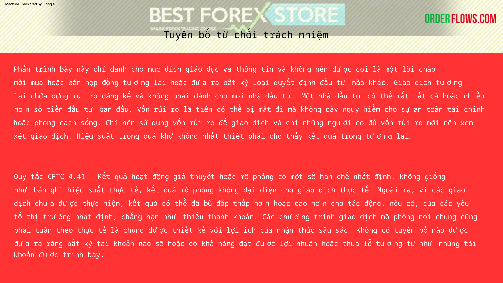

Tuyên bố từ chối trách nhiệm
Phần trình bày này chỉ dành cho mục đích giáo dục và thông tin và không nên được coi là một lời chào
mời mua hoặc bán hợp đồng tương lai hoặc đưa ra bất kỳ loại quyết định đầu tư nào khác. Giao dịch tương
lai chứa đựng rủi ro đáng kể và không phải dành cho mọi nhà đầu tư. Một nhà đầu tư có thể mất tất cả hoặc nhiều
hơn số tiền đầu tư ban đầu. Vốn rủi ro là tiền có thể bị mất đi mà không gây nguy hiểm cho sự an toàn tài chính
hoặc phong cách sống. Chỉ nên sử dụng vốn rủi ro để giao dịch và chỉ những người có đủ vốn rủi ro mới nên xem
xét giao dịch. Hiệu suất trong quá khứ không nhất thiết phải cho thấy kết quả trong tương lai.
Quy tắc CFTC 4.41 - Kết quả hoạt động giả thuyết hoặc mô phỏng có một số hạn chế nhất định, không giống
như bản ghi hiệu suất thực tế, kết quả mô phỏng không đại diện cho giao dịch thực tế. Ngoài ra, vì các giao
dịch chưa được thực hiện, kết quả có thể đã bù đắp thấp hơn hoặc cao hơn cho tác động, nếu có, của các yếu
tố thị trường nhất định, chẳng hạn như thiếu thanh khoản. Các chương trình giao dịch mô phỏng nói chung cũng
phải tuân theo thực tế là chúng được thiết kế với lợi ích của nhận thức sâu sắc. Không có tuyên bố nào được
đưa ra rằng bất kỳ tài khoản nào sẽ hoặc có khả năng đạt được lợi nhuận hoặc thua lỗ tương tự như những tài
khoản được trình bày.

## Trang 3

Hoạt động mua và bán liên tục của những người
tham gia khác nhau.
Không bao giờ có nhiều người mua hơn người bán hoặc nhiều
người bán hơn người mua.
Nguyên nhân nào khiến thị trường chuyển động?

## Trang 4
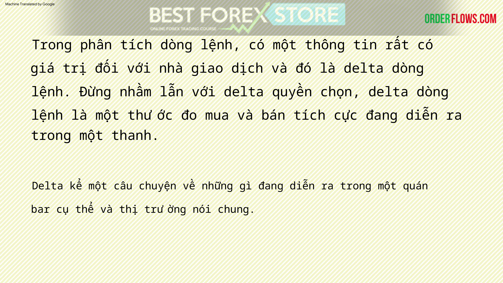

Delta kể một câu chuyện về những gì đang diễn ra trong một quán
bar cụ thể và thị trường nói chung.
Trong phân tích dòng lệnh, có một thông tin rất có
giá trị đối với nhà giao dịch và đó là delta dòng
lệnh. Đừng nhầm lẫn với delta quyền chọn, delta dòng
lệnh là một thước đo mua và bán tích cực đang diễn ra
trong một thanh.

## Trang 5
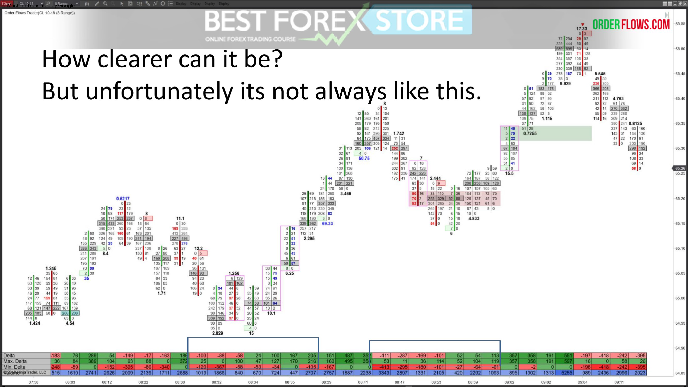

*(slide chi co hinh, khong co text)*

## Trang 6
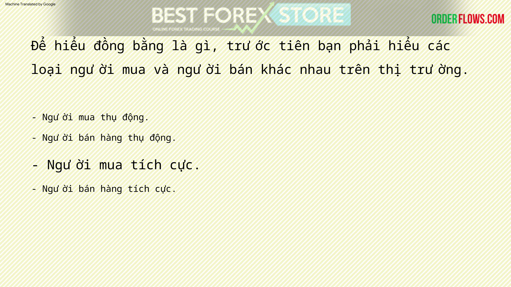

- Người mua thụ động.
- Người bán hàng thụ động.
- Người bán hàng tích cực.
Để hiểu đồng bằng là gì, trước tiên bạn phải hiểu các
loại người mua và người bán khác nhau trên thị trường.
- Người mua tích cực.

## Trang 7
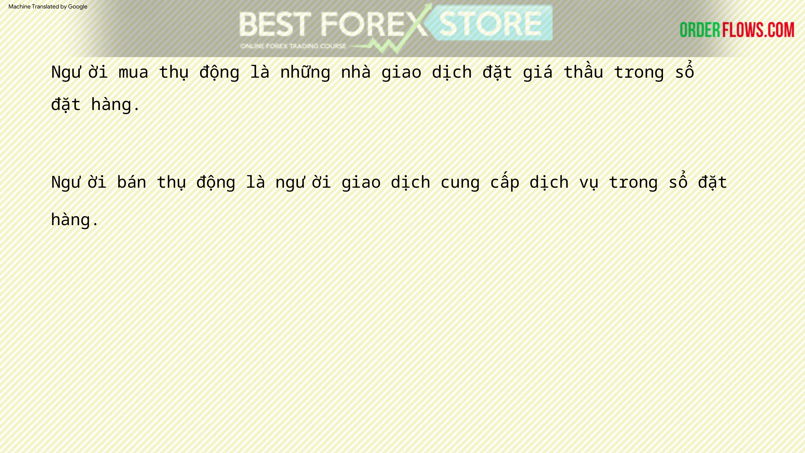

Người bán thụ động là người giao dịch cung cấp dịch vụ trong sổ đặt
hàng.
Người mua thụ động là những nhà giao dịch đặt giá thầu trong sổ
đặt hàng.

## Trang 8

Người mua thụ động và người bán thụ động để thị
trường đến với họ.

## Trang 9
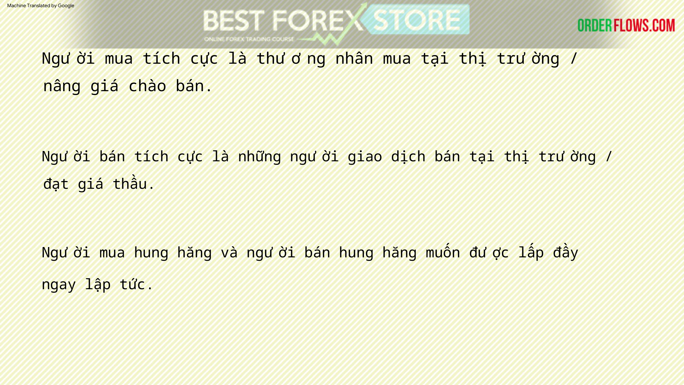

Người bán tích cực là những người giao dịch bán tại thị trường /
đạt giá thầu.
Người mua hung hăng và người bán hung hăng muốn được lấp đầy
ngay lập tức.
Người mua tích cực là thương nhân mua tại thị trường /
nâng giá chào bán.

## Trang 10
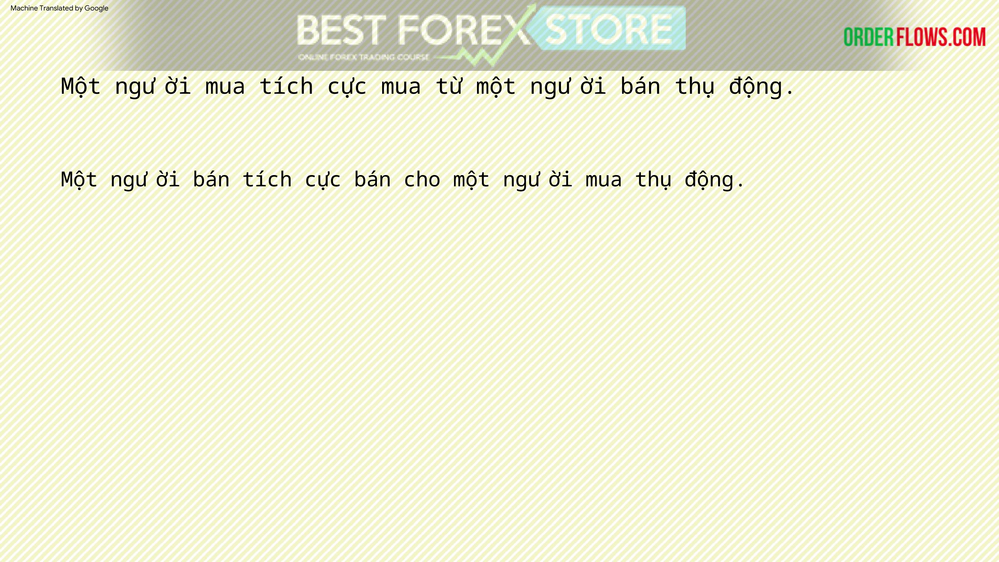

Một người bán tích cực bán cho một người mua thụ động.
Một người mua tích cực mua từ một người bán thụ động.

## Trang 11

*(slide chi co hinh, khong co text)*

## Trang 12
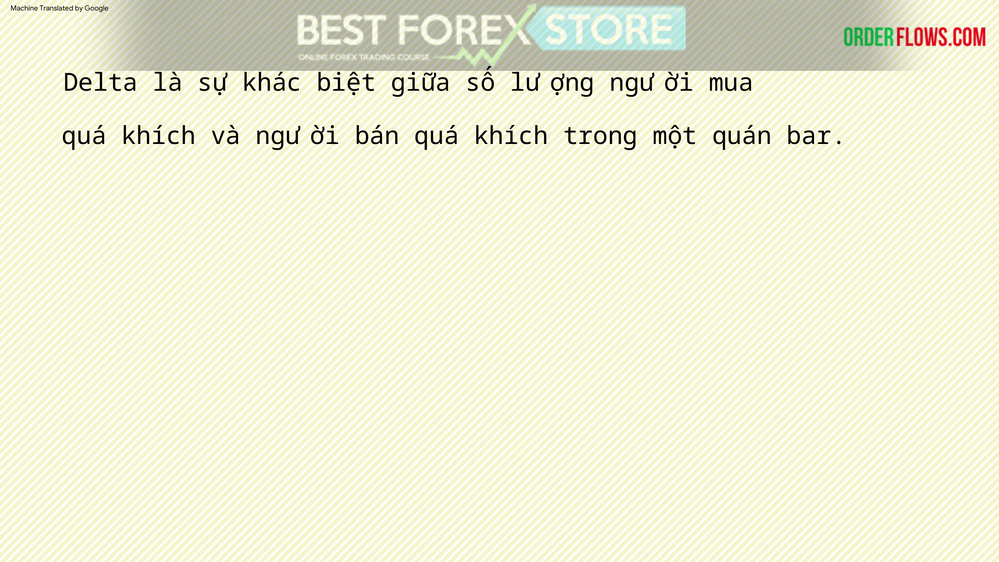

Delta là sự khác biệt giữa số lượng người mua
quá khích và người bán quá khích trong một quán bar.

## Trang 13
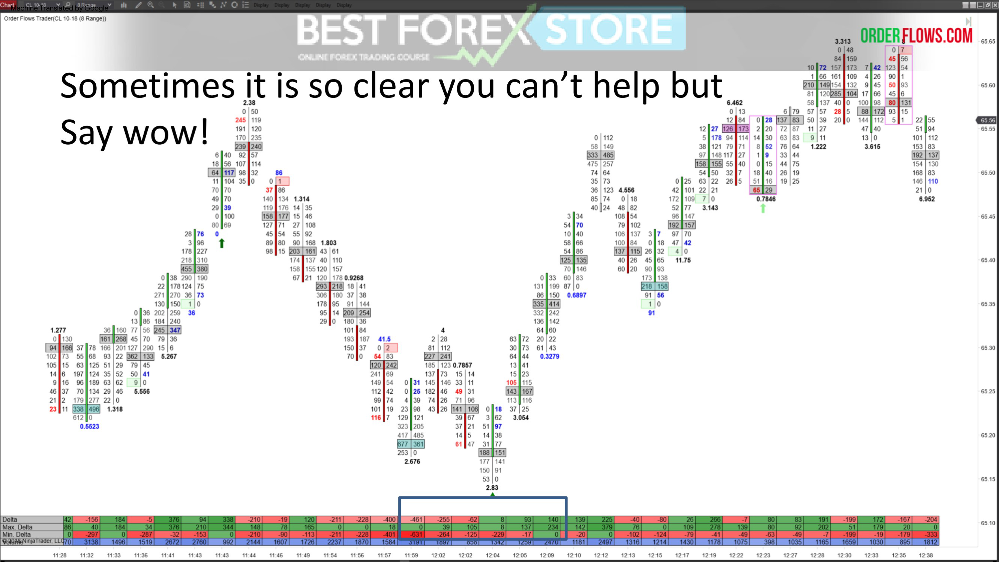

*(slide chi co hinh, khong co text)*

## Trang 14

Delta rất quan trọng bởi vì có những lúc một bên, cả những
người mua tích cực hoặc những người bán tích cực đang thực sự
thể hiện tay mình trên thị trường và biết khi nào điều đó xảy
ra sẽ mang lại cho bạn lợi thế so với những nhà giao dịch khác,
những người không biết chuyện gì đang xảy ra.

## Trang 15
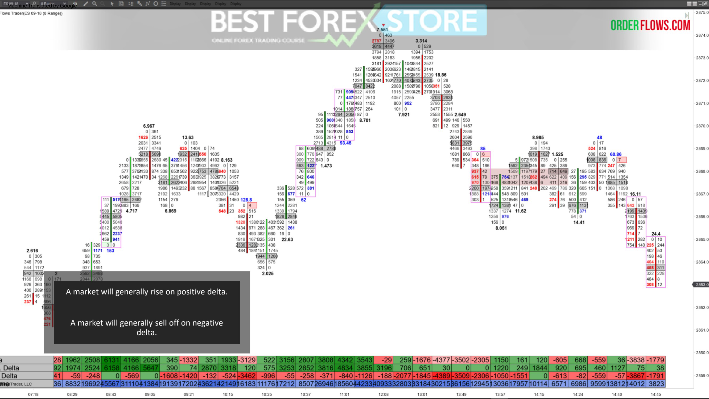

*(slide chi co hinh, khong co text)*

## Trang 16

Tôi nói một cách tổng quát bởi vì khi không có thì thường
có lý do và lý do là quan trọng và có khả năng là một cơ hội
giao dịch tuyệt vời. Tôi sẽ giải thích điều đó trong các bài
học sau.

## Trang 17
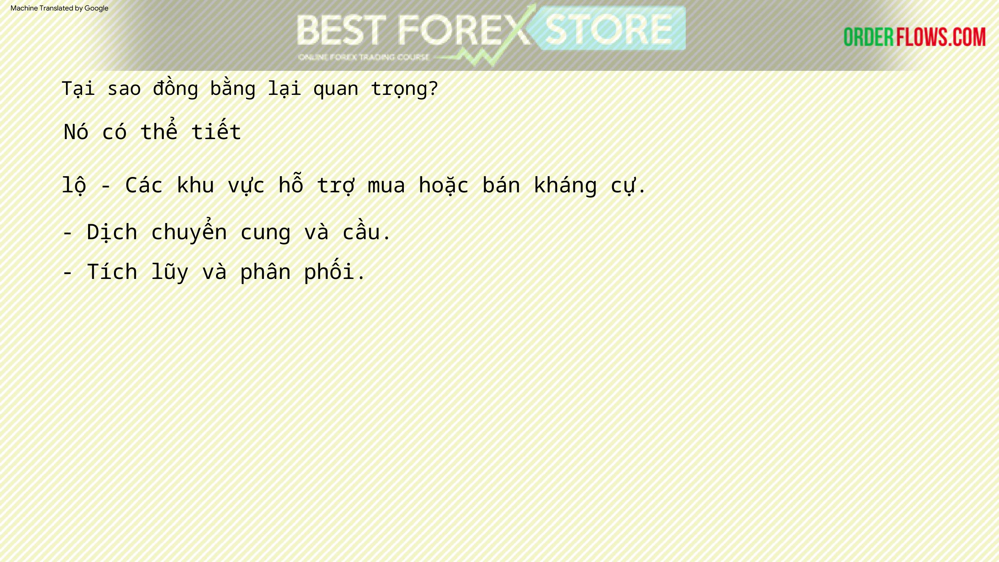

Nó có thể tiết
lộ - Các khu vực hỗ trợ mua hoặc bán kháng cự.
- Dịch chuyển cung và cầu.
- Tích lũy và phân phối.
Tại sao đồng bằng lại quan trọng?

## Trang 18
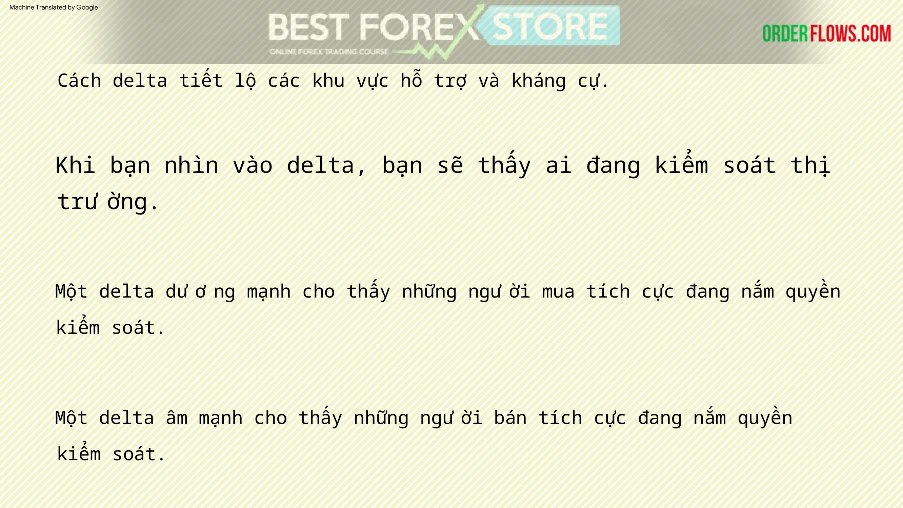

Khi bạn nhìn vào delta, bạn sẽ thấy ai đang kiểm soát thị
trường.
Cách delta tiết lộ các khu vực hỗ trợ và kháng cự.
Một delta âm mạnh cho thấy những người bán tích cực đang nắm quyền
kiểm soát.
Một delta dương mạnh cho thấy những người mua tích cực đang nắm quyền
kiểm soát.

## Trang 19
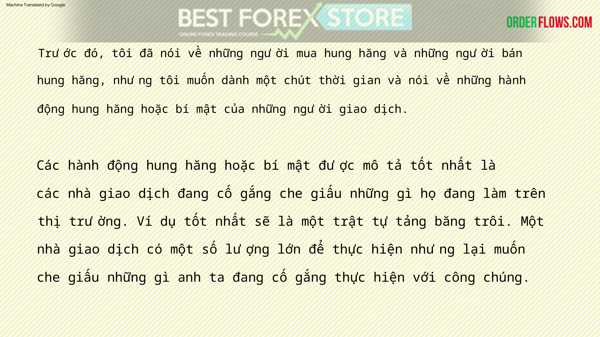

Các hành động hung hăng hoặc bí mật được mô tả tốt nhất là
các nhà giao dịch đang cố gắng che giấu những gì họ đang làm trên
thị trường. Ví dụ tốt nhất sẽ là một trật tự tảng băng trôi. Một
nhà giao dịch có một số lượng lớn để thực hiện nhưng lại muốn
che giấu những gì anh ta đang cố gắng thực hiện với công chúng.
Trước đó, tôi đã nói về những người mua hung hăng và những người bán
hung hăng, nhưng tôi muốn dành một chút thời gian và nói về những hành
động hung hăng hoặc bí mật của những người giao dịch.

## Trang 20

Lệnh Iceberg là một dạng hành vi của nhà
giao dịch bí mật tích cực.

## Trang 21
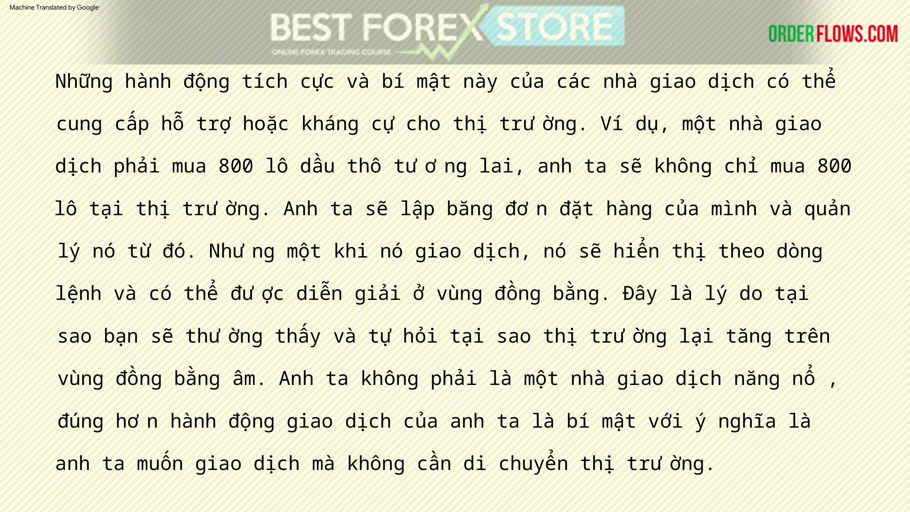

Những hành động tích cực và bí mật này của các nhà giao dịch có thể
cung cấp hỗ trợ hoặc kháng cự cho thị trường. Ví dụ, một nhà giao
dịch phải mua 800 lô dầu thô tương lai, anh ta sẽ không chỉ mua 800
lô tại thị trường. Anh ta sẽ lập băng đơn đặt hàng của mình và quản
lý nó từ đó. Nhưng một khi nó giao dịch, nó sẽ hiển thị theo dòng
lệnh và có thể được diễn giải ở vùng đồng bằng. Đây là lý do tại
sao bạn sẽ thường thấy và tự hỏi tại sao thị trường lại tăng trên
vùng đồng bằng âm. Anh ta không phải là một nhà giao dịch năng nổ ,
đúng hơn hành động giao dịch của anh ta là bí mật với ý nghĩa là
anh ta muốn giao dịch mà không cần di chuyển thị trường.

## Trang 22
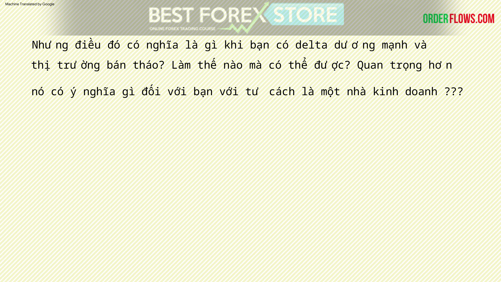

Nhưng điều đó có nghĩa là gì khi bạn có delta dương mạnh và
thị trường bán tháo? Làm thế nào mà có thể được? Quan trọng hơn
nó có ý nghĩa gì đối với bạn với tư cách là một nhà kinh doanh ???

## Trang 23
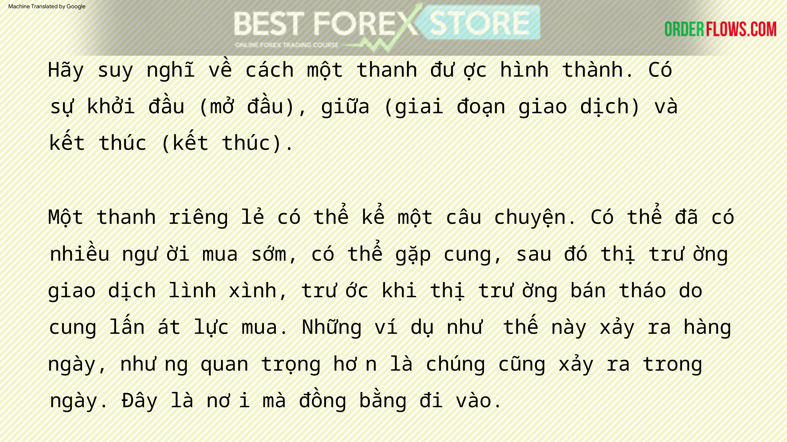

Một thanh riêng lẻ có thể kể một câu chuyện. Có thể đã có
nhiều người mua sớm, có thể gặp cung, sau đó thị trường
giao dịch lình xình, trước khi thị trường bán tháo do
cung lấn át lực mua. Những ví dụ như thế này xảy ra hàng
ngày, nhưng quan trọng hơn là chúng cũng xảy ra trong
ngày. Đây là nơi mà đồng bằng đi vào.
Hãy suy nghĩ về cách một thanh được hình thành. Có
sự khởi đầu (mở đầu), giữa (giai đoạn giao dịch) và
kết thúc (kết thúc).

## Trang 24

Theo quy luật cung và cầu, giá sẽ cao hơn khi
cầu mạnh và cung yếu.
Giá giảm khi cung mạnh và cầu yếu. Kinh tế học 101.
Delta cho phép bạn xem sự thay đổi trong cung và cầu mà
có thể không được chú ý.

## Trang 25
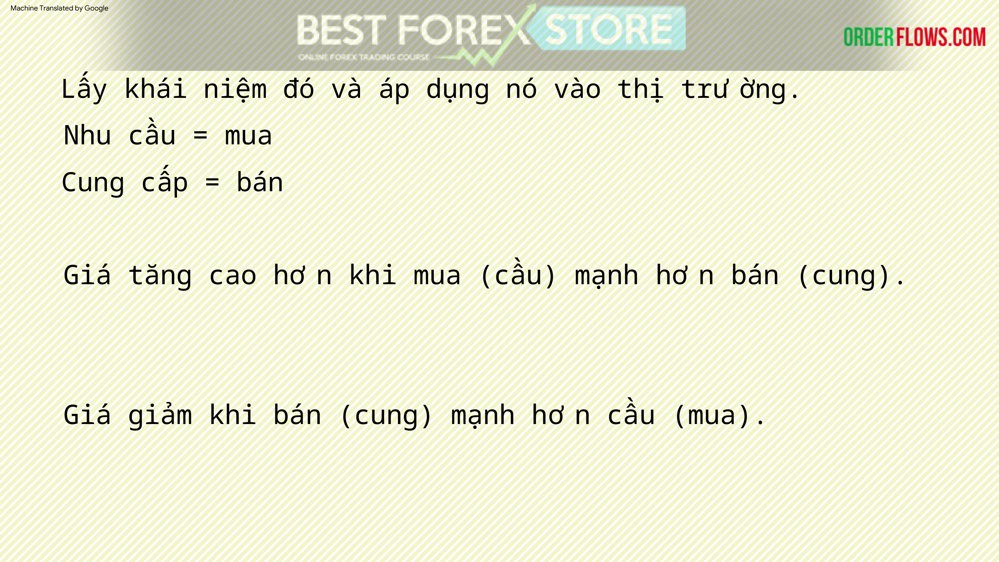

Cung cấp = bán
Giá tăng cao hơn khi mua (cầu) mạnh hơn bán (cung).
Nhu cầu = mua
Giá giảm khi bán (cung) mạnh hơn cầu (mua).
Lấy khái niệm đó và áp dụng nó vào thị trường.

## Trang 26
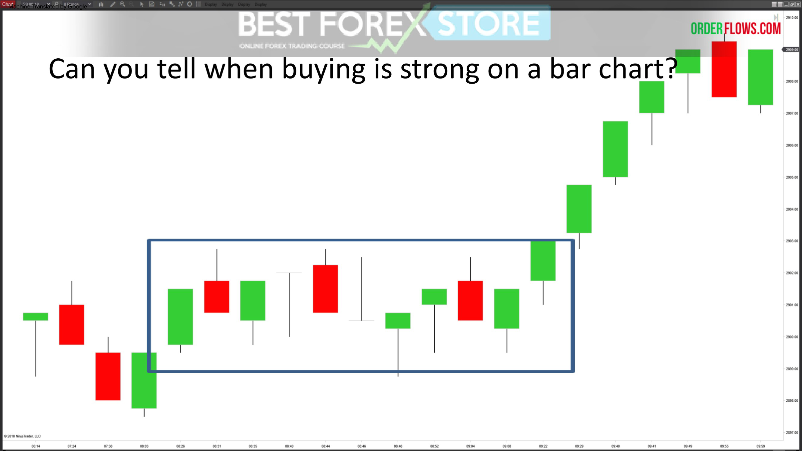

*(slide chi co hinh, khong co text)*

## Trang 27
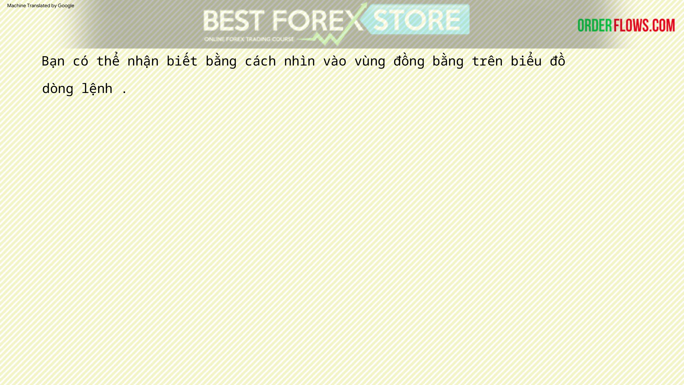

Bạn có thể nhận biết bằng cách nhìn vào vùng đồng bằng trên biểu đồ
dòng lệnh .

## Trang 28
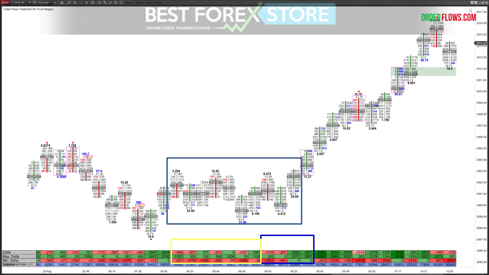

*(slide chi co hinh, khong co text)*

## Trang 29
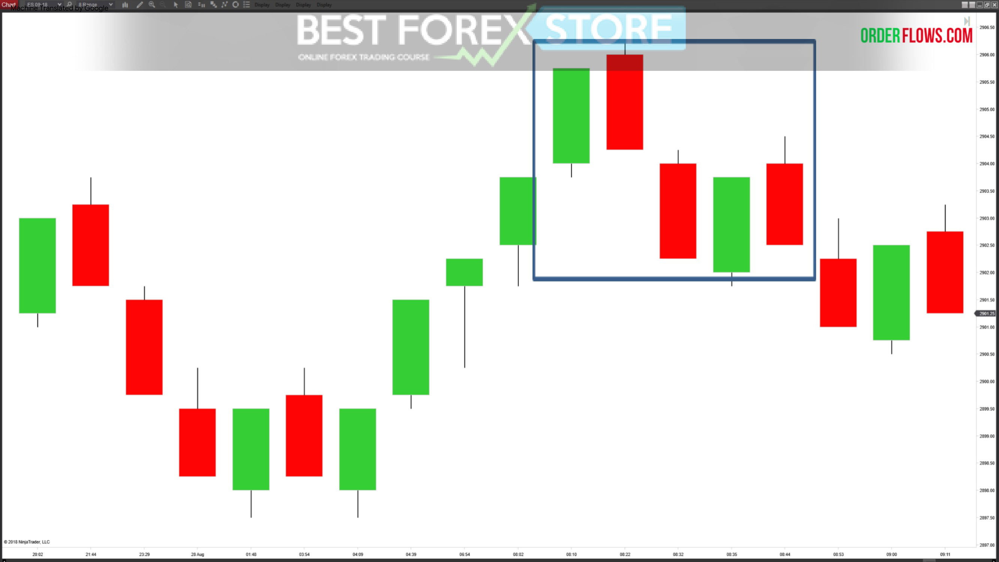

*(slide chi co hinh, khong co text)*

## Trang 30
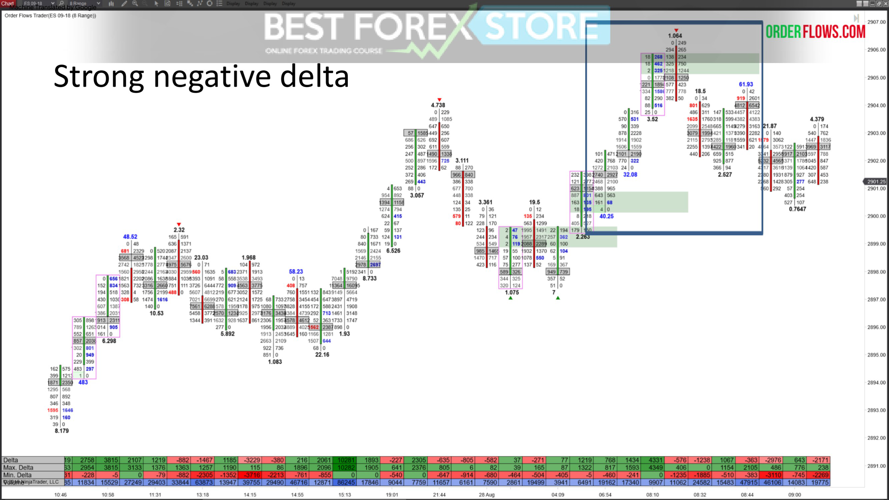

*(slide chi co hinh, khong co text)*

## Trang 31
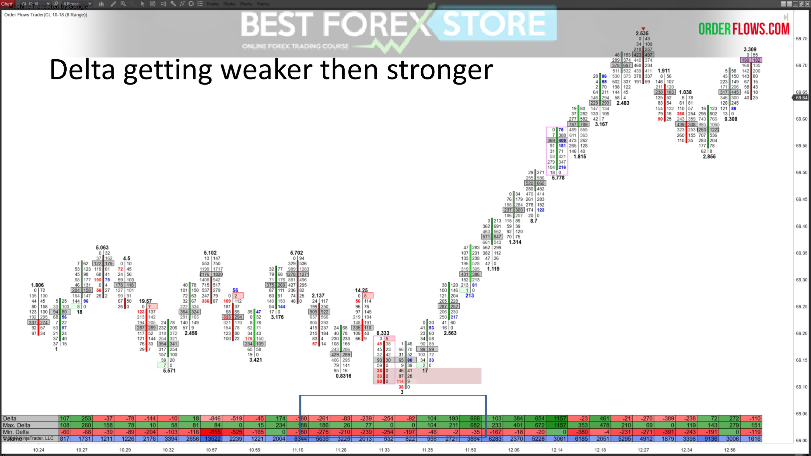

*(slide chi co hinh, khong co text)*

## Trang 32
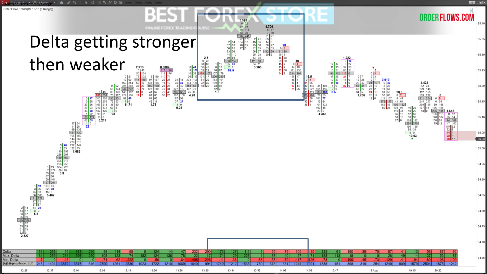

*(slide chi co hinh, khong co text)*

## Trang 33

Hãy suy nghĩ về hàng tồn kho. Nếu bạn điều hành một doanh
nghiệp, bạn biết rằng có những lúc bạn cần mua hàng tồn kho
và có những lúc bạn có quá nhiều hàng tồn kho và bạn cần phải
bắt đầu phân phối hàng tồn kho của mình ra ngoài, hay nói
cách khác là bán nó đi.
Tích lũy và phân phối là gì?
Đối với các nhà giao dịch tổ chức, vị trí của họ là hành
trang của họ .

## Trang 34

Hãy đặt mình vào vị trí của một nhà quản lý danh mục đầu
tư. Bạn nghĩ rằng cổ phiếu của Apple là một sự mua lớn ngay
bây giờ và bạn đã phân bổ 100 triệu đô la cho vị trí này. Bây
giờ bạn phải đi vào chế độ tích lũy. Bây giờ là hai năm sau
và bạn đã kiếm được 300 triệu đô la từ vị trí này nhưng bạn
muốn đóng nó. Vì vậy, bây giờ bạn đi vào chế độ phân phối.

## Trang 35
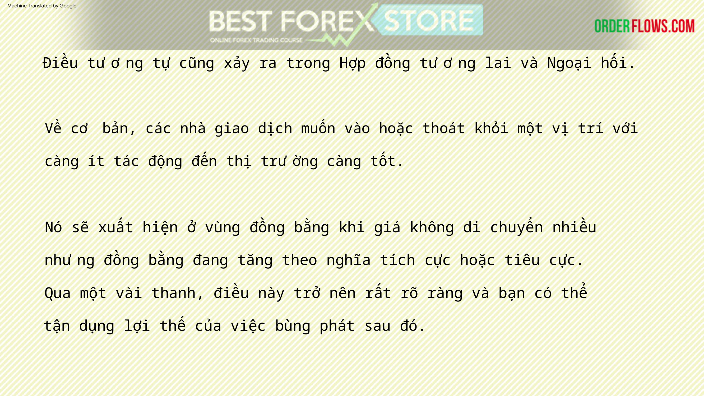

Về cơ bản, các nhà giao dịch muốn vào hoặc thoát khỏi một vị trí với
càng ít tác động đến thị trường càng tốt.
Nó sẽ xuất hiện ở vùng đồng bằng khi giá không di chuyển nhiều
nhưng đồng bằng đang tăng theo nghĩa tích cực hoặc tiêu cực.
Qua một vài thanh, điều này trở nên rất rõ ràng và bạn có thể
tận dụng lợi thế của việc bùng phát sau đó.
Điều tương tự cũng xảy ra trong Hợp đồng tương lai và Ngoại hối.

## Trang 36
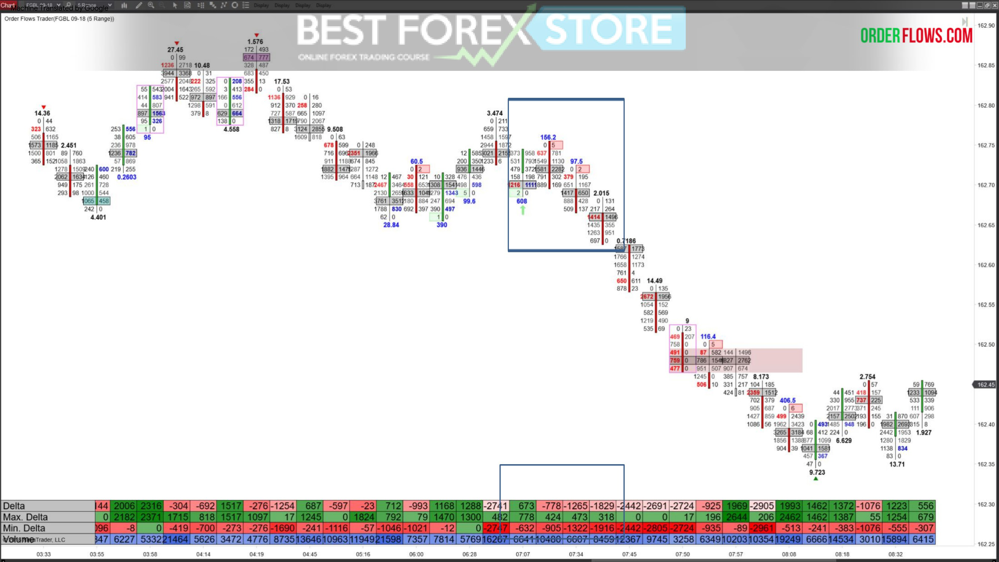

*(slide chi co hinh, khong co text)*

## Trang 37
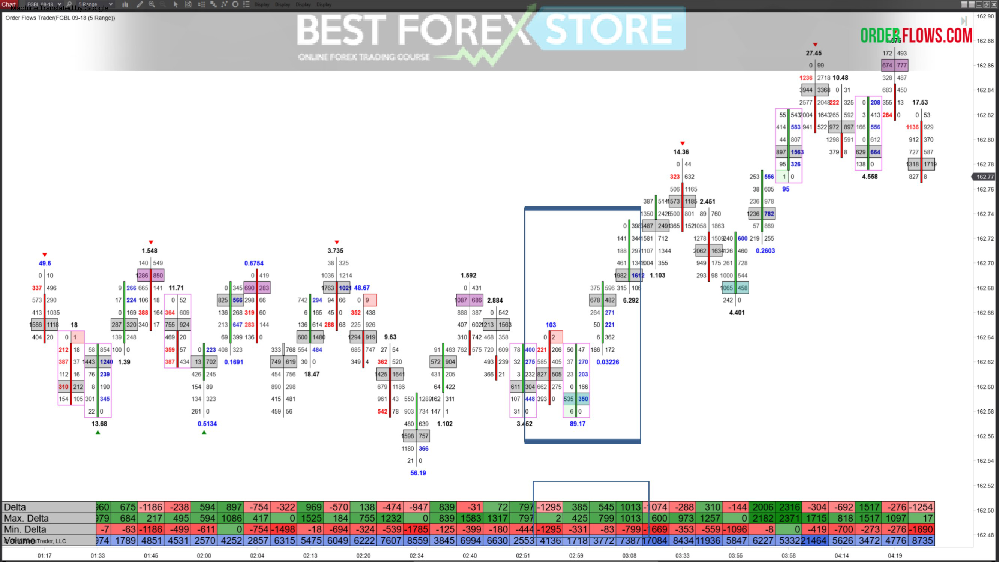

*(slide chi co hinh, khong co text)*

## Trang 38
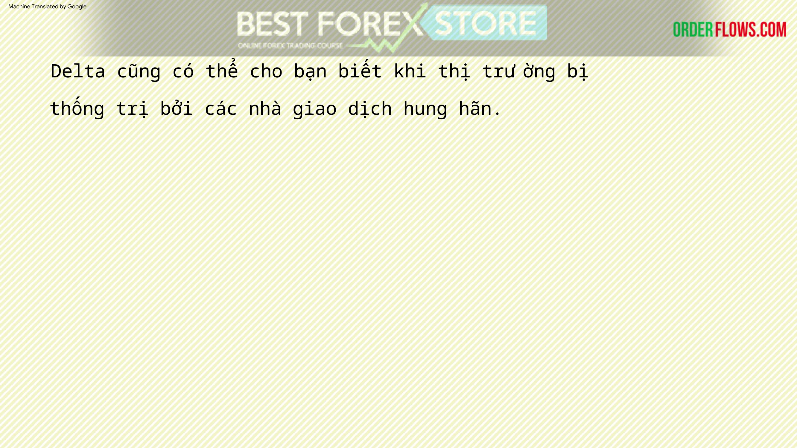

Delta cũng có thể cho bạn biết khi thị trường bị
thống trị bởi các nhà giao dịch hung hãn.

## Trang 39
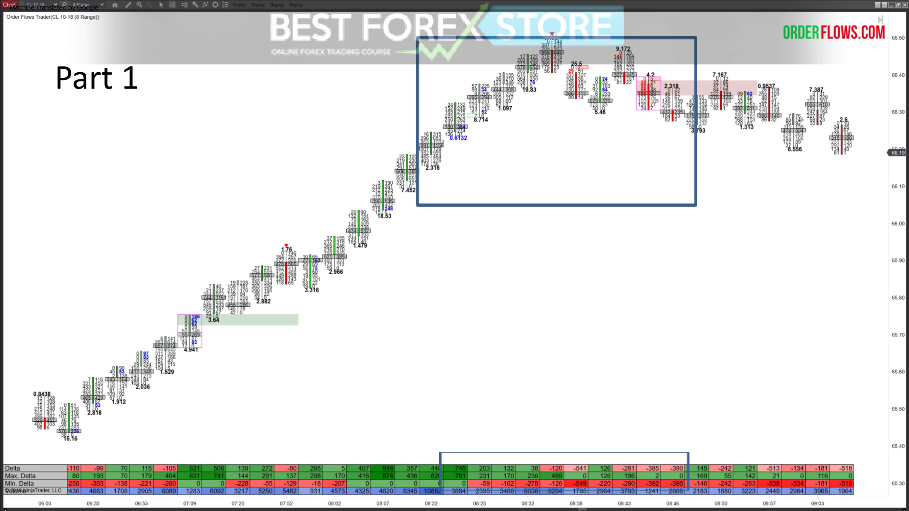

*(slide chi co hinh, khong co text)*

## Trang 40
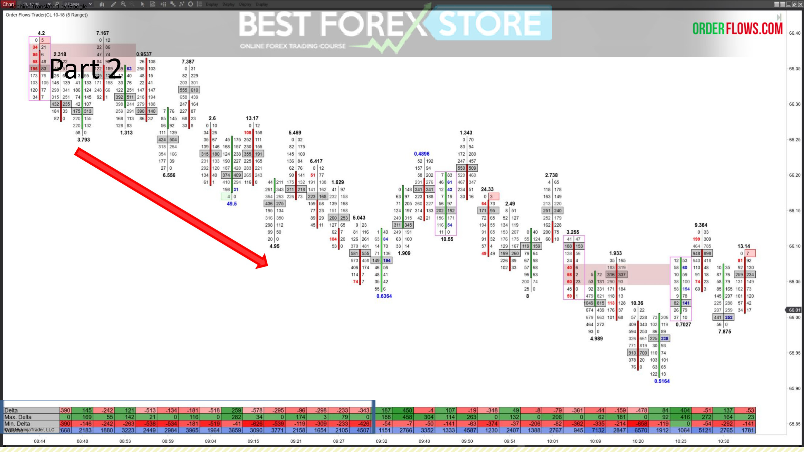

*(slide chi co hinh, khong co text)*

## Trang 41
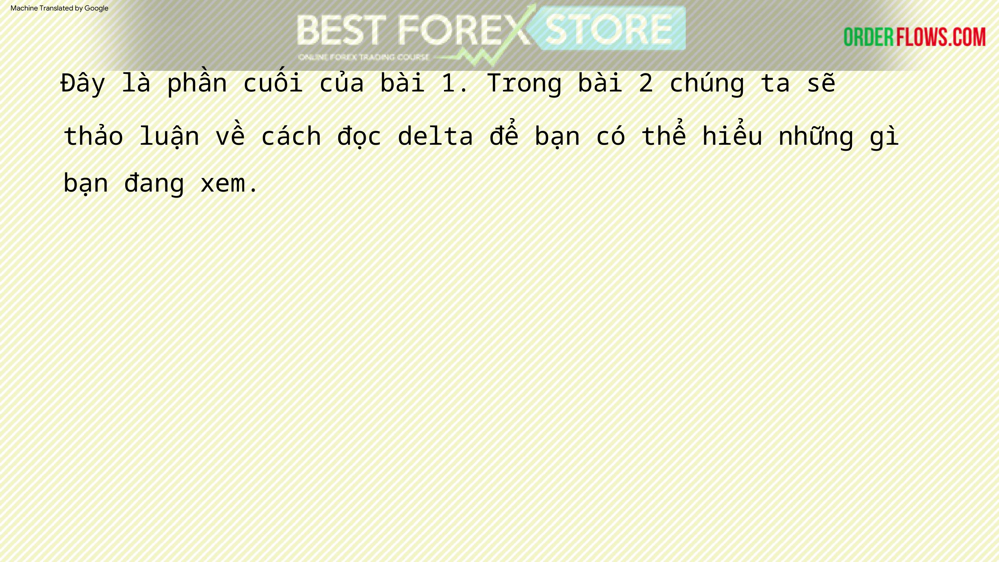

Đây là phần cuối của bài 1. Trong bài 2 chúng ta sẽ
thảo luận về cách đọc delta để bạn có thể hiểu những gì
bạn đang xem.