# Bai 2 — Cach doc Delta (How to Read Delta)
> Nguon: Foot Print Vietsub.pdf, trang 42–68 (khoa hoc Delta Order Flow, dang slide).

## Trang 42

Delta quy trình đặt hàng
Khóa học giao dịch
Bài 2 - Cách đọc Delta

## Trang 43

Tuyên bố từ chối trách nhiệm
Phần trình bày này chỉ dành cho mục đích giáo dục và thông tin và không nên được coi là một lời chào
mời mua hoặc bán hợp đồng tương lai hoặc đưa ra bất kỳ loại quyết định đầu tư nào khác. Giao dịch tương
lai chứa đựng rủi ro đáng kể và không phải dành cho mọi nhà đầu tư. Một nhà đầu tư có thể mất tất cả hoặc nhiều
hơn số tiền đầu tư ban đầu. Vốn rủi ro là tiền có thể bị mất đi mà không gây nguy hiểm cho sự an toàn tài chính
hoặc phong cách sống. Chỉ nên sử dụng vốn rủi ro để giao dịch và chỉ những người có đủ vốn rủi ro mới nên xem
xét giao dịch. Hiệu suất trong quá khứ không nhất thiết phải cho thấy kết quả trong tương lai.
Quy tắc CFTC 4.41 - Kết quả hoạt động giả thuyết hoặc mô phỏng có một số hạn chế nhất định, không giống
như bản ghi hiệu suất thực tế, kết quả mô phỏng không đại diện cho giao dịch thực tế. Ngoài ra, vì các giao
dịch chưa được thực hiện, kết quả có thể đã bù đắp thấp hơn hoặc cao hơn cho tác động, nếu có, của các yếu
tố thị trường nhất định, chẳng hạn như thiếu thanh khoản. Các chương trình giao dịch mô phỏng nói chung cũng
phải tuân theo thực tế là chúng được thiết kế với lợi ích của nhận thức sâu sắc. Không có tuyên bố nào được
đưa ra rằng bất kỳ tài khoản nào sẽ hoặc có khả năng đạt được lợi nhuận hoặc thua lỗ tương tự như những tài
khoản được trình bày.

## Trang 44

Lý do tại sao delta là một công cụ tuyệt vời cho các nhà giao
dịch là vì nó có thể được phân tích một mình và với các thanh khác.
Ý tôi là có những lúc bạn có thể nhìn thấy thứ gì
đó ở vùng đồng bằng của một thanh đơn đang lộ ra và
có những lúc bạn có thể phân tích vùng đồng bằng trên
một vài thanh để thấy thứ gì đó đang lộ ra.

## Trang 45

Có nhiều loại màn hình delta khác nhau có sẵn cho các nhà
giao dịch sử dụng.
Nhiều nhà giao dịch thậm chí không nhận ra những lựa chọn khác
nhau ngoài kia. Bài học này sẽ giúp bạn mở rộng tầm mắt về những
cách khác nhau để nhìn vào đồng bằng dòng lệnh.
Điều quan trọng là phải biết các cách khác để xem xét delta vì nó
sẽ mang lại cho bạn lợi thế so với các nhà giao dịch khác, những
người hoàn toàn coi thường delta.

## Trang 46

Hình thức phân tích delta phổ biến nhất được thực hiện bằng cách sử
dụng biểu đồ dấu chân khối lượng dòng chảy đặt hàng với delta được
hiển thị dọc theo phần dưới cùng của biểu đồ.

## Trang 47
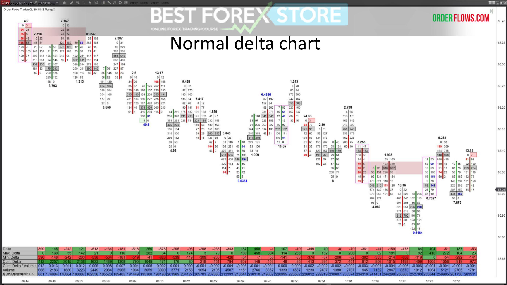

*(slide chi co hinh, khong co text)*

## Trang 48
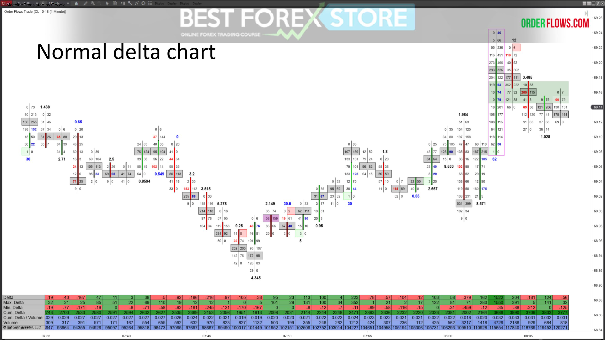

*(slide chi co hinh, khong co text)*

## Trang 49
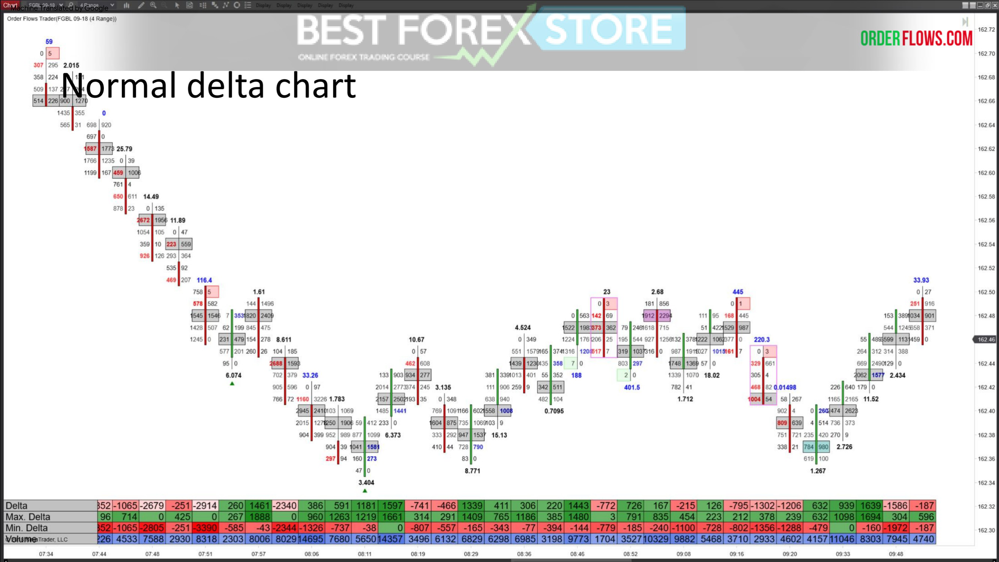

*(slide chi co hinh, khong co text)*

## Trang 50

Đối với những người bạn thích biểu diễn
trực quan , bạn cũng có thể hiển thị hình tam giác ở
dạng hình nến bên dưới biểu đồ của mình.
Trí óc xử lý hình ảnh với tốc độ nhanh hơn so với số
hoặc văn bản và do đó, bạn có thể dễ dàng nhìn thấy các mẫu
ở vùng đồng bằng trong biểu mẫu này.

## Trang 51
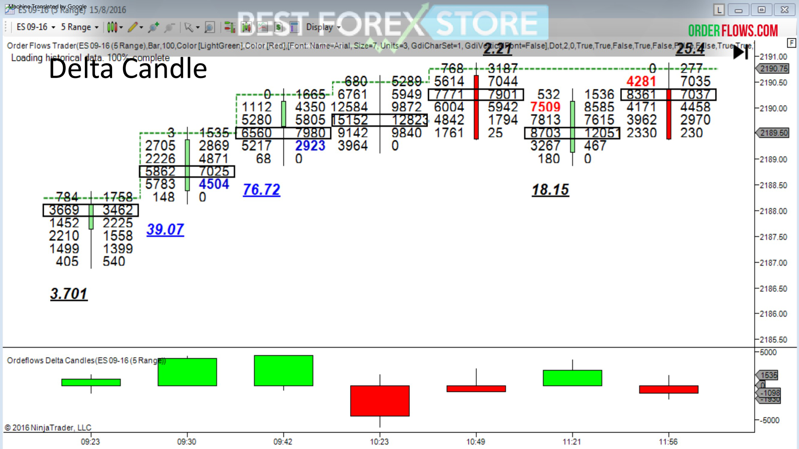

*(slide chi co hinh, khong co text)*

## Trang 52
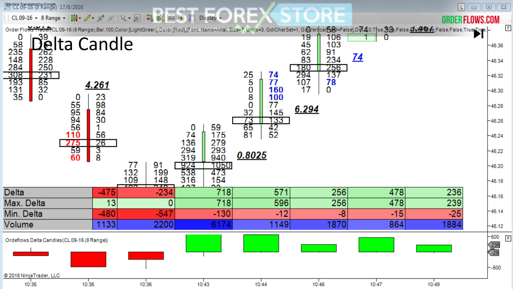

*(slide chi co hinh, khong co text)*

## Trang 53
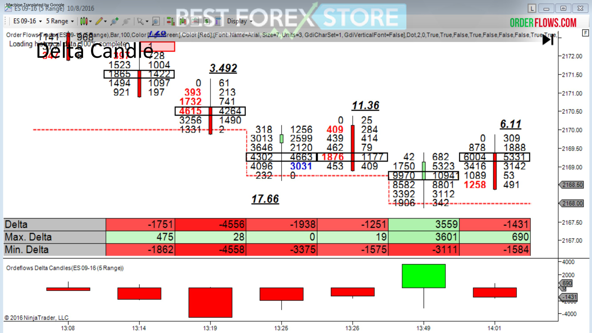

*(slide chi co hinh, khong co text)*

## Trang 54
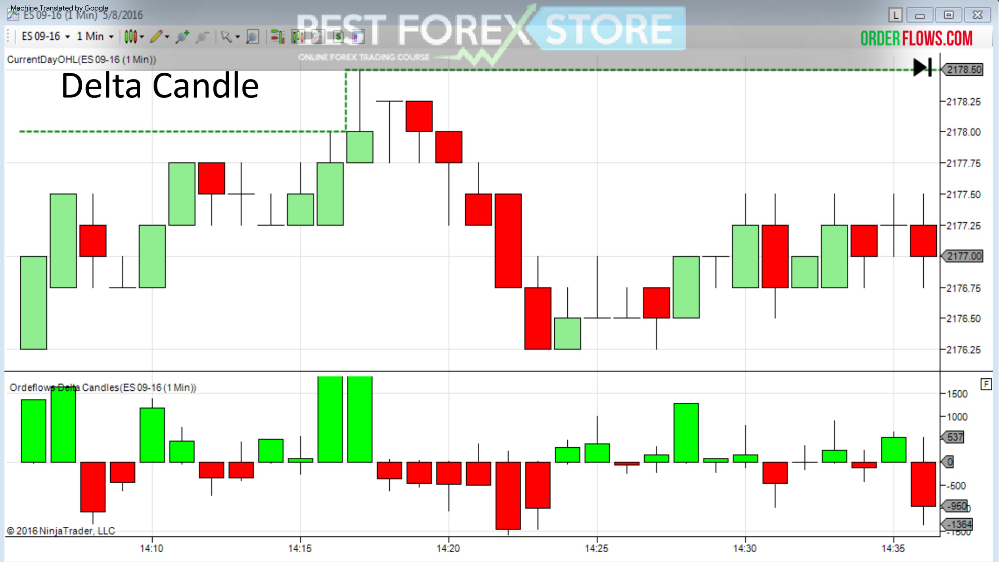

*(slide chi co hinh, khong co text)*

## Trang 55

*(slide chi co hinh, khong co text)*

## Trang 56

Một cách khác để xem delta là biểu đồ dấu chân thực tế với
delta được hiển thị cho mỗi mức giá được giao dịch trong một
thanh.
Biểu đồ này cho phép bạn xem liệu có hoạt động mua
tích cực hơn hoặc bán tích cực hơn ở một mức giá trong thanh

## Trang 57
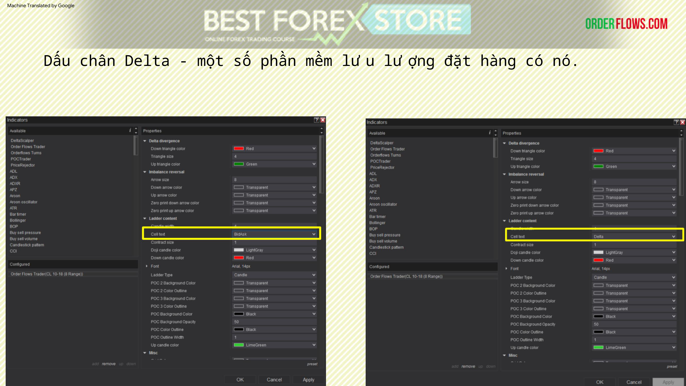

Dấu chân Delta - một số phần mềm lưu lượng đặt hàng có nó.

## Trang 58
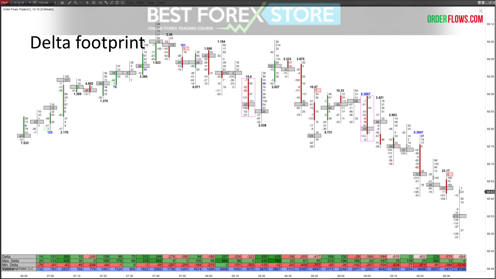

*(slide chi co hinh, khong co text)*

## Trang 59
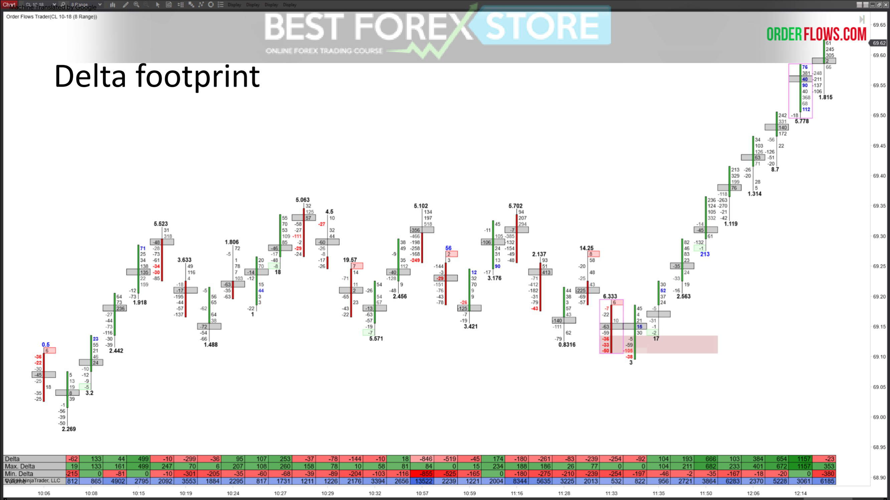

*(slide chi co hinh, khong co text)*

## Trang 60

Một cách khác để phân tích đồng bằng là biểu đồ dấu chân đồng
bằng theo đường chéo hiển thị đồng bằng trong giá thầu / yêu cầu.
Biểu đồ dấu chân tam giác theo đường chéo rất hữu ích để lọc ra sự
mất cân đối.

## Trang 61
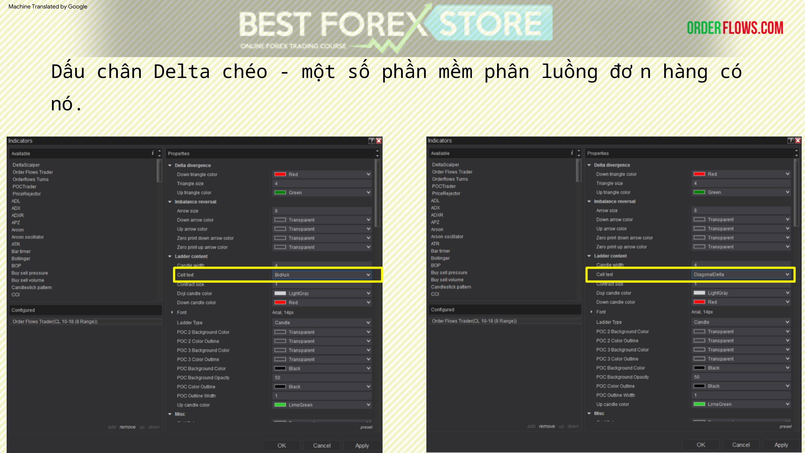

Dấu chân Delta chéo - một số phần mềm phân luồng đơn hàng có
nó.

## Trang 62
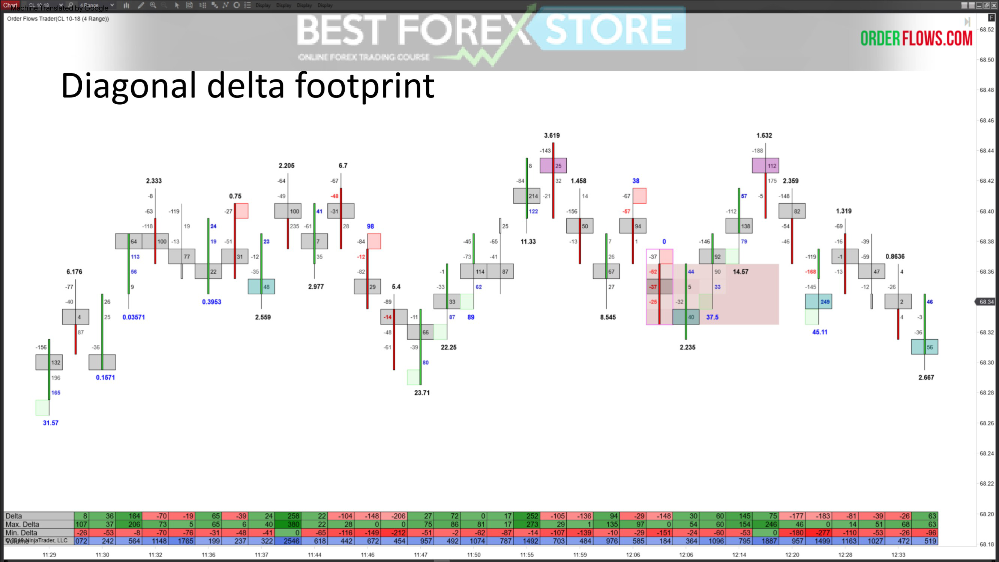

*(slide chi co hinh, khong co text)*

## Trang 63
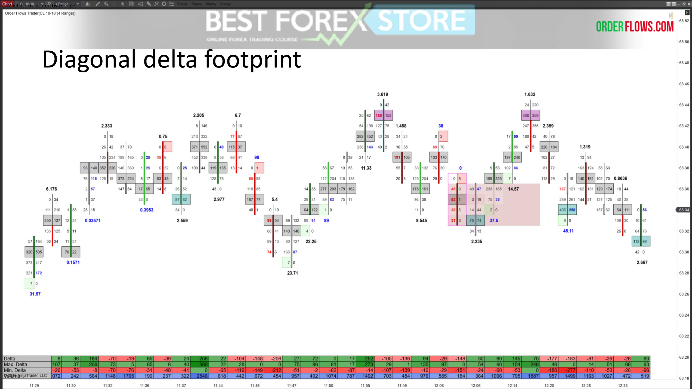

*(slide chi co hinh, khong co text)*

## Trang 64
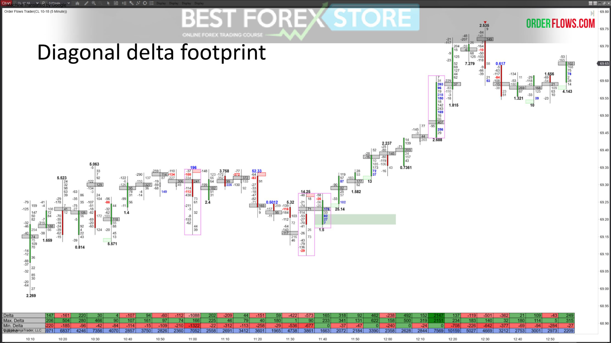

*(slide chi co hinh, khong co text)*

## Trang 65
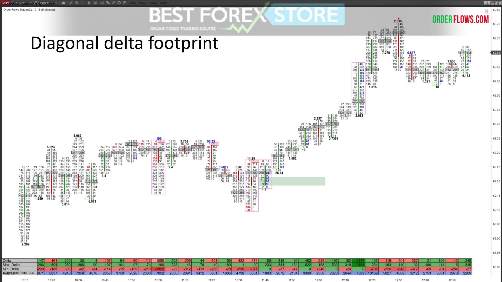

*(slide chi co hinh, khong co text)*

## Trang 66

Trong nhiều năm, tôi đã đi từ việc phân tích đồng bằng ở đáy, đến chân
nến đồng bằng, trở lại đồng bằng ở dưới cùng, đến dấu chân đồng bằng,
đến sự kết hợp giữa đồng bằng ở đáy và dấu chân đồng bằng.
Đó là một sự lựa chọn cá nhân. Giao dịch là như vậy. Những gì hiệu quả
với tôi có thể không hiệu quả với bạn.
Câu hỏi triệu đô là "vậy tôi nên sử dụng định dạng nào
để xem delta?"

## Trang 67

Những gì tôi đang làm là giải thích các tùy chọn khác nhau của
bạn để bạn có thể đưa ra lựa chọn tốt nhất có thể về việc sử
dụng những gì để giao dịch của bạn có lợi nhuận liên tục.
Một phần của thành công trong giao dịch là tìm ra thứ
phù hợp với bạn. Bạn kiểm soát số phận của mình. Bạn là
người phải đưa ra quyết định khi giao dịch.

## Trang 68

Đây là phần cuối của bài 2. Trong bài 3, tôi sẽ thảo luận
về các số đồng bằng khác nhau, ý nghĩa của chúng và cách
giải thích chúng.