# Bai 3 — So Delta (Delta Numbers)
> Nguon: Foot Print Vietsub.pdf, trang 69–117 (khoa hoc Delta Order Flow, dang slide).

## Trang 69

Khóa học giao dịch
OrderFlows Delta
Bài 3 - Số Delta

## Trang 70

Phần trình bày này chỉ dành cho mục đích giáo dục và thông tin và không nên được coi là một lời chào
mời mua hoặc bán hợp đồng tương lai hoặc đưa ra bất kỳ loại quyết định đầu tư nào khác. Giao dịch tương lai
chứa đựng rủi ro đáng kể và không phải dành cho mọi nhà đầu tư. Một nhà đầu tư có thể mất tất cả hoặc nhiều hơn
số tiền đầu tư ban đầu. Vốn rủi ro là tiền có thể bị mất đi mà không gây nguy hiểm cho sự an toàn tài chính
hoặc phong cách sống. Chỉ nên sử dụng vốn rủi ro để giao dịch và chỉ những người có đủ vốn rủi ro mới nên xem
xét giao dịch. Hiệu suất trong quá khứ không nhất thiết phải cho thấy kết quả trong tương lai.
Quy tắc CFTC 4.41 - Kết quả hoạt động giả thuyết hoặc mô phỏng có một số hạn chế nhất định, không giống
như bản ghi hiệu suất thực tế, kết quả mô phỏng không đại diện cho giao dịch thực tế. Ngoài ra, vì các
giao dịch chưa được thực hiện, kết quả có thể đã bù đắp thấp hơn hoặc cao hơn cho tác động, nếu có, của các
yếu tố thị trường nhất định, chẳng hạn như thiếu thanh khoản. Các chương trình giao dịch mô phỏng nói chung
cũng phải tuân theo thực tế là chúng được thiết kế với lợi ích của nhận thức sâu sắc. Không có tuyên bố nào
được đưa ra rằng bất kỳ tài khoản nào sẽ hoặc có khả năng đạt được lợi nhuận hoặc thua lỗ tương tự như những
tài khoản được trình bày.
Tuyên bố từ chối trách nhiệm

## Trang 71

Delta - Đó là số đọc delta hiện tại cho thanh và khi
thanh đóng lại là delta cuối cùng cho thanh.
Delta tích lũy - Delta đang chạy cho phiên.
Khi giao dịch theo thứ tự delta dòng chảy, bạn có thể
xem các số delta khác nhau:
Max Delta - Vùng đồng bằng tích cực nhất nằm trong một thanh.
Đồng bằng / Khối lượng tích lũy - Đồng bằng tích
lũy chia cho tổng khối lượng của phiên cho đến thời
điểm đó.
Min Delta - Vùng đồng bằng tiêu cực nhất nằm trong một vạch.

## Trang 72

Biểu đồ dựa trên phạm vi cung cấp cho bạn khả năng đọc rõ ràng hơn
về chuyển động của giá so với biểu đồ dựa trên thời gian vì một thanh
mới sẽ chỉ hình thành nếu giá đang di chuyển.
Khi nhìn vào delta, loại biểu đồ bạn nhìn sẽ cung cấp cho bạn các bài
đọc delta rất khác nhau.
Biểu đồ dựa trên phút so với biểu đồ dựa trên phạm vi.

## Trang 73

Delta - là sự khác biệt giữa mua tích cực và bán mạnh
trong quán bar. Trong khi thanh đang hình thành, số delta
liên tục thay đổi khi giao dịch đang diễn ra. Đồng bằng
sẽ chuyển sang tích cực hoặc tiêu cực. Sau khi thanh được
đóng, delta sẽ không thay đổi.

## Trang 74

Delta - Bạn phải nhớ rằng delta trong thanh, trong khi
thanh đang hình thành, giá trị delta có thể thay đổi từ
dương mạnh sang âm mạnh và ngược lại. Bạn cần phải cẩn
thận thực hiện giao dịch sớm khi một thanh đang hình thành
dựa trên suy nghĩ của bạn về delta vì nó có thể thay đổi
trong một trường hợp nào đó.

## Trang 75
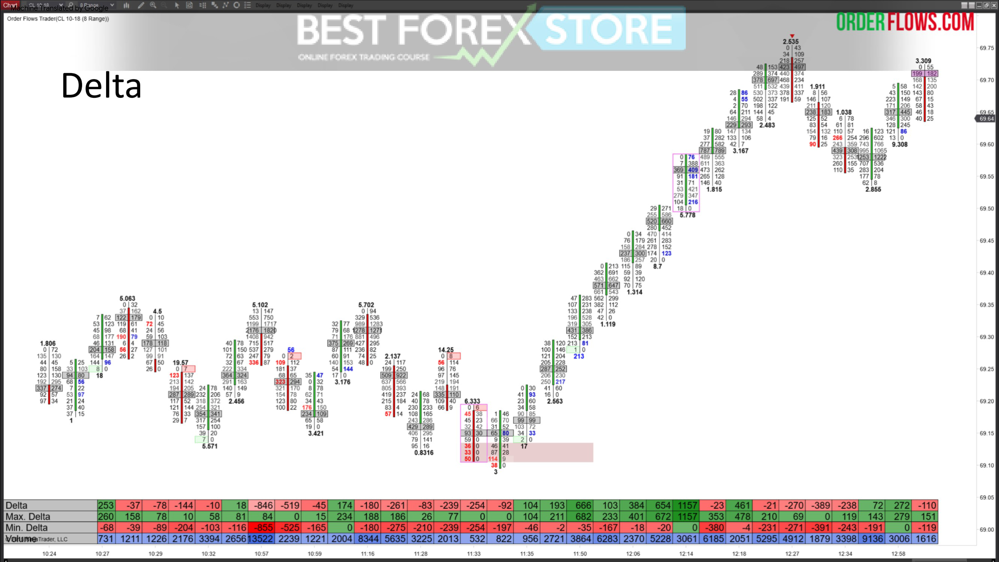

*(slide chi co hinh, khong co text)*

## Trang 76
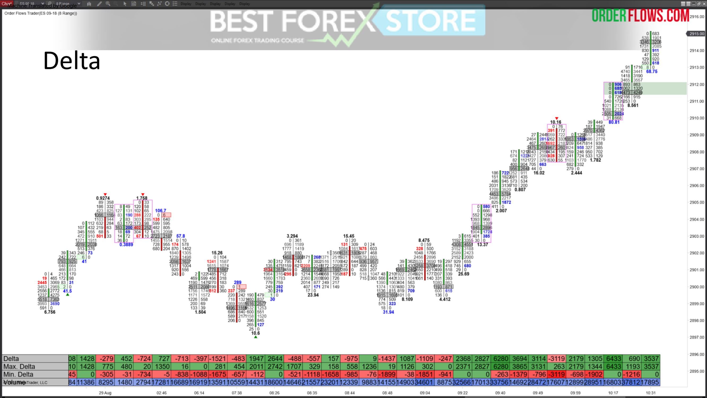

*(slide chi co hinh, khong co text)*

## Trang 77

Delta có liên quan đến khối lượng. Khi một thị trường
tiền mặt cơ bản mở ra và khối lượng lấy ra, tổng thể
các con số đồng bằng sẽ lớn hơn.
Thời gian mở và đóng cửa có thể thể hiện số delta
lớn hơn trung bình do khối lượng lớn hơn trung bình
trong khoảng thời gian.

## Trang 78
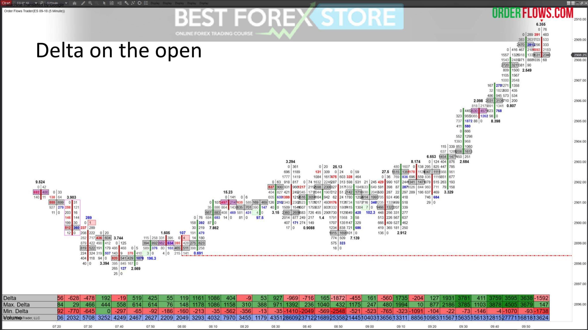

*(slide chi co hinh, khong co text)*

## Trang 79
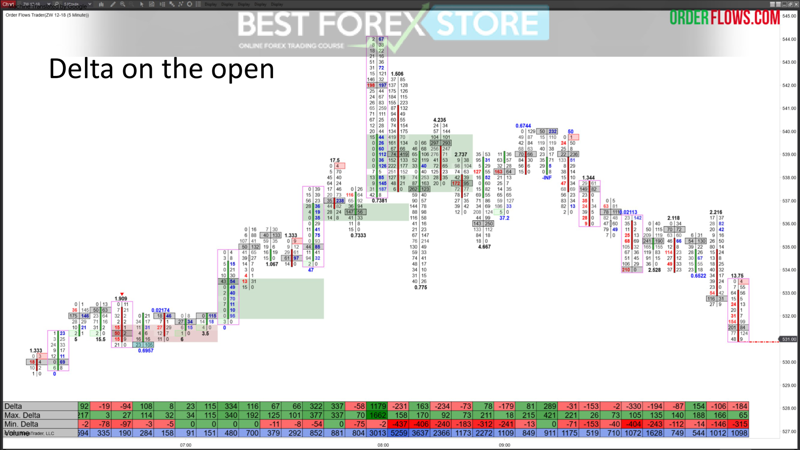

*(slide chi co hinh, khong co text)*

## Trang 80

Max Delta là đồng bằng mạnh nhất ở khía cạnh tích
cực. Điều này có nghĩa là mức độ mua mạnh mẽ tại một
thời điểm trong thanh. Giá trị delta cuối cùng gần với
giá trị delta tối đa cho biết những người mua tích cực
đã thống trị thanh này.

## Trang 81
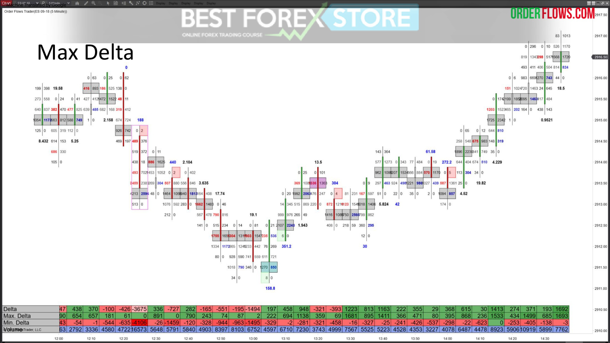

*(slide chi co hinh, khong co text)*

## Trang 82
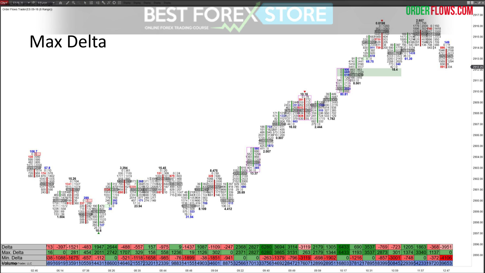

*(slide chi co hinh, khong co text)*

## Trang 83

Điều tôi thích ở Max Delta là khi, qua một vài vạch,
Delta kết thúc gần Max Delta và Min Delta tương đối
nhỏ, nó cho thấy lực mua tích cực mạnh mẽ và sức mạnh
thường được xây dựng dựa trên chính nó và thị trường có
xu hướng tăng.

## Trang 84
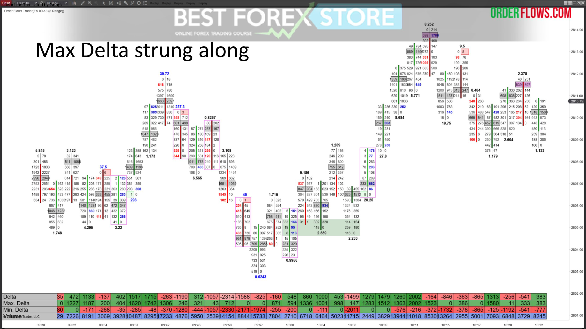

*(slide chi co hinh, khong co text)*

## Trang 85
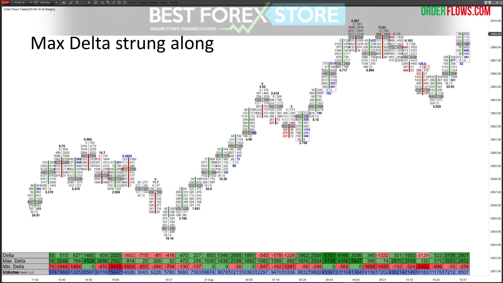

*(slide chi co hinh, khong co text)*

## Trang 86

Min Delta là châu thổ mạnh nhất ở mặt âm của thanh. Có nghĩa
là những người bán hàng hung hăng mạnh mẽ như thế nào trong
quầy bar. Giá đóng cửa gần số delta tối thiểu cho thấy những
người bán tích cực đã thống trị thanh.

## Trang 87
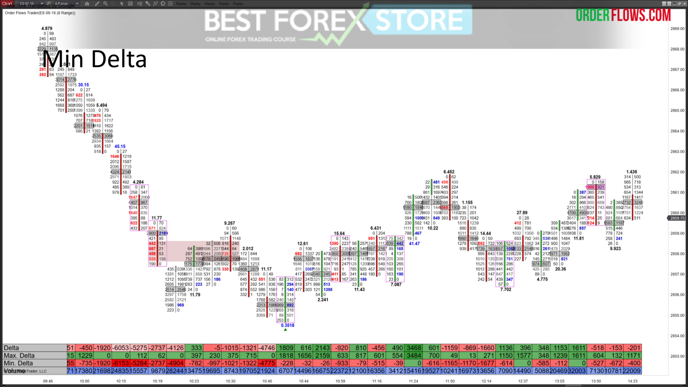

*(slide chi co hinh, khong co text)*

## Trang 88
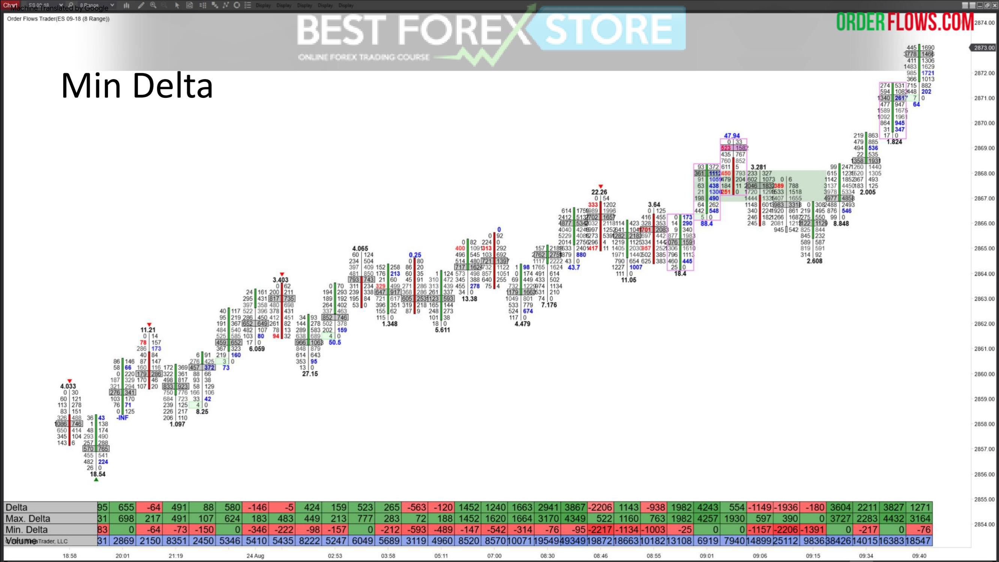

*(slide chi co hinh, khong co text)*

## Trang 89
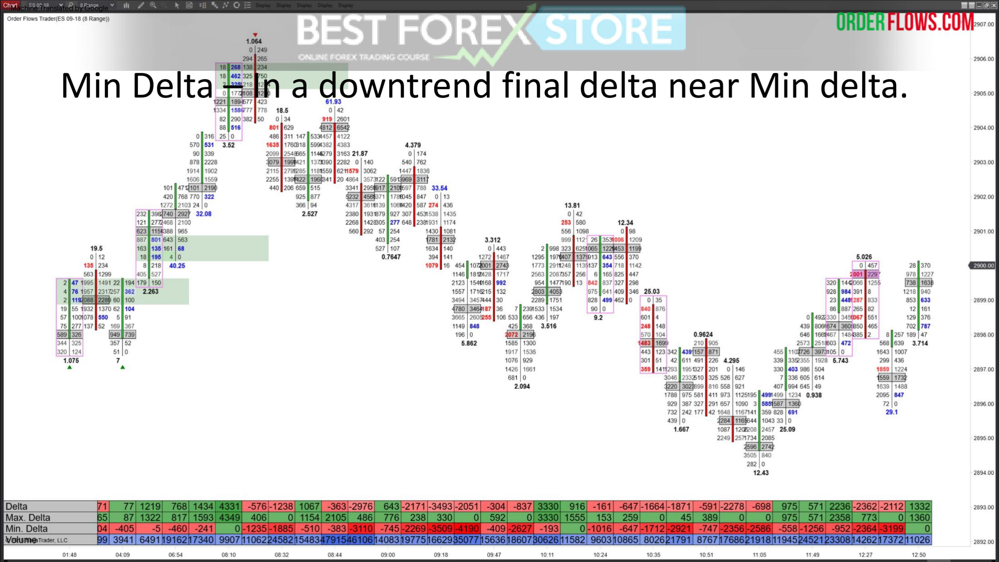

*(slide chi co hinh, khong co text)*

## Trang 90

Điều tôi thích ở Min Delta là khi bạn xâu chuỗi một
vài thanh với nhau mà thanh Delta kết thúc gần số Min
Delta, đó là một cơ hội ngắn tiềm năng tuyệt vời.

## Trang 91
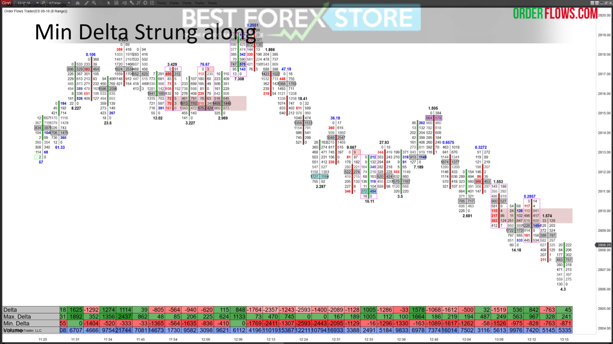

*(slide chi co hinh, khong co text)*

## Trang 92
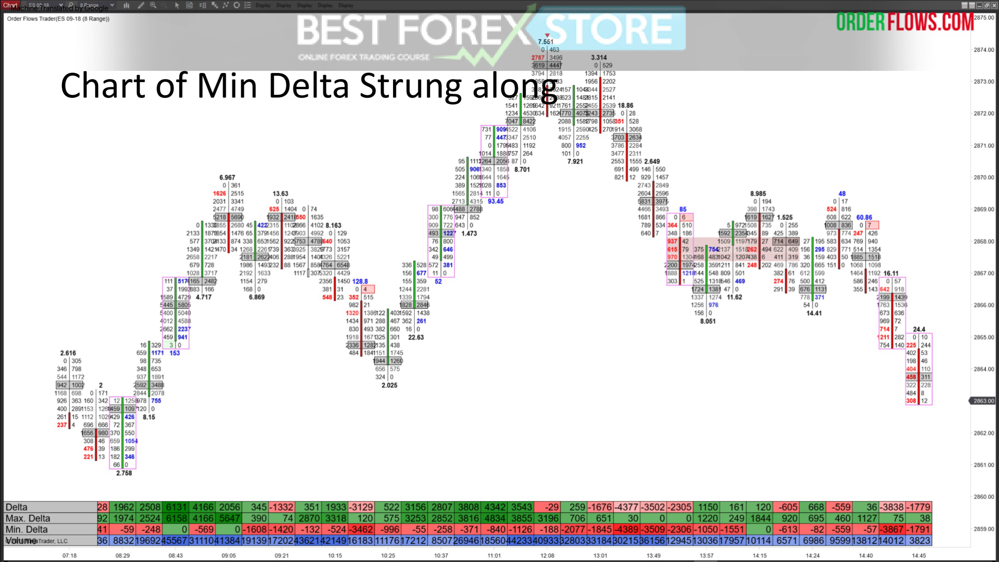

*(slide chi co hinh, khong co text)*

## Trang 93

Có nhiều cách khác nhau để phân tích delta tối đa và tối thiểu
giúp giao dịch có cái nhìn sâu sắc về thị trường mà không thể
nhìn thấy ở bất kỳ nơi nào khác.
Nó có thể giúp bạn thấy được sự thay đổi của cung và cầu.

## Trang 94
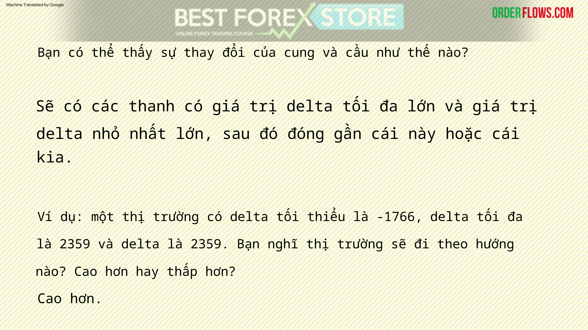

Ví dụ: một thị trường có delta tối thiểu là -1766, delta tối đa
là 2359 và delta là 2359. Bạn nghĩ thị trường sẽ đi theo hướng
nào? Cao hơn hay thấp hơn?
Bạn có thể thấy sự thay đổi của cung và cầu như thế nào?
Sẽ có các thanh có giá trị delta tối đa lớn và giá trị
delta nhỏ nhất lớn, sau đó đóng gần cái này hoặc cái
kia.
Cao hơn.

## Trang 95
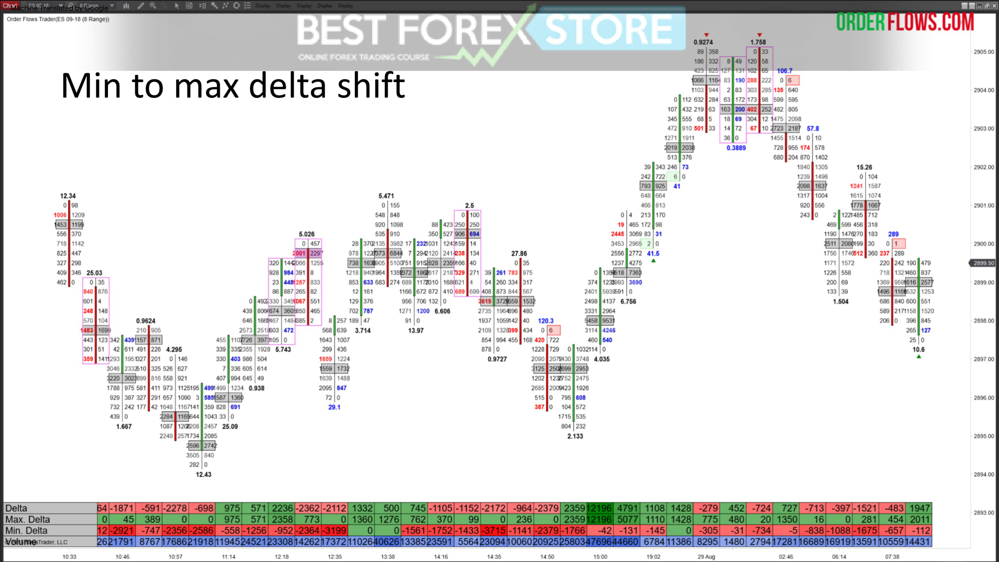

*(slide chi co hinh, khong co text)*

## Trang 96
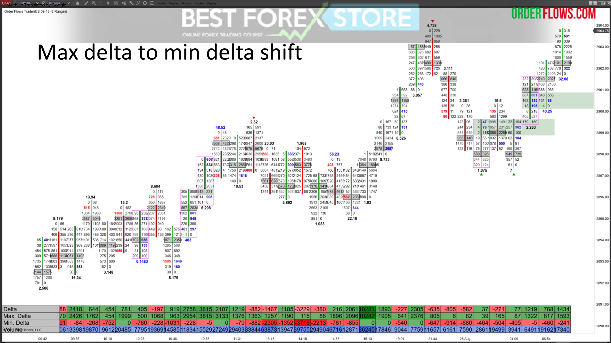

*(slide chi co hinh, khong co text)*

## Trang 97

Delta tích lũy là delta chạy trong toàn bộ phiên
giao dịch. Lấy delta cho mỗi thanh và cộng hoặc trừ nó
khỏi tổng.

## Trang 98
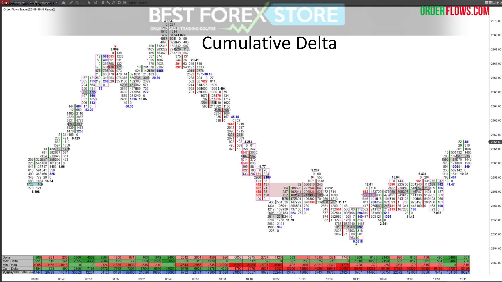

*(slide chi co hinh, khong co text)*

## Trang 99
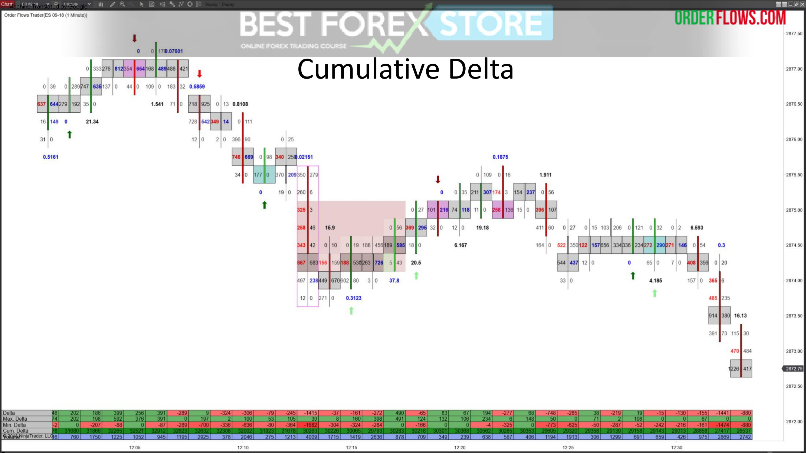

*(slide chi co hinh, khong co text)*

## Trang 100

Cá nhân tôi nghĩ rằng delta tích lũy có thể là một
chỉ báo tụt hậu vì đối với một thị trường dành hàng
giờ để ghép các thanh với delta dương để cung cấp cho
bạn một delta tích lũy dương, thì sẽ cần nhiều thanh
delta âm để biến delta tích lũy thành âm.

## Trang 101
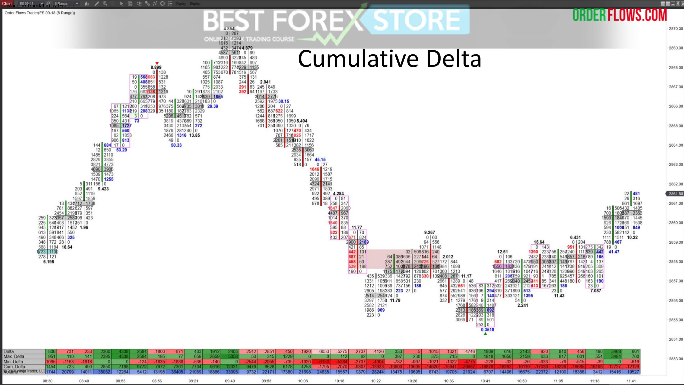

*(slide chi co hinh, khong co text)*

## Trang 102

Delta tích lũy

## Trang 103

Có một số nhà giao dịch nói rằng “giao dịch theo hướng
của đồng bằng tích lũy”. Tôi thấy rằng lời khuyên cực
kỳ tồi tệ vì ví dụ, nếu bạn đang giao dịch biểu đồ ES 1
phút và đồng bằng tích lũy là dương 32623 và bạn nhận
được tín hiệu ngắn hạn, bạn sẽ không thực hiện giao dịch
ngắn hạn và bạn có thể bỏ lỡ rất nhiều giao dịch tuyệt
vời. . Trên biểu đồ dựa trên phút mà bạn chỉ nhận được các
thanh delta trong hàng trăm, sẽ cần rất nhiều thanh delta
âm để biến delta tích lũy thành âm.

## Trang 104
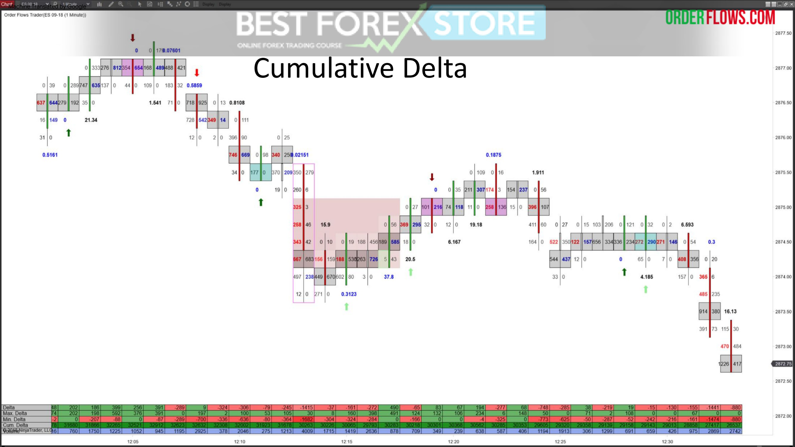

*(slide chi co hinh, khong co text)*

## Trang 105

Đó là những vấn đề tôi gặp phải với đồng bằng tích lũy. Điều đó không
có nghĩa là nó không phải là một công cụ hữu ích. Thay vào đó, tôi chỉ
muốn cho bạn thấy những cạm bẫy của đồng bằng tích lũy.

## Trang 106

Delta / Khối lượng tích lũy là delta tích lũy chia
cho tổng khối lượng của phiên tại thời điểm đó.
Khi tỷ lệ này gần bằng 0, nó là dấu hiệu của một châu thổ tích lũy nhỏ.
Vấn đề là tổng khối lượng sẽ luôn tăng trong khi đồng bằng tích lũy
có thể mở rộng hoặc thu hẹp.

## Trang 107

Những gì tôi tìm kiếm là các khu vực mà đồng
bằng / khối lượng tích lũy gần bằng 0,000 và sau đó tìm
kiếm để giao dịch theo hướng của đồng bằng mạnh sau đó.
Đó là một khu vực hấp thụ và hợp nhất, các nhà
giao dịch gần như bằng nhau trong phiên và tôi chỉ
đang chờ xem hướng đi của thị trường.

## Trang 108
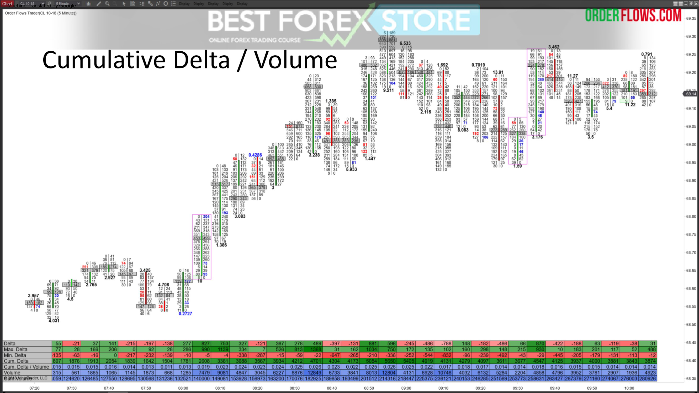

*(slide chi co hinh, khong co text)*

## Trang 109
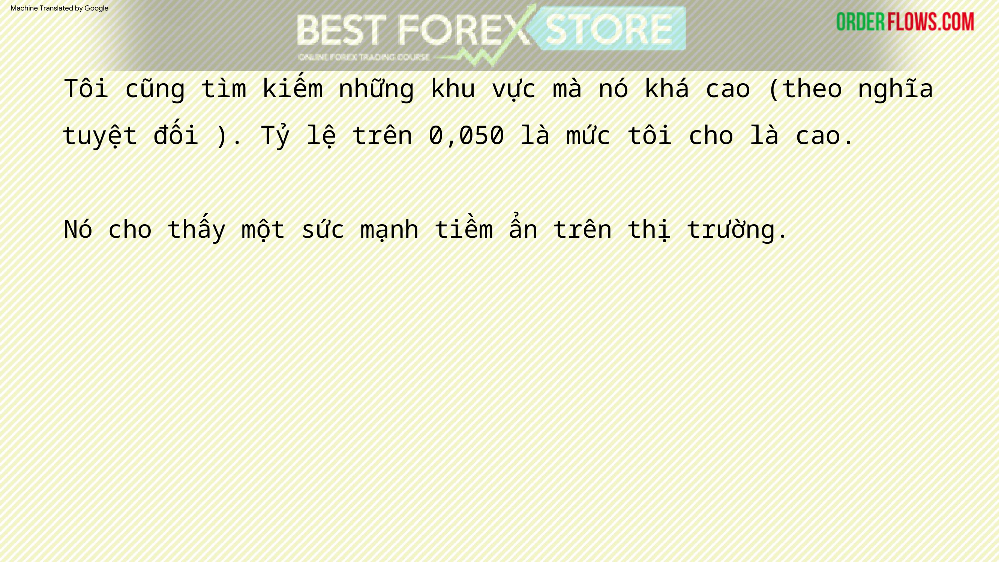

Tôi cũng tìm kiếm những khu vực mà nó khá cao (theo nghĩa
tuyệt đối ). Tỷ lệ trên 0,050 là mức tôi cho là cao.
Nó cho thấy một sức mạnh tiềm ẩn trên thị trường.

## Trang 110
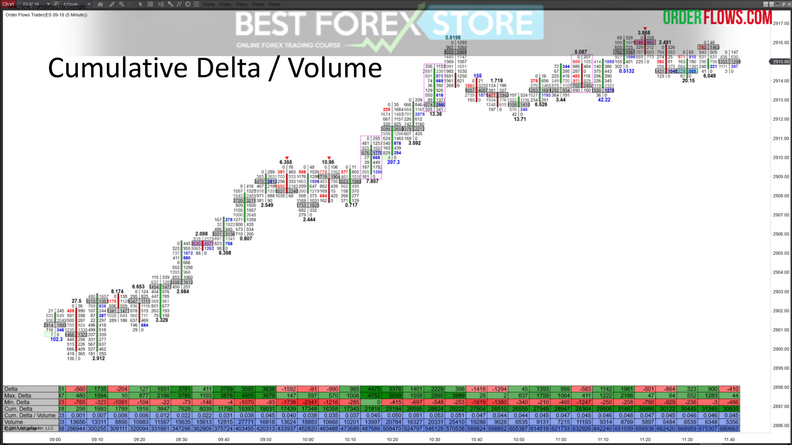

*(slide chi co hinh, khong co text)*

## Trang 111

Nhiều khi delta / volume tích lũy quá nhỏ đến mức vô
ích.

## Trang 112
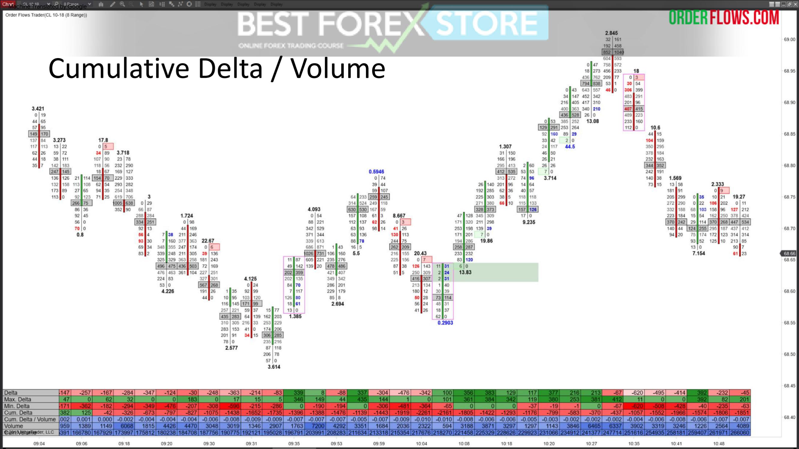

*(slide chi co hinh, khong co text)*

## Trang 113

Một vấn đề khác với Delta / Khối lượng tích lũy là theo
thời gian nó có thể bị san phẳng. Khi ngày trôi qua, những
thay đổi là nhỏ. Vì vậy, sẽ rất khó để thấy bất kỳ thay đổi
nào có ảnh hưởng đến thị trường.

## Trang 114
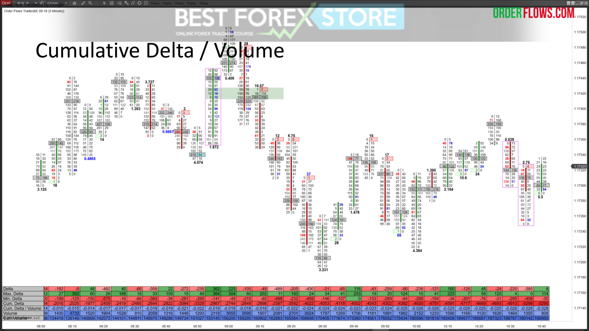

*(slide chi co hinh, khong co text)*

## Trang 115

Tôi sẽ thừa nhận rằng tôi không chú ý nhiều
đến tỷ lệ delta / volume kiêm. Cá nhân tôi chỉ thấy
có rất nhiều thông tin khác ở dạng delta hữu ích hơn.

## Trang 116

Bây giờ, bạn đã hiểu các loại số delta khác nhau có
sẵn để phân tích và quan trọng hơn bạn nên hiểu ý
nghĩa của chúng và cách sử dụng chúng.

## Trang 117

Đây là phần cuối của bài 3. Trong bài 4, tôi sẽ giải thích
chi tiết các thiết lập theo thứ tự dòng chảy delta để bạn
có thể tự tìm kiếm chúng.