# Order Flow eBook — Toan van (theo trang PDF)
> Tai lieu ly thuyet bo tro. Moi muc la 1 trang PDF kem anh.

## Trang 1
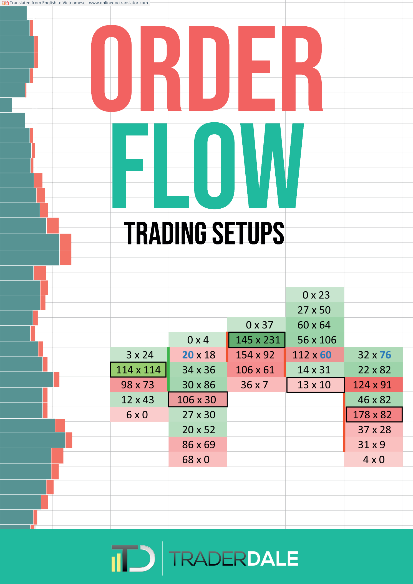

*(trang chi co hinh)*

## Trang 2

Tuyên bố rủi ro
Giao dịch tương lai và ngoại hối tiềm ẩn rủi ro đáng kể và không phải dành cho mọi nhà đầu tư. Một nhà đầu tư
có thể mất tất cả hoặc nhiều hơn số tiền đầu tư ban đầu của họ. Vốn rủi ro là tiền có thể
bị mất đi mà không gây nguy hiểm cho an ninh tài chính hoặc lối sống của một người. Chỉ nên có vốn rủi ro
được sử dụng để giao dịch và chỉ những người có đủ vốn rủi ro mới nên xem xét giao dịch. Quá khứ
hiệu suất không nhất thiết là dấu hiệu của kết quả trong tương lai.
Tiết lộ hiệu suất giả định
Kết quả thực hiện giả định có nhiều hạn chế cố hữu, một số trong đó là
được mô tả dưới đây. Không có tuyên bố nào được đưa ra rằng bất kỳ tài khoản nào sẽ hoặc có khả năng đạt được
lợi nhuận hoặc thua lỗ tương tự như được hiển thị; trên thực tế, thường có những khác biệt rõ ràng
giữa kết quả thực hiện giả định và kết quả thực tế đạt được sau đó bởi
bất kỳ chương trình giao dịch cụ thể nào. Một trong những hạn chế của kết quả thực hiện giả định là
rằng chúng thường được chuẩn bị với lợi ích của nhận thức muộn màng. Ngoài ra, giả sử
giao dịch không liên quan đến rủi ro tài chính và không có hồ sơ giao dịch giả định nào có thể hoàn toàn
tính đến tác động của rủi ro tài chính của giao dịch thực tế. Ví dụ, khả năng chịu đựng
thua lỗ hoặc tuân thủ một chương trình giao dịch cụ thể mặc dù thua lỗ trong giao dịch là một điểm trọng yếu
điều đó cũng có thể ảnh hưởng xấu đến kết quả giao dịch thực tế. Còn rất nhiều yếu tố khác liên quan
thị trường nói chung hoặc việc thực hiện bất kỳ chương trình giao dịch cụ thể nào
không thể được tính toán đầy đủ trong việc chuẩn bị các kết quả hoạt động giả định và tất cả
trong đó có thể ảnh hưởng xấu đến kết quả giao dịch. Cuốn sách này chỉ dành cho mục đích giáo dục và
các ý kiến bày tỏ chỉ là của tác giả. Tất cả các giao dịch được trình bày phải được
được coi là giả thuyết. Không có giao dịch nào được giao dịch trong tài khoản trực tiếp.
Lời chứng thực
Lời chứng thực xuất hiện trong ấn phẩm này có thể không đại diện cho khách hàng khác hoặc
khách hàng và không phải là sự đảm bảo cho hiệu suất hoặc thành công trong tương lai.

## Trang 3

Nội dung
Tải xuống sách điện tử................................................................. ................................................................. ............7
Câu chuyện của tôi ................................................ ................................................................. ...................................số 8
Tại sao tôi bắt đầu sử dụng luồng đơn hàng ................................................. ................................................................. 10
Bạn sẽ học cái gì? ................................................................. ................................................................. ............11
Thông báo quan trọng ................................................ ................................................................. ...................12
Thiết lập luồng đơn hàng.................................................................. ................................................................. ............13
Nền tảng giao dịch NinjaTrader 8 .................................... .................................................13
Các nền tảng giao dịch khác.................................................................. ................................................................. .....13
Nguồn cấp dữ liệu cho luồng đơn hàng.................................................. ................................................................. .....14
CQG – Nguồn cấp dữ liệu tương lai.................................................. ................................................................. ..14
Nơi nhận đơn hàng................................................................. ................................................................. .....15
Bạn có thể giao dịch những công cụ nào với dòng lệnh?................................................. ............16
Bạn nên bắt đầu với công cụ giao dịch nào? ................................................................. ............16
Luồng lệnh: Forex so với hợp đồng tương lai.................................................. ................................................................. 0,16
Chuyển cấp độ giao dịch từ hợp đồng tương lai tiền tệ sang ngoại hối.................................................. ....18
Luồng lệnh – Những người tham gia thị trường.................................................. ...................................................19
Những người tham gia thị trường thụ động và chủ động (tích cực) .................................... ...................19
Những người tham gia thị trường thụ động.................................................................. ................................................................. 20
Những người tham gia thị trường tích cực................................................................. ................................................................. 0,21
Chủ động và thụ động trong một biểu đồ................................................................. .................................................22
Quan điểm lớn hơn (THƯỞNG) ................................................. ................................................................. 0,23
Luồng lệnh – Mô tả biểu đồ cơ bản ................................................. ...................................24
Dấu chân................................................................................. ................................................................. ............24
Tế bào xanh/đỏ.................................................................. ................................................................. ...................25

## Trang 4

Nút âm lượng cao (HVN)................................................................ ................................................................. .....25
Đồng bằng................................................................................. ................................................................. .................................26
VÍ DỤ: Giá và sự phân kỳ Delta .................................................... .................................27
Tóm tắt dấu chân................................................................................. ................................................................. ............29
Hồ sơ khối lượng................................................................................. ................................................................. ...................31
Luồng lệnh TD – Tính năng đặc biệt................................................. ...................................................32
Luồng đặt lệnh cho Forex................................................................. ................................................................. ............32
Cụm khối lượng................................................................................. ................................................................. ............33
Nhiều nút âm lượng cao (HVN) ................................................. ...................................34
Sự mất cân bằng................................................................................. ................................................................. ............35
Mất cân bằng xếp chồng................................................................................. ................................................................. ............36
Công việc chưa hoàn thành.................................................................. ................................................................. ..........37
VÍ DỤ: Công việc chưa hoàn thành.................................................. ...................................38
Bộ lọc giao dịch................................................................................. ................................................................. ............40
Delta tích lũy................................................................................. ................................................................. ............41
VÍ DỤ: Delta tích lũy ................................................................. .................................................42
Luồng lệnh – Không gian làm việc giao dịch.................................................. .................................................43
Luồng lệnh – Thiết lập giao dịch.................................................. ................................................................. ....45
Thiết lập giao dịch số 1: Cụm khối lượng.................................................. .................................................45
Cụm khối lượng (trong XU HƯỚNG).................................................. ...................................45
VÍ DỤ: Cụm khối lượng (trong XU HƯỚNG) ...................................... ......................48
Cụm khối lượng (trong TỪ CHỐI).................................................. ...................................50
VÍ DỤ: Cụm khối lượng (trong TỪ CHỐI)................................................. ............52
Thiết lập giao dịch số 2: Nhiều nút ...................................... ...................................54
VÍ DỤ: Nhiều nút................................................................. ...................................56
Thiết lập giao dịch số 3: Bộ lọc giao dịch .................................... .................................................59

## Trang 5

VÍ DỤ: Bộ lọc giao dịch.................................................. ................................................................. ..61
Thiết lập giao dịch số 4: Mất cân bằng xếp chồng lên nhau .................................... .................................64
VÍ DỤ: Sự mất cân bằng xếp chồng lên nhau.................................................. ...................................67
Thiết lập giao dịch số 5: Công việc chưa hoàn thành .................................... .................................70
Thu lợi nhuận................................................................................. ................................................................. ......................71
Chặn đứng tổn thất ................................................ ................................................................. ............72
Xác nhận................................................................................. ................................................................. .................72
Cảnh báo khi tham gia một giao dịch xấu.................................................. .................................73
VÍ DỤ: Công việc chưa hoàn thành.................................................. ...................................75
Quy trình đặt hàng – Xác nhận................................................................. ................................................................. .....79
Thiết lập xác nhận số 1: Lệnh giới hạn lớn .................................... ...................................80
VÍ DỤ: Lệnh giới hạn lớn.................................................. ......................................83
Thiết lập xác nhận #2: Hấp thụ.................................................. ...................................86
VÍ DỤ: Sự hấp thụ.................................................................. ................................................................. ...88
Thiết lập xác nhận số 3: Lệnh linh hoạt và Delta .................................... ............91
VÍ DỤ: Lệnh linh hoạt và Delta ................................................. ......................95
Thiết lập xác nhận số 4: Phân kỳ Delta tích lũy .................................... ............98
VÍ DỤ: Phân kỳ Delta tích lũy .................................................... ............102
Kiếm lợi nhuận từ dòng lệnh.................................................. ................................................................. ....104
Chốt lời dựa trên khối lượng.................................................. ................................................................. ..104
VÍ DỤ: Chốt lời dựa trên khối lượng.................................................. .................................106
Chốt lời – Trailing ................................................................. ................................................................. ............109
Trailing TP - Tín hiệu cảnh báo.................................................. ......................................110
VÍ DỤ: Chốt lãi - Trailing.................................................. ...................................112
Dừng lỗ với luồng lệnh................................................................. ................................................................. ......114
VÍ DỤ: Dừng lỗ với luồng lệnh.................................................. .................................116

## Trang 6

Cách tìm mức hỗ trợ và kháng cự bằng hồ sơ khối lượng.................................. ........120
Giới thiệu hồ sơ khối lượng................................................................. ......................................120
Hồ sơ Khối lượng trông như thế nào?................................................. ...................................121
Cấu hình Khối lượng khác với Chỉ báo Khối lượng Tiêu chuẩn trong MT4 như thế nào?.................................121
Hồ sơ khối lượng cho chúng tôi biết điều gì? ................................................................. .................................122
Các hình dạng hồ sơ khối lượng khác nhau................................................. ...................................124
Biên dạng hình chữ D................................................................. ................................................................. ............124
Hồ sơ hình chữ P................................................................................. ................................................................. ............125
Hồ sơ hình b................................................................................. ................................................................. ............126
Hồ sơ mỏng................................................................................. ................................................................. ...................127
Điều gì làm cho hồ sơ khối lượng khác với các chỉ số giao dịch khác?.................................128
Tại sao lại quan tâm đến khối lượng và những gì các tổ chức lớn đang làm? ......................128
Hồ sơ khối lượng - Thiết lập giao dịch.................................................. ...................................................129
Thiết lập Hồ sơ Ổ đĩa số 1: Thiết lập Tích lũy Ổ đĩa .................................... ..........130
Logic đằng sau việc thiết lập tích lũy khối lượng.................................................. ......................131
VÍ DỤ: Thiết lập tích lũy khối lượng.................................................. ............134
Thiết lập hồ sơ khối lượng số 2: Thiết lập xu hướng .................................... ...................................136
Logic đằng sau việc thiết lập xu hướng:................................................. ......................137
VÍ DỤ: Thiết lập xu hướng .................................................... ................................................................. 138
Thiết lập Hồ sơ Khối lượng số 3: Thiết lập Từ chối........................................... ......................140
VÍ DỤ: Thiết lập từ chối.................................................. .................................................143
Nơi nhận thêm thông tin về hồ sơ khối lượng.................................. ............145
Ví dụ về giao dịch trực tiếp - Liên kết .................................... ................................................................. ...145
Phải làm gì tiếp theo .............................................. ................................................................. ......................146
Đẩy nhanh quá trình học tập của bạn!................................................. ................................................................. ......146
Gói ưu tú................................................................................. ................................................................. ......................147

## Trang 7

Gói luồng đơn hàng................................................................. ................................................................. ............149
Chỉ một vài lời chứng thực về các khóa học giao dịch của tôi ................................. ............151
Bảng chú giải................................................. ................................................................. .................................155
Cảm ơn! ................................................................. ................................................................. ............159

## Trang 8

Tải xuống sách điện tử
Lưu ý nhanh trước khi chúng ta bắt đầu: Nếu bạn mua phiên bản in đen trắng của cuốn sách này,
thì tôi hy vọng bạn sẽ thấy một số chi tiết trong hình ảnh hơi khó nhìn và một số văn bản hoặc
số quá nhỏ và khó đọc.
Vì lý do này, tôi đã tải lên phiên bản điện tử của cuốn sách (cùng với một số Quy trình đặt hàng
video) trên một trang web đặc biệt. Bằng cách này, bạn sẽ có thể kiểm tra màu sắc và hình ảnh
độ phân giải cao. Nếu cần, bạn cũng có thể phóng to để xem hình ảnh rõ hơn.
Liên kết:https://www.trader-dale.com/of-book/
Mật khẩu:giao dịch vui vẻ
7

## Trang 9
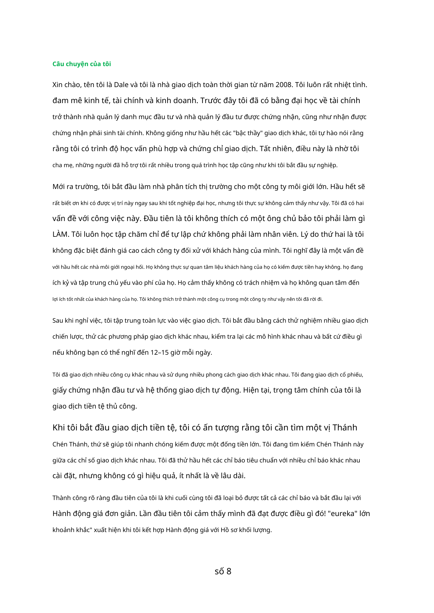

Câu chuyện của tôi
Xin chào, tên tôi là Dale và tôi là nhà giao dịch toàn thời gian từ năm 2008. Tôi luôn rất nhiệt tình.
đam mê kinh tế, tài chính và kinh doanh. Trước đây tôi đã có bằng đại học về tài chính
trở thành nhà quản lý danh mục đầu tư và nhà quản lý đầu tư được chứng nhận, cũng như nhận được
chứng nhận phái sinh tài chính. Không giống như hầu hết các "bậc thầy" giao dịch khác, tôi tự hào nói rằng
rằng tôi có trình độ học vấn phù hợp và chứng chỉ giao dịch. Tất nhiên, điều này là nhờ tôi
cha mẹ, những người đã hỗ trợ tôi rất nhiều trong quá trình học tập cũng như khi tôi bắt đầu sự nghiệp.
Mới ra trường, tôi bắt đầu làm nhà phân tích thị trường cho một công ty môi giới lớn. Hầu hết sẽ
rất biết ơn khi có được vị trí này ngay sau khi tốt nghiệp đại học, nhưng tôi thực sự không cảm thấy như vậy. Tôi đã có hai
vấn đề với công việc này. Đầu tiên là tôi không thích có một ông chủ bảo tôi phải làm gì
LÀM. Tôi luôn học tập chăm chỉ để tự lập chứ không phải làm nhân viên. Lý do thứ hai là tôi
không đặc biệt đánh giá cao cách công ty đối xử với khách hàng của mình. Tôi nghĩ đây là một vấn đề
với hầu hết các nhà môi giới ngoại hối. Họ không thực sự quan tâm liệu khách hàng của họ có kiếm được tiền hay không. họ đang
ích kỷ và tập trung chủ yếu vào phí của họ. Họ cảm thấy không có trách nhiệm và họ không quan tâm đến
lợi ích tốt nhất của khách hàng của họ. Tôi không thích trở thành một công cụ trong một công ty như vậy nên tôi đã rời đi.
Sau khi nghỉ việc, tôi tập trung toàn lực vào việc giao dịch. Tôi bắt đầu bằng cách thử nghiệm nhiều giao dịch
chiến lược, thử các phương pháp giao dịch khác nhau, kiểm tra lại các mô hình khác nhau và bất cứ điều gì
nếu không bạn có thể nghĩ đến 12–15 giờ mỗi ngày.
Tôi đã giao dịch nhiều công cụ khác nhau và sử dụng nhiều phong cách giao dịch khác nhau. Tôi đang giao dịch cổ phiếu,
giấy chứng nhận đầu tư và hệ thống giao dịch tự động. Hiện tại, trọng tâm chính của tôi là
giao dịch tiền tệ thủ công.
Khi tôi bắt đầu giao dịch tiền tệ, tôi có ấn tượng rằng tôi cần tìm một vị Thánh
Chén Thánh, thứ sẽ giúp tôi nhanh chóng kiếm được một đống tiền lớn. Tôi đang tìm kiếm Chén Thánh này
giữa các chỉ số giao dịch khác nhau. Tôi đã thử hầu hết các chỉ báo tiêu chuẩn với nhiều chỉ báo khác nhau
cài đặt, nhưng không có gì hiệu quả, ít nhất là về lâu dài.
Thành công rõ ràng đầu tiên của tôi là khi cuối cùng tôi đã loại bỏ được tất cả các chỉ báo và bắt đầu lại với
Hành động giá đơn giản. Lần đầu tiên tôi cảm thấy mình đã đạt được điều gì đó! "eureka" lớn
khoảnh khắc" xuất hiện khi tôi kết hợp Hành động giá với Hồ sơ khối lượng.
số 8

## Trang 10

Lúc đầu, tôi chỉ giao dịch theo xu hướng swing. Tôi chủ yếu làm việc theo khung thời gian hàng ngày và, như
bạn có thể tưởng tượng, tôi không có nhiều giao dịch. Tuy nhiên, đây là lần đầu tiên tôi cảm thấy tự tin về
giao dịch của tôi. Tôi cũng rất vui mừng vì cuối cùng tôi đã tìm được con đường của mình và việc giao dịch của tôi đã trở nên
nhất quán.
Đối với nhiều người điều này là đủ, nhưng tôi muốn tìm hiểu thêm và tiến xa hơn. tôi đã bắt đầu
để đi sâu hơn nhiều và tôi bắt đầu tìm kiếm một phương pháp hoặc công cụ phù hợp để giao dịch trong ngày trên
khung thời gian nhanh hơn nhiều.
9

## Trang 11
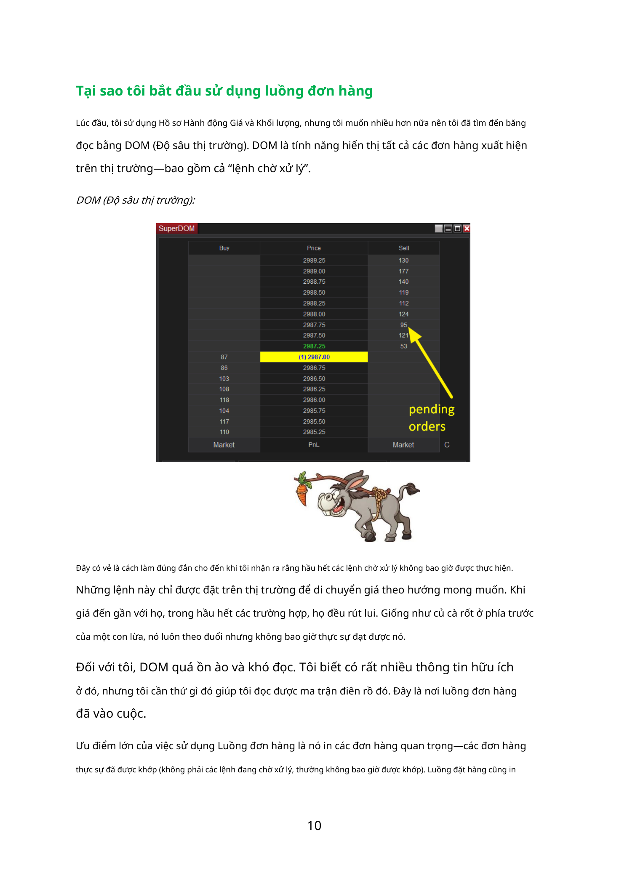

Tại sao tôi bắt đầu sử dụng luồng đơn hàng
Lúc đầu, tôi sử dụng Hồ sơ Hành động Giá và Khối lượng, nhưng tôi muốn nhiều hơn nữa nên tôi đã tìm đến băng
đọc bằng DOM (Độ sâu thị trường). DOM là tính năng hiển thị tất cả các đơn hàng xuất hiện
trên thị trường—bao gồm cả “lệnh chờ xử lý”.
DOM (Độ sâu thị trường):
Đây có vẻ là cách làm đúng đắn cho đến khi tôi nhận ra rằng hầu hết các lệnh chờ xử lý không bao giờ được thực hiện.
Những lệnh này chỉ được đặt trên thị trường để di chuyển giá theo hướng mong muốn. Khi
giá đến gần với họ, trong hầu hết các trường hợp, họ đều rút lui. Giống như củ cà rốt ở phía trước
của một con lừa, nó luôn theo đuổi nhưng không bao giờ thực sự đạt được nó.
Đối với tôi, DOM quá ồn ào và khó đọc. Tôi biết có rất nhiều thông tin hữu ích
ở đó, nhưng tôi cần thứ gì đó giúp tôi đọc được ma trận điên rồ đó. Đây là nơi luồng đơn hàng
đã vào cuộc.
Ưu điểm lớn của việc sử dụng Luồng đơn hàng là nó in các đơn hàng quan trọng—các đơn hàng
thực sự đã được khớp (không phải các lệnh đang chờ xử lý, thường không bao giờ được khớp). Luồng đặt hàng cũng in
10

## Trang 12
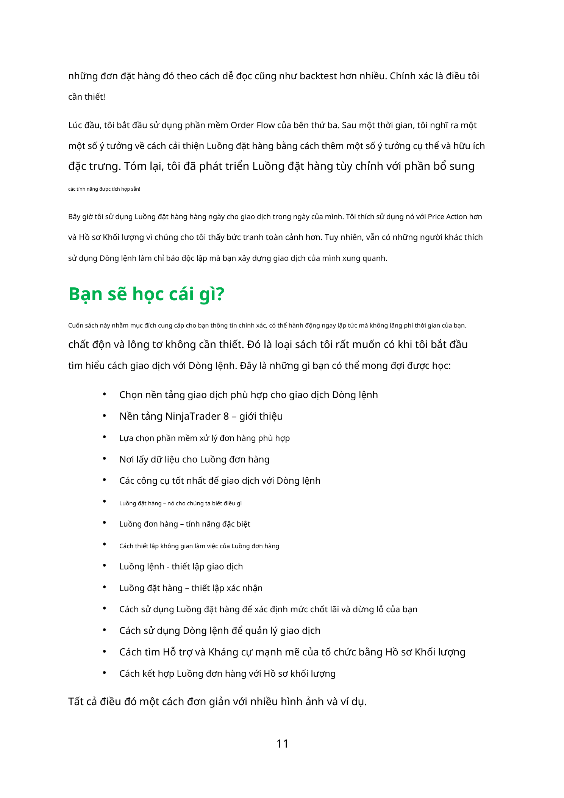

những đơn đặt hàng đó theo cách dễ đọc cũng như backtest hơn nhiều. Chính xác là điều tôi
cần thiết!
Lúc đầu, tôi bắt đầu sử dụng phần mềm Order Flow của bên thứ ba. Sau một thời gian, tôi nghĩ ra một
một số ý tưởng về cách cải thiện Luồng đặt hàng bằng cách thêm một số ý tưởng cụ thể và hữu ích
đặc trưng. Tóm lại, tôi đã phát triển Luồng đặt hàng tùy chỉnh với phần bổ sung
các tính năng được tích hợp sẵn!
Bây giờ tôi sử dụng Luồng đặt hàng hàng ngày cho giao dịch trong ngày của mình. Tôi thích sử dụng nó với Price Action hơn
và Hồ sơ Khối lượng vì chúng cho tôi thấy bức tranh toàn cảnh hơn. Tuy nhiên, vẫn có những người khác thích
sử dụng Dòng lệnh làm chỉ báo độc lập mà bạn xây dựng giao dịch của mình xung quanh.
Bạn sẽ học cái gì?
Cuốn sách này nhằm mục đích cung cấp cho bạn thông tin chính xác, có thể hành động ngay lập tức mà không lãng phí thời gian của bạn.
chất độn và lông tơ không cần thiết. Đó là loại sách tôi rất muốn có khi tôi bắt đầu
tìm hiểu cách giao dịch với Dòng lệnh. Đây là những gì bạn có thể mong đợi được học:
•
Chọn nền tảng giao dịch phù hợp cho giao dịch Dòng lệnh
•
Nền tảng NinjaTrader 8 – giới thiệu
•
Lựa chọn phần mềm xử lý đơn hàng phù hợp
•
Nơi lấy dữ liệu cho Luồng đơn hàng
•
Các công cụ tốt nhất để giao dịch với Dòng lệnh
•
Luồng đặt hàng – nó cho chúng ta biết điều gì
•
Luồng đơn hàng – tính năng đặc biệt
•
Cách thiết lập không gian làm việc của Luồng đơn hàng
•
Luồng lệnh - thiết lập giao dịch
•
Luồng đặt hàng – thiết lập xác nhận
•
Cách sử dụng Luồng đặt hàng để xác định mức chốt lãi và dừng lỗ của bạn
•
Cách sử dụng Dòng lệnh để quản lý giao dịch
•
Cách tìm Hỗ trợ và Kháng cự mạnh mẽ của tổ chức bằng Hồ sơ Khối lượng
•
Cách kết hợp Luồng đơn hàng với Hồ sơ khối lượng
Tất cả điều đó một cách đơn giản với nhiều hình ảnh và ví dụ.
11

## Trang 13
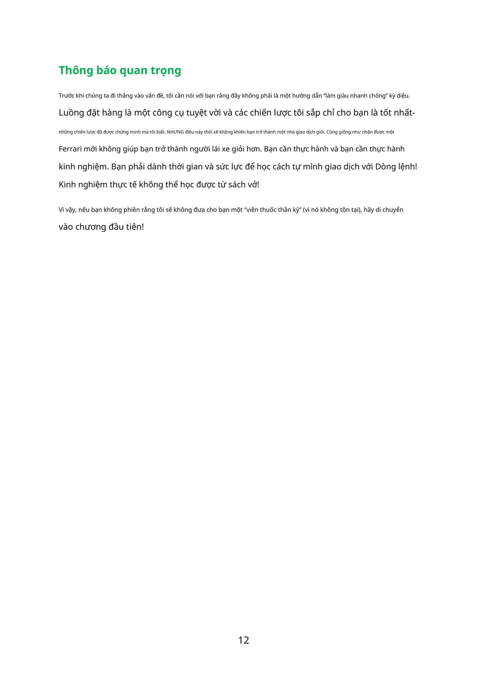

Thông báo quan trọng
Trước khi chúng ta đi thẳng vào vấn đề, tôi cần nói với bạn rằng đây không phải là một hướng dẫn “làm giàu nhanh chóng” kỳ diệu.
Luồng đặt hàng là một công cụ tuyệt vời và các chiến lược tôi sắp chỉ cho bạn là tốt nhất-
những chiến lược đã được chứng minh mà tôi biết. NHƯNG điều này thôi sẽ không khiến bạn trở thành một nhà giao dịch giỏi. Cũng giống như nhận được một
Ferrari mới không giúp bạn trở thành người lái xe giỏi hơn. Bạn cần thực hành và bạn cần thực hành
kinh nghiệm. Bạn phải dành thời gian và sức lực để học cách tự mình giao dịch với Dòng lệnh!
Kinh nghiệm thực tế không thể học được từ sách vở!
Vì vậy, nếu bạn không phiền rằng tôi sẽ không đưa cho bạn một “viên thuốc thần kỳ” (vì nó không tồn tại), hãy di chuyển
vào chương đầu tiên!
12

## Trang 14
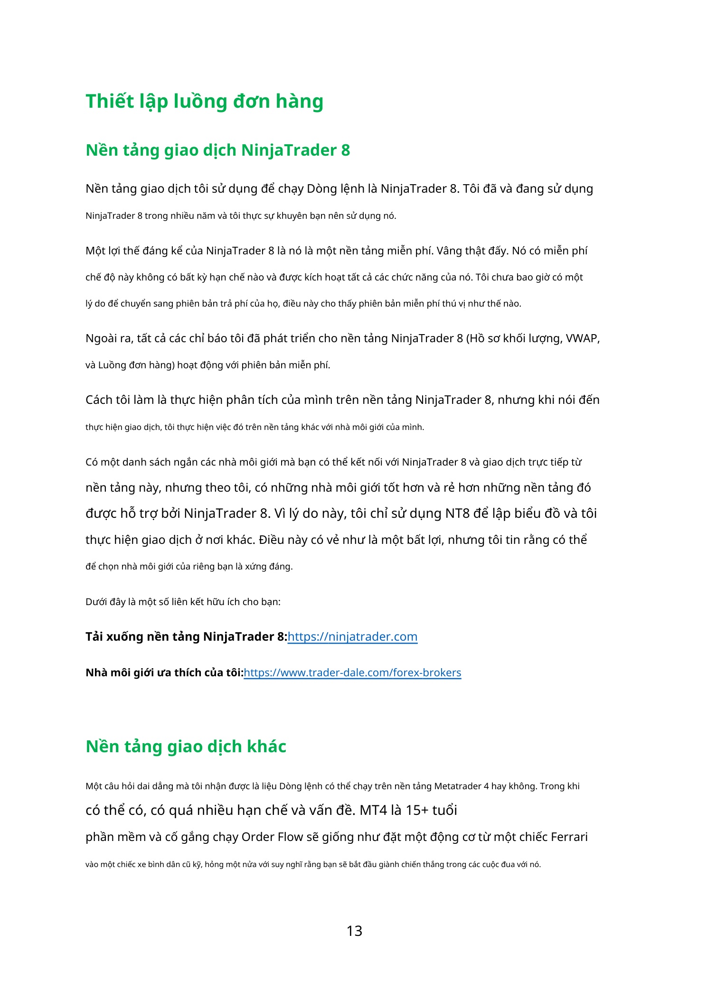

Thiết lập luồng đơn hàng
Nền tảng giao dịch NinjaTrader 8
Nền tảng giao dịch tôi sử dụng để chạy Dòng lệnh là NinjaTrader 8. Tôi đã và đang sử dụng
NinjaTrader 8 trong nhiều năm và tôi thực sự khuyên bạn nên sử dụng nó.
Một lợi thế đáng kể của NinjaTrader 8 là nó là một nền tảng miễn phí. Vâng thật đấy. Nó có miễn phí
chế độ này không có bất kỳ hạn chế nào và được kích hoạt tất cả các chức năng của nó. Tôi chưa bao giờ có một
lý do để chuyển sang phiên bản trả phí của họ, điều này cho thấy phiên bản miễn phí thú vị như thế nào.
Ngoài ra, tất cả các chỉ báo tôi đã phát triển cho nền tảng NinjaTrader 8 (Hồ sơ khối lượng, VWAP,
và Luồng đơn hàng) hoạt động với phiên bản miễn phí.
Cách tôi làm là thực hiện phân tích của mình trên nền tảng NinjaTrader 8, nhưng khi nói đến
thực hiện giao dịch, tôi thực hiện việc đó trên nền tảng khác với nhà môi giới của mình.
Có một danh sách ngắn các nhà môi giới mà bạn có thể kết nối với NinjaTrader 8 và giao dịch trực tiếp từ
nền tảng này, nhưng theo tôi, có những nhà môi giới tốt hơn và rẻ hơn những nền tảng đó
được hỗ trợ bởi NinjaTrader 8. Vì lý do này, tôi chỉ sử dụng NT8 để lập biểu đồ và tôi
thực hiện giao dịch ở nơi khác. Điều này có vẻ như là một bất lợi, nhưng tôi tin rằng có thể
để chọn nhà môi giới của riêng bạn là xứng đáng.
Dưới đây là một số liên kết hữu ích cho bạn:
Tải xuống nền tảng NinjaTrader 8:https://ninjatrader.com
Nhà môi giới ưa thích của tôi:https://www.trader-dale.com/forex-brokers
Nền tảng giao dịch khác
Một câu hỏi dai dẳng mà tôi nhận được là liệu Dòng lệnh có thể chạy trên nền tảng Metatrader 4 hay không. Trong khi
có thể có, có quá nhiều hạn chế và vấn đề. MT4 là 15+ tuổi
phần mềm và cố gắng chạy Order Flow sẽ giống như đặt một động cơ từ một chiếc Ferrari
vào một chiếc xe bình dân cũ kỹ, hỏng một nửa với suy nghĩ rằng bạn sẽ bắt đầu giành chiến thắng trong các cuộc đua với nó.
13

## Trang 15
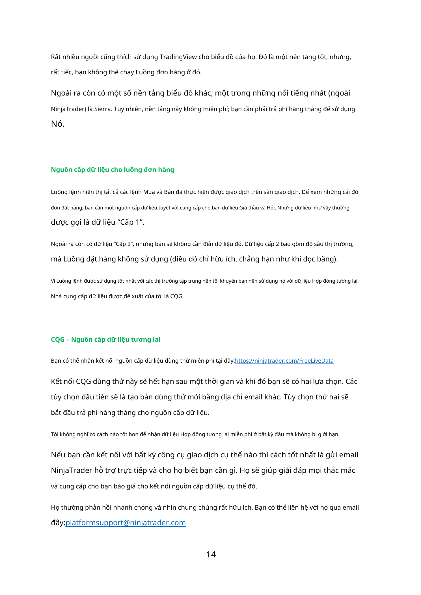

Rất nhiều người cũng thích sử dụng TradingView cho biểu đồ của họ. Đó là một nền tảng tốt, nhưng,
rất tiếc, bạn không thể chạy Luồng đơn hàng ở đó.
Ngoài ra còn có một số nền tảng biểu đồ khác; một trong những nổi tiếng nhất (ngoài
NinjaTrader) là Sierra. Tuy nhiên, nền tảng này không miễn phí; bạn cần phải trả phí hàng tháng để sử dụng
Nó.
Nguồn cấp dữ liệu cho luồng đơn hàng
Luồng lệnh hiển thị tất cả các lệnh Mua và Bán đã thực hiện được giao dịch trên sàn giao dịch. Để xem những cái đó
đơn đặt hàng, bạn cần một nguồn cấp dữ liệu tuyệt vời cung cấp cho bạn dữ liệu Giá thầu và Hỏi. Những dữ liệu như vậy thường
được gọi là dữ liệu “Cấp 1”.
Ngoài ra còn có dữ liệu “Cấp 2”, nhưng bạn sẽ không cần đến dữ liệu đó. Dữ liệu cấp 2 bao gồm độ sâu thị trường,
mà Luồng đặt hàng không sử dụng (điều đó chỉ hữu ích, chẳng hạn như khi đọc băng).
Vì Luồng lệnh được sử dụng tốt nhất với các thị trường tập trung nên tôi khuyên bạn nên sử dụng nó với dữ liệu Hợp đồng tương lai.
Nhà cung cấp dữ liệu được đề xuất của tôi là CQG.
CQG – Nguồn cấp dữ liệu tương lai
Bạn có thể nhận kết nối nguồn cấp dữ liệu dùng thử miễn phí tại đây:https://ninjatrader.com/FreeLiveData
Kết nối CQG dùng thử này sẽ hết hạn sau một thời gian và khi đó bạn sẽ có hai lựa chọn. Các
tùy chọn đầu tiên sẽ là tạo bản dùng thử mới bằng địa chỉ email khác. Tùy chọn thứ hai sẽ
bắt đầu trả phí hàng tháng cho nguồn cấp dữ liệu.
Tôi không nghĩ có cách nào tốt hơn để nhận dữ liệu Hợp đồng tương lai miễn phí ở bất kỳ đâu mà không bị giới hạn.
Nếu bạn cần kết nối với bất kỳ công cụ giao dịch cụ thể nào thì cách tốt nhất là gửi email
NinjaTrader hỗ trợ trực tiếp và cho họ biết bạn cần gì. Họ sẽ giúp giải đáp mọi thắc mắc
và cung cấp cho bạn báo giá cho kết nối nguồn cấp dữ liệu cụ thể đó.
Họ thường phản hồi nhanh chóng và nhìn chung chúng rất hữu ích. Bạn có thể liên hệ với họ qua email
đây:platformsupport@ninjatrader.com
14

## Trang 16
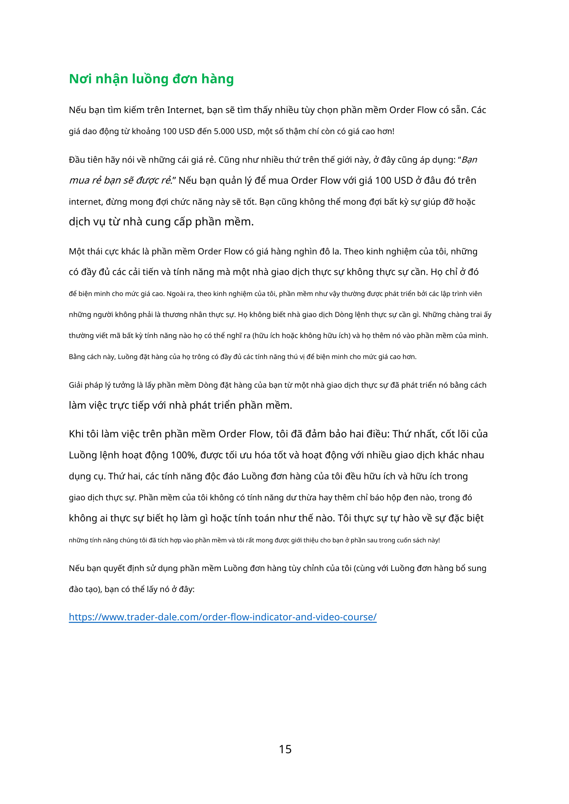

Nơi nhận luồng đơn hàng
Nếu bạn tìm kiếm trên Internet, bạn sẽ tìm thấy nhiều tùy chọn phần mềm Order Flow có sẵn. Các
giá dao động từ khoảng 100 USD đến 5.000 USD, một số thậm chí còn có giá cao hơn!
Đầu tiên hãy nói về những cái giá rẻ. Cũng như nhiều thứ trên thế giới này, ở đây cũng áp dụng: “Bạn
mua rẻ bạn sẽ được rẻ.” Nếu bạn quản lý để mua Order Flow với giá 100 USD ở đâu đó trên
internet, đừng mong đợi chức năng này sẽ tốt. Bạn cũng không thể mong đợi bất kỳ sự giúp đỡ hoặc
dịch vụ từ nhà cung cấp phần mềm.
Một thái cực khác là phần mềm Order Flow có giá hàng nghìn đô la. Theo kinh nghiệm của tôi, những
có đầy đủ các cải tiến và tính năng mà một nhà giao dịch thực sự không thực sự cần. Họ chỉ ở đó
để biện minh cho mức giá cao. Ngoài ra, theo kinh nghiệm của tôi, phần mềm như vậy thường được phát triển bởi các lập trình viên
những người không phải là thương nhân thực sự. Họ không biết nhà giao dịch Dòng lệnh thực sự cần gì. Những chàng trai ấy
thường viết mã bất kỳ tính năng nào họ có thể nghĩ ra (hữu ích hoặc không hữu ích) và họ thêm nó vào phần mềm của mình.
Bằng cách này, Luồng đặt hàng của họ trông có đầy đủ các tính năng thú vị để biện minh cho mức giá cao hơn.
Giải pháp lý tưởng là lấy phần mềm Dòng đặt hàng của bạn từ một nhà giao dịch thực sự đã phát triển nó bằng cách
làm việc trực tiếp với nhà phát triển phần mềm.
Khi tôi làm việc trên phần mềm Order Flow, tôi đã đảm bảo hai điều: Thứ nhất, cốt lõi của
Luồng lệnh hoạt động 100%, được tối ưu hóa tốt và hoạt động với nhiều giao dịch khác nhau
dụng cụ. Thứ hai, các tính năng độc đáo Luồng đơn hàng của tôi đều hữu ích và hữu ích trong
giao dịch thực sự. Phần mềm của tôi không có tính năng dư thừa hay thêm chỉ báo hộp đen nào, trong đó
không ai thực sự biết họ làm gì hoặc tính toán như thế nào. Tôi thực sự tự hào về sự đặc biệt
những tính năng chúng tôi đã tích hợp vào phần mềm và tôi rất mong được giới thiệu cho bạn ở phần sau trong cuốn sách này!
Nếu bạn quyết định sử dụng phần mềm Luồng đơn hàng tùy chỉnh của tôi (cùng với Luồng đơn hàng bổ sung
đào tạo), bạn có thể lấy nó ở đây:
https://www.trader-dale.com/order-flow-indicator-and-video-course/
15

## Trang 17

Bạn có thể giao dịch những công cụ nào với dòng lệnh?
Dòng lệnh được sử dụng tốt nhất cho giao dịch trong ngày. Các thị trường phổ biến nhất là:
•
Tương lai tiền tệ / Forex
•
Chỉ số tương lai (S&P 500, Nasdaq, Dow Jones, DAX…)
•
Dầu mỏ, Kim loại (Vàng…)
•
Cổ phiếu
Tôi sử dụng Dòng lệnh chủ yếu cho Hợp đồng tương lai tiền tệ. Như tôi đã đề cập trước đó, tôi thực hiện phân tích của mình về
NinjaTrader 8 sử dụng tiền tệ Tương lai. Sau đó tôi thực hiện giao dịch với nhà môi giới Forex của mình trong
thị trường ngoại hối giao ngay.
Bạn nên bắt đầu với công cụ giao dịch nào?
Tôi khuyên bạn nên bắt đầu chỉ với một công cụ giao dịch, ví dụ: 6E (EUR Futures) và
chỉ tập trung vào điều đó. Lý do là mọi công cụ giao dịch đều hoạt động khác nhau. Mọi
cụ hoặc thị trường có khối lượng giao dịch trung bình khác nhau, thời điểm giao dịch tốt nhất khác nhau
tích cực, các phản ứng khác nhau, v.v. Chỉ để thành thạo một nhạc cụ sẽ mất rất nhiều thời gian!
Các nhà giao dịch trong ngày chuyên nghiệp thường chỉ tập trung vào một công cụ giao dịch mà họ đã thành thạo và
mà họ giao dịch. Khi bắt đầu, tôi không thấy việc chọn nhiều thị trường có lợi vì nó sẽ
chỉ làm phức tạp quá trình học tập.
Tôi tập trung chủ yếu vào 6E (EUR Futures). Đây là nơi tôi cảm thấy thoải mái nhất và là nơi tôi
có kết quả giao dịch tốt nhất của tôi cho đến nay.
Luồng lệnh: Forex so với tương lai
“Tại sao chúng ta cần sử dụng Hợp đồng tương lai thay vì Forex?”Đó là một câu hỏi hay mà tôi nhận được khá thường xuyên.
Sự khác biệt giữa hai điều này là thế này:
16

## Trang 18
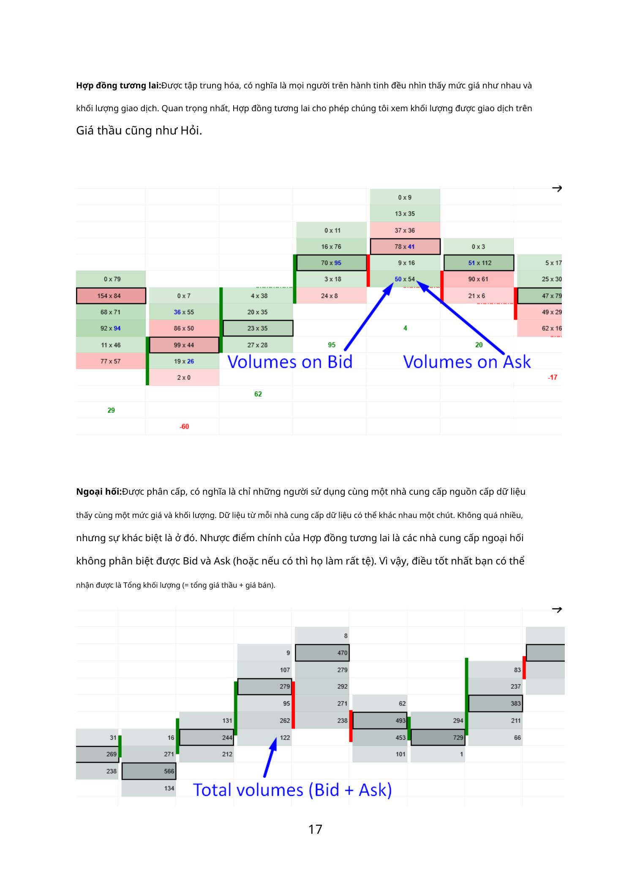

Hợp đồng tương lai:Được tập trung hóa, có nghĩa là mọi người trên hành tinh đều nhìn thấy mức giá như nhau và
khối lượng giao dịch. Quan trọng nhất, Hợp đồng tương lai cho phép chúng tôi xem khối lượng được giao dịch trên
Giá thầu cũng như Hỏi.
Ngoại hối:Được phân cấp, có nghĩa là chỉ những người sử dụng cùng một nhà cung cấp nguồn cấp dữ liệu
thấy cùng một mức giá và khối lượng. Dữ liệu từ mỗi nhà cung cấp dữ liệu có thể khác nhau một chút. Không quá nhiều,
nhưng sự khác biệt là ở đó. Nhược điểm chính của Hợp đồng tương lai là các nhà cung cấp ngoại hối
không phân biệt được Bid và Ask (hoặc nếu có thì họ làm rất tệ). Vì vậy, điều tốt nhất bạn có thể
nhận được là Tổng khối lượng (= tổng giá thầu + giá bán).
17

## Trang 19
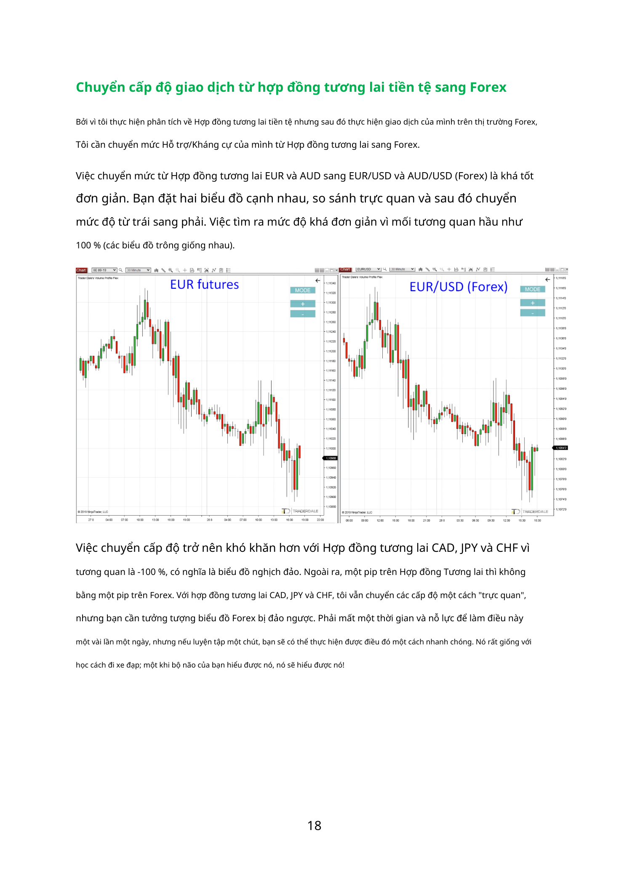

Chuyển cấp độ giao dịch từ hợp đồng tương lai tiền tệ sang Forex
Bởi vì tôi thực hiện phân tích về Hợp đồng tương lai tiền tệ nhưng sau đó thực hiện giao dịch của mình trên thị trường Forex,
Tôi cần chuyển mức Hỗ trợ/Kháng cự của mình từ Hợp đồng tương lai sang Forex.
Việc chuyển mức từ Hợp đồng tương lai EUR và AUD sang EUR/USD và AUD/USD (Forex) là khá tốt
đơn giản. Bạn đặt hai biểu đồ cạnh nhau, so sánh trực quan và sau đó chuyển
mức độ từ trái sang phải. Việc tìm ra mức độ khá đơn giản vì mối tương quan hầu như
100 % (các biểu đồ trông giống nhau).
Việc chuyển cấp độ trở nên khó khăn hơn với Hợp đồng tương lai CAD, JPY và CHF vì
tương quan là -100 %, có nghĩa là biểu đồ nghịch đảo. Ngoài ra, một pip trên Hợp đồng Tương lai thì không
bằng một pip trên Forex. Với hợp đồng tương lai CAD, JPY và CHF, tôi vẫn chuyển các cấp độ một cách "trực quan",
nhưng bạn cần tưởng tượng biểu đồ Forex bị đảo ngược. Phải mất một thời gian và nỗ lực để làm điều này
một vài lần một ngày, nhưng nếu luyện tập một chút, bạn sẽ có thể thực hiện được điều đó một cách nhanh chóng. Nó rất giống với
học cách đi xe đạp; một khi bộ não của bạn hiểu được nó, nó sẽ hiểu được nó!
18

## Trang 20
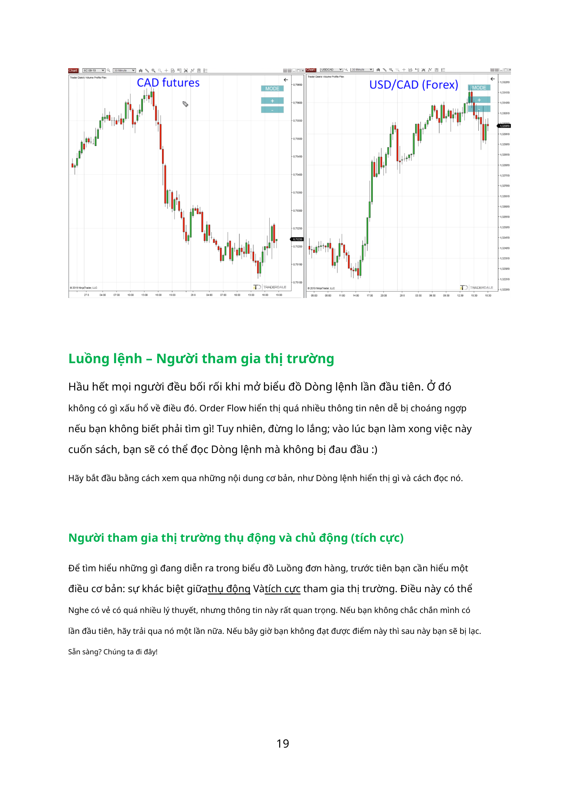

Luồng lệnh – Người tham gia thị trường
Hầu hết mọi người đều bối rối khi mở biểu đồ Dòng lệnh lần đầu tiên. Ở đó
không có gì xấu hổ về điều đó. Order Flow hiển thị quá nhiều thông tin nên dễ bị choáng ngợp
nếu bạn không biết phải tìm gì! Tuy nhiên, đừng lo lắng; vào lúc bạn làm xong việc này
cuốn sách, bạn sẽ có thể đọc Dòng lệnh mà không bị đau đầu :)
Hãy bắt đầu bằng cách xem qua những nội dung cơ bản, như Dòng lệnh hiển thị gì và cách đọc nó.
Người tham gia thị trường thụ động và chủ động (tích cực)
Để tìm hiểu những gì đang diễn ra trong biểu đồ Luồng đơn hàng, trước tiên bạn cần hiểu một
điều cơ bản: sự khác biệt giữathụ động Vàtích cực tham gia thị trường. Điều này có thể
Nghe có vẻ có quá nhiều lý thuyết, nhưng thông tin này rất quan trọng. Nếu bạn không chắc chắn mình có
lần đầu tiên, hãy trải qua nó một lần nữa. Nếu bây giờ bạn không đạt được điểm này thì sau này bạn sẽ bị lạc.
Sẵn sàng? Chúng ta đi đây!
19

## Trang 21
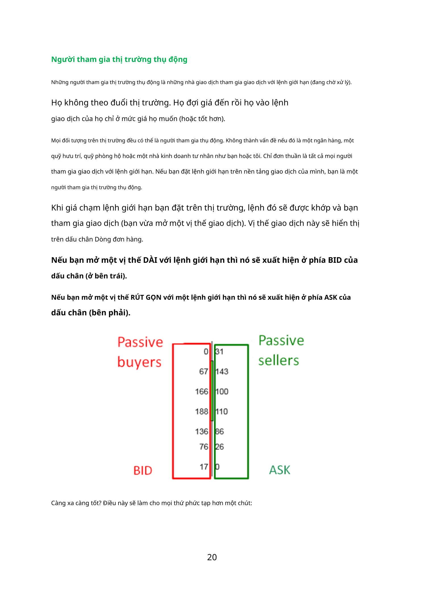

Người tham gia thị trường thụ động
Những người tham gia thị trường thụ động là những nhà giao dịch tham gia giao dịch với lệnh giới hạn (đang chờ xử lý).
Họ không theo đuổi thị trường. Họ đợi giá đến rồi họ vào lệnh
giao dịch của họ chỉ ở mức giá họ muốn (hoặc tốt hơn).
Mọi đối tượng trên thị trường đều có thể là người tham gia thụ động. Không thành vấn đề nếu đó là một ngân hàng, một
quỹ hưu trí, quỹ phòng hộ hoặc một nhà kinh doanh tư nhân như bạn hoặc tôi. Chỉ đơn thuần là tất cả mọi người
tham gia giao dịch với lệnh giới hạn. Nếu bạn đặt lệnh giới hạn trên nền tảng giao dịch của mình, bạn là một
người tham gia thị trường thụ động.
Khi giá chạm lệnh giới hạn bạn đặt trên thị trường, lệnh đó sẽ được khớp và bạn
tham gia giao dịch (bạn vừa mở một vị thế giao dịch). Vị thế giao dịch này sẽ hiển thị
trên dấu chân Dòng đơn hàng.
Nếu bạn mở một vị thế DÀI với lệnh giới hạn thì nó sẽ xuất hiện ở phía BID của
dấu chân (ở bên trái).
Nếu bạn mở một vị thế RÚT GỌN với một lệnh giới hạn thì nó sẽ xuất hiện ở phía ASK của
dấu chân (bên phải).
Càng xa càng tốt? Điều này sẽ làm cho mọi thứ phức tạp hơn một chút:
20

## Trang 22
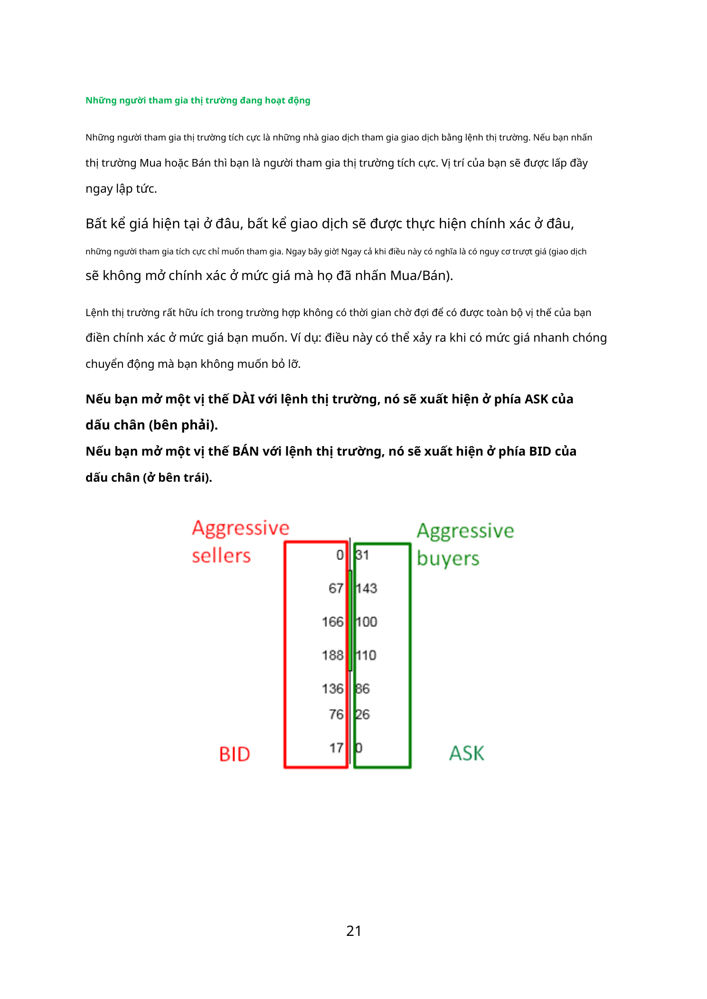

Những người tham gia thị trường đang hoạt động
Những người tham gia thị trường tích cực là những nhà giao dịch tham gia giao dịch bằng lệnh thị trường. Nếu bạn nhấn
thị trường Mua hoặc Bán thì bạn là người tham gia thị trường tích cực. Vị trí của bạn sẽ được lấp đầy
ngay lập tức.
Bất kể giá hiện tại ở đâu, bất kể giao dịch sẽ được thực hiện chính xác ở đâu,
những người tham gia tích cực chỉ muốn tham gia. Ngay bây giờ! Ngay cả khi điều này có nghĩa là có nguy cơ trượt giá (giao dịch
sẽ không mở chính xác ở mức giá mà họ đã nhấn Mua/Bán).
Lệnh thị trường rất hữu ích trong trường hợp không có thời gian chờ đợi để có được toàn bộ vị thế của bạn
điền chính xác ở mức giá bạn muốn. Ví dụ: điều này có thể xảy ra khi có mức giá nhanh chóng
chuyển động mà bạn không muốn bỏ lỡ.
Nếu bạn mở một vị thế DÀI với lệnh thị trường, nó sẽ xuất hiện ở phía ASK của
dấu chân (bên phải).
Nếu bạn mở một vị thế BÁN với lệnh thị trường, nó sẽ xuất hiện ở phía BID của
dấu chân (ở bên trái).
21

## Trang 23
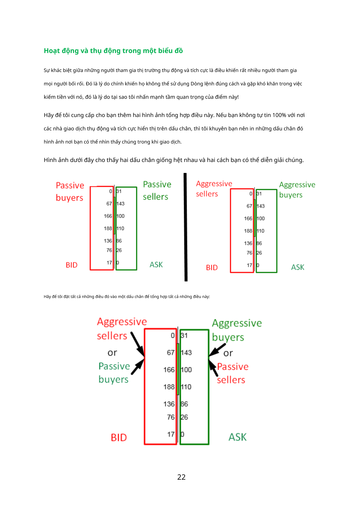

Hoạt động và thụ động trong một biểu đồ
Sự khác biệt giữa những người tham gia thị trường thụ động và tích cực là điều khiến rất nhiều người tham gia
mọi người bối rối. Đó là lý do chính khiến họ không thể sử dụng Dòng lệnh đúng cách và gặp khó khăn trong việc
kiếm tiền với nó, đó là lý do tại sao tôi nhấn mạnh tầm quan trọng của điểm này!
Hãy để tôi cung cấp cho bạn thêm hai hình ảnh tổng hợp điều này. Nếu bạn không tự tin 100% với nơi
các nhà giao dịch thụ động và tích cực hiển thị trên dấu chân, thì tôi khuyên bạn nên in những dấu chân đó
hình ảnh nơi bạn có thể nhìn thấy chúng trong khi giao dịch.
Hình ảnh dưới đây cho thấy hai dấu chân giống hệt nhau và hai cách bạn có thể diễn giải chúng.
Hãy để tôi đặt tất cả những điều đó vào một dấu chân để tổng hợp tất cả những điều này:
22

## Trang 24
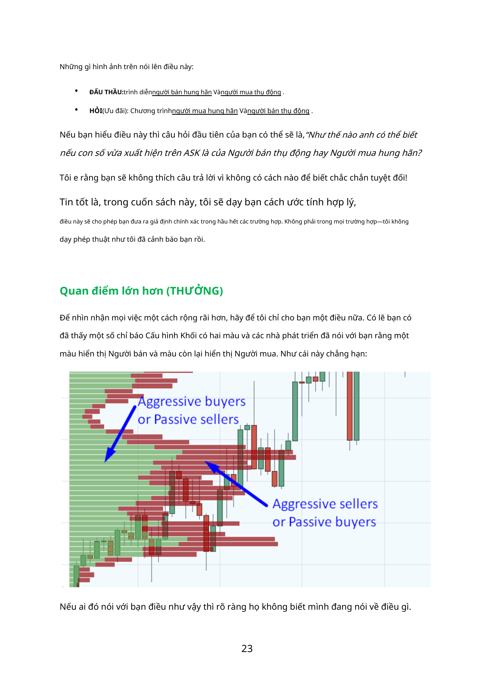

Những gì hình ảnh trên nói lên điều này:
•
ĐẤU THẦU:trình diễnngười bán hung hãn Vàngười mua thụ động .
•
HỎI(Ưu đãi): Chương trìnhngười mua hung hãn Vàngười bán thụ động .
Nếu bạn hiểu điều này thì câu hỏi đầu tiên của bạn có thể sẽ là,“Như thế nào anh có thể biết
nếu con số vừa xuất hiện trên ASK là của Người bán thụ động hay Người mua hung hãn?
Tôi e rằng bạn sẽ không thích câu trả lời vì không có cách nào để biết chắc chắn tuyệt đối!
Tin tốt là, trong cuốn sách này, tôi sẽ dạy bạn cách ước tính hợp lý,
điều này sẽ cho phép bạn đưa ra giả định chính xác trong hầu hết các trường hợp. Không phải trong mọi trường hợp—tôi không
dạy phép thuật như tôi đã cảnh báo bạn rồi.
Quan điểm lớn hơn (THƯỞNG)
Để nhìn nhận mọi việc một cách rộng rãi hơn, hãy để tôi chỉ cho bạn một điều nữa. Có lẽ bạn có
đã thấy một số chỉ báo Cấu hình Khối có hai màu và các nhà phát triển đã nói với bạn rằng một
màu hiển thị Người bán và màu còn lại hiển thị Người mua. Như cái này chẳng hạn:
Nếu ai đó nói với bạn điều như vậy thì rõ ràng họ không biết mình đang nói về điều gì.
23

## Trang 25
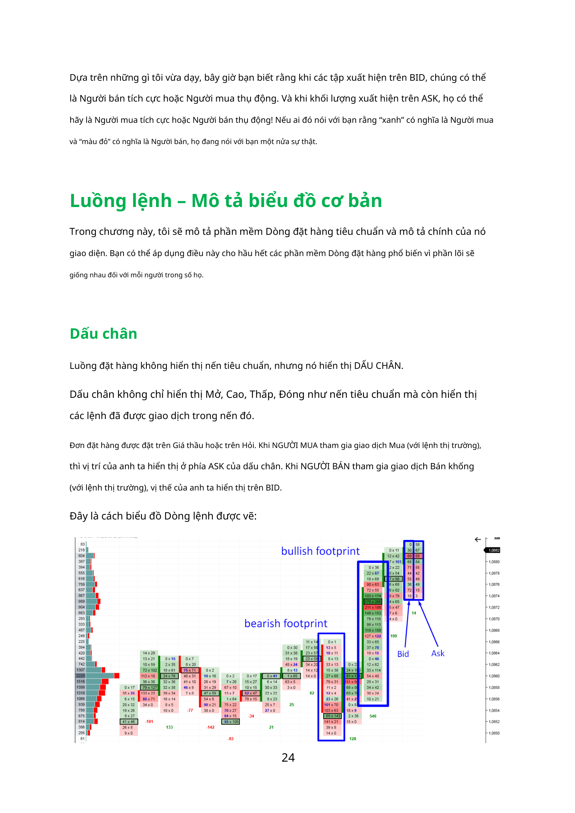

Dựa trên những gì tôi vừa dạy, bây giờ bạn biết rằng khi các tập xuất hiện trên BID, chúng có thể
là Người bán tích cực hoặc Người mua thụ động. Và khi khối lượng xuất hiện trên ASK, họ có thể
hãy là Người mua tích cực hoặc Người bán thụ động! Nếu ai đó nói với bạn rằng “xanh” có nghĩa là Người mua
và “màu đỏ” có nghĩa là Người bán, họ đang nói với bạn một nửa sự thật.
Luồng lệnh – Mô tả biểu đồ cơ bản
Trong chương này, tôi sẽ mô tả phần mềm Dòng đặt hàng tiêu chuẩn và mô tả chính của nó
giao diện. Bạn có thể áp dụng điều này cho hầu hết các phần mềm Dòng đặt hàng phổ biến vì phần lõi sẽ
giống nhau đối với mỗi người trong số họ.
Dấu chân
Luồng đặt hàng không hiển thị nến tiêu chuẩn, nhưng nó hiển thị DẤU CHÂN.
Dấu chân không chỉ hiển thị Mở, Cao, Thấp, Đóng như nến tiêu chuẩn mà còn hiển thị
các lệnh đã được giao dịch trong nến đó.
Đơn đặt hàng được đặt trên Giá thầu hoặc trên Hỏi. Khi NGƯỜI MUA tham gia giao dịch Mua (với lệnh thị trường),
thì vị trí của anh ta hiển thị ở phía ASK của dấu chân. Khi NGƯỜI BÁN tham gia giao dịch Bán khống
(với lệnh thị trường), vị thế của anh ta hiển thị trên BID.
Đây là cách biểu đồ Dòng lệnh được vẽ:
24

## Trang 26
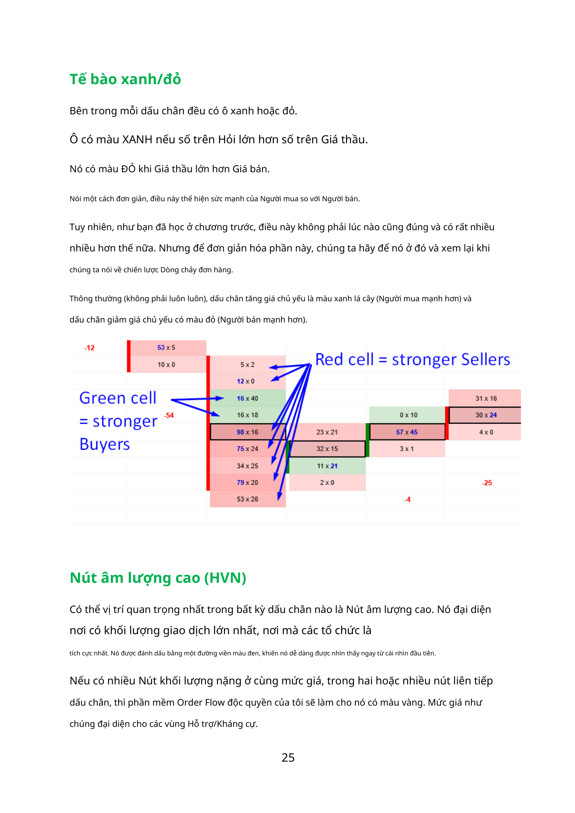

Tế bào xanh/đỏ
Bên trong mỗi dấu chân đều có ô xanh hoặc đỏ.
Ô có màu XANH nếu số trên Hỏi lớn hơn số trên Giá thầu.
Nó có màu ĐỎ khi Giá thầu lớn hơn Giá bán.
Nói một cách đơn giản, điều này thể hiện sức mạnh của Người mua so với Người bán.
Tuy nhiên, như bạn đã học ở chương trước, điều này không phải lúc nào cũng đúng và có rất nhiều
nhiều hơn thế nữa. Nhưng để đơn giản hóa phần này, chúng ta hãy để nó ở đó và xem lại khi
chúng ta nói về chiến lược Dòng chảy đơn hàng.
Thông thường (không phải luôn luôn), dấu chân tăng giá chủ yếu là màu xanh lá cây (Người mua mạnh hơn) và
dấu chân giảm giá chủ yếu có màu đỏ (Người bán mạnh hơn).
Nút âm lượng cao (HVN)
Có thể vị trí quan trọng nhất trong bất kỳ dấu chân nào là Nút âm lượng cao. Nó đại diện
nơi có khối lượng giao dịch lớn nhất, nơi mà các tổ chức là
tích cực nhất. Nó được đánh dấu bằng một đường viền màu đen, khiến nó dễ dàng được nhìn thấy ngay từ cái nhìn đầu tiên.
Nếu có nhiều Nút khối lượng nặng ở cùng mức giá, trong hai hoặc nhiều nút liên tiếp
dấu chân, thì phần mềm Order Flow độc quyền của tôi sẽ làm cho nó có màu vàng. Mức giá như
chúng đại diện cho các vùng Hỗ trợ/Kháng cự.
25

## Trang 27
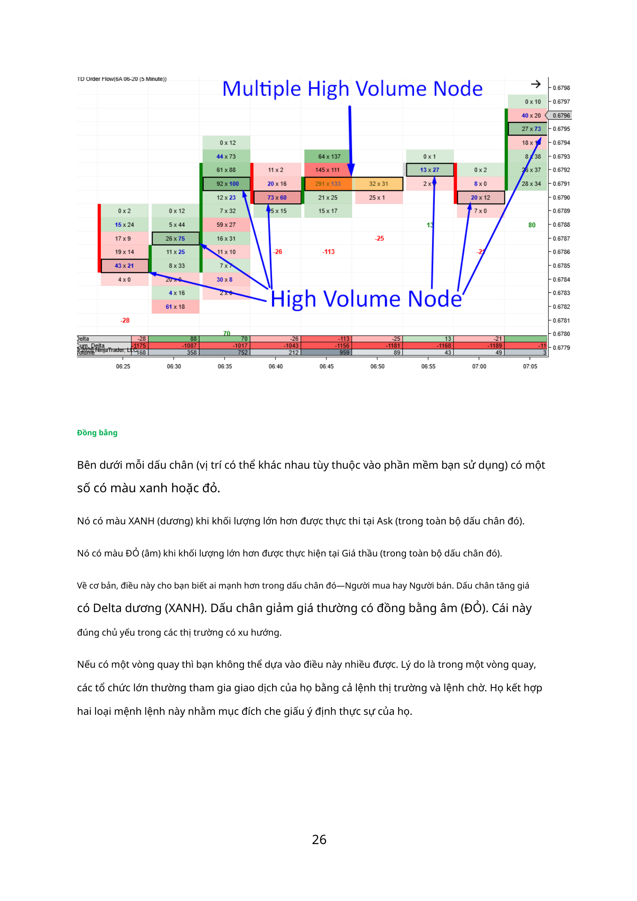

Đồng bằng
Bên dưới mỗi dấu chân (vị trí có thể khác nhau tùy thuộc vào phần mềm bạn sử dụng) có một
số có màu xanh hoặc đỏ.
Nó có màu XANH (dương) khi khối lượng lớn hơn được thực thi tại Ask (trong toàn bộ dấu chân đó).
Nó có màu ĐỎ (âm) khi khối lượng lớn hơn được thực hiện tại Giá thầu (trong toàn bộ dấu chân đó).
Về cơ bản, điều này cho bạn biết ai mạnh hơn trong dấu chân đó—Người mua hay Người bán. Dấu chân tăng giá
có Delta dương (XANH). Dấu chân giảm giá thường có đồng bằng âm (ĐỎ). Cái này
đúng chủ yếu trong các thị trường có xu hướng.
Nếu có một vòng quay thì bạn không thể dựa vào điều này nhiều được. Lý do là trong một vòng quay,
các tổ chức lớn thường tham gia giao dịch của họ bằng cả lệnh thị trường và lệnh chờ. Họ kết hợp
hai loại mệnh lệnh này nhằm mục đích che giấu ý định thực sự của họ.
26

## Trang 28
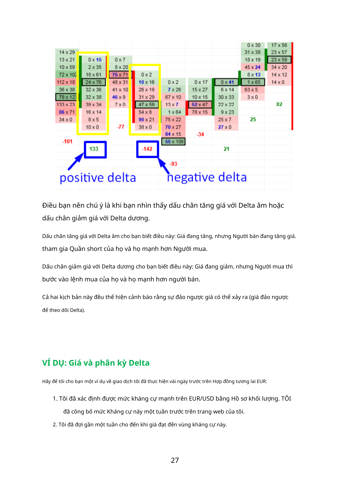

Điều bạn nên chú ý là khi bạn nhìn thấy dấu chân tăng giá với Delta âm hoặc
dấu chân giảm giá với Delta dương.
Dấu chân tăng giá với Delta âm cho bạn biết điều này: Giá đang tăng, nhưng Người bán đang tăng giá.
tham gia Quần short của họ và họ mạnh hơn Người mua.
Dấu chân giảm giá với Delta dương cho bạn biết điều này: Giá đang giảm, nhưng Người mua thì
bước vào lệnh mua của họ và họ mạnh hơn người bán.
Cả hai kịch bản này đều thể hiện cảnh báo rằng sự đảo ngược giá có thể xảy ra (giá đảo ngược
để theo dõi Delta).
VÍ DỤ: Giá và phân kỳ Delta
Hãy để tôi cho bạn một ví dụ về giao dịch tôi đã thực hiện vài ngày trước trên Hợp đồng tương lai EUR:
1. Tôi đã xác định được mức kháng cự mạnh trên EUR/USD bằng Hồ sơ khối lượng. TÔI
đã công bố mức Kháng cự này một tuần trước trên trang web của tôi.
2. Tôi đã đợi gần một tuần cho đến khi giá đạt đến vùng kháng cự này.
27

## Trang 29
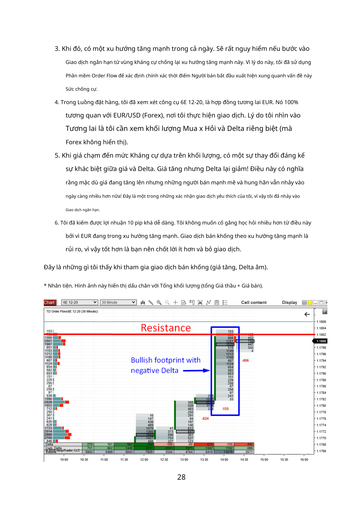

3. Khi đó, có một xu hướng tăng mạnh trong cả ngày. Sẽ rất nguy hiểm nếu bước vào
Giao dịch ngắn hạn từ vùng kháng cự chống lại xu hướng tăng mạnh này. Vì lý do này, tôi đã sử dụng
Phần mềm Order Flow để xác định chính xác thời điểm Người bán bắt đầu xuất hiện xung quanh vấn đề này
Sức chống cự.
4. Trong Luồng đặt hàng, tôi đã xem xét công cụ 6E 12-20, là hợp đồng tương lai EUR. Nó 100%
tương quan với EUR/USD (Forex), nơi tôi thực hiện giao dịch. Lý do tôi nhìn vào
Tương lai là tôi cần xem khối lượng Mua x Hỏi và Delta riêng biệt (mà
Forex không hiển thị).
5. Khi giá chạm đến mức Kháng cự dựa trên khối lượng, có một sự thay đổi đáng kể
sự khác biệt giữa giá và Delta. Giá tăng nhưng Delta lại giảm! Điều này có nghĩa
rằng mặc dù giá đang tăng lên nhưng những người bán mạnh mẽ và hung hãn vẫn nhảy vào
ngày càng nhiều hơn nữa! Đây là một trong những xác nhận giao dịch yêu thích của tôi, vì vậy tôi đã nhảy vào
Giao dịch ngắn hạn.
6. Tôi đã kiếm được lợi nhuận 10 pip khá dễ dàng. Tôi không muốn cố gắng học hỏi nhiều hơn từ điều này
bởi vì EUR đang trong xu hướng tăng mạnh. Giao dịch bán khống theo xu hướng tăng mạnh là
rủi ro, vì vậy tốt hơn là bạn nên chốt lời ít hơn và bỏ giao dịch.
Đây là những gì tôi thấy khi tham gia giao dịch bán khống (giá tăng, Delta âm).
* Nhân tiện. Hình ảnh này hiển thị dấu chân với Tổng khối lượng (tổng Giá thầu + Giá bán).
28

## Trang 30
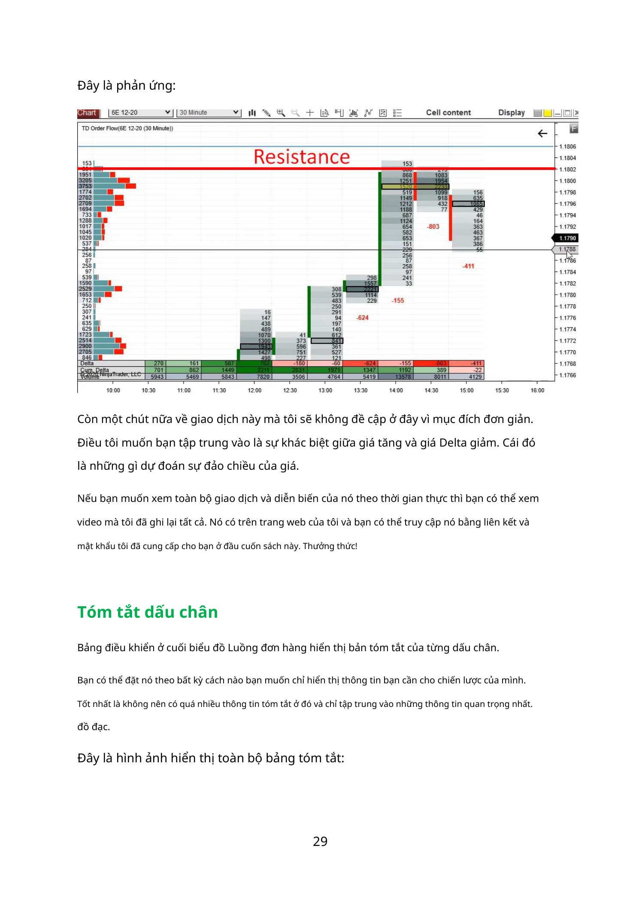

Đây là phản ứng:
Còn một chút nữa về giao dịch này mà tôi sẽ không đề cập ở đây vì mục đích đơn giản.
Điều tôi muốn bạn tập trung vào là sự khác biệt giữa giá tăng và giá Delta giảm. Cái đó
là những gì dự đoán sự đảo chiều của giá.
Nếu bạn muốn xem toàn bộ giao dịch và diễn biến của nó theo thời gian thực thì bạn có thể xem
video mà tôi đã ghi lại tất cả. Nó có trên trang web của tôi và bạn có thể truy cập nó bằng liên kết và
mật khẩu tôi đã cung cấp cho bạn ở đầu cuốn sách này. Thưởng thức!
Tóm tắt dấu chân
Bảng điều khiển ở cuối biểu đồ Luồng đơn hàng hiển thị bản tóm tắt của từng dấu chân.
Bạn có thể đặt nó theo bất kỳ cách nào bạn muốn chỉ hiển thị thông tin bạn cần cho chiến lược của mình.
Tốt nhất là không nên có quá nhiều thông tin tóm tắt ở đó và chỉ tập trung vào những thông tin quan trọng nhất.
đồ đạc.
Đây là hình ảnh hiển thị toàn bộ bảng tóm tắt:
29

## Trang 31
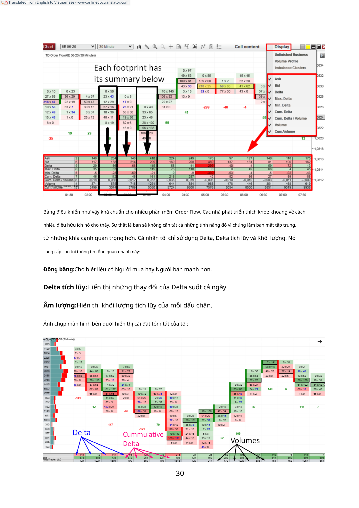

Bảng điều khiển như vậy khá chuẩn cho nhiều phần mềm Order Flow. Các nhà phát triển thích khoe khoang về cách
nhiều điều hữu ích nó cho thấy. Sự thật là bạn sẽ không cần tất cả những tính năng đó vì chúng làm bạn mất tập trung.
từ những khía cạnh quan trọng hơn. Cá nhân tôi chỉ sử dụng Delta, Delta tích lũy và Khối lượng. Nó
cung cấp cho tôi thông tin tổng quan nhanh này:
Đồng bằng:Cho biết liệu có Người mua hay Người bán mạnh hơn.
Delta tích lũy:Hiển thị những thay đổi của Delta suốt cả ngày.
Âm lượng:Hiển thị khối lượng tích lũy của mỗi dấu chân.
Ảnh chụp màn hình bên dưới hiển thị cài đặt tóm tắt của tôi:
30

## Trang 32
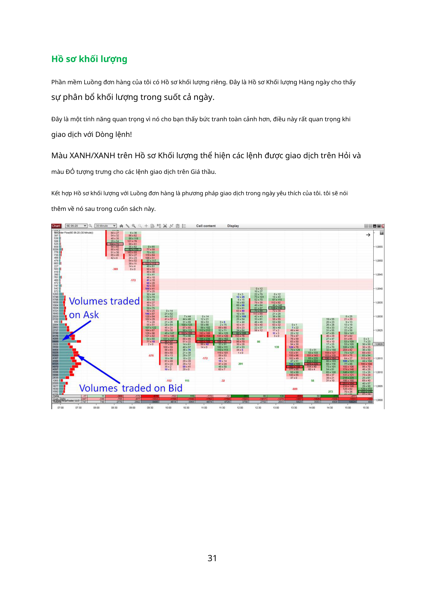

Hồ sơ khối lượng
Phần mềm Luồng đơn hàng của tôi có Hồ sơ khối lượng riêng. Đây là Hồ sơ Khối lượng Hàng ngày cho thấy
sự phân bổ khối lượng trong suốt cả ngày.
Đây là một tính năng quan trọng vì nó cho bạn thấy bức tranh toàn cảnh hơn, điều này rất quan trọng khi
giao dịch với Dòng lệnh!
Màu XANH/XANH trên Hồ sơ Khối lượng thể hiện các lệnh được giao dịch trên Hỏi và
màu ĐỎ tượng trưng cho các lệnh giao dịch trên Giá thầu.
Kết hợp Hồ sơ khối lượng với Luồng đơn hàng là phương pháp giao dịch trong ngày yêu thích của tôi. tôi sẽ nói
thêm về nó sau trong cuốn sách này.
31

## Trang 33
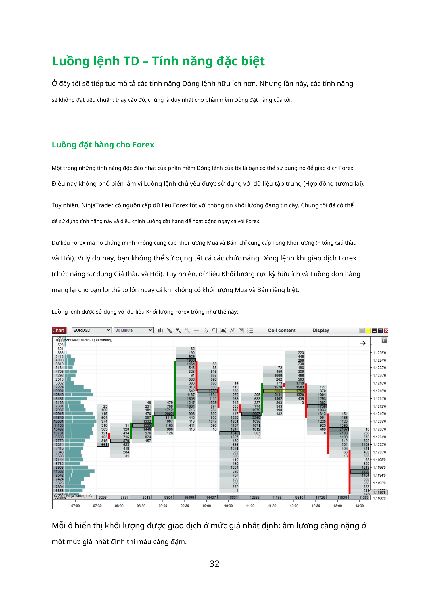

Luồng lệnh TD – Tính năng đặc biệt
Ở đây tôi sẽ tiếp tục mô tả các tính năng Dòng lệnh hữu ích hơn. Nhưng lần này, các tính năng
sẽ không đạt tiêu chuẩn; thay vào đó, chúng là duy nhất cho phần mềm Dòng đặt hàng của tôi.
Luồng đặt hàng cho Forex
Một trong những tính năng độc đáo nhất của phần mềm Dòng lệnh của tôi là bạn có thể sử dụng nó để giao dịch Forex.
Điều này không phổ biến lắm vì Luồng lệnh chủ yếu được sử dụng với dữ liệu tập trung (Hợp đồng tương lai).
Tuy nhiên, NinjaTrader có nguồn cấp dữ liệu Forex tốt với thông tin khối lượng đáng tin cậy. Chúng tôi đã có thể
để sử dụng tính năng này và điều chỉnh Luồng đặt hàng để hoạt động ngay cả với Forex!
Dữ liệu Forex mà họ chứng minh không cung cấp khối lượng Mua và Bán, chỉ cung cấp Tổng Khối lượng (= tổng Giá thầu
và Hỏi). Vì lý do này, bạn không thể sử dụng tất cả các chức năng Dòng lệnh khi giao dịch Forex
(chức năng sử dụng Giá thầu và Hỏi). Tuy nhiên, dữ liệu Khối lượng cực kỳ hữu ích và Luồng đơn hàng
mang lại cho bạn lợi thế to lớn ngay cả khi không có khối lượng Mua và Bán riêng biệt.
Luồng lệnh được sử dụng với dữ liệu Khối lượng Forex trông như thế này:
Mỗi ô hiển thị khối lượng được giao dịch ở mức giá nhất định; âm lượng càng nặng ở
một mức giá nhất định thì màu càng đậm.
32

## Trang 34
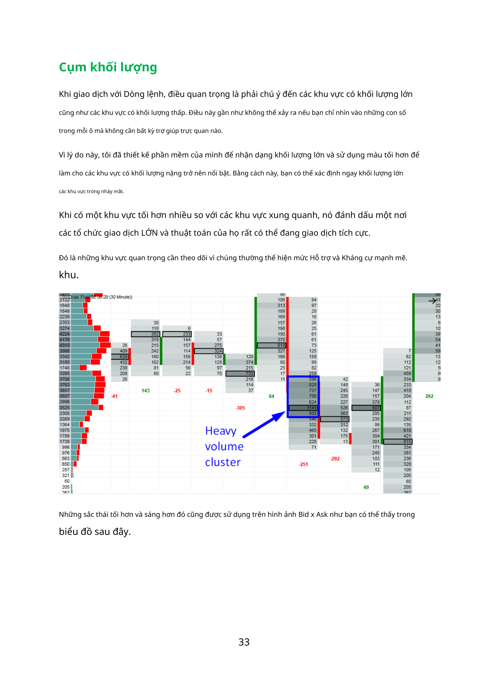

Cụm khối lượng
Khi giao dịch với Dòng lệnh, điều quan trọng là phải chú ý đến các khu vực có khối lượng lớn
cũng như các khu vực có khối lượng thấp. Điều này gần như không thể xảy ra nếu bạn chỉ nhìn vào những con số
trong mỗi ô mà không cần bất kỳ trợ giúp trực quan nào.
Vì lý do này, tôi đã thiết kế phần mềm của mình để nhận dạng khối lượng lớn và sử dụng màu tối hơn để
làm cho các khu vực có khối lượng nặng trở nên nổi bật. Bằng cách này, bạn có thể xác định ngay khối lượng lớn
các khu vực trong nháy mắt.
Khi có một khu vực tối hơn nhiều so với các khu vực xung quanh, nó đánh dấu một nơi
các tổ chức giao dịch LỚN và thuật toán của họ rất có thể đang giao dịch tích cực.
Đó là những khu vực quan trọng cần theo dõi vì chúng thường thể hiện mức Hỗ trợ và Kháng cự mạnh mẽ.
khu.
Những sắc thái tối hơn và sáng hơn đó cũng được sử dụng trên hình ảnh Bid x Ask như bạn có thể thấy trong
biểu đồ sau đây.
33

## Trang 35
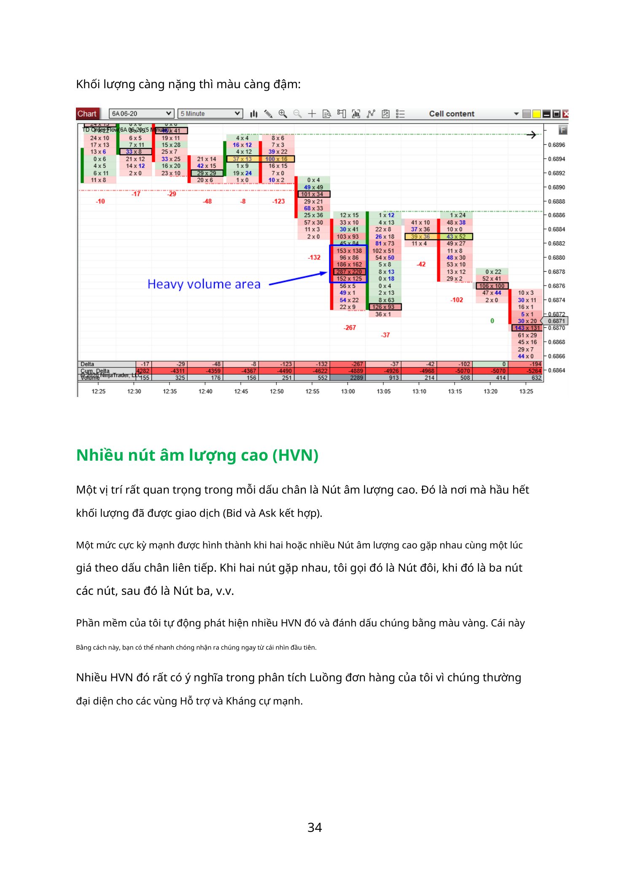

Khối lượng càng nặng thì màu càng đậm:
Nhiều nút âm lượng cao (HVN)
Một vị trí rất quan trọng trong mỗi dấu chân là Nút âm lượng cao. Đó là nơi mà hầu hết
khối lượng đã được giao dịch (Bid và Ask kết hợp).
Một mức cực kỳ mạnh được hình thành khi hai hoặc nhiều Nút âm lượng cao gặp nhau cùng một lúc
giá theo dấu chân liên tiếp. Khi hai nút gặp nhau, tôi gọi đó là Nút đôi, khi đó là ba nút
các nút, sau đó là Nút ba, v.v.
Phần mềm của tôi tự động phát hiện nhiều HVN đó và đánh dấu chúng bằng màu vàng. Cái này
Bằng cách này, bạn có thể nhanh chóng nhận ra chúng ngay từ cái nhìn đầu tiên.
Nhiều HVN đó rất có ý nghĩa trong phân tích Luồng đơn hàng của tôi vì chúng thường
đại diện cho các vùng Hỗ trợ và Kháng cự mạnh.
34

## Trang 36
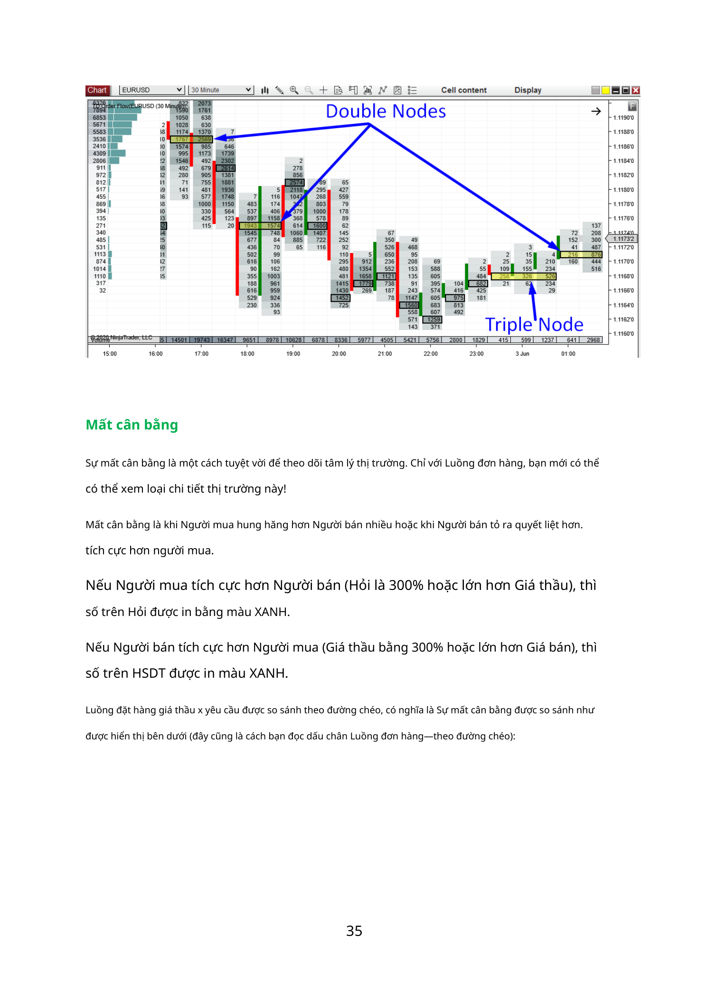

Mất cân bằng
Sự mất cân bằng là một cách tuyệt vời để theo dõi tâm lý thị trường. Chỉ với Luồng đơn hàng, bạn mới có thể
có thể xem loại chi tiết thị trường này!
Mất cân bằng là khi Người mua hung hăng hơn Người bán nhiều hoặc khi Người bán tỏ ra quyết liệt hơn.
tích cực hơn người mua.
Nếu Người mua tích cực hơn Người bán (Hỏi là 300% hoặc lớn hơn Giá thầu), thì
số trên Hỏi được in bằng màu XANH.
Nếu Người bán tích cực hơn Người mua (Giá thầu bằng 300% hoặc lớn hơn Giá bán), thì
số trên HSDT được in màu XANH.
Luồng đặt hàng giá thầu x yêu cầu được so sánh theo đường chéo, có nghĩa là Sự mất cân bằng được so sánh như
được hiển thị bên dưới (đây cũng là cách bạn đọc dấu chân Luồng đơn hàng—theo đường chéo):
35

## Trang 37
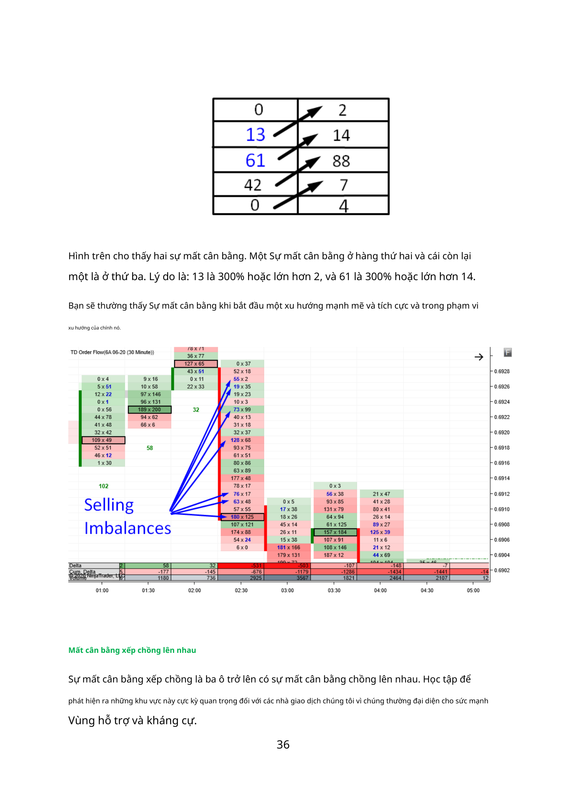

Hình trên cho thấy hai sự mất cân bằng. Một Sự mất cân bằng ở hàng thứ hai và cái còn lại
một là ở thứ ba. Lý do là: 13 là 300% hoặc lớn hơn 2, và 61 là 300% hoặc lớn hơn 14.
Bạn sẽ thường thấy Sự mất cân bằng khi bắt đầu một xu hướng mạnh mẽ và tích cực và trong phạm vi
xu hướng của chính nó.
Mất cân bằng xếp chồng lên nhau
Sự mất cân bằng xếp chồng là ba ô trở lên có sự mất cân bằng chồng lên nhau. Học tập để
phát hiện ra những khu vực này cực kỳ quan trọng đối với các nhà giao dịch chúng tôi vì chúng thường đại diện cho sức mạnh
Vùng hỗ trợ và kháng cự.
36

## Trang 38
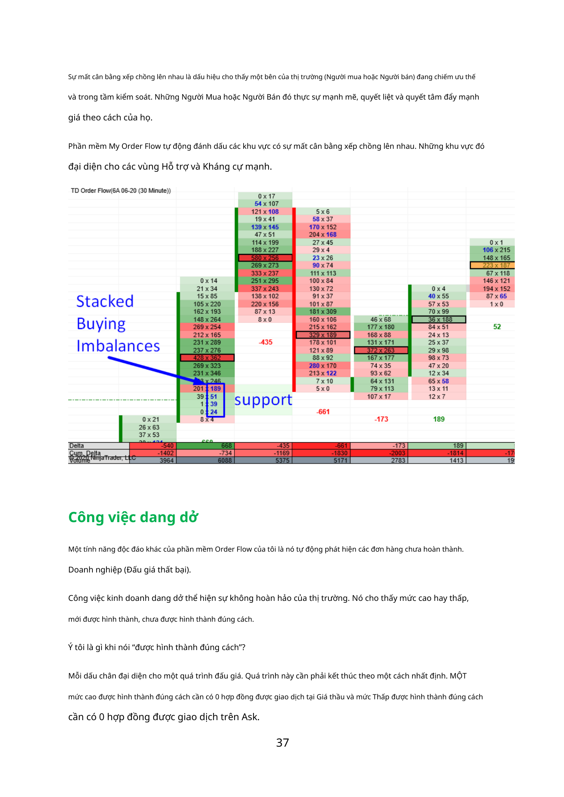

Sự mất cân bằng xếp chồng lên nhau là dấu hiệu cho thấy một bên của thị trường (Người mua hoặc Người bán) đang chiếm ưu thế
và trong tầm kiểm soát. Những Người Mua hoặc Người Bán đó thực sự mạnh mẽ, quyết liệt và quyết tâm đẩy mạnh
giá theo cách của họ.
Phần mềm My Order Flow tự động đánh dấu các khu vực có sự mất cân bằng xếp chồng lên nhau. Những khu vực đó
đại diện cho các vùng Hỗ trợ và Kháng cự mạnh.
Công việc dang dở
Một tính năng độc đáo khác của phần mềm Order Flow của tôi là nó tự động phát hiện các đơn hàng chưa hoàn thành.
Doanh nghiệp (Đấu giá thất bại).
Công việc kinh doanh dang dở thể hiện sự không hoàn hảo của thị trường. Nó cho thấy mức cao hay thấp,
mới được hình thành, chưa được hình thành đúng cách.
Ý tôi là gì khi nói “được hình thành đúng cách”?
Mỗi dấu chân đại diện cho một quá trình đấu giá. Quá trình này cần phải kết thúc theo một cách nhất định. MỘT
mức cao được hình thành đúng cách cần có 0 hợp đồng được giao dịch tại Giá thầu và mức Thấp được hình thành đúng cách
cần có 0 hợp đồng được giao dịch trên Ask.
37

## Trang 39
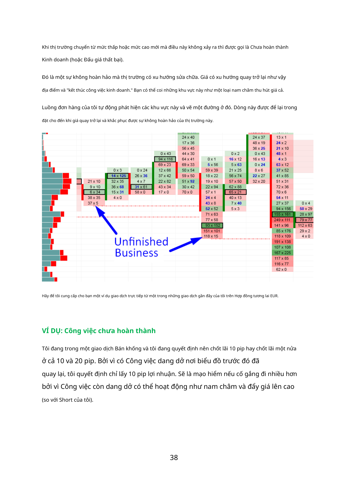

Khi thị trường chuyển từ mức thấp hoặc mức cao mới mà điều này không xảy ra thì được gọi là Chưa hoàn thành
Kinh doanh (hoặc Đấu giá thất bại).
Đó là một sự không hoàn hảo mà thị trường có xu hướng sửa chữa. Giá có xu hướng quay trở lại như vậy
địa điểm và "kết thúc công việc kinh doanh." Bạn có thể coi những khu vực này như một loại nam châm thu hút giá cả.
Luồng đơn hàng của tôi tự động phát hiện các khu vực này và vẽ một đường ở đó. Dòng này được để lại trong
đặt cho đến khi giá quay trở lại và khắc phục được sự không hoàn hảo của thị trường này.
Hãy để tôi cung cấp cho bạn một ví dụ giao dịch trực tiếp từ một trong những giao dịch gần đây của tôi trên Hợp đồng tương lai EUR.
VÍ DỤ: Công việc chưa hoàn thành
Tôi đang trong một giao dịch Bán khống và tôi đang quyết định nên chốt lãi 10 pip hay chốt lãi một nửa
ở cả 10 và 20 pip. Bởi vì có Công việc dang dở nơi biểu đồ trước đó đã
quay lại, tôi quyết định chỉ lấy 10 pip lợi nhuận. Sẽ là mạo hiểm nếu cố gắng đi nhiều hơn
bởi vì Công việc còn dang dở có thể hoạt động như nam châm và đẩy giá lên cao
(so với Short của tôi).
38

## Trang 40
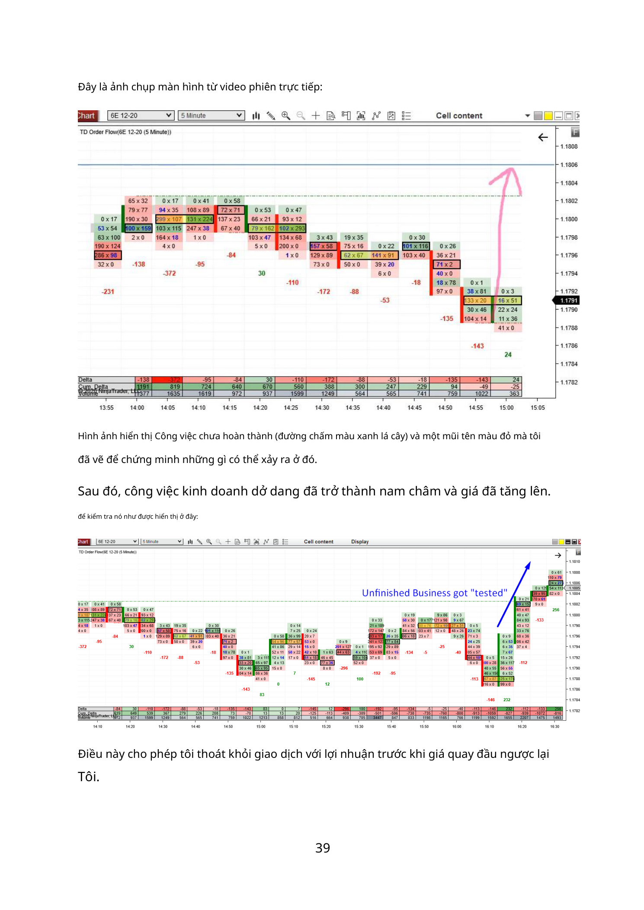

Đây là ảnh chụp màn hình từ video phiên trực tiếp:
Hình ảnh hiển thị Công việc chưa hoàn thành (đường chấm màu xanh lá cây) và một mũi tên màu đỏ mà tôi
đã vẽ để chứng minh những gì có thể xảy ra ở đó.
Sau đó, công việc kinh doanh dở dang đã trở thành nam châm và giá đã tăng lên.
để kiểm tra nó như được hiển thị ở đây:
Điều này cho phép tôi thoát khỏi giao dịch với lợi nhuận trước khi giá quay đầu ngược lại
Tôi.
39

## Trang 41
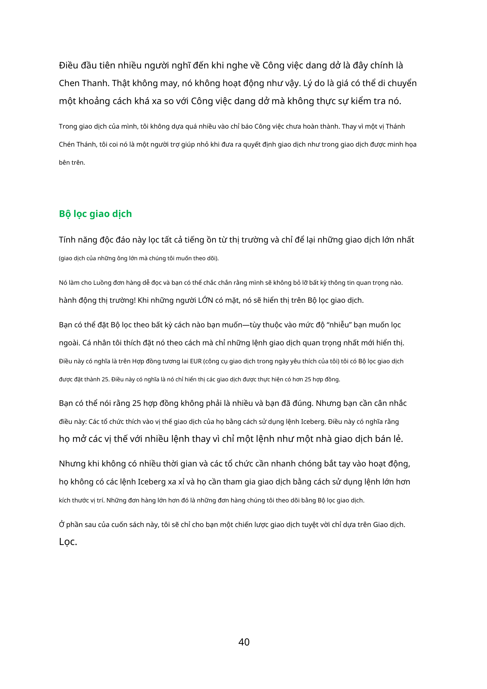

Điều đầu tiên nhiều người nghĩ đến khi nghe về Công việc dang dở là đây chính là
Chen Thanh. Thật không may, nó không hoạt động như vậy. Lý do là giá có thể di chuyển
một khoảng cách khá xa so với Công việc dang dở mà không thực sự kiểm tra nó.
Trong giao dịch của mình, tôi không dựa quá nhiều vào chỉ báo Công việc chưa hoàn thành. Thay vì một vị Thánh
Chén Thánh, tôi coi nó là một người trợ giúp nhỏ khi đưa ra quyết định giao dịch như trong giao dịch được minh họa
bên trên.
Bộ lọc giao dịch
Tính năng độc đáo này lọc tất cả tiếng ồn từ thị trường và chỉ để lại những giao dịch lớn nhất
(giao dịch của những ông lớn mà chúng tôi muốn theo dõi).
Nó làm cho Luồng đơn hàng dễ đọc và bạn có thể chắc chắn rằng mình sẽ không bỏ lỡ bất kỳ thông tin quan trọng nào.
hành động thị trường! Khi những người LỚN có mặt, nó sẽ hiển thị trên Bộ lọc giao dịch.
Bạn có thể đặt Bộ lọc theo bất kỳ cách nào bạn muốn—tùy thuộc vào mức độ “nhiễu” bạn muốn lọc
ngoài. Cá nhân tôi thích đặt nó theo cách mà chỉ những lệnh giao dịch quan trọng nhất mới hiển thị.
Điều này có nghĩa là trên Hợp đồng tương lai EUR (công cụ giao dịch trong ngày yêu thích của tôi) tôi có Bộ lọc giao dịch
được đặt thành 25. Điều này có nghĩa là nó chỉ hiển thị các giao dịch được thực hiện có hơn 25 hợp đồng.
Bạn có thể nói rằng 25 hợp đồng không phải là nhiều và bạn đã đúng. Nhưng bạn cần cân nhắc
điều này: Các tổ chức thích vào vị thế giao dịch của họ bằng cách sử dụng lệnh Iceberg. Điều này có nghĩa rằng
họ mở các vị thế với nhiều lệnh thay vì chỉ một lệnh như một nhà giao dịch bán lẻ.
Nhưng khi không có nhiều thời gian và các tổ chức cần nhanh chóng bắt tay vào hoạt động,
họ không có các lệnh Iceberg xa xỉ và họ cần tham gia giao dịch bằng cách sử dụng lệnh lớn hơn
kích thước vị trí. Những đơn hàng lớn hơn đó là những đơn hàng chúng tôi theo dõi bằng Bộ lọc giao dịch.
Ở phần sau của cuốn sách này, tôi sẽ chỉ cho bạn một chiến lược giao dịch tuyệt vời chỉ dựa trên Giao dịch.
Lọc.
40

## Trang 42
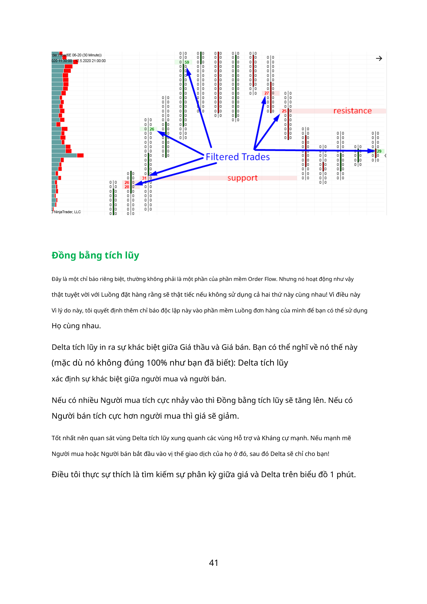

Đồng bằng tích lũy
Đây là một chỉ báo riêng biệt, thường không phải là một phần của phần mềm Order Flow. Nhưng nó hoạt động như vậy
thật tuyệt vời với Luồng đặt hàng rằng sẽ thật tiếc nếu không sử dụng cả hai thứ này cùng nhau! Vì điều này
Vì lý do này, tôi quyết định thêm chỉ báo độc lập này vào phần mềm Luồng đơn hàng của mình để bạn có thể sử dụng
Họ cùng nhau.
Delta tích lũy in ra sự khác biệt giữa Giá thầu và Giá bán. Bạn có thể nghĩ về nó thế này
(mặc dù nó không đúng 100% như bạn đã biết): Delta tích lũy
xác định sự khác biệt giữa người mua và người bán.
Nếu có nhiều Người mua tích cực nhảy vào thì Đồng bằng tích lũy sẽ tăng lên. Nếu có
Người bán tích cực hơn người mua thì giá sẽ giảm.
Tốt nhất nên quan sát vùng Delta tích lũy xung quanh các vùng Hỗ trợ và Kháng cự mạnh. Nếu mạnh mẽ
Người mua hoặc Người bán bắt đầu vào vị thế giao dịch của họ ở đó, sau đó Delta sẽ chỉ cho bạn!
Điều tôi thực sự thích là tìm kiếm sự phân kỳ giữa giá và Delta trên biểu đồ 1 phút.
41

## Trang 43
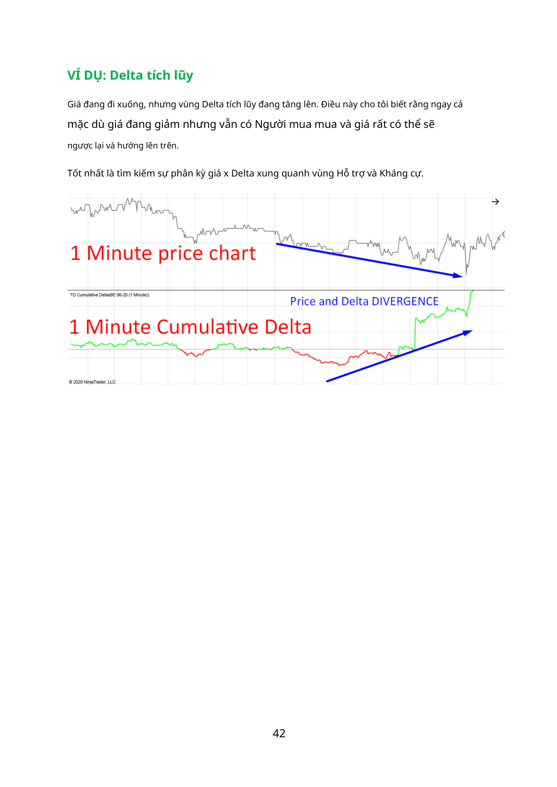

VÍ DỤ: Delta tích lũy
Giá đang đi xuống, nhưng vùng Delta tích lũy đang tăng lên. Điều này cho tôi biết rằng ngay cả
mặc dù giá đang giảm nhưng vẫn có Người mua mua và giá rất có thể sẽ
ngược lại và hướng lên trên.
Tốt nhất là tìm kiếm sự phân kỳ giá x Delta xung quanh vùng Hỗ trợ và Kháng cự.
42

## Trang 44
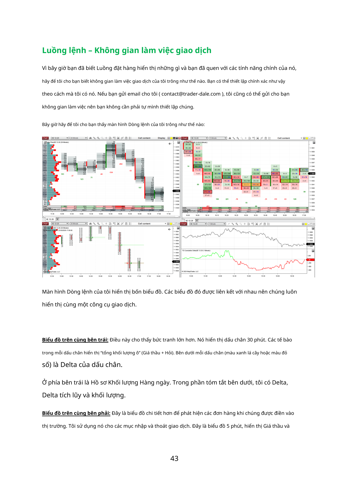

Luồng lệnh – Không gian làm việc giao dịch
Vì bây giờ bạn đã biết Luồng đặt hàng hiển thị những gì và bạn đã quen với các tính năng chính của nó,
hãy để tôi cho bạn biết không gian làm việc giao dịch của tôi trông như thế nào. Bạn có thể thiết lập chính xác như vậy
theo cách mà tôi có nó. Nếu bạn gửi email cho tôi ( contact@trader-dale.com ), tôi cũng có thể gửi cho bạn
không gian làm việc nên bạn không cần phải tự mình thiết lập chúng.
Bây giờ hãy để tôi cho bạn thấy màn hình Dòng lệnh của tôi trông như thế nào:
Màn hình Dòng lệnh của tôi hiển thị bốn biểu đồ. Các biểu đồ đó được liên kết với nhau nên chúng luôn
hiển thị cùng một công cụ giao dịch.
Biểu đồ trên cùng bên trái: Điều này cho thấy bức tranh lớn hơn. Nó hiển thị dấu chân 30 phút. Các tế bào
trong mỗi dấu chân hiển thị “tổng khối lượng ô” (Giá thầu + Hỏi). Bên dưới mỗi dấu chân (màu xanh lá cây hoặc màu đỏ
số) là Delta của dấu chân.
Ở phía bên trái là Hồ sơ Khối lượng Hàng ngày. Trong phần tóm tắt bên dưới, tôi có Delta,
Delta tích lũy và khối lượng.
Biểu đồ trên cùng bên phải: Đây là biểu đồ chi tiết hơn để phát hiện các đơn hàng khi chúng được điền vào
thị trường. Tôi sử dụng nó cho các mục nhập và thoát giao dịch. Đây là biểu đồ 5 phút, hiển thị Giá thầu và
43

## Trang 45

Hỏi vào từng ô. Mỗi dấu chân còn có in chữ Delta bên dưới. Bản tóm tắt thương mại tại
phía dưới hiển thị Delta, Delta tích lũy và Khối lượng.
Biểu đồ dưới cùng bên trái: Biểu đồ Luồng đặt hàng trong 30 phút với Bộ lọc giao dịch và Hồ sơ khối lượng hàng ngày được bật
Bên trái. Tôi sử dụng biểu đồ này để lọc tiếng ồn và tìm kiếm các lệnh giao dịch lớn.
Biểu đồ dưới cùng bên phải: Hiển thị biểu đồ giá 1 phút ở trên cùng và Delta tích lũy 1 phút
biểu đồ ở phía dưới.
Không gian làm việc này cho phép tôi xem tất cả những điều quan trọng đang diễn ra trên thị trường.
Tôi có thể nhìn thấy bức tranh toàn cảnh với biểu đồ Khối lượng 30 phút và Bộ lọc Giao dịch cũng như
chi tiết hơn trên biểu đồ Giá thầu x Hỏi 5 phút và trên biểu đồ Delta tích lũy.
44

## Trang 46

Luồng lệnh – Thiết lập giao dịch
Trong phần này, tôi sẽ giới thiệu cho bạn năm thiết lập giao dịch Dòng lệnh yêu thích của tôi. Bạn có thể
giao dịch chúng dưới dạng các thiết lập độc lập, có nghĩa là chúng chỉ mạnh khi hoạt động độc lập. Ở đó
không cần kết hợp chúng với bất kỳ thiết lập nào khác, bạn cũng không cần tìm kiếm bất kỳ thiết lập bổ sung nào
xác nhận giao dịch (bạn có thể làm điều đó, nhưng không bắt buộc). Chúng ta hãy bắt tay vào việc đó thôi!
Thiết lập giao dịch số 1: Cụm khối lượng
Thiết lập này dựa trên việc giao dịch các khu vực có khối lượng lớn (Cụm khối lượng),
xảy ra trong mộtxu hướng hoặc mạnh mẽsự từ chối giá cao hơn/thấp hơn.
Những khu vực có khối lượng lớn như vậy là nơi mà những kẻ LỚN (tổ chức) và hoạt động giao dịch của họ
các thuật toán đã đặt một phần lớn đơn đặt hàng của họ.
Trước tiên hãy nói về tình huống khi Cụm Khối lượng xảy ra trong một xu hướng.
* Chiến lược này không sử dụng Giá thầu x Hỏi, chỉ sử dụng cài đặt Khối lượng. Vì điều này, bạn có thể giao dịch
nó cũng có trên Forex (tuy nhiên, tôi khuyên bạn nên thực hiện phân tích về Hợp đồng tương lai).
Cụm khối lượng (trong XU HƯỚNG)
Các bước chính xác để làm theo là:
1. Đặt phần mềm Luồng đặt hàng của bạn hiển thị Khối lượng (không phải Giá thầu x Hỏi). Điều này sẽ làm được điều đó
dễ dàng hơn để xác định vùng khối lượng lớn. Bằng cách này, Luồng đặt hàng sẽ hiển thị các sắc thái của
màu xám và những vùng có khối lượng lớn sẽ nổi bật hơn.
2. Tìm xu hướng và tìm kiếm các vùng màu xám đậm (Cụm khối lượng nặng) nổi bật.
Những khu vực đó đại diện cho khối lượng lớn (hoạt động thể chế).
3. Bạn cần thấy giá di chuyển ra khỏi Cụm Khối lượng, khiến ít nhất một hoặc
toàn bộ hai dấu chân (nến) ở trên hoặc dưới vùng khối lượng nặng. Tôi thích sử dụng
biểu đồ dấu chân 30 phút cho việc này.
4. Sau đó, bạn cần đợi một đợt pullback. Khi giá trở lại mức nặng nề này
khu vực khối lượng, bạn tham gia giao dịch của mình.
45

## Trang 47
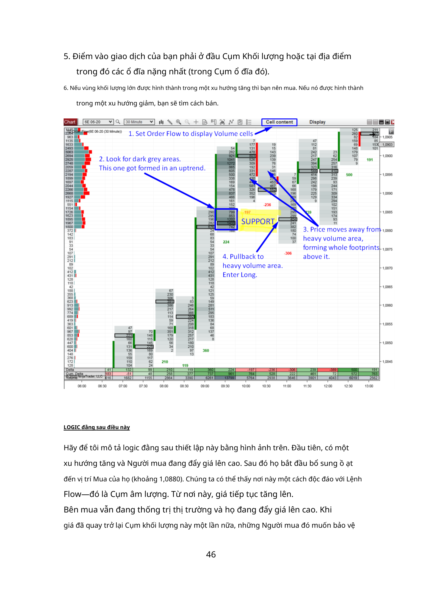

5. Điểm vào giao dịch của bạn phải ở đầu Cụm Khối lượng hoặc tại địa điểm
trong đó các ổ đĩa nặng nhất (trong Cụm ổ đĩa đó).
6. Nếu vùng khối lượng lớn được hình thành trong một xu hướng tăng thì bạn nên mua. Nếu nó được hình thành
trong một xu hướng giảm, bạn sẽ tìm cách bán.
LOGIC đằng sau điều này
Hãy để tôi mô tả logic đằng sau thiết lập này bằng hình ảnh trên. Đầu tiên, có một
xu hướng tăng và Người mua đang đẩy giá lên cao. Sau đó họ bắt đầu bổ sung ồ ạt
đến vị trí Mua của họ (khoảng 1,0880). Chúng ta có thể thấy nơi này một cách độc đáo với Lệnh
Flow—đó là Cụm âm lượng. Từ nơi này, giá tiếp tục tăng lên.
Bên mua vẫn đang thống trị thị trường và họ đang đẩy giá lên cao. Khi
giá đã quay trở lại Cụm khối lượng này một lần nữa, những Người mua đó muốn bảo vệ
46

## Trang 48
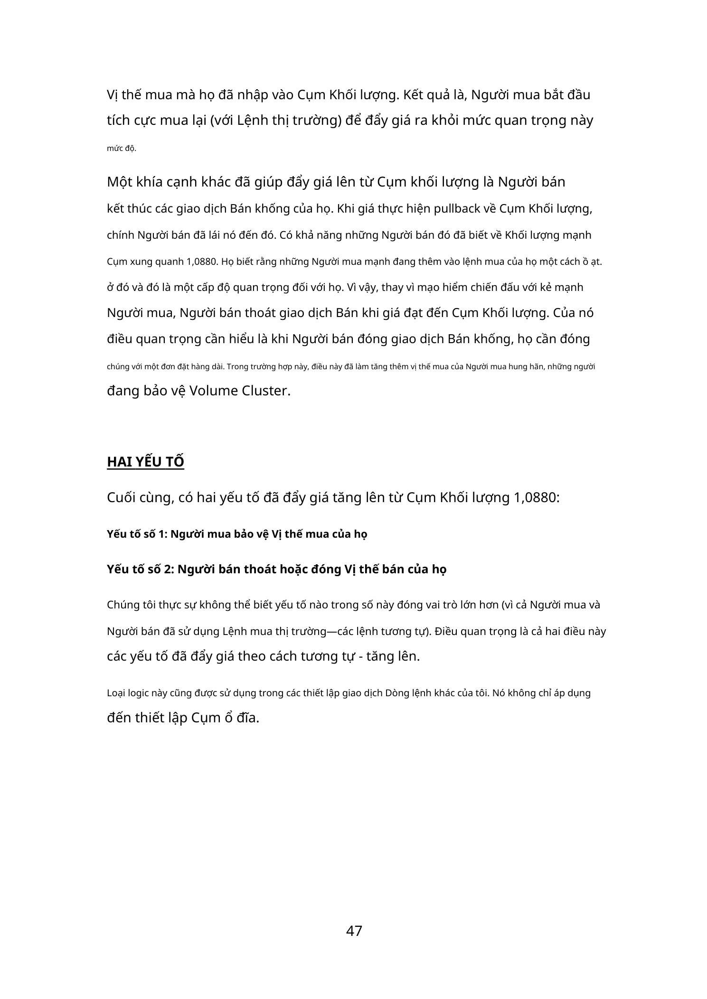

Vị thế mua mà họ đã nhập vào Cụm Khối lượng. Kết quả là, Người mua bắt đầu
tích cực mua lại (với Lệnh thị trường) để đẩy giá ra khỏi mức quan trọng này
mức độ.
Một khía cạnh khác đã giúp đẩy giá lên từ Cụm khối lượng là Người bán
kết thúc các giao dịch Bán khống của họ. Khi giá thực hiện pullback về Cụm Khối lượng,
chính Người bán đã lái nó đến đó. Có khả năng những Người bán đó đã biết về Khối lượng mạnh
Cụm xung quanh 1,0880. Họ biết rằng những Người mua mạnh đang thêm vào lệnh mua của họ một cách ồ ạt.
ở đó và đó là một cấp độ quan trọng đối với họ. Vì vậy, thay vì mạo hiểm chiến đấu với kẻ mạnh
Người mua, Người bán thoát giao dịch Bán khi giá đạt đến Cụm Khối lượng. Của nó
điều quan trọng cần hiểu là khi Người bán đóng giao dịch Bán khống, họ cần đóng
chúng với một đơn đặt hàng dài. Trong trường hợp này, điều này đã làm tăng thêm vị thế mua của Người mua hung hãn, những người
đang bảo vệ Volume Cluster.
HAI YẾU TỐ
Cuối cùng, có hai yếu tố đã đẩy giá tăng lên từ Cụm Khối lượng 1,0880:
Yếu tố số 1: Người mua bảo vệ Vị thế mua của họ
Yếu tố số 2: Người bán thoát hoặc đóng Vị thế bán của họ
Chúng tôi thực sự không thể biết yếu tố nào trong số này đóng vai trò lớn hơn (vì cả Người mua và
Người bán đã sử dụng Lệnh mua thị trường—các lệnh tương tự). Điều quan trọng là cả hai điều này
các yếu tố đã đẩy giá theo cách tương tự - tăng lên.
Loại logic này cũng được sử dụng trong các thiết lập giao dịch Dòng lệnh khác của tôi. Nó không chỉ áp dụng
đến thiết lập Cụm ổ đĩa.
47

## Trang 49
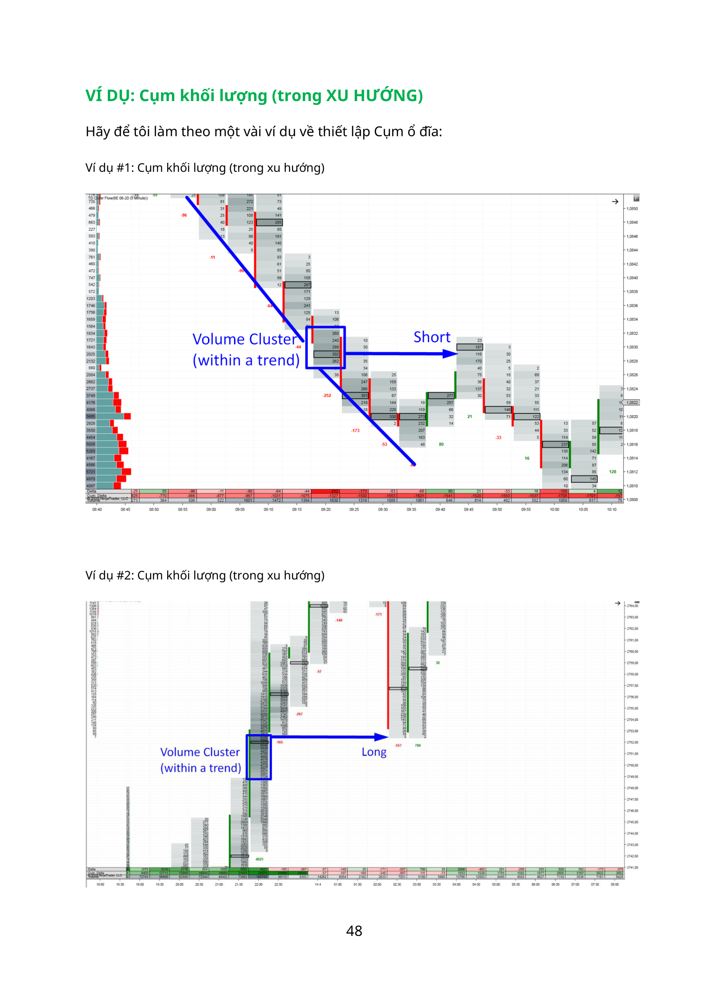

VÍ DỤ: Cụm khối lượng (trong XU HƯỚNG)
Hãy để tôi làm theo một vài ví dụ về thiết lập Cụm ổ đĩa:
Ví dụ #1: Cụm khối lượng (trong xu hướng)
Ví dụ #2: Cụm khối lượng (trong xu hướng)
48

## Trang 50
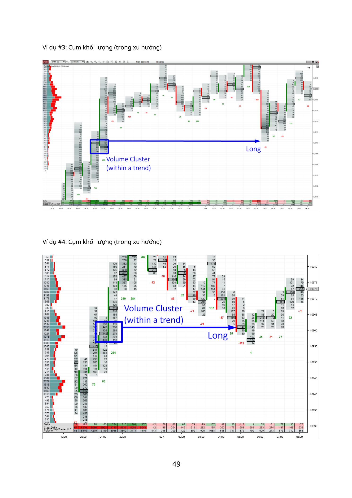

Ví dụ #3: Cụm khối lượng (trong xu hướng)
Ví dụ #4: Cụm khối lượng (trong xu hướng)
49

## Trang 51
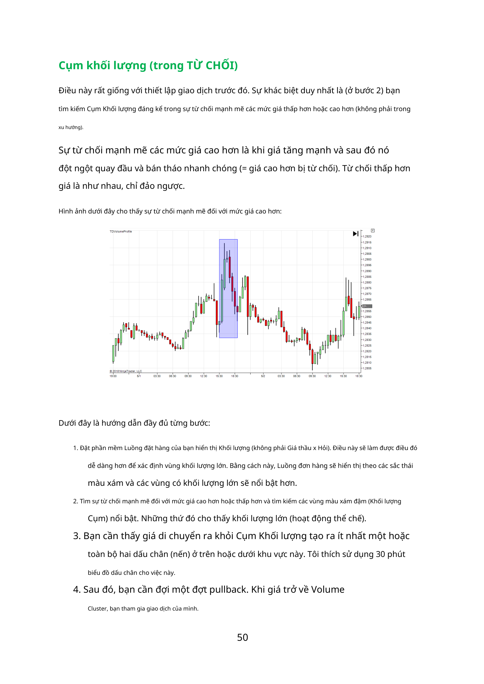

Cụm khối lượng (trong TỪ CHỐI)
Điều này rất giống với thiết lập giao dịch trước đó. Sự khác biệt duy nhất là (ở bước 2) bạn
tìm kiếm Cụm Khối lượng đáng kể trong sự từ chối mạnh mẽ các mức giá thấp hơn hoặc cao hơn (không phải trong
xu hướng).
Sự từ chối mạnh mẽ các mức giá cao hơn là khi giá tăng mạnh và sau đó nó
đột ngột quay đầu và bán tháo nhanh chóng (= giá cao hơn bị từ chối). Từ chối thấp hơn
giá là như nhau, chỉ đảo ngược.
Hình ảnh dưới đây cho thấy sự từ chối mạnh mẽ đối với mức giá cao hơn:
Dưới đây là hướng dẫn đầy đủ từng bước:
1. Đặt phần mềm Luồng đặt hàng của bạn hiển thị Khối lượng (không phải Giá thầu x Hỏi). Điều này sẽ làm được điều đó
dễ dàng hơn để xác định vùng khối lượng lớn. Bằng cách này, Luồng đơn hàng sẽ hiển thị theo các sắc thái
màu xám và các vùng có khối lượng lớn sẽ nổi bật hơn.
2. Tìm sự từ chối mạnh mẽ đối với mức giá cao hơn hoặc thấp hơn và tìm kiếm các vùng màu xám đậm (Khối lượng
Cụm) nổi bật. Những thứ đó cho thấy khối lượng lớn (hoạt động thể chế).
3. Bạn cần thấy giá di chuyển ra khỏi Cụm Khối lượng tạo ra ít nhất một hoặc
toàn bộ hai dấu chân (nến) ở trên hoặc dưới khu vực này. Tôi thích sử dụng 30 phút
biểu đồ dấu chân cho việc này.
4. Sau đó, bạn cần đợi một đợt pullback. Khi giá trở về Volume
Cluster, bạn tham gia giao dịch của mình.
50

## Trang 52
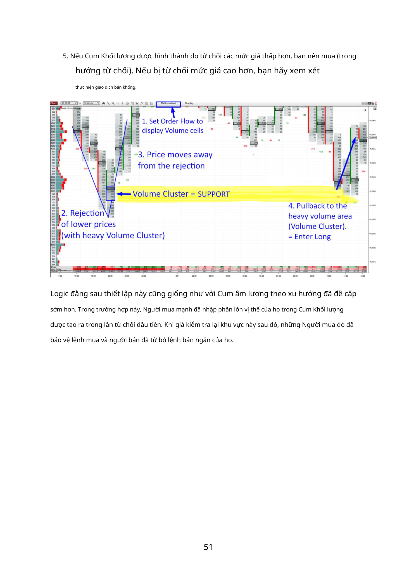

5. Nếu Cụm Khối lượng được hình thành do từ chối các mức giá thấp hơn, bạn nên mua (trong
hướng từ chối). Nếu bị từ chối mức giá cao hơn, bạn hãy xem xét
thực hiện giao dịch bán khống.
Logic đằng sau thiết lập này cũng giống như với Cụm âm lượng theo xu hướng đã đề cập
sớm hơn. Trong trường hợp này, Người mua mạnh đã nhập phần lớn vị thế của họ trong Cụm Khối lượng
được tạo ra trong lần từ chối đầu tiên. Khi giá kiểm tra lại khu vực này sau đó, những Người mua đó đã
bảo vệ lệnh mua và người bán đã từ bỏ lệnh bán ngắn của họ.
51

## Trang 53
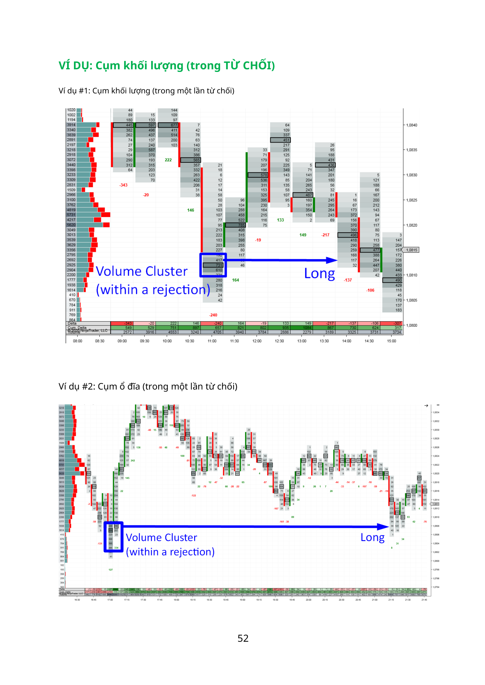

VÍ DỤ: Cụm khối lượng (trong TỪ CHỐI)
Ví dụ #1: Cụm khối lượng (trong một lần từ chối)
Ví dụ #2: Cụm ổ đĩa (trong một lần từ chối)
52

## Trang 54
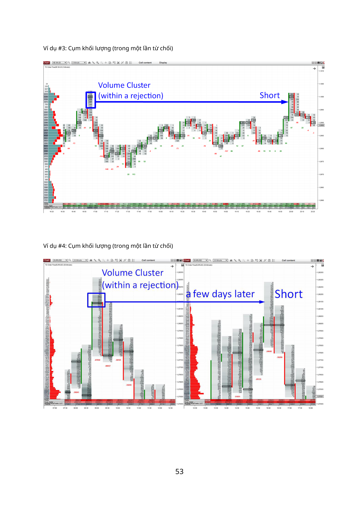

Ví dụ #3: Cụm khối lượng (trong một lần từ chối)
Ví dụ #4: Cụm khối lượng (trong một lần từ chối)
53

## Trang 55
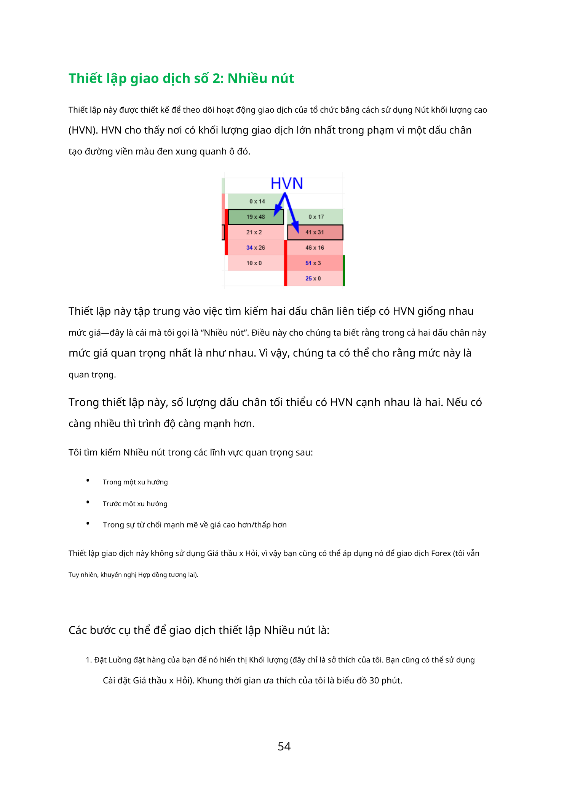

Thiết lập giao dịch số 2: Nhiều nút
Thiết lập này được thiết kế để theo dõi hoạt động giao dịch của tổ chức bằng cách sử dụng Nút khối lượng cao
(HVN). HVN cho thấy nơi có khối lượng giao dịch lớn nhất trong phạm vi một dấu chân
tạo đường viền màu đen xung quanh ô đó.
Thiết lập này tập trung vào việc tìm kiếm hai dấu chân liên tiếp có HVN giống nhau
mức giá—đây là cái mà tôi gọi là “Nhiều nút”. Điều này cho chúng ta biết rằng trong cả hai dấu chân này
mức giá quan trọng nhất là như nhau. Vì vậy, chúng ta có thể cho rằng mức này là
quan trọng.
Trong thiết lập này, số lượng dấu chân tối thiểu có HVN cạnh nhau là hai. Nếu có
càng nhiều thì trình độ càng mạnh hơn.
Tôi tìm kiếm Nhiều nút trong các lĩnh vực quan trọng sau:
•
Trong một xu hướng
•
Trước một xu hướng
•
Trong sự từ chối mạnh mẽ về giá cao hơn/thấp hơn
Thiết lập giao dịch này không sử dụng Giá thầu x Hỏi, vì vậy bạn cũng có thể áp dụng nó để giao dịch Forex (tôi vẫn
Tuy nhiên, khuyến nghị Hợp đồng tương lai).
Các bước cụ thể để giao dịch thiết lập Nhiều nút là:
1. Đặt Luồng đặt hàng của bạn để nó hiển thị Khối lượng (đây chỉ là sở thích của tôi. Bạn cũng có thể sử dụng
Cài đặt Giá thầu x Hỏi). Khung thời gian ưa thích của tôi là biểu đồ 30 phút.
54

## Trang 56
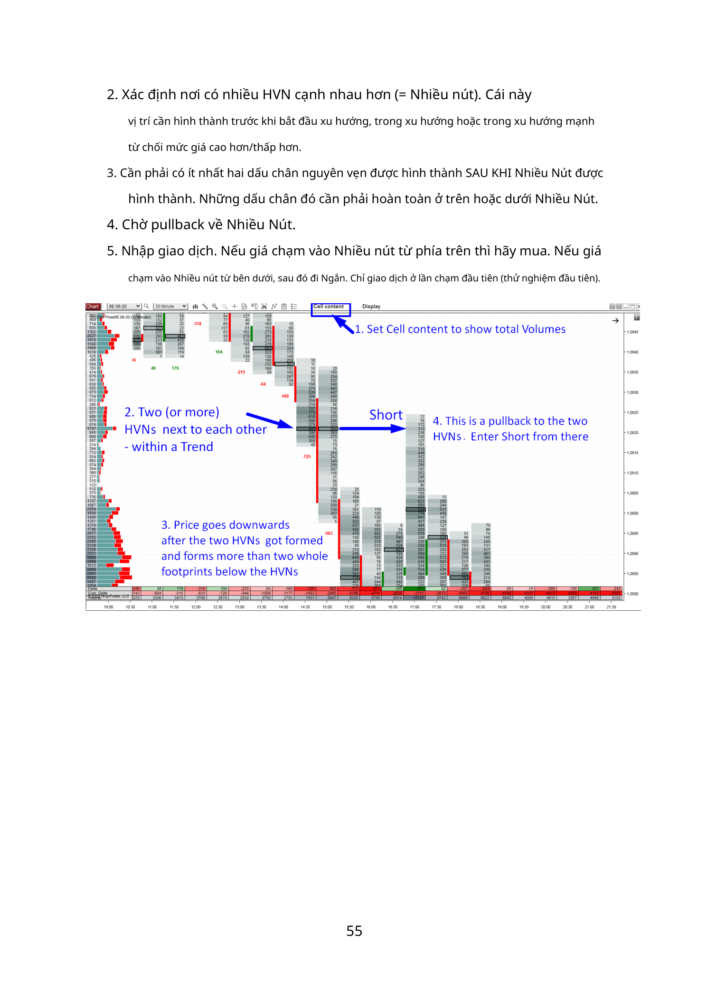

2. Xác định nơi có nhiều HVN cạnh nhau hơn (= Nhiều nút). Cái này
vị trí cần hình thành trước khi bắt đầu xu hướng, trong xu hướng hoặc trong xu hướng mạnh
từ chối mức giá cao hơn/thấp hơn.
3. Cần phải có ít nhất hai dấu chân nguyên vẹn được hình thành SAU KHI Nhiều Nút được
hình thành. Những dấu chân đó cần phải hoàn toàn ở trên hoặc dưới Nhiều Nút.
4. Chờ pullback về Nhiều Nút.
5. Nhập giao dịch. Nếu giá chạm vào Nhiều nút từ phía trên thì hãy mua. Nếu giá
chạm vào Nhiều nút từ bên dưới, sau đó đi Ngắn. Chỉ giao dịch ở lần chạm đầu tiên (thử nghiệm đầu tiên).
55

## Trang 57
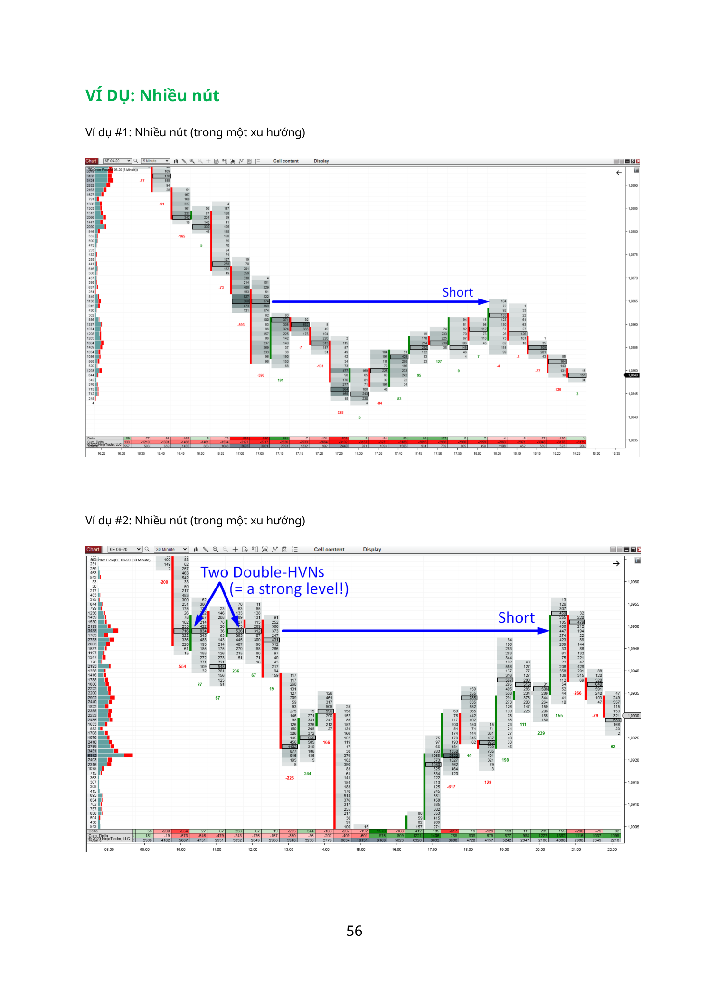

VÍ DỤ: Nhiều nút
Ví dụ #1: Nhiều nút (trong một xu hướng)
Ví dụ #2: Nhiều nút (trong một xu hướng)
56

## Trang 58
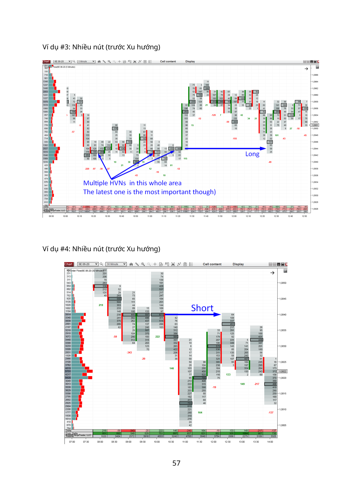

Ví dụ #3: Nhiều nút (trước Xu hướng)
Ví dụ #4: Nhiều nút (trước Xu hướng)
57

## Trang 59
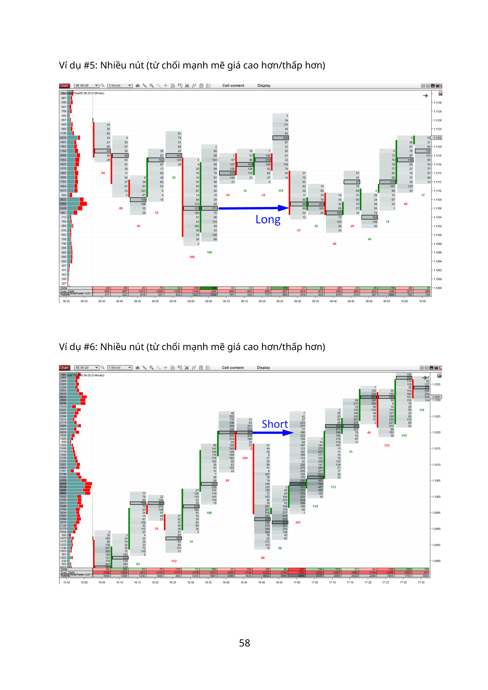

Ví dụ #5: Nhiều nút (từ chối mạnh mẽ giá cao hơn/thấp hơn)
Ví dụ #6: Nhiều nút (từ chối mạnh mẽ giá cao hơn/thấp hơn)
58

## Trang 60
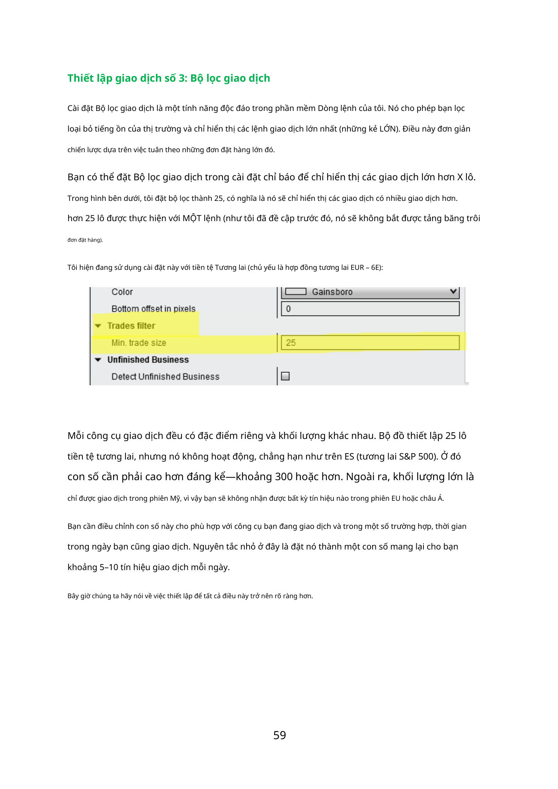

Thiết lập giao dịch số 3: Bộ lọc giao dịch
Cài đặt Bộ lọc giao dịch là một tính năng độc đáo trong phần mềm Dòng lệnh của tôi. Nó cho phép bạn lọc
loại bỏ tiếng ồn của thị trường và chỉ hiển thị các lệnh giao dịch lớn nhất (những kẻ LỚN). Điều này đơn giản
chiến lược dựa trên việc tuân theo những đơn đặt hàng lớn đó.
Bạn có thể đặt Bộ lọc giao dịch trong cài đặt chỉ báo để chỉ hiển thị các giao dịch lớn hơn X lô.
Trong hình bên dưới, tôi đặt bộ lọc thành 25, có nghĩa là nó sẽ chỉ hiển thị các giao dịch có nhiều giao dịch hơn.
hơn 25 lô được thực hiện với MỘT lệnh (như tôi đã đề cập trước đó, nó sẽ không bắt được tảng băng trôi
đơn đặt hàng).
Tôi hiện đang sử dụng cài đặt này với tiền tệ Tương lai (chủ yếu là hợp đồng tương lai EUR – 6E):
Mỗi công cụ giao dịch đều có đặc điểm riêng và khối lượng khác nhau. Bộ đồ thiết lập 25 lô
tiền tệ tương lai, nhưng nó không hoạt động, chẳng hạn như trên ES (tương lai S&P 500). Ở đó
con số cần phải cao hơn đáng kể—khoảng 300 hoặc hơn. Ngoài ra, khối lượng lớn là
chỉ được giao dịch trong phiên Mỹ, vì vậy bạn sẽ không nhận được bất kỳ tín hiệu nào trong phiên EU hoặc châu Á.
Bạn cần điều chỉnh con số này cho phù hợp với công cụ bạn đang giao dịch và trong một số trường hợp, thời gian
trong ngày bạn cũng giao dịch. Nguyên tắc nhỏ ở đây là đặt nó thành một con số mang lại cho bạn
khoảng 5–10 tín hiệu giao dịch mỗi ngày.
Bây giờ chúng ta hãy nói về việc thiết lập để tất cả điều này trở nên rõ ràng hơn.
59

## Trang 61
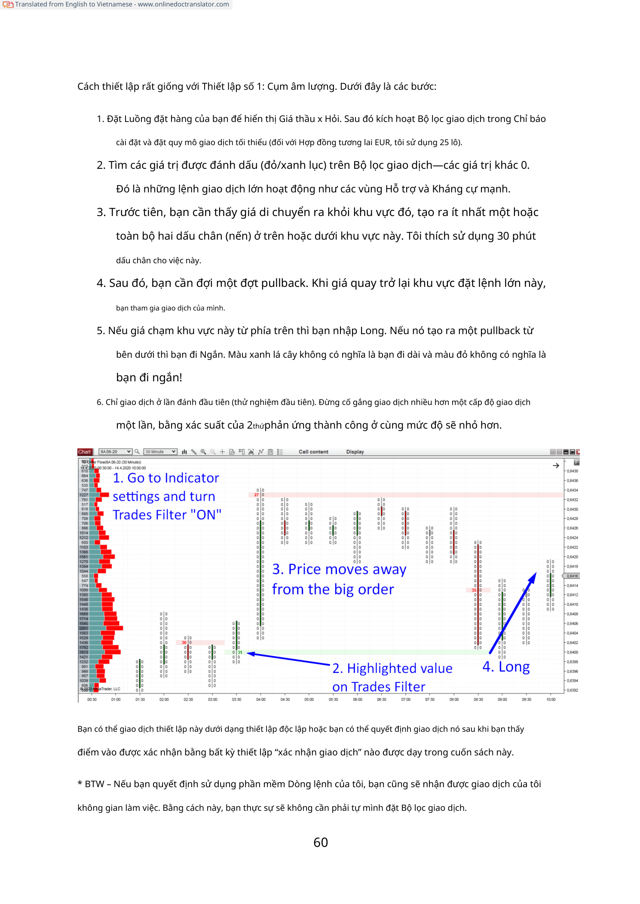

Cách thiết lập rất giống với Thiết lập số 1: Cụm âm lượng. Dưới đây là các bước:
1. Đặt Luồng đặt hàng của bạn để hiển thị Giá thầu x Hỏi. Sau đó kích hoạt Bộ lọc giao dịch trong Chỉ báo
cài đặt và đặt quy mô giao dịch tối thiểu (đối với Hợp đồng tương lai EUR, tôi sử dụng 25 lô).
2. Tìm các giá trị được đánh dấu (đỏ/xanh lục) trên Bộ lọc giao dịch—các giá trị khác 0.
Đó là những lệnh giao dịch lớn hoạt động như các vùng Hỗ trợ và Kháng cự mạnh.
3. Trước tiên, bạn cần thấy giá di chuyển ra khỏi khu vực đó, tạo ra ít nhất một hoặc
toàn bộ hai dấu chân (nến) ở trên hoặc dưới khu vực này. Tôi thích sử dụng 30 phút
dấu chân cho việc này.
4. Sau đó, bạn cần đợi một đợt pullback. Khi giá quay trở lại khu vực đặt lệnh lớn này,
bạn tham gia giao dịch của mình.
5. Nếu giá chạm khu vực này từ phía trên thì bạn nhập Long. Nếu nó tạo ra một pullback từ
bên dưới thì bạn đi Ngắn. Màu xanh lá cây không có nghĩa là bạn đi dài và màu đỏ không có nghĩa là
bạn đi ngắn!
6. Chỉ giao dịch ở lần đánh đầu tiên (thử nghiệm đầu tiên). Đừng cố gắng giao dịch nhiều hơn một cấp độ giao dịch
một lần, bằng xác suất của 2thứphản ứng thành công ở cùng mức độ sẽ nhỏ hơn.
Bạn có thể giao dịch thiết lập này dưới dạng thiết lập độc lập hoặc bạn có thể quyết định giao dịch nó sau khi bạn thấy
điểm vào được xác nhận bằng bất kỳ thiết lập “xác nhận giao dịch” nào được dạy trong cuốn sách này.
* BTW – Nếu bạn quyết định sử dụng phần mềm Dòng lệnh của tôi, bạn cũng sẽ nhận được giao dịch của tôi
không gian làm việc. Bằng cách này, bạn thực sự sẽ không cần phải tự mình đặt Bộ lọc giao dịch.
60

## Trang 62
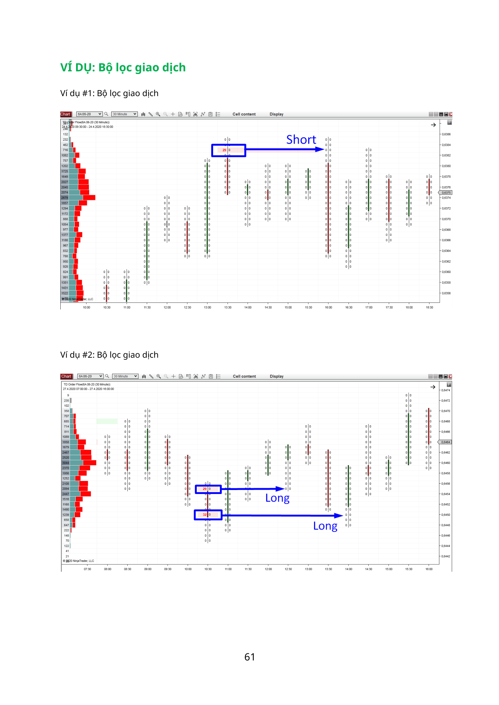

VÍ DỤ: Bộ lọc giao dịch
Ví dụ #1: Bộ lọc giao dịch
Ví dụ #2: Bộ lọc giao dịch
61

## Trang 63
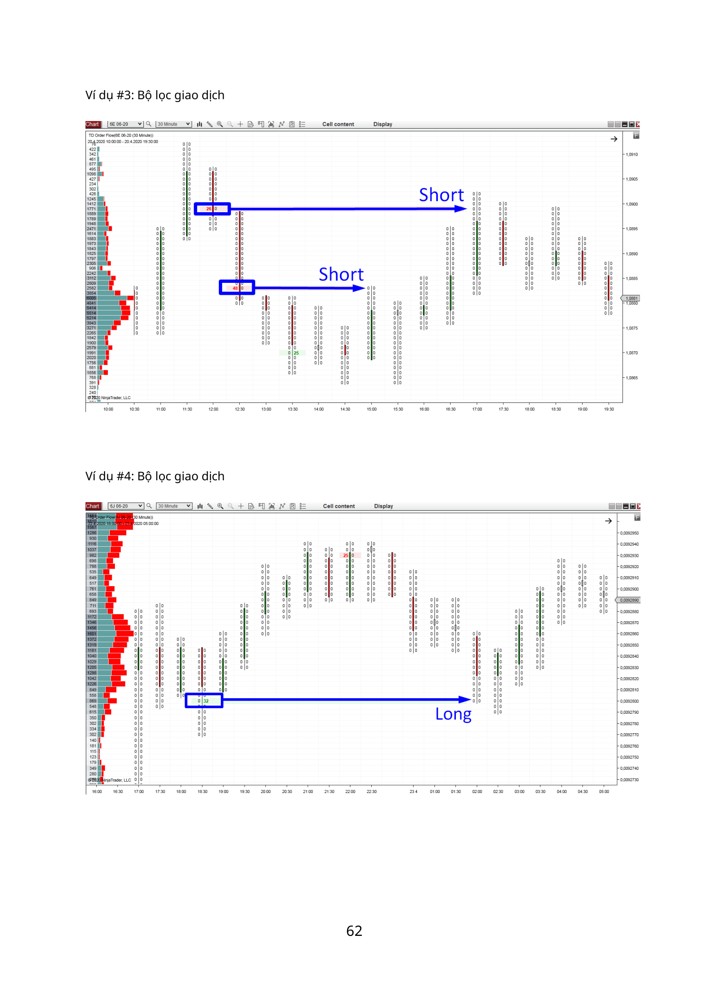

Ví dụ #3: Bộ lọc giao dịch
Ví dụ #4: Bộ lọc giao dịch
62

## Trang 64
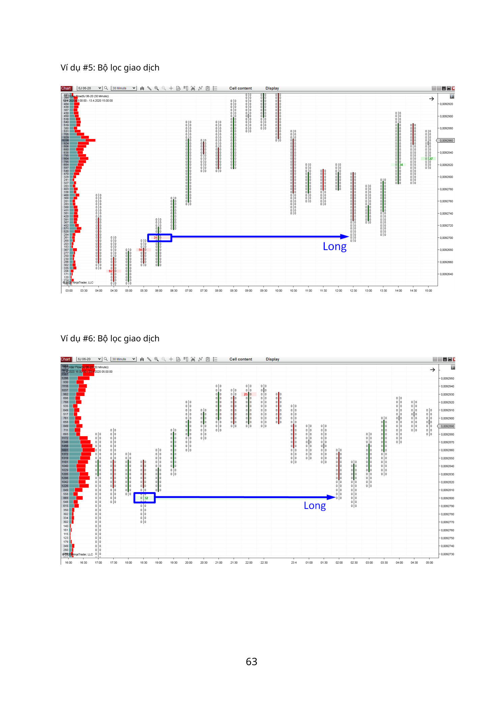

Ví dụ #5: Bộ lọc giao dịch
Ví dụ #6: Bộ lọc giao dịch
63

## Trang 65
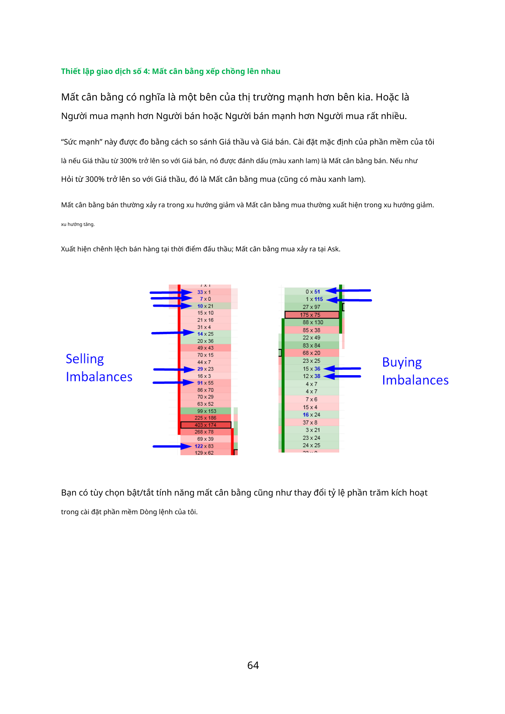

Thiết lập giao dịch số 4: Mất cân bằng xếp chồng lên nhau
Mất cân bằng có nghĩa là một bên của thị trường mạnh hơn bên kia. Hoặc là
Người mua mạnh hơn Người bán hoặc Người bán mạnh hơn Người mua rất nhiều.
“Sức mạnh” này được đo bằng cách so sánh Giá thầu và Giá bán. Cài đặt mặc định của phần mềm của tôi
là nếu Giá thầu từ 300% trở lên so với Giá bán, nó được đánh dấu (màu xanh lam) là Mất cân bằng bán. Nếu như
Hỏi từ 300% trở lên so với Giá thầu, đó là Mất cân bằng mua (cũng có màu xanh lam).
Mất cân bằng bán thường xảy ra trong xu hướng giảm và Mất cân bằng mua thường xuất hiện trong xu hướng giảm.
xu hướng tăng.
Xuất hiện chênh lệch bán hàng tại thời điểm đấu thầu; Mất cân bằng mua xảy ra tại Ask.
Bạn có tùy chọn bật/tắt tính năng mất cân bằng cũng như thay đổi tỷ lệ phần trăm kích hoạt
trong cài đặt phần mềm Dòng lệnh của tôi.
64

## Trang 66
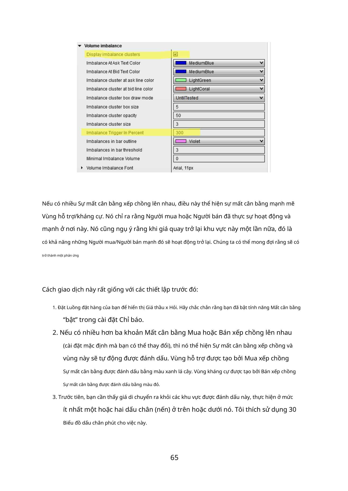

Nếu có nhiều Sự mất cân bằng xếp chồng lên nhau, điều này thể hiện sự mất cân bằng mạnh mẽ
Vùng hỗ trợ/kháng cự. Nó chỉ ra rằng Người mua hoặc Người bán đã thực sự hoạt động và
mạnh ở nơi này. Nó cũng ngụ ý rằng khi giá quay trở lại khu vực này một lần nữa, đó là
có khả năng những Người mua/Người bán mạnh đó sẽ hoạt động trở lại. Chúng ta có thể mong đợi rằng sẽ có
trở thành một phản ứng
Cách giao dịch này rất giống với các thiết lập trước đó:
1. Đặt Luồng đặt hàng của bạn để hiển thị Giá thầu x Hỏi. Hãy chắc chắn rằng bạn đã bật tính năng Mất cân bằng
“bật” trong cài đặt Chỉ báo.
2. Nếu có nhiều hơn ba khoản Mất cân bằng Mua hoặc Bán xếp chồng lên nhau
(cài đặt mặc định mà bạn có thể thay đổi), thì nó thể hiện Sự mất cân bằng xếp chồng và
vùng này sẽ tự động được đánh dấu. Vùng hỗ trợ được tạo bởi Mua xếp chồng
Sự mất cân bằng được đánh dấu bằng màu xanh lá cây. Vùng kháng cự được tạo bởi Bán xếp chồng
Sự mất cân bằng được đánh dấu bằng màu đỏ.
3. Trước tiên, bạn cần thấy giá di chuyển ra khỏi các khu vực được đánh dấu này, thực hiện ở mức
ít nhất một hoặc hai dấu chân (nến) ở trên hoặc dưới nó. Tôi thích sử dụng 30
Biểu đồ dấu chân phút cho việc này.
65

## Trang 67
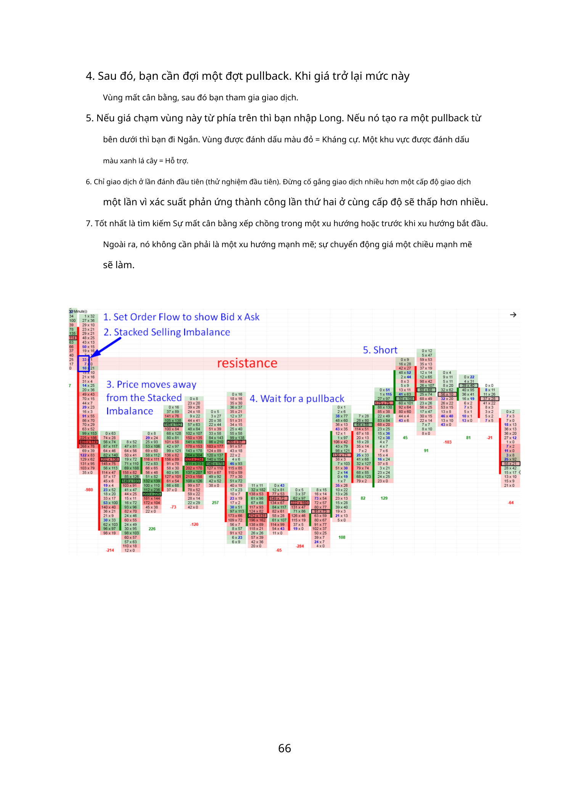

4. Sau đó, bạn cần đợi một đợt pullback. Khi giá trở lại mức này
Vùng mất cân bằng, sau đó bạn tham gia giao dịch.
5. Nếu giá chạm vùng này từ phía trên thì bạn nhập Long. Nếu nó tạo ra một pullback từ
bên dưới thì bạn đi Ngắn. Vùng được đánh dấu màu đỏ = Kháng cự. Một khu vực được đánh dấu
màu xanh lá cây = Hỗ trợ.
6. Chỉ giao dịch ở lần đánh đầu tiên (thử nghiệm đầu tiên). Đừng cố gắng giao dịch nhiều hơn một cấp độ giao dịch
một lần vì xác suất phản ứng thành công lần thứ hai ở cùng cấp độ sẽ thấp hơn nhiều.
7. Tốt nhất là tìm kiếm Sự mất cân bằng xếp chồng trong một xu hướng hoặc trước khi xu hướng bắt đầu.
Ngoài ra, nó không cần phải là một xu hướng mạnh mẽ; sự chuyển động giá một chiều mạnh mẽ
sẽ làm.
66

## Trang 68
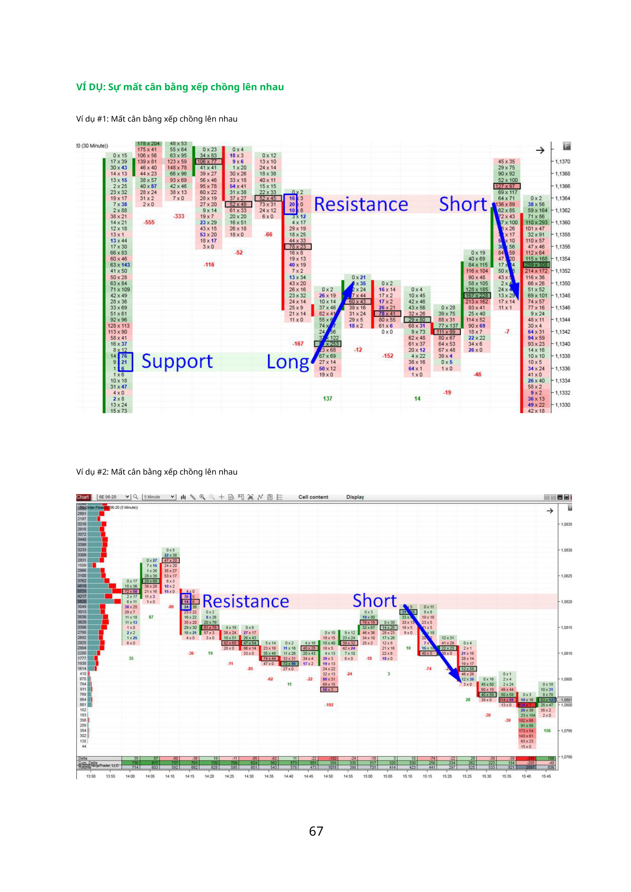

VÍ DỤ: Sự mất cân bằng xếp chồng lên nhau
Ví dụ #1: Mất cân bằng xếp chồng lên nhau
Ví dụ #2: Mất cân bằng xếp chồng lên nhau
67

## Trang 69
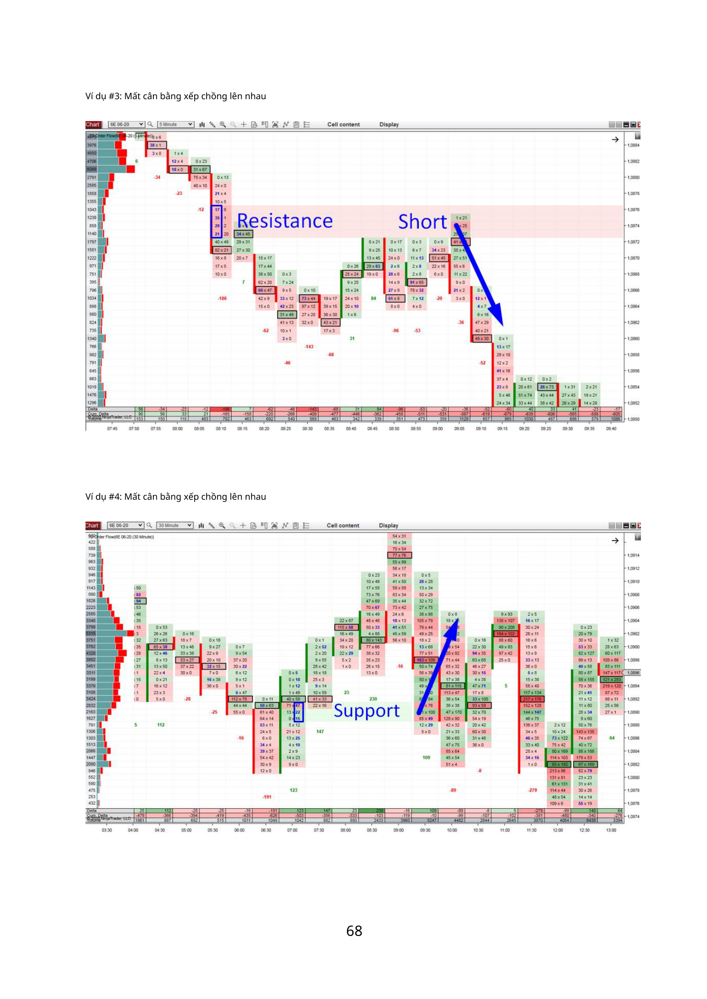

Ví dụ #3: Mất cân bằng xếp chồng lên nhau
Ví dụ #4: Mất cân bằng xếp chồng lên nhau
68

## Trang 70
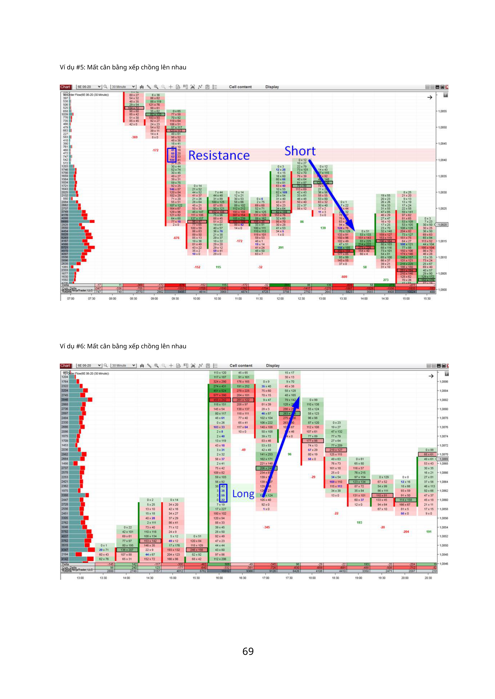

Ví dụ #5: Mất cân bằng xếp chồng lên nhau
Ví dụ #6: Mất cân bằng xếp chồng lên nhau
69

## Trang 71
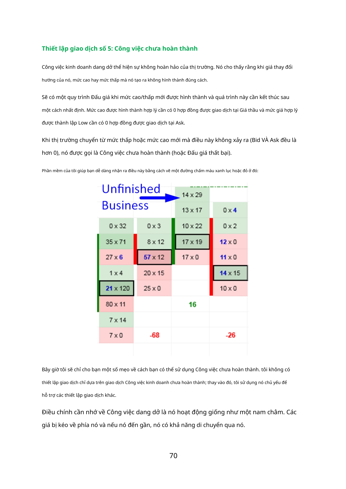

Thiết lập giao dịch số 5: Công việc chưa hoàn thành
Công việc kinh doanh dang dở thể hiện sự không hoàn hảo của thị trường. Nó cho thấy rằng khi giá thay đổi
hướng của nó, mức cao hay mức thấp mà nó tạo ra không hình thành đúng cách.
Sẽ có một quy trình Đấu giá khi mức cao/thấp mới được hình thành và quá trình này cần kết thúc sau
một cách nhất định. Mức cao được hình thành hợp lý cần có 0 hợp đồng được giao dịch tại Giá thầu và mức giá hợp lý
được thành lập Low cần có 0 hợp đồng được giao dịch tại Ask.
Khi thị trường chuyển từ mức thấp hoặc mức cao mới mà điều này không xảy ra (Bid VÀ Ask đều là
hơn 0), nó được gọi là Công việc chưa hoàn thành (hoặc Đấu giá thất bại).
Phần mềm của tôi giúp bạn dễ dàng nhận ra điều này bằng cách vẽ một đường chấm màu xanh lục hoặc đỏ ở đó:
Bây giờ tôi sẽ chỉ cho bạn một số mẹo về cách bạn có thể sử dụng Công việc chưa hoàn thành. tôi không có
thiết lập giao dịch chỉ dựa trên giao dịch Công việc kinh doanh chưa hoàn thành; thay vào đó, tôi sử dụng nó chủ yếu để
hỗ trợ các thiết lập giao dịch khác.
Điều chính cần nhớ về Công việc dang dở là nó hoạt động giống như một nam châm. Các
giá bị kéo về phía nó và nếu nó đến gần, nó có khả năng di chuyển qua nó.
70

## Trang 72
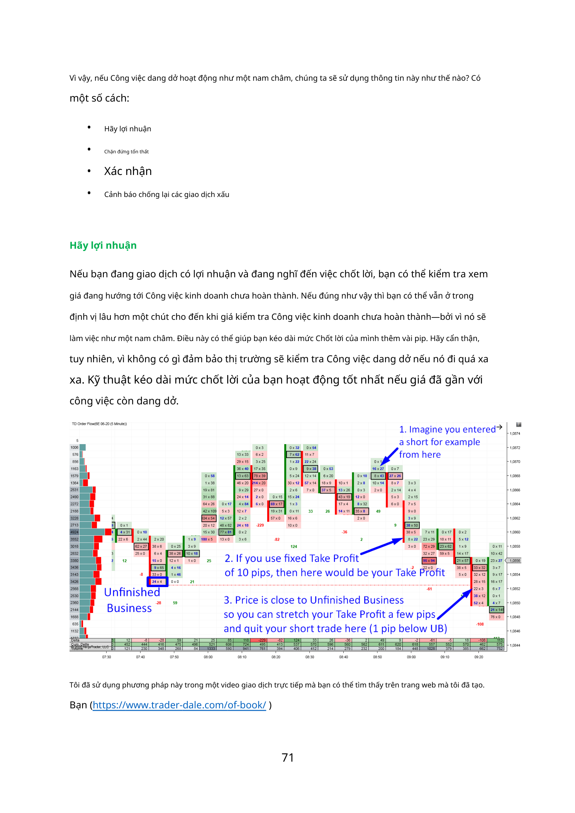

Vì vậy, nếu Công việc dang dở hoạt động như một nam châm, chúng ta sẽ sử dụng thông tin này như thế nào? Có
một số cách:
•
Hãy lợi nhuận
•
Chặn đứng tổn thất
•
Xác nhận
•
Cảnh báo chống lại các giao dịch xấu
Hãy lợi nhuận
Nếu bạn đang giao dịch có lợi nhuận và đang nghĩ đến việc chốt lời, bạn có thể kiểm tra xem
giá đang hướng tới Công việc kinh doanh chưa hoàn thành. Nếu đúng như vậy thì bạn có thể vẫn ở trong
định vị lâu hơn một chút cho đến khi giá kiểm tra Công việc kinh doanh chưa hoàn thành—bởi vì nó sẽ
làm việc như một nam châm. Điều này có thể giúp bạn kéo dài mức Chốt lời của mình thêm vài pip. Hãy cẩn thận,
tuy nhiên, vì không có gì đảm bảo thị trường sẽ kiểm tra Công việc dang dở nếu nó đi quá xa
xa. Kỹ thuật kéo dài mức chốt lời của bạn hoạt động tốt nhất nếu giá đã gần với
công việc còn dang dở.
Tôi đã sử dụng phương pháp này trong một video giao dịch trực tiếp mà bạn có thể tìm thấy trên trang web mà tôi đã tạo.
Bạn (https://www.trader-dale.com/of-book/ )
71

## Trang 73
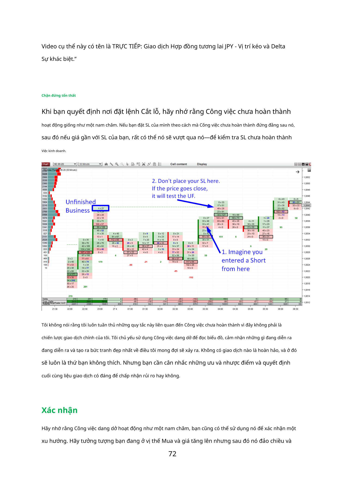

Video cụ thể này có tên là TRỰC TIẾP: Giao dịch Hợp đồng tương lai JPY - Vị trí kéo và Delta
Sự khác biệt.”
Chặn đứng tổn thất
Khi bạn quyết định nơi đặt lệnh Cắt lỗ, hãy nhớ rằng Công việc chưa hoàn thành
hoạt động giống như một nam châm. Nếu bạn đặt SL của mình theo cách mà Công việc chưa hoàn thành đứng đằng sau nó,
sau đó nếu giá gần với SL của bạn, rất có thể nó sẽ vượt qua nó—để kiểm tra SL chưa hoàn thành
Việc kinh doanh.
Tôi không nói rằng tôi luôn tuân thủ những quy tắc này liên quan đến Công việc chưa hoàn thành vì đây không phải là
chiến lược giao dịch chính của tôi. Tôi chủ yếu sử dụng Công việc dang dở để đọc biểu đồ, cảm nhận những gì đang diễn ra
đang diễn ra và tạo ra bức tranh đẹp nhất về điều tôi mong đợi sẽ xảy ra. Không có giao dịch nào là hoàn hảo, và ở đó
sẽ luôn là thứ bạn không thích. Nhưng bạn cần cân nhắc những ưu và nhược điểm và quyết định
cuối cùng liệu giao dịch có đáng để chấp nhận rủi ro hay không.
Xác nhận
Hãy nhớ rằng Công việc dang dở hoạt động như một nam châm, bạn cũng có thể sử dụng nó để xác nhận một
xu hướng. Hãy tưởng tượng bạn đang ở vị thế Mua và giá tăng lên nhưng sau đó nó đảo chiều và
72

## Trang 74
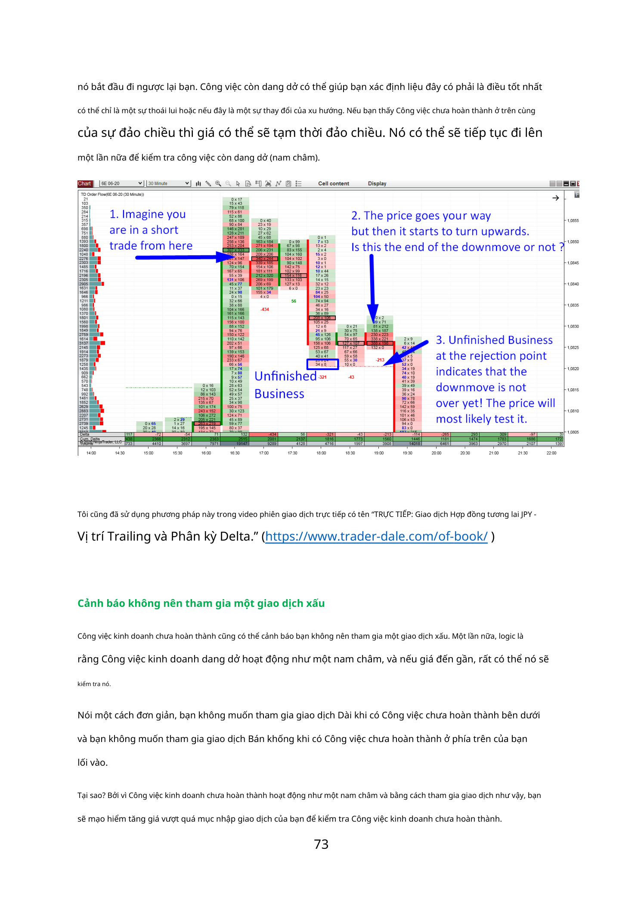

nó bắt đầu đi ngược lại bạn. Công việc còn dang dở có thể giúp bạn xác định liệu đây có phải là điều tốt nhất
có thể chỉ là một sự thoái lui hoặc nếu đây là một sự thay đổi của xu hướng. Nếu bạn thấy Công việc chưa hoàn thành ở trên cùng
của sự đảo chiều thì giá có thể sẽ tạm thời đảo chiều. Nó có thể sẽ tiếp tục đi lên
một lần nữa để kiểm tra công việc còn dang dở (nam châm).
Tôi cũng đã sử dụng phương pháp này trong video phiên giao dịch trực tiếp có tên “TRỰC TIẾP: Giao dịch Hợp đồng tương lai JPY -
Vị trí Trailing và Phân kỳ Delta.” (https://www.trader-dale.com/of-book/ )
Cảnh báo không nên tham gia một giao dịch xấu
Công việc kinh doanh chưa hoàn thành cũng có thể cảnh báo bạn không nên tham gia một giao dịch xấu. Một lần nữa, logic là
rằng Công việc kinh doanh dang dở hoạt động như một nam châm, và nếu giá đến gần, rất có thể nó sẽ
kiểm tra nó.
Nói một cách đơn giản, bạn không muốn tham gia giao dịch Dài khi có Công việc chưa hoàn thành bên dưới
và bạn không muốn tham gia giao dịch Bán khống khi có Công việc chưa hoàn thành ở phía trên của bạn
lối vào.
Tại sao? Bởi vì Công việc kinh doanh chưa hoàn thành hoạt động như một nam châm và bằng cách tham gia giao dịch như vậy, bạn
sẽ mạo hiểm tăng giá vượt quá mục nhập giao dịch của bạn để kiểm tra Công việc kinh doanh chưa hoàn thành.
73

## Trang 75
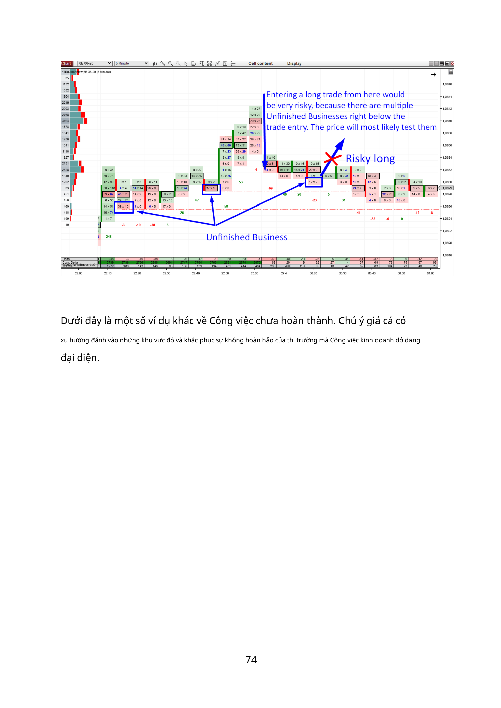

Dưới đây là một số ví dụ khác về Công việc chưa hoàn thành. Chú ý giá cả có
xu hướng đánh vào những khu vực đó và khắc phục sự không hoàn hảo của thị trường mà Công việc kinh doanh dở dang
đại diện.
74

## Trang 76
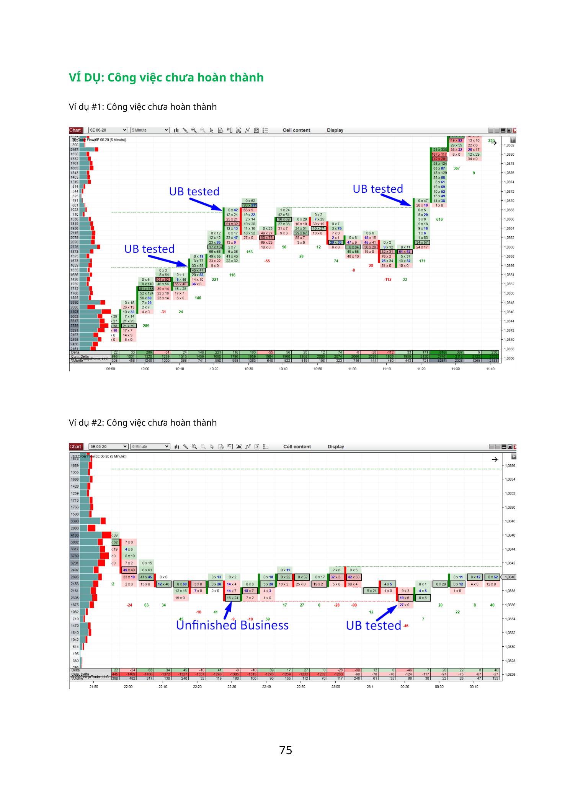

VÍ DỤ: Công việc chưa hoàn thành
Ví dụ #1: Công việc chưa hoàn thành
Ví dụ #2: Công việc chưa hoàn thành
75

## Trang 77
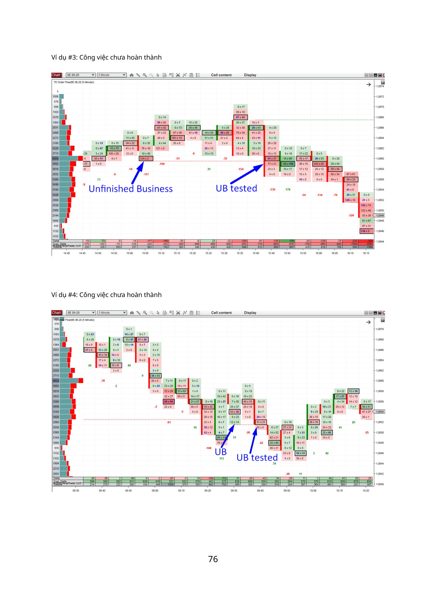

Ví dụ #3: Công việc chưa hoàn thành
Ví dụ #4: Công việc chưa hoàn thành
76

## Trang 78
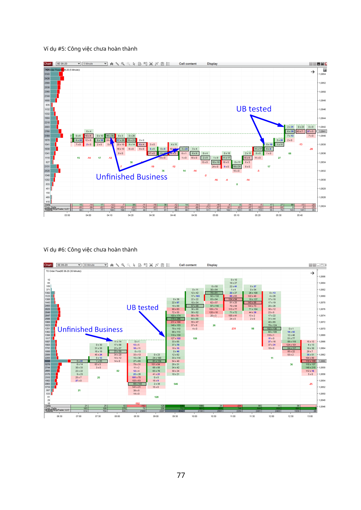

Ví dụ #5: Công việc chưa hoàn thành
Ví dụ #6: Công việc chưa hoàn thành
77

## Trang 79
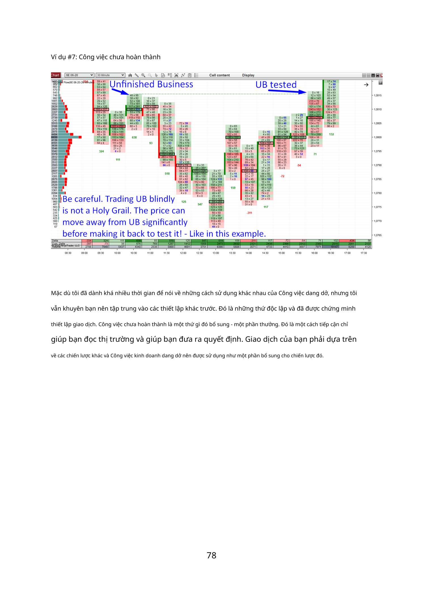

Ví dụ #7: Công việc chưa hoàn thành
Mặc dù tôi đã dành khá nhiều thời gian để nói về những cách sử dụng khác nhau của Công việc dang dở, nhưng tôi
vẫn khuyên bạn nên tập trung vào các thiết lập khác trước. Đó là những thứ độc lập và đã được chứng minh
thiết lập giao dịch. Công việc chưa hoàn thành là một thứ gì đó bổ sung - một phần thưởng. Đó là một cách tiếp cận chỉ
giúp bạn đọc thị trường và giúp bạn đưa ra quyết định. Giao dịch của bạn phải dựa trên
về các chiến lược khác và Công việc kinh doanh dang dở nên được sử dụng như một phần bổ sung cho chiến lược đó.
78

## Trang 80

Luồng đặt hàng – Xác nhận
Thiết lập xác nhận không phải là thiết lập giao dịch tiêu chuẩn. Bạn không nên căn cứ vào giao dịch của mình
chiến lược về họ một mình. Sức mạnh của họ nằm ở việc đưa ra gợi ý cho bạn khi thị trường bắt đầu
phản ứng với vùng Hỗ trợ/Kháng cự mà bạn đã tìm thấy bằng cách sử dụng một trong các thiết lập giao dịch chính của mình. Cái đó
sẽ là một thiết lập dựa trên Hồ sơ Khối lượng hoặc một trong những thiết lập mà tôi đã chỉ cho bạn ở phần trước
chương.
Đây là cách nó hoạt động:
Đầu tiên, hãy xem qua biểu đồ và xác định các vùng Hỗ trợ và Kháng cự. Bạn có thể làm được việc này
với Cấu hình khối lượng, thiết lập chính Luồng đơn hàng hoặc xác định các vùng S/R theo cách khác của bạn
quen thuộc với.
Sau đó, đánh dấu các vùng S/R đó trong biểu đồ của bạn. Sau đó đợi cho đến khi giá đạt đến đó. Khi
đúng như vậy, hãy chuyển sang Luồng đơn hàng và chờ xác nhận.
Điều quan trọng cần lưu ý là Hỗ trợ và Kháng cự là các VÙNG, KHÔNG PHẢI là mức CHÍNH XÁC. Khi mà
giá đạt đến một vùng như vậy, bạn muốn thấy xác nhận ở đó, ở đâu đó trong vùng đó.
Xác nhận như vậy cho bạn biết rằng những kẻ LỚN (tổ chức) đang bắt đầu phản ứng ở đó.
Có bốn xác nhận tôi muốn sử dụng. Những điều này có thể mang lại cho bạn cú hích cuối cùng để bước vào
buôn bán.
Tôi cũng thích sử dụng những xác nhận này khi tôi không chắc chắn có nên thực hiện giao dịch hay không. Cái này
chẳng hạn, có thể là do giá di chuyển rất nhanh và mạnh so với giao dịch của tôi
cấp độ hoặc cấp độ giao dịch không thực sự rõ ràng (không rõ chính xác nơi đặt nó). Tôi cũng dùng
xác nhận khi mức độ giao dịch của tôi không đặc biệt mạnh và tôi không chắc liệu có nên
giao dịch nó hay không.
Trong tất cả các tình huống như vậy, xác nhận Luồng lệnh có thể giúp bạn quyết định có nên thực hiện giao dịch hay không
hoặc bỏ qua nó.
Có bốn xác nhận tôi tìm kiếm khi giá đạt đến mức Hỗ trợ hoặc Hỗ trợ đáng kể
Vùng kháng cự. Tôi tìm kiếm: Lệnh giới hạn lớn, Sự hấp thụ, dấu hiệu của Người mua/Người bán hung hãn,
và xác nhận về Delta tích lũy.
79

## Trang 81
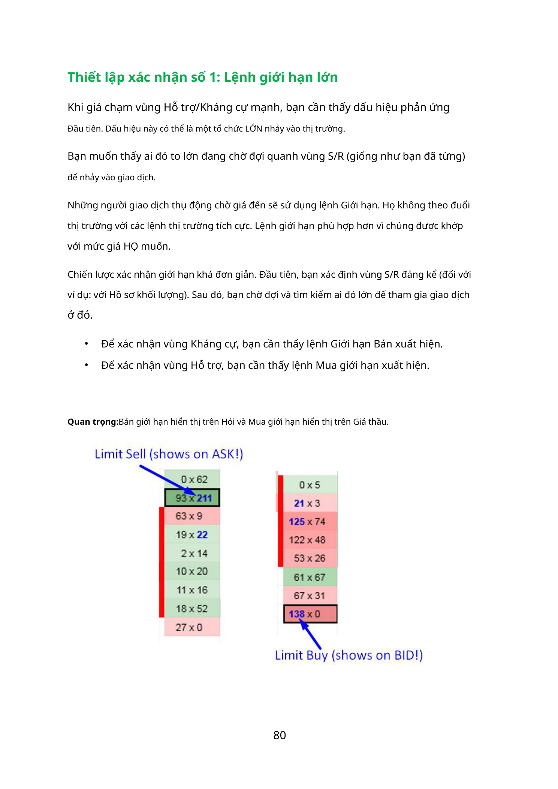

Thiết lập xác nhận số 1: Lệnh giới hạn lớn
Khi giá chạm vùng Hỗ trợ/Kháng cự mạnh, bạn cần thấy dấu hiệu phản ứng
Đầu tiên. Dấu hiệu này có thể là một tổ chức LỚN nhảy vào thị trường.
Bạn muốn thấy ai đó to lớn đang chờ đợi quanh vùng S/R (giống như bạn đã từng)
để nhảy vào giao dịch.
Những người giao dịch thụ động chờ giá đến sẽ sử dụng lệnh Giới hạn. Họ không theo đuổi
thị trường với các lệnh thị trường tích cực. Lệnh giới hạn phù hợp hơn vì chúng được khớp
với mức giá HỌ muốn.
Chiến lược xác nhận giới hạn khá đơn giản. Đầu tiên, bạn xác định vùng S/R đáng kể (đối với
ví dụ: với Hồ sơ khối lượng). Sau đó, bạn chờ đợi và tìm kiếm ai đó lớn để tham gia giao dịch
ở đó.
•
Để xác nhận vùng Kháng cự, bạn cần thấy lệnh Giới hạn Bán xuất hiện.
•
Để xác nhận vùng Hỗ trợ, bạn cần thấy lệnh Mua giới hạn xuất hiện.
Quan trọng:Bán giới hạn hiển thị trên Hỏi và Mua giới hạn hiển thị trên Giá thầu.
80

## Trang 82
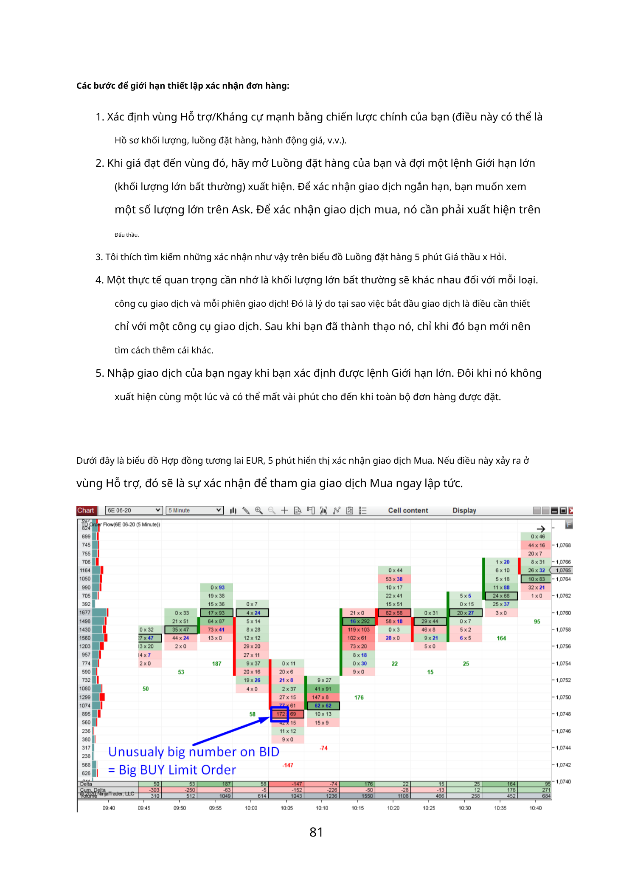

Các bước để giới hạn thiết lập xác nhận đơn hàng:
1. Xác định vùng Hỗ trợ/Kháng cự mạnh bằng chiến lược chính của bạn (điều này có thể là
Hồ sơ khối lượng, luồng đặt hàng, hành động giá, v.v.).
2. Khi giá đạt đến vùng đó, hãy mở Luồng đặt hàng của bạn và đợi một lệnh Giới hạn lớn
(khối lượng lớn bất thường) xuất hiện. Để xác nhận giao dịch ngắn hạn, bạn muốn xem
một số lượng lớn trên Ask. Để xác nhận giao dịch mua, nó cần phải xuất hiện trên
Đấu thầu.
3. Tôi thích tìm kiếm những xác nhận như vậy trên biểu đồ Luồng đặt hàng 5 phút Giá thầu x Hỏi.
4. Một thực tế quan trọng cần nhớ là khối lượng lớn bất thường sẽ khác nhau đối với mỗi loại.
công cụ giao dịch và mỗi phiên giao dịch! Đó là lý do tại sao việc bắt đầu giao dịch là điều cần thiết
chỉ với một công cụ giao dịch. Sau khi bạn đã thành thạo nó, chỉ khi đó bạn mới nên
tìm cách thêm cái khác.
5. Nhập giao dịch của bạn ngay khi bạn xác định được lệnh Giới hạn lớn. Đôi khi nó không
xuất hiện cùng một lúc và có thể mất vài phút cho đến khi toàn bộ đơn hàng được đặt.
Dưới đây là biểu đồ Hợp đồng tương lai EUR, 5 phút hiển thị xác nhận giao dịch Mua. Nếu điều này xảy ra ở
vùng Hỗ trợ, đó sẽ là sự xác nhận để tham gia giao dịch Mua ngay lập tức.
81

## Trang 83
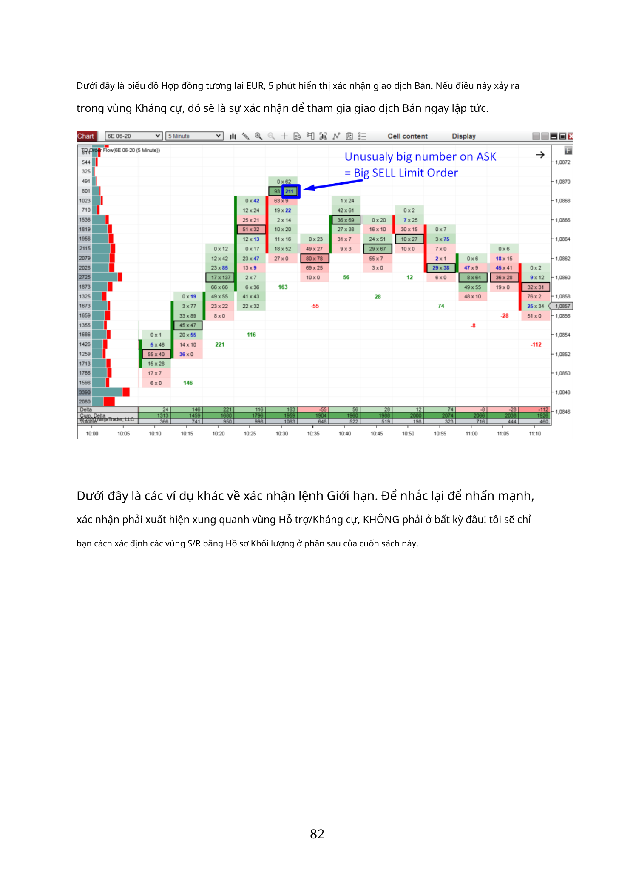

Dưới đây là biểu đồ Hợp đồng tương lai EUR, 5 phút hiển thị xác nhận giao dịch Bán. Nếu điều này xảy ra
trong vùng Kháng cự, đó sẽ là sự xác nhận để tham gia giao dịch Bán ngay lập tức.
Dưới đây là các ví dụ khác về xác nhận lệnh Giới hạn. Để nhắc lại để nhấn mạnh,
xác nhận phải xuất hiện xung quanh vùng Hỗ trợ/Kháng cự, KHÔNG phải ở bất kỳ đâu! tôi sẽ chỉ
bạn cách xác định các vùng S/R bằng Hồ sơ Khối lượng ở phần sau của cuốn sách này.
82

## Trang 84
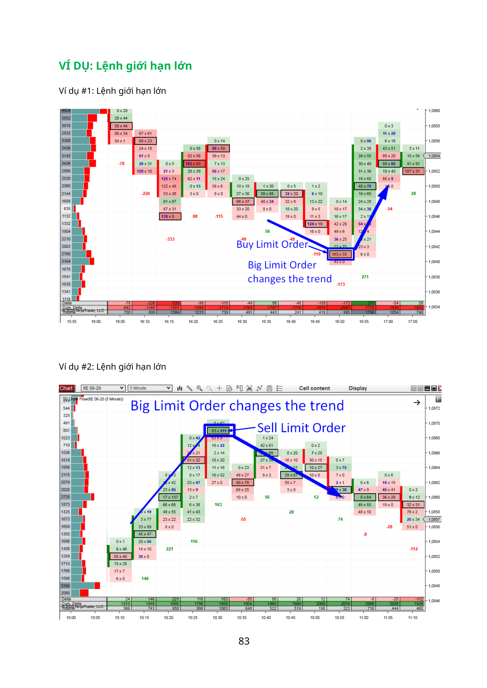

VÍ DỤ: Lệnh giới hạn lớn
Ví dụ #1: Lệnh giới hạn lớn
Ví dụ #2: Lệnh giới hạn lớn
83

## Trang 85
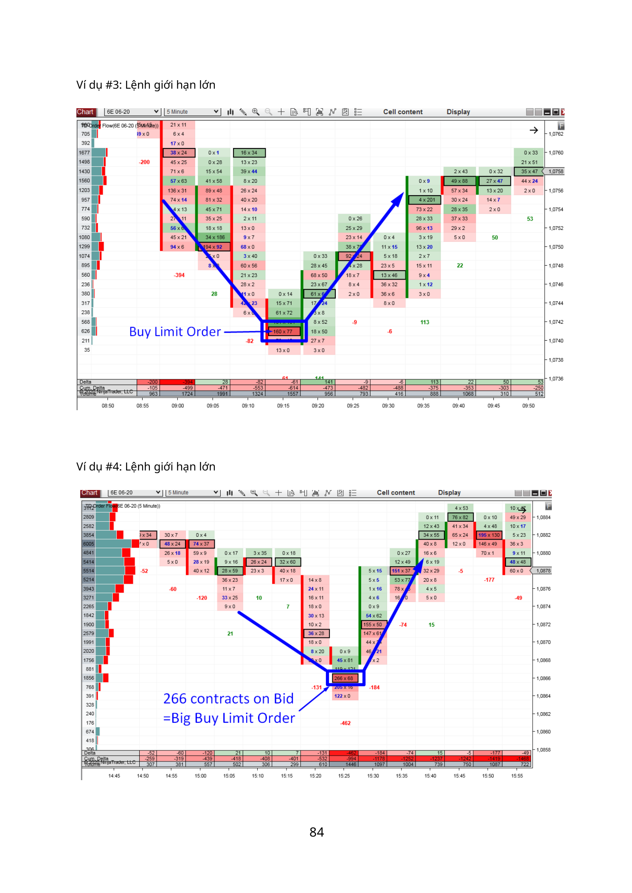

Ví dụ #3: Lệnh giới hạn lớn
Ví dụ #4: Lệnh giới hạn lớn
84

## Trang 86
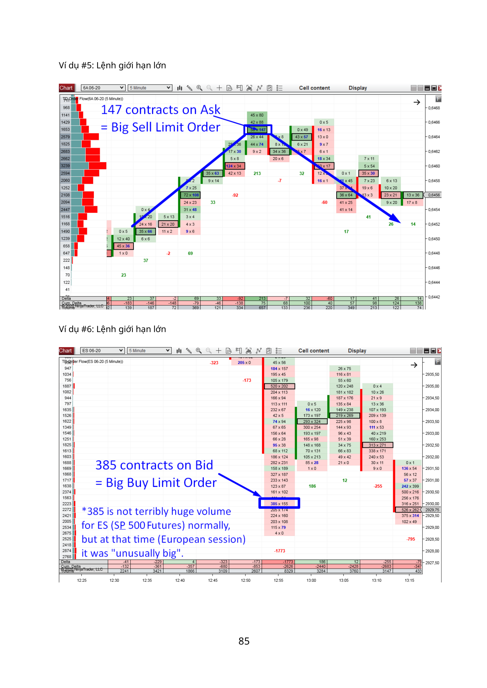

Ví dụ #5: Lệnh giới hạn lớn
Ví dụ #6: Lệnh giới hạn lớn
85

## Trang 87
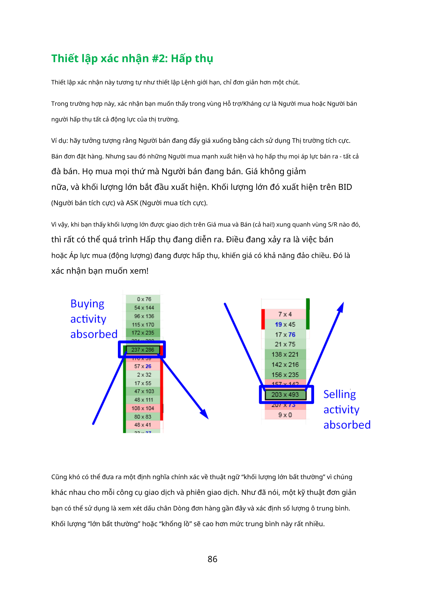

Thiết lập xác nhận #2: Hấp thụ
Thiết lập xác nhận này tương tự như thiết lập Lệnh giới hạn, chỉ đơn giản hơn một chút.
Trong trường hợp này, xác nhận bạn muốn thấy trong vùng Hỗ trợ/Kháng cự là Người mua hoặc Người bán
người hấp thụ tất cả động lực của thị trường.
Ví dụ: hãy tưởng tượng rằng Người bán đang đẩy giá xuống bằng cách sử dụng Thị trường tích cực.
Bán đơn đặt hàng. Nhưng sau đó những Người mua mạnh xuất hiện và họ hấp thụ mọi áp lực bán ra - tất cả
đà bán. Họ mua mọi thứ mà Người bán đang bán. Giá không giảm
nữa, và khối lượng lớn bắt đầu xuất hiện. Khối lượng lớn đó xuất hiện trên BID
(Người bán tích cực) và ASK (Người mua tích cực).
Vì vậy, khi bạn thấy khối lượng lớn được giao dịch trên Giá mua và Bán (cả hai!) xung quanh vùng S/R nào đó,
thì rất có thể quá trình Hấp thụ đang diễn ra. Điều đang xảy ra là việc bán
hoặc Áp lực mua (động lượng) đang được hấp thụ, khiến giá có khả năng đảo chiều. Đó là
xác nhận bạn muốn xem!
Cũng khó có thể đưa ra một định nghĩa chính xác về thuật ngữ “khối lượng lớn bất thường” vì chúng
khác nhau cho mỗi công cụ giao dịch và phiên giao dịch. Như đã nói, một kỹ thuật đơn giản
bạn có thể sử dụng là xem xét dấu chân Dòng đơn hàng gần đây và xác định số lượng ô trung bình.
Khối lượng “lớn bất thường” hoặc “khổng lồ” sẽ cao hơn mức trung bình này rất nhiều.
86

## Trang 88
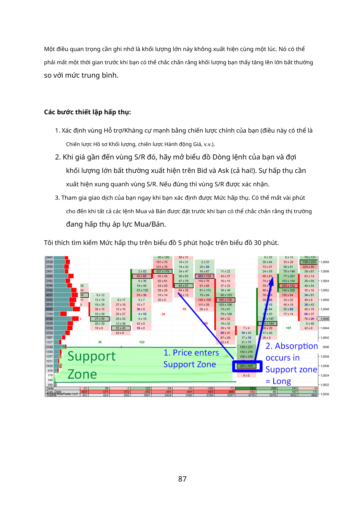

Một điều quan trọng cần ghi nhớ là khối lượng lớn này không xuất hiện cùng một lúc. Nó có thể
phải mất một thời gian trước khi bạn có thể chắc chắn rằng khối lượng bạn thấy tăng lên lớn bất thường
so với mức trung bình.
Các bước thiết lập hấp thụ:
1. Xác định vùng Hỗ trợ/Kháng cự mạnh bằng chiến lược chính của bạn (điều này có thể là
Chiến lược Hồ sơ Khối lượng, chiến lược Hành động Giá, v.v.).
2. Khi giá gần đến vùng S/R đó, hãy mở biểu đồ Dòng lệnh của bạn và đợi
khối lượng lớn bất thường xuất hiện trên Bid và Ask (cả hai!). Sự hấp thụ cần
xuất hiện xung quanh vùng S/R. Nếu đúng thì vùng S/R được xác nhận.
3. Tham gia giao dịch của bạn ngay khi bạn xác định được Mức hấp thụ. Có thể mất vài phút
cho đến khi tất cả các lệnh Mua và Bán được đặt trước khi bạn có thể chắc chắn rằng thị trường
đang hấp thụ áp lực Mua/Bán.
Tôi thích tìm kiếm Mức hấp thụ trên biểu đồ 5 phút hoặc trên biểu đồ 30 phút.
87

## Trang 89
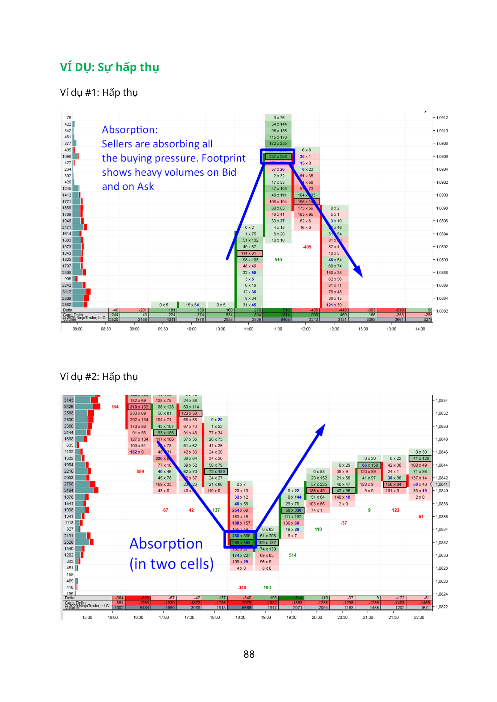

VÍ DỤ: Sự hấp thụ
Ví dụ #1: Hấp thụ
Ví dụ #2: Hấp thụ
88

## Trang 90
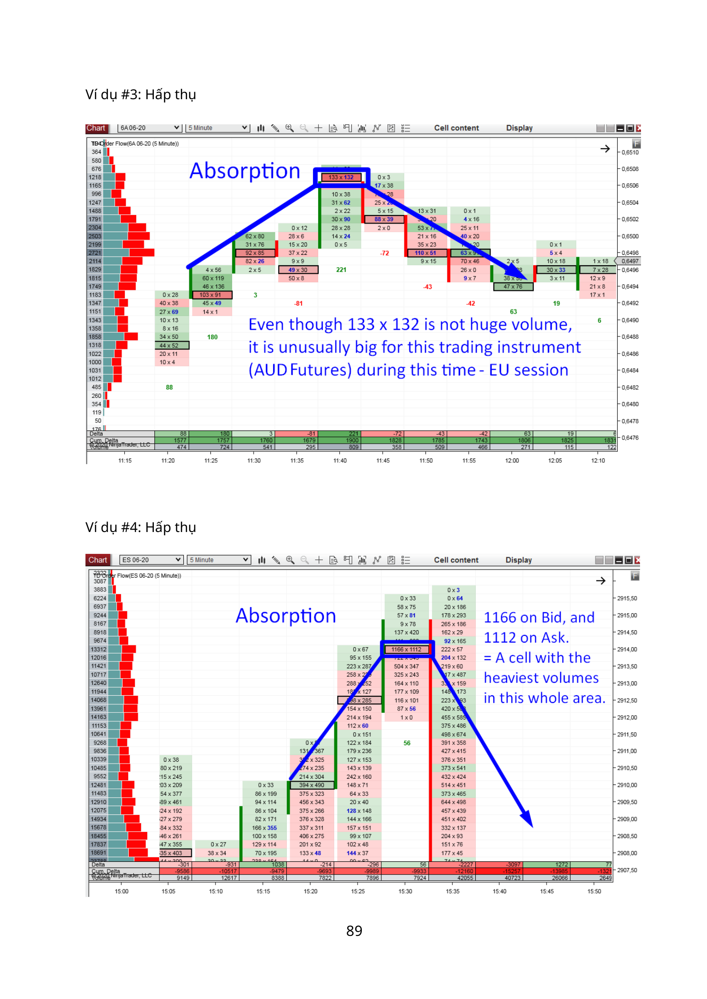

Ví dụ #3: Hấp thụ
Ví dụ #4: Hấp thụ
89

## Trang 91
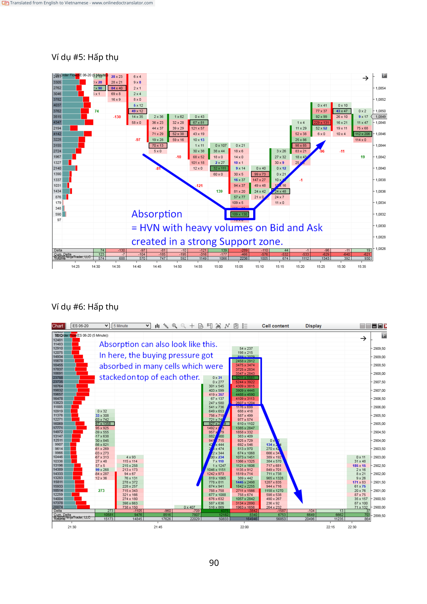

Ví dụ #5: Hấp thụ
Ví dụ #6: Hấp thụ
90

## Trang 92
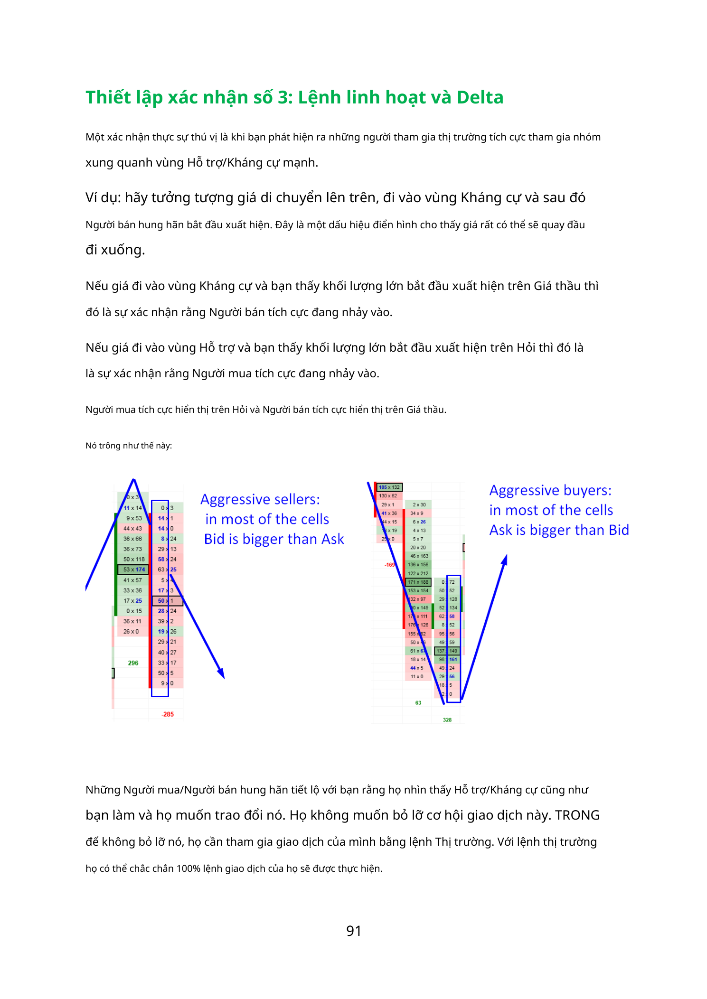

Thiết lập xác nhận số 3: Lệnh linh hoạt và Delta
Một xác nhận thực sự thú vị là khi bạn phát hiện ra những người tham gia thị trường tích cực tham gia nhóm
xung quanh vùng Hỗ trợ/Kháng cự mạnh.
Ví dụ: hãy tưởng tượng giá di chuyển lên trên, đi vào vùng Kháng cự và sau đó
Người bán hung hãn bắt đầu xuất hiện. Đây là một dấu hiệu điển hình cho thấy giá rất có thể sẽ quay đầu
đi xuống.
Nếu giá đi vào vùng Kháng cự và bạn thấy khối lượng lớn bắt đầu xuất hiện trên Giá thầu thì
đó là sự xác nhận rằng Người bán tích cực đang nhảy vào.
Nếu giá đi vào vùng Hỗ trợ và bạn thấy khối lượng lớn bắt đầu xuất hiện trên Hỏi thì đó là
là sự xác nhận rằng Người mua tích cực đang nhảy vào.
Người mua tích cực hiển thị trên Hỏi và Người bán tích cực hiển thị trên Giá thầu.
Nó trông như thế này:
Những Người mua/Người bán hung hãn tiết lộ với bạn rằng họ nhìn thấy Hỗ trợ/Kháng cự cũng như
bạn làm và họ muốn trao đổi nó. Họ không muốn bỏ lỡ cơ hội giao dịch này. TRONG
để không bỏ lỡ nó, họ cần tham gia giao dịch của mình bằng lệnh Thị trường. Với lệnh thị trường
họ có thể chắc chắn 100% lệnh giao dịch của họ sẽ được thực hiện.
91

## Trang 93
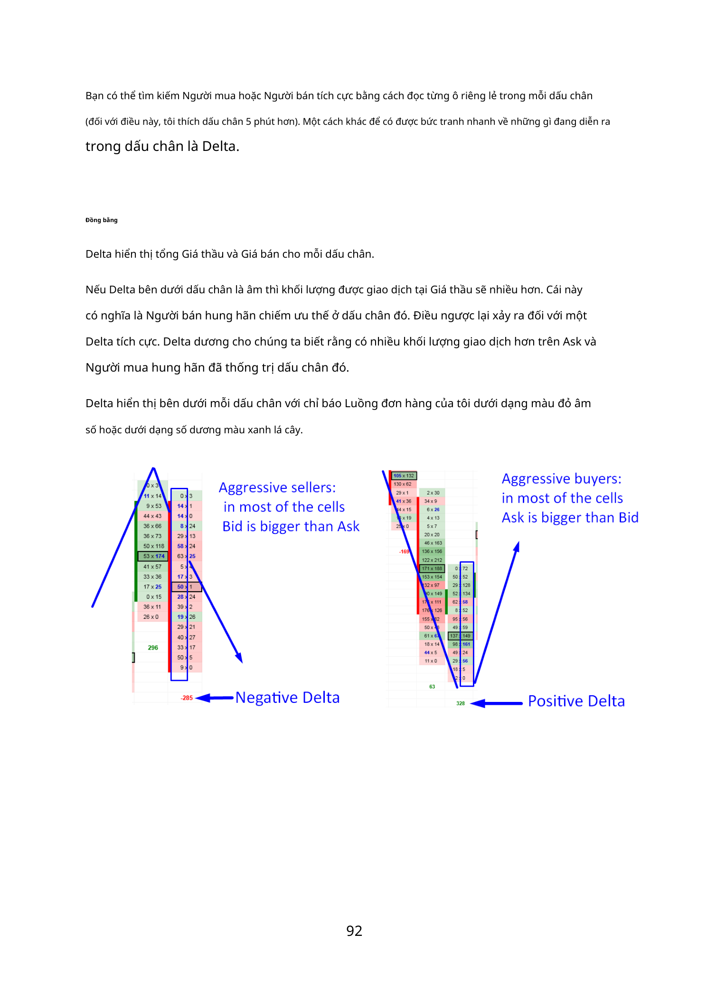

Bạn có thể tìm kiếm Người mua hoặc Người bán tích cực bằng cách đọc từng ô riêng lẻ trong mỗi dấu chân
(đối với điều này, tôi thích dấu chân 5 phút hơn). Một cách khác để có được bức tranh nhanh về những gì đang diễn ra
trong dấu chân là Delta.
Đồng bằng
Delta hiển thị tổng Giá thầu và Giá bán cho mỗi dấu chân.
Nếu Delta bên dưới dấu chân là âm thì khối lượng được giao dịch tại Giá thầu sẽ nhiều hơn. Cái này
có nghĩa là Người bán hung hãn chiếm ưu thế ở dấu chân đó. Điều ngược lại xảy ra đối với một
Delta tích cực. Delta dương cho chúng ta biết rằng có nhiều khối lượng giao dịch hơn trên Ask và
Người mua hung hãn đã thống trị dấu chân đó.
Delta hiển thị bên dưới mỗi dấu chân với chỉ báo Luồng đơn hàng của tôi dưới dạng màu đỏ âm
số hoặc dưới dạng số dương màu xanh lá cây.
92

## Trang 94
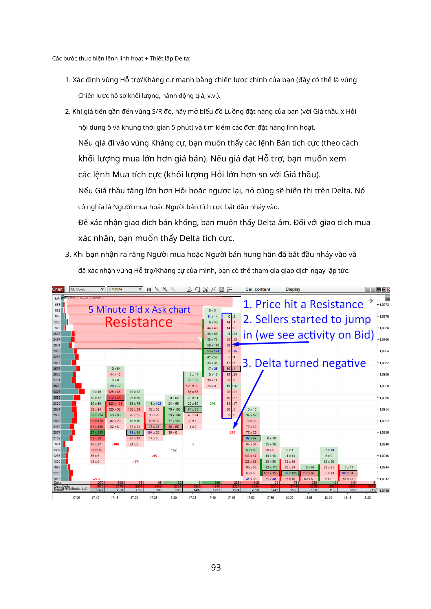

Các bước thực hiện lệnh linh hoạt + Thiết lập Delta:
1. Xác định vùng Hỗ trợ/Kháng cự mạnh bằng chiến lược chính của bạn (đây có thể là vùng
Chiến lược hồ sơ khối lượng, hành động giá, v.v.).
2. Khi giá tiến gần đến vùng S/R đó, hãy mở biểu đồ Luồng đặt hàng của bạn (với Giá thầu x Hỏi
nội dung ô và khung thời gian 5 phút) và tìm kiếm các đơn đặt hàng linh hoạt.
Nếu giá đi vào vùng Kháng cự, bạn muốn thấy các lệnh Bán tích cực (theo cách
khối lượng mua lớn hơn giá bán). Nếu giá đạt Hỗ trợ, bạn muốn xem
các lệnh Mua tích cực (khối lượng Hỏi lớn hơn so với Giá thầu).
Nếu Giá thầu tăng lớn hơn Hỏi hoặc ngược lại, nó cũng sẽ hiển thị trên Delta. Nó
có nghĩa là Người mua hoặc Người bán tích cực bắt đầu nhảy vào.
Để xác nhận giao dịch bán khống, bạn muốn thấy Delta âm. Đối với giao dịch mua
xác nhận, bạn muốn thấy Delta tích cực.
3. Khi bạn nhận ra rằng Người mua hoặc Người bán hung hãn đã bắt đầu nhảy vào và
đã xác nhận vùng Hỗ trợ/Kháng cự của mình, bạn có thể tham gia giao dịch ngay lập tức.
93

## Trang 95
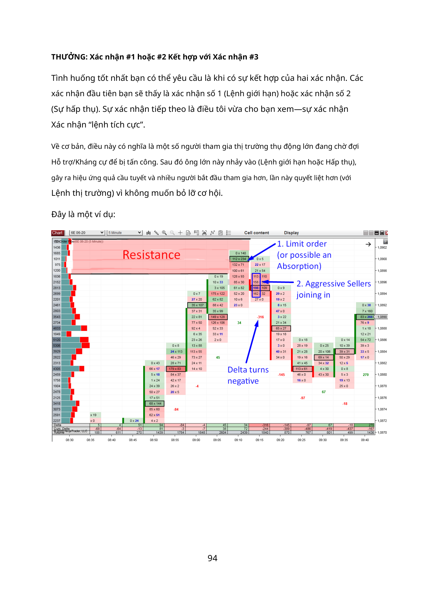

THƯỞNG: Xác nhận #1 hoặc #2 Kết hợp với Xác nhận #3
Tình huống tốt nhất bạn có thể yêu cầu là khi có sự kết hợp của hai xác nhận. Các
xác nhận đầu tiên bạn sẽ thấy là xác nhận số 1 (Lệnh giới hạn) hoặc xác nhận số 2
(Sự hấp thụ). Sự xác nhận tiếp theo là điều tôi vừa cho bạn xem—sự xác nhận
Xác nhận “lệnh tích cực”.
Về cơ bản, điều này có nghĩa là một số người tham gia thị trường thụ động lớn đang chờ đợi
Hỗ trợ/Kháng cự để bị tấn công. Sau đó ông lớn này nhảy vào (Lệnh giới hạn hoặc Hấp thụ),
gây ra hiệu ứng quả cầu tuyết và nhiều người bắt đầu tham gia hơn, lần này quyết liệt hơn (với
Lệnh thị trường) vì không muốn bỏ lỡ cơ hội.
Đây là một ví dụ:
94

## Trang 96
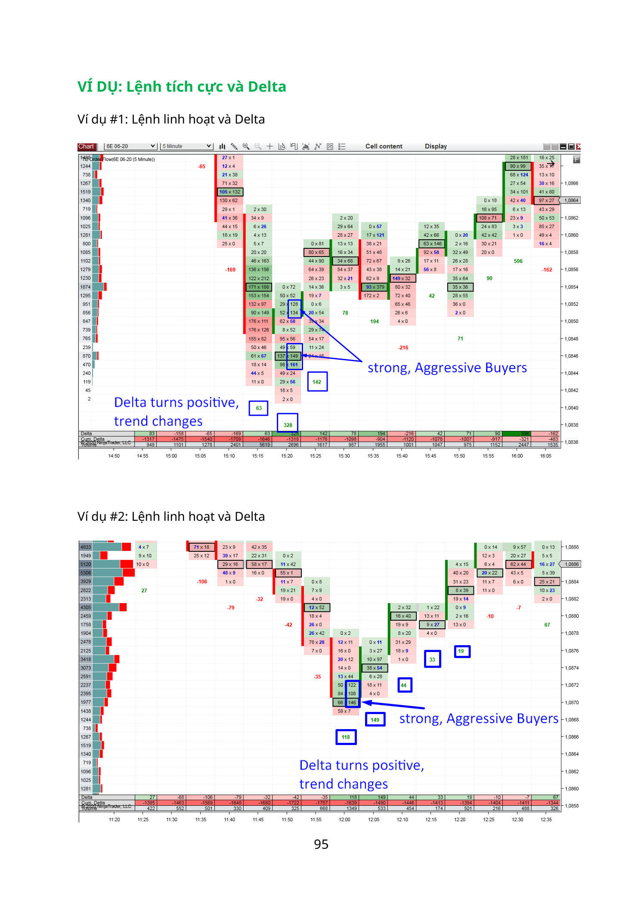

VÍ DỤ: Lệnh tích cực và Delta
Ví dụ #1: Lệnh linh hoạt và Delta
Ví dụ #2: Lệnh linh hoạt và Delta
95

## Trang 97
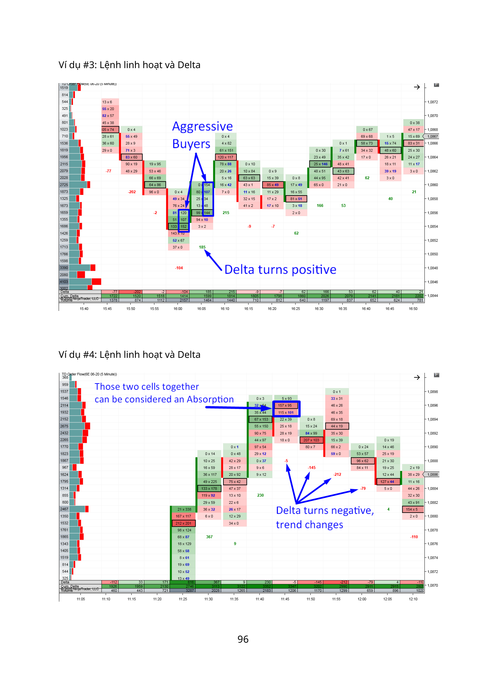

Ví dụ #3: Lệnh linh hoạt và Delta
Ví dụ #4: Lệnh linh hoạt và Delta
96

## Trang 98
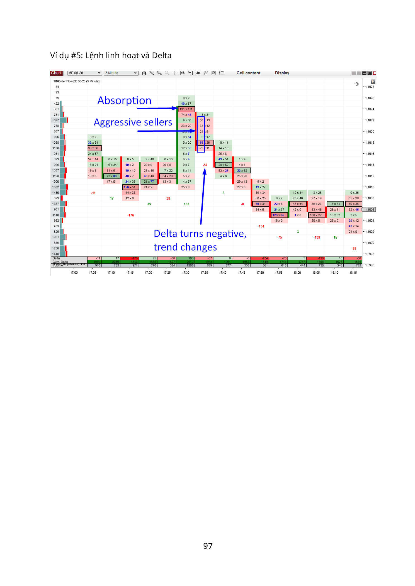

Ví dụ #5: Lệnh linh hoạt và Delta
97

## Trang 99
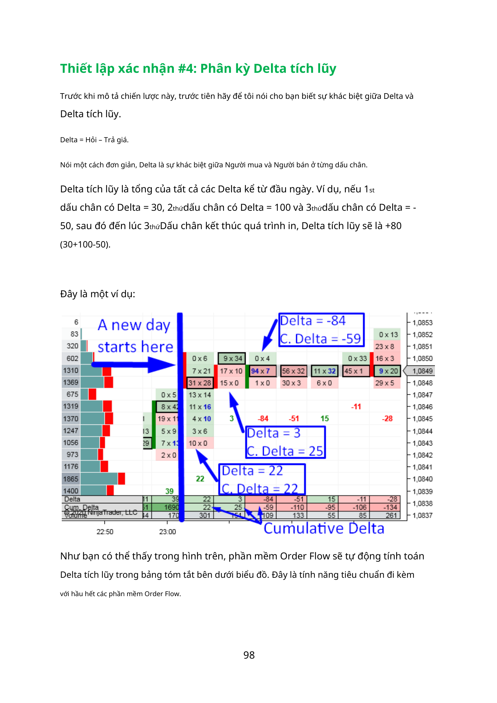

Thiết lập xác nhận #4: Phân kỳ Delta tích lũy
Trước khi mô tả chiến lược này, trước tiên hãy để tôi nói cho bạn biết sự khác biệt giữa Delta và
Delta tích lũy.
Delta = Hỏi – Trả giá.
Nói một cách đơn giản, Delta là sự khác biệt giữa Người mua và Người bán ở từng dấu chân.
Delta tích lũy là tổng của tất cả các Delta kể từ đầu ngày. Ví dụ, nếu 1st
dấu chân có Delta = 30, 2thứdấu chân có Delta = 100 và 3thứdấu chân có Delta = -
50, sau đó đến lúc 3thứDấu chân kết thúc quá trình in, Delta tích lũy sẽ là +80
(30+100-50).
Đây là một ví dụ:
Như bạn có thể thấy trong hình trên, phần mềm Order Flow sẽ tự động tính toán
Delta tích lũy trong bảng tóm tắt bên dưới biểu đồ. Đây là tính năng tiêu chuẩn đi kèm
với hầu hết các phần mềm Order Flow.
98

## Trang 100
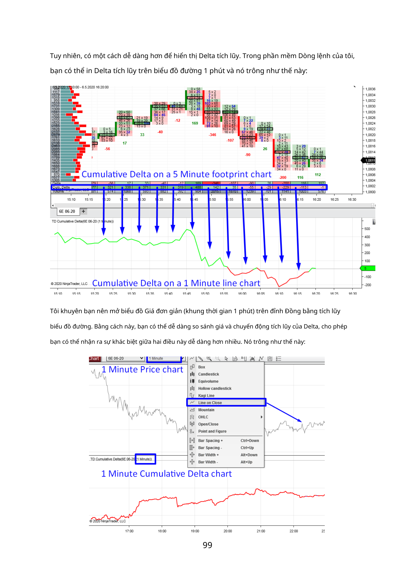

Tuy nhiên, có một cách dễ dàng hơn để hiển thị Delta tích lũy. Trong phần mềm Dòng lệnh của tôi,
bạn có thể in Delta tích lũy trên biểu đồ đường 1 phút và nó trông như thế này:
Tôi khuyên bạn nên mở biểu đồ Giá đơn giản (khung thời gian 1 phút) trên đỉnh Đồng bằng tích lũy
biểu đồ đường. Bằng cách này, bạn có thể dễ dàng so sánh giá và chuyển động tích lũy của Delta, cho phép
bạn có thể nhận ra sự khác biệt giữa hai điều này dễ dàng hơn nhiều. Nó trông như thế này:
99

## Trang 101
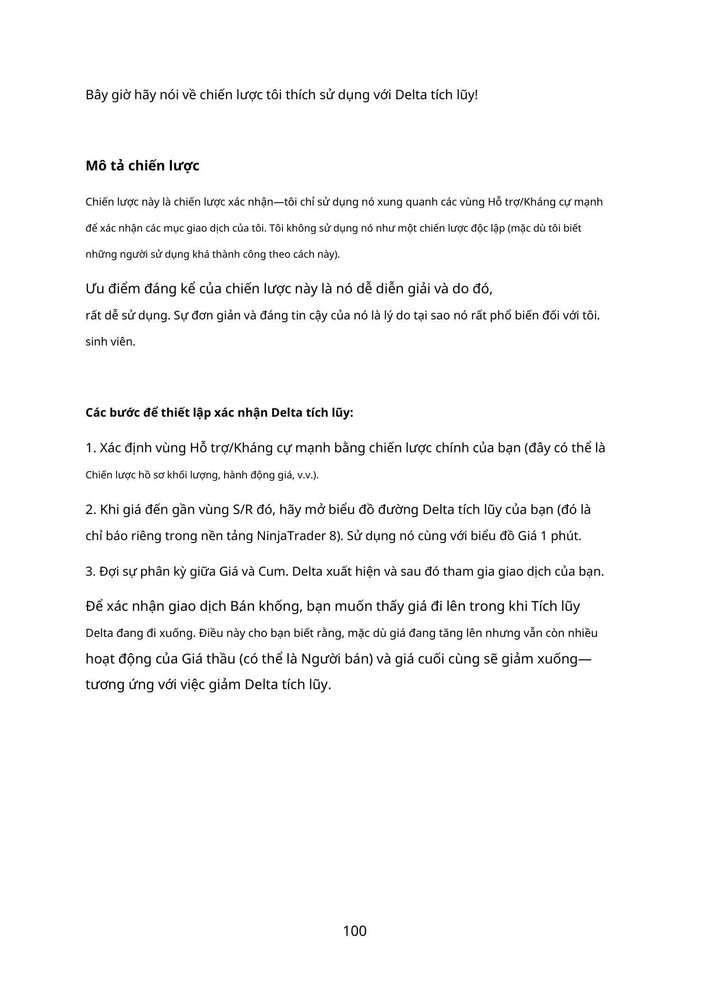

Bây giờ hãy nói về chiến lược tôi thích sử dụng với Delta tích lũy!
Mô tả chiến lược
Chiến lược này là chiến lược xác nhận—tôi chỉ sử dụng nó xung quanh các vùng Hỗ trợ/Kháng cự mạnh
để xác nhận các mục giao dịch của tôi. Tôi không sử dụng nó như một chiến lược độc lập (mặc dù tôi biết
những người sử dụng khá thành công theo cách này).
Ưu điểm đáng kể của chiến lược này là nó dễ diễn giải và do đó,
rất dễ sử dụng. Sự đơn giản và đáng tin cậy của nó là lý do tại sao nó rất phổ biến đối với tôi.
sinh viên.
Các bước để thiết lập xác nhận Delta tích lũy:
1. Xác định vùng Hỗ trợ/Kháng cự mạnh bằng chiến lược chính của bạn (đây có thể là
Chiến lược hồ sơ khối lượng, hành động giá, v.v.).
2. Khi giá đến gần vùng S/R đó, hãy mở biểu đồ đường Delta tích lũy của bạn (đó là
chỉ báo riêng trong nền tảng NinjaTrader 8). Sử dụng nó cùng với biểu đồ Giá 1 phút.
3. Đợi sự phân kỳ giữa Giá và Cum. Delta xuất hiện và sau đó tham gia giao dịch của bạn.
Để xác nhận giao dịch Bán khống, bạn muốn thấy giá đi lên trong khi Tích lũy
Delta đang đi xuống. Điều này cho bạn biết rằng, mặc dù giá đang tăng lên nhưng vẫn còn nhiều
hoạt động của Giá thầu (có thể là Người bán) và giá cuối cùng sẽ giảm xuống—
tương ứng với việc giảm Delta tích lũy.
100

## Trang 102
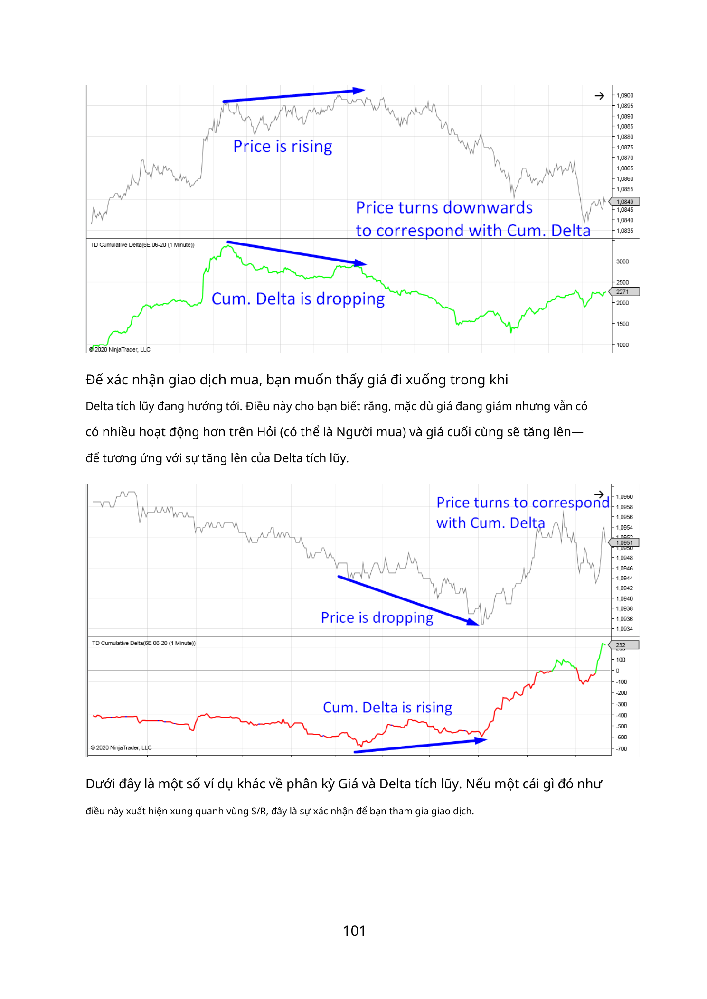

Để xác nhận giao dịch mua, bạn muốn thấy giá đi xuống trong khi
Delta tích lũy đang hướng tới. Điều này cho bạn biết rằng, mặc dù giá đang giảm nhưng vẫn có
có nhiều hoạt động hơn trên Hỏi (có thể là Người mua) và giá cuối cùng sẽ tăng lên—
để tương ứng với sự tăng lên của Delta tích lũy.
Dưới đây là một số ví dụ khác về phân kỳ Giá và Delta tích lũy. Nếu một cái gì đó như
điều này xuất hiện xung quanh vùng S/R, đây là sự xác nhận để bạn tham gia giao dịch.
101

## Trang 103
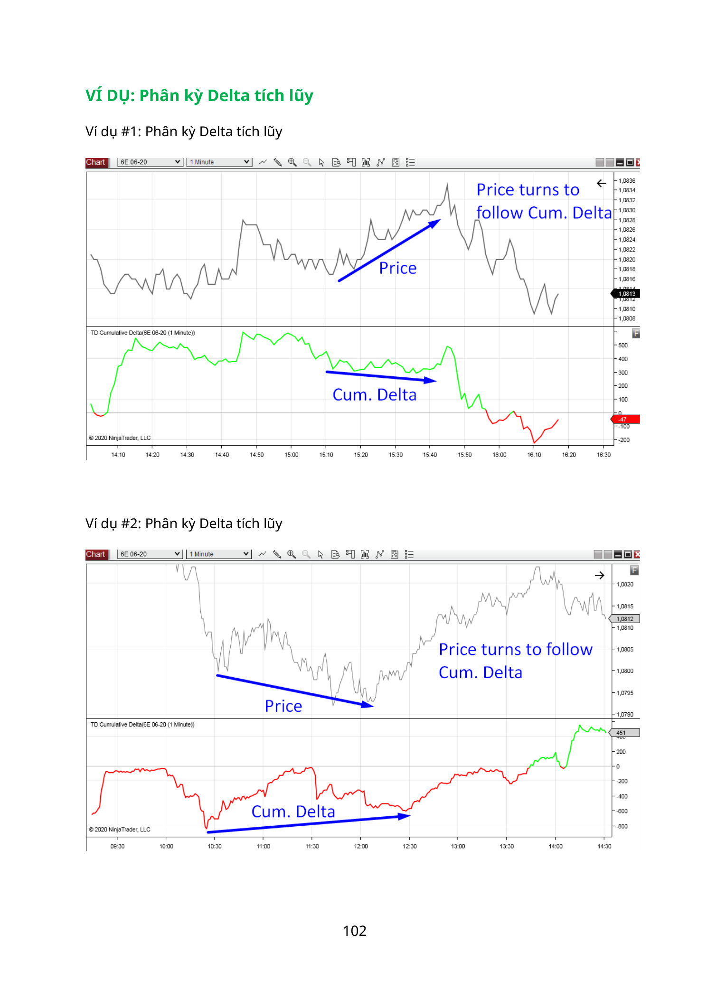

VÍ DỤ: Phân kỳ Delta tích lũy
Ví dụ #1: Phân kỳ Delta tích lũy
Ví dụ #2: Phân kỳ Delta tích lũy
102

## Trang 104
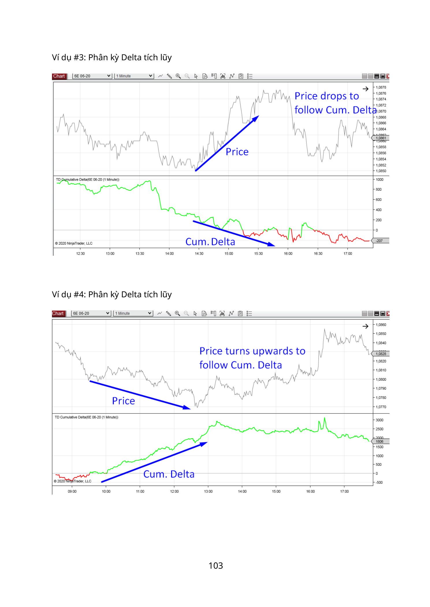

Ví dụ #3: Phân kỳ Delta tích lũy
Ví dụ #4: Phân kỳ Delta tích lũy
103

## Trang 105
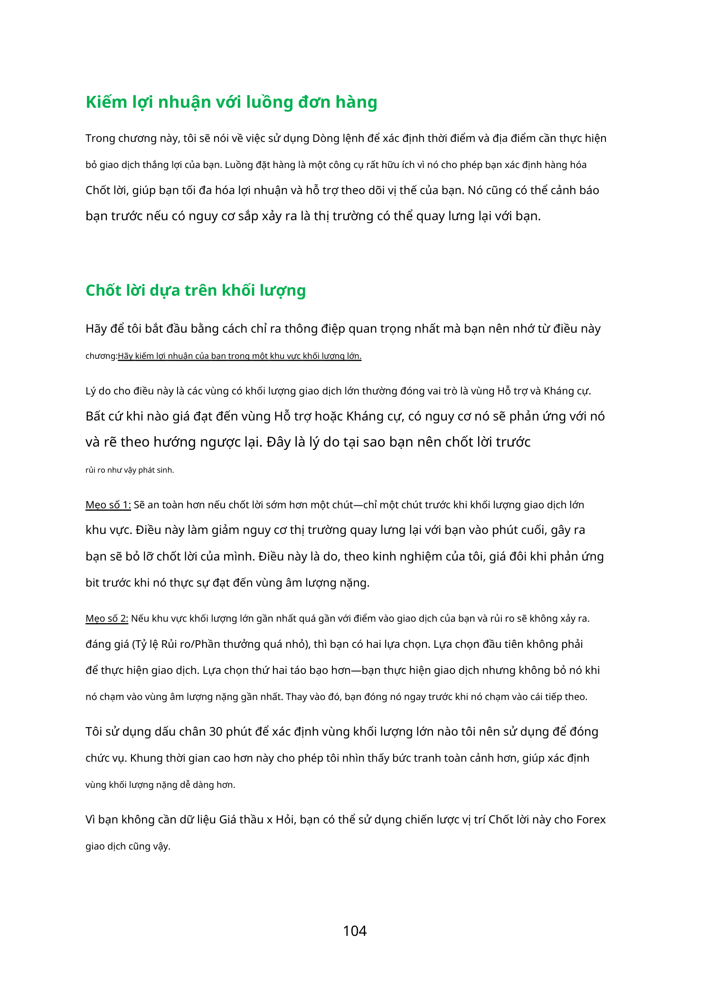

Kiếm lợi nhuận với luồng đơn hàng
Trong chương này, tôi sẽ nói về việc sử dụng Dòng lệnh để xác định thời điểm và địa điểm cần thực hiện
bỏ giao dịch thắng lợi của bạn. Luồng đặt hàng là một công cụ rất hữu ích vì nó cho phép bạn xác định hàng hóa
Chốt lời, giúp bạn tối đa hóa lợi nhuận và hỗ trợ theo dõi vị thế của bạn. Nó cũng có thể cảnh báo
bạn trước nếu có nguy cơ sắp xảy ra là thị trường có thể quay lưng lại với bạn.
Chốt lời dựa trên khối lượng
Hãy để tôi bắt đầu bằng cách chỉ ra thông điệp quan trọng nhất mà bạn nên nhớ từ điều này
chương:Hãy kiếm lợi nhuận của bạn trong một khu vực khối lượng lớn.
Lý do cho điều này là các vùng có khối lượng giao dịch lớn thường đóng vai trò là vùng Hỗ trợ và Kháng cự.
Bất cứ khi nào giá đạt đến vùng Hỗ trợ hoặc Kháng cự, có nguy cơ nó sẽ phản ứng với nó
và rẽ theo hướng ngược lại. Đây là lý do tại sao bạn nên chốt lời trước
rủi ro như vậy phát sinh.
Mẹo số 1: Sẽ an toàn hơn nếu chốt lời sớm hơn một chút—chỉ một chút trước khi khối lượng giao dịch lớn
khu vực. Điều này làm giảm nguy cơ thị trường quay lưng lại với bạn vào phút cuối, gây ra
bạn sẽ bỏ lỡ chốt lời của mình. Điều này là do, theo kinh nghiệm của tôi, giá đôi khi phản ứng
bit trước khi nó thực sự đạt đến vùng âm lượng nặng.
Mẹo số 2: Nếu khu vực khối lượng lớn gần nhất quá gần với điểm vào giao dịch của bạn và rủi ro sẽ không xảy ra.
đáng giá (Tỷ lệ Rủi ro/Phần thưởng quá nhỏ), thì bạn có hai lựa chọn. Lựa chọn đầu tiên không phải
để thực hiện giao dịch. Lựa chọn thứ hai táo bạo hơn—bạn thực hiện giao dịch nhưng không bỏ nó khi
nó chạm vào vùng âm lượng nặng gần nhất. Thay vào đó, bạn đóng nó ngay trước khi nó chạm vào cái tiếp theo.
Tôi sử dụng dấu chân 30 phút để xác định vùng khối lượng lớn nào tôi nên sử dụng để đóng
chức vụ. Khung thời gian cao hơn này cho phép tôi nhìn thấy bức tranh toàn cảnh hơn, giúp xác định
vùng khối lượng nặng dễ dàng hơn.
Vì bạn không cần dữ liệu Giá thầu x Hỏi, bạn có thể sử dụng chiến lược vị trí Chốt lời này cho Forex
giao dịch cũng vậy.
104

## Trang 106
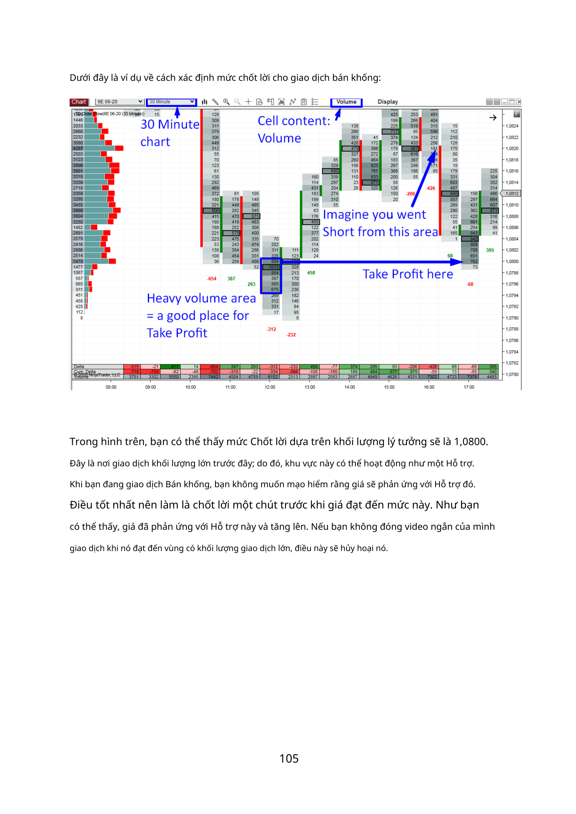

Dưới đây là ví dụ về cách xác định mức chốt lời cho giao dịch bán khống:
Trong hình trên, bạn có thể thấy mức Chốt lời dựa trên khối lượng lý tưởng sẽ là 1,0800.
Đây là nơi giao dịch khối lượng lớn trước đây; do đó, khu vực này có thể hoạt động như một Hỗ trợ.
Khi bạn đang giao dịch Bán khống, bạn không muốn mạo hiểm rằng giá sẽ phản ứng với Hỗ trợ đó.
Điều tốt nhất nên làm là chốt lời một chút trước khi giá đạt đến mức này. Như bạn
có thể thấy, giá đã phản ứng với Hỗ trợ này và tăng lên. Nếu bạn không đóng video ngắn của mình
giao dịch khi nó đạt đến vùng có khối lượng giao dịch lớn, điều này sẽ hủy hoại nó.
105

## Trang 107
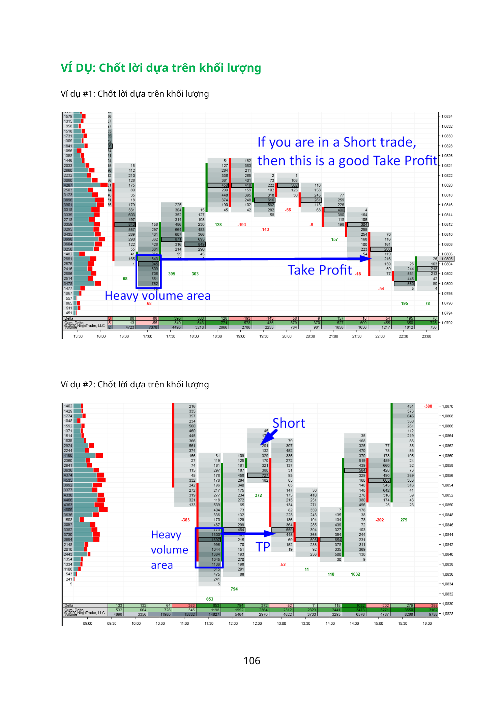

VÍ DỤ: Chốt lời dựa trên khối lượng
Ví dụ #1: Chốt lời dựa trên khối lượng
Ví dụ #2: Chốt lời dựa trên khối lượng
106

## Trang 108
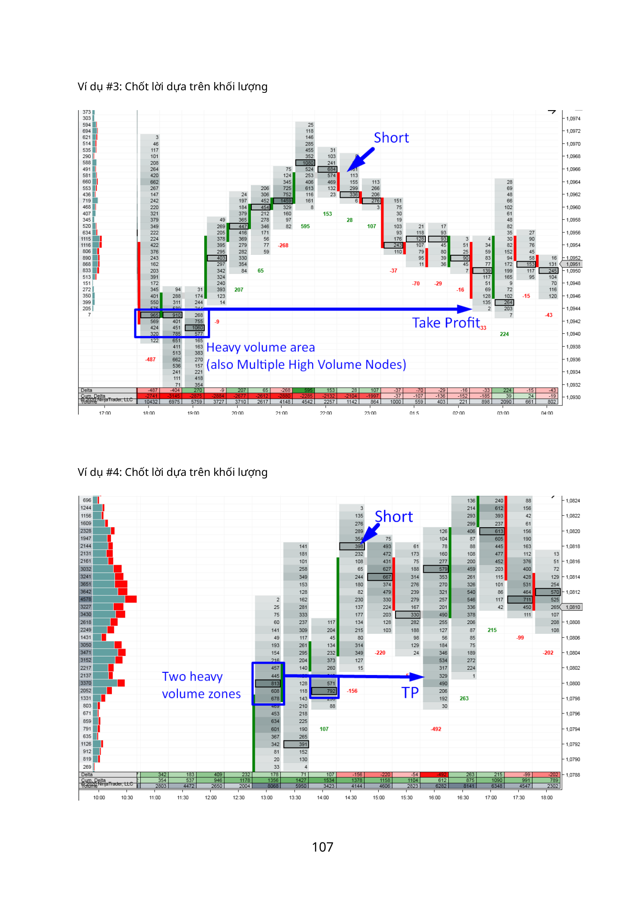

Ví dụ #3: Chốt lời dựa trên khối lượng
Ví dụ #4: Chốt lời dựa trên khối lượng
107

## Trang 109
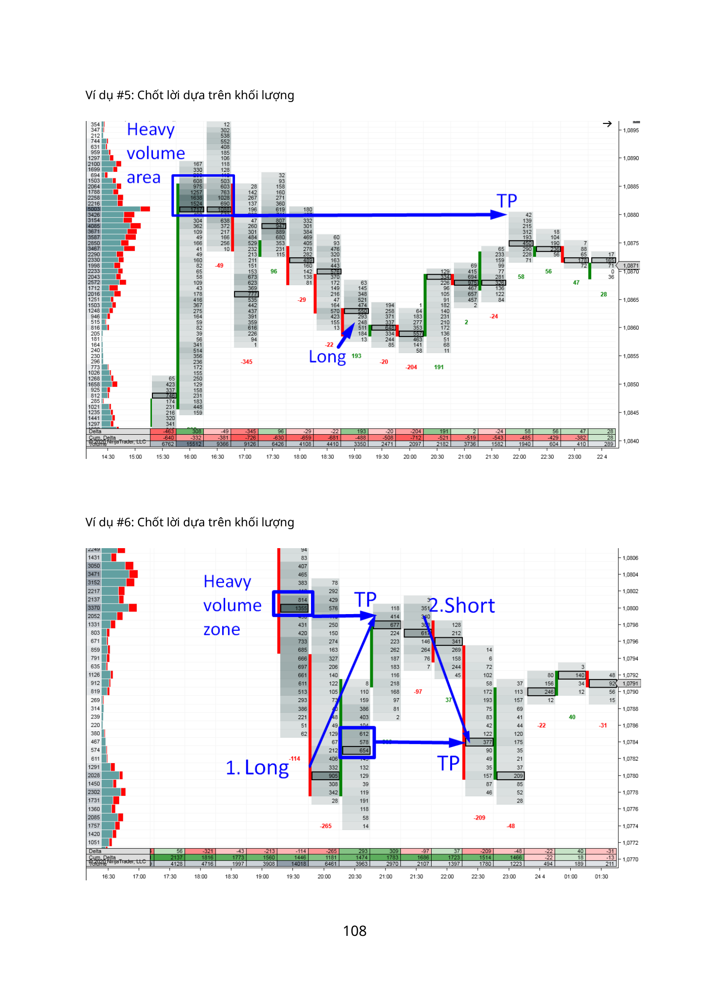

Ví dụ #5: Chốt lời dựa trên khối lượng
Ví dụ #6: Chốt lời dựa trên khối lượng
108

## Trang 110

Chốt lãi – Trailing
Đối với những người muốn theo dõi mức dừng lỗ của mình, phần này là dành cho bạn. Tham lam thường không
mang lại lợi nhuận trong giao dịch, nhưng nếu bạn học kỹ thuật Dòng lệnh này, nó sẽ giúp bạn nhận ra khi nào
bạn có đủ khả năng để tham lam.
Ý tưởng chính đằng sau việc theo dõi lệnh Cắt lỗ của bạn bằng Luồng lệnh là chỉ theo dõi nó khi bạn thấy
những người tham gia thị trường tích cực đứng về phía bạn.
Vì vậy, để theo dõi vị thế Mua của mình, bạn muốn thấy những Người mua tích cực. Tại sao lại bỏ giao dịch mua khi
Người mua hung hăng đang đẩy giá ngày càng cao hơn, phải không?
Điều tương tự, chỉ đảo ngược, áp dụng cho vị thế Bán: Bạn có thể theo dõi Bán khống của mình nếu có
Người bán tích cực chủ động đẩy giá xuống.
Làm thế nào bạn có thể biết liệu một bên của thị trường có mạnh mẽ hơn bên kia hay không? Dễ nhất
cách là tìm kiếm sự mất cân bằng. Khi bạn mua, bạn muốn xem Sự mất cân bằng mua. Khi
bạn là người Bán khống, bạn muốn xem Bán hàng mất cân đối.
Nếu giá tiếp tục di chuyển nhanh chóng và nó tạo ra sự mất cân bằng trên đường đi thì bạn có thể
theo dõi vị trí của bạn một số chi tiết.
Mất cân bằng = Dấu hiệu của người mua/người bán tích cực.
* Chỉ để làm mới trí nhớ của bạn: Nếu Giá thầu bằng 300% hoặc lớn hơn Giá bán thì đó là Bán
Mất cân bằng. Nó được đánh dấu màu xanh lam và hiển thị trên Giá thầu. Nếu Hỏi lớn hơn 300% so với Giá thầu,
thì đó là sự mất cân bằng mua hàng. Điều này cũng sẽ được đánh dấu màu xanh lam và nó hiển thị trên Hỏi.
109

## Trang 111
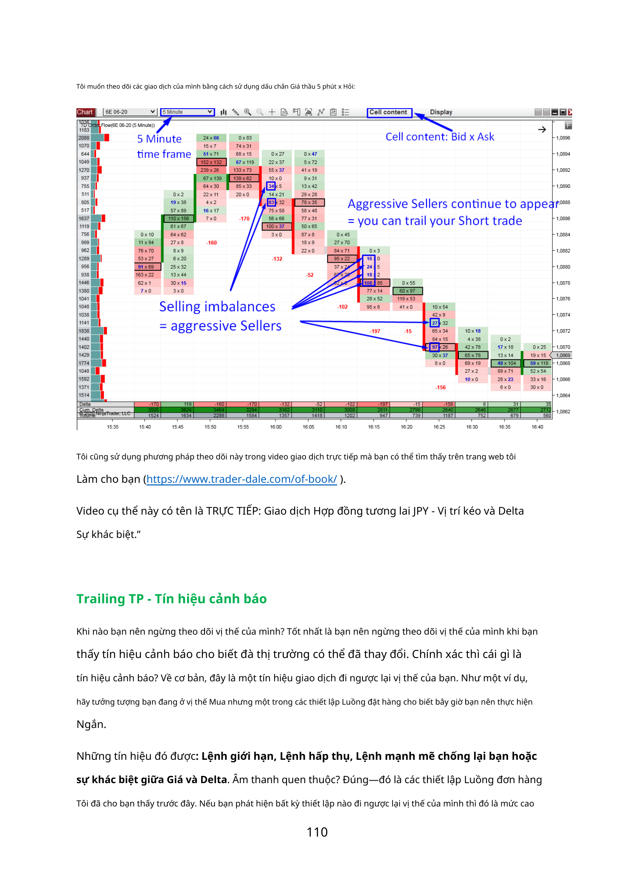

Tôi muốn theo dõi các giao dịch của mình bằng cách sử dụng dấu chân Giá thầu 5 phút x Hỏi:
Tôi cũng sử dụng phương pháp theo dõi này trong video giao dịch trực tiếp mà bạn có thể tìm thấy trên trang web tôi
Làm cho bạn (https://www.trader-dale.com/of-book/ ).
Video cụ thể này có tên là TRỰC TIẾP: Giao dịch Hợp đồng tương lai JPY - Vị trí kéo và Delta
Sự khác biệt.”
Trailing TP - Tín hiệu cảnh báo
Khi nào bạn nên ngừng theo dõi vị thế của mình? Tốt nhất là bạn nên ngừng theo dõi vị thế của mình khi bạn
thấy tín hiệu cảnh báo cho biết đà thị trường có thể đã thay đổi. Chính xác thì cái gì là
tín hiệu cảnh báo? Về cơ bản, đây là một tín hiệu giao dịch đi ngược lại vị thế của bạn. Như một ví dụ,
hãy tưởng tượng bạn đang ở vị thế Mua nhưng một trong các thiết lập Luồng đặt hàng cho biết bây giờ bạn nên thực hiện
Ngắn.
Những tín hiệu đó được: Lệnh giới hạn, Lệnh hấp thụ, Lệnh mạnh mẽ chống lại bạn hoặc
sự khác biệt giữa Giá và Delta. Âm thanh quen thuộc? Đúng—đó là các thiết lập Luồng đơn hàng
Tôi đã cho bạn thấy trước đây. Nếu bạn phát hiện bất kỳ thiết lập nào đi ngược lại vị thế của mình thì đó là mức cao
110

## Trang 112
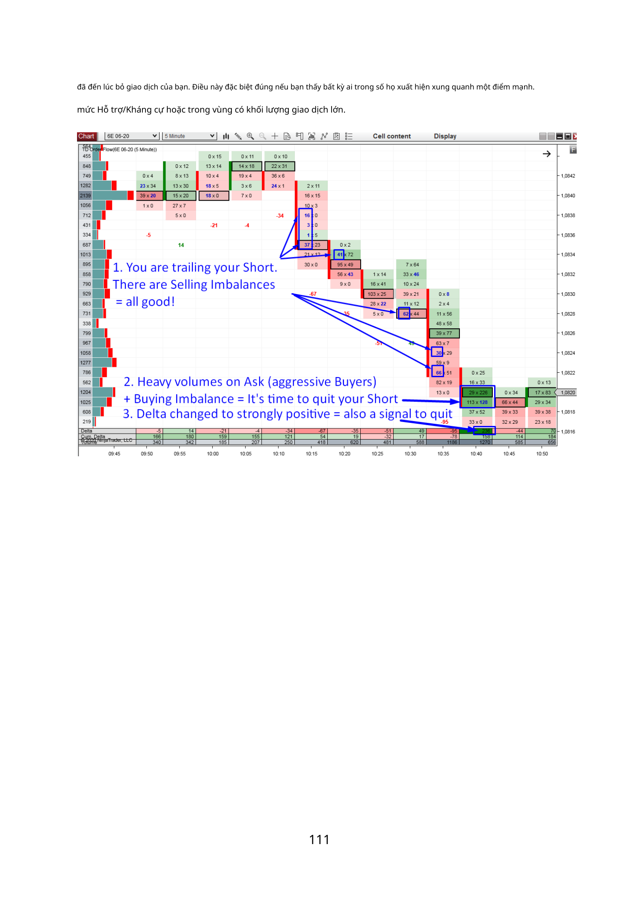

đã đến lúc bỏ giao dịch của bạn. Điều này đặc biệt đúng nếu bạn thấy bất kỳ ai trong số họ xuất hiện xung quanh một điểm mạnh.
mức Hỗ trợ/Kháng cự hoặc trong vùng có khối lượng giao dịch lớn.
111

## Trang 113
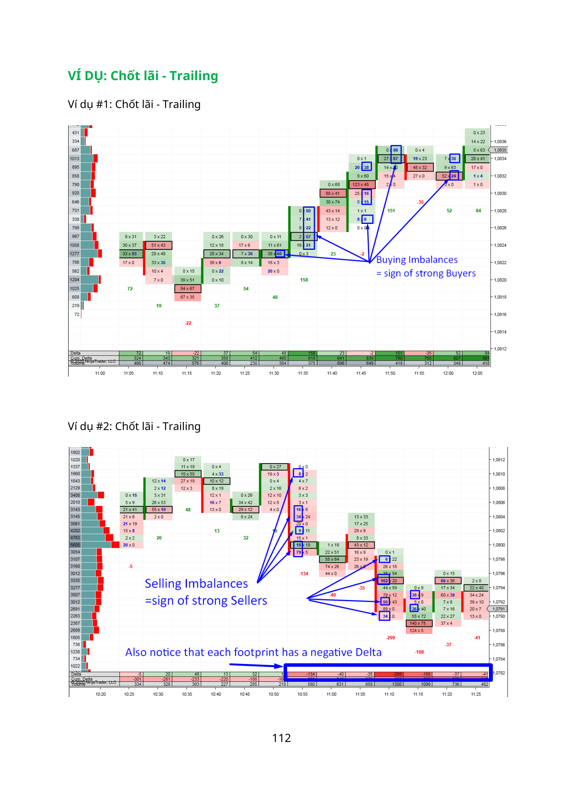

VÍ DỤ: Chốt lãi - Trailing
Ví dụ #1: Chốt lãi - Trailing
Ví dụ #2: Chốt lãi - Trailing
112

## Trang 114
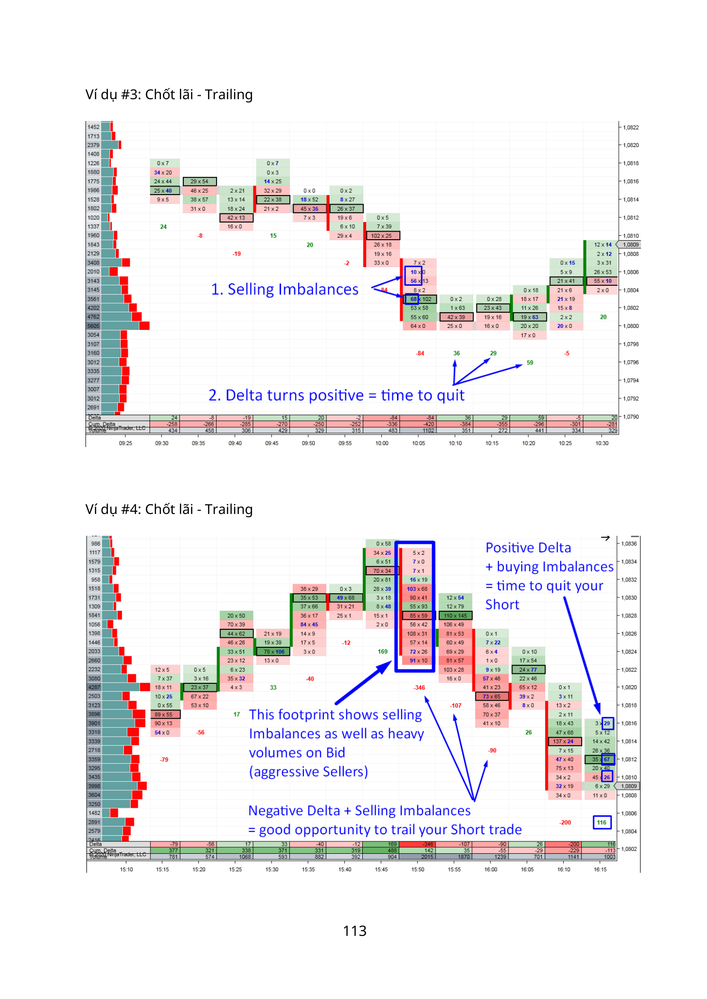

Ví dụ #3: Chốt lãi - Trailing
Ví dụ #4: Chốt lãi - Trailing
113

## Trang 115
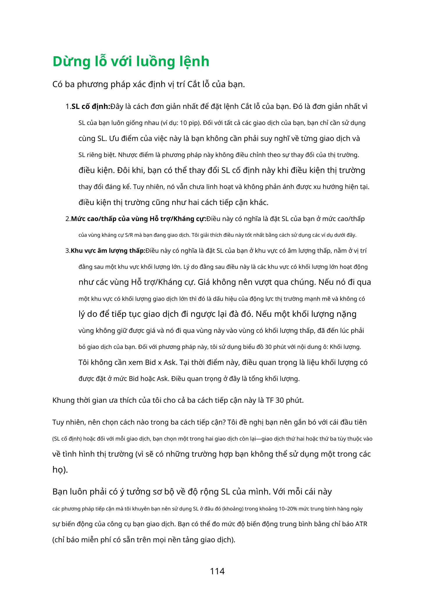

Dừng lỗ với luồng lệnh
Có ba phương pháp xác định vị trí Cắt lỗ của bạn.
1.SL cố định:Đây là cách đơn giản nhất để đặt lệnh Cắt lỗ của bạn. Đó là đơn giản nhất vì
SL của bạn luôn giống nhau (ví dụ: 10 pip). Đối với tất cả các giao dịch của bạn, bạn chỉ cần sử dụng
cùng SL. Ưu điểm của việc này là bạn không cần phải suy nghĩ về từng giao dịch và
SL riêng biệt. Nhược điểm là phương pháp này không điều chỉnh theo sự thay đổi của thị trường.
điều kiện. Đôi khi, bạn có thể thay đổi SL cố định này khi điều kiện thị trường
thay đổi đáng kể. Tuy nhiên, nó vẫn chưa linh hoạt và không phản ánh được xu hướng hiện tại.
điều kiện thị trường cũng như hai cách tiếp cận khác.
2.Mức cao/thấp của vùng Hỗ trợ/Kháng cự:Điều này có nghĩa là đặt SL của bạn ở mức cao/thấp
của vùng kháng cự S/R mà bạn đang giao dịch. Tôi giải thích điều này tốt nhất bằng cách sử dụng các ví dụ dưới đây.
3.Khu vực âm lượng thấp:Điều này có nghĩa là đặt SL của bạn ở khu vực có âm lượng thấp, nằm ở vị trí
đằng sau một khu vực khối lượng lớn. Lý do đằng sau điều này là các khu vực có khối lượng lớn hoạt động
như các vùng Hỗ trợ/Kháng cự. Giá không nên vượt qua chúng. Nếu nó đi qua
một khu vực có khối lượng giao dịch lớn thì đó là dấu hiệu của động lực thị trường mạnh mẽ và không có
lý do để tiếp tục giao dịch đi ngược lại đà đó. Nếu một khối lượng nặng
vùng không giữ được giá và nó đi qua vùng này vào vùng có khối lượng thấp, đã đến lúc phải
bỏ giao dịch của bạn. Đối với phương pháp này, tôi sử dụng biểu đồ 30 phút với nội dung ô: Khối lượng.
Tôi không cần xem Bid x Ask. Tại thời điểm này, điều quan trọng là liệu khối lượng có
được đặt ở mức Bid hoặc Ask. Điều quan trọng ở đây là tổng khối lượng.
Khung thời gian ưa thích của tôi cho cả ba cách tiếp cận này là TF 30 phút.
Tuy nhiên, nên chọn cách nào trong ba cách tiếp cận? Tôi đề nghị bạn nên gắn bó với cái đầu tiên
(SL cố định) hoặc đối với mỗi giao dịch, bạn chọn một trong hai giao dịch còn lại—giao dịch thứ hai hoặc thứ ba tùy thuộc vào
về tình hình thị trường (vì sẽ có những trường hợp bạn không thể sử dụng một trong các
họ).
Bạn luôn phải có ý tưởng sơ bộ về độ rộng SL của mình. Với mỗi cái này
các phương pháp tiếp cận mà tôi khuyên bạn nên sử dụng SL ở đâu đó (khoảng) trong khoảng 10–20% mức trung bình hàng ngày
sự biến động của công cụ bạn giao dịch. Bạn có thể đo mức độ biến động trung bình bằng chỉ báo ATR
(chỉ báo miễn phí có sẵn trên mọi nền tảng giao dịch).
114

## Trang 116
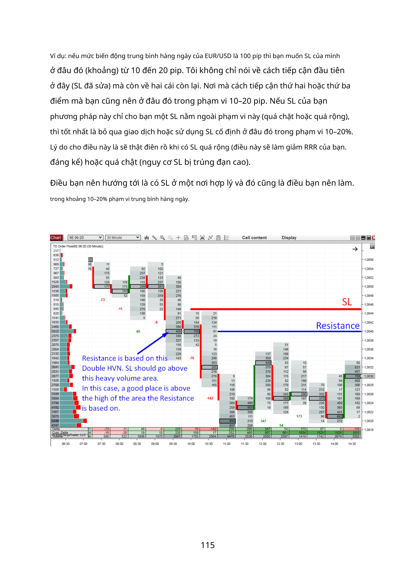

Ví dụ: nếu mức biến động trung bình hàng ngày của EUR/USD là 100 pip thì bạn muốn SL của mình
ở đâu đó (khoảng) từ 10 đến 20 pip. Tôi không chỉ nói về cách tiếp cận đầu tiên
ở đây (SL đã sửa) mà còn về hai cái còn lại. Nơi mà cách tiếp cận thứ hai hoặc thứ ba
điểm mà bạn cũng nên ở đâu đó trong phạm vi 10–20 pip. Nếu SL của bạn
phương pháp này chỉ cho bạn một SL nằm ngoài phạm vi này (quá chặt hoặc quá rộng),
thì tốt nhất là bỏ qua giao dịch hoặc sử dụng SL cố định ở đâu đó trong phạm vi 10–20%.
Lý do cho điều này là sẽ thật điên rồ khi có SL quá rộng (điều này sẽ làm giảm RRR của bạn.
đáng kể) hoặc quá chật (nguy cơ SL bị trúng đạn cao).
Điều bạn nên hướng tới là có SL ở một nơi hợp lý và đó cũng là điều bạn nên làm.
trong khoảng 10–20% phạm vi trung bình hàng ngày.
115

## Trang 117
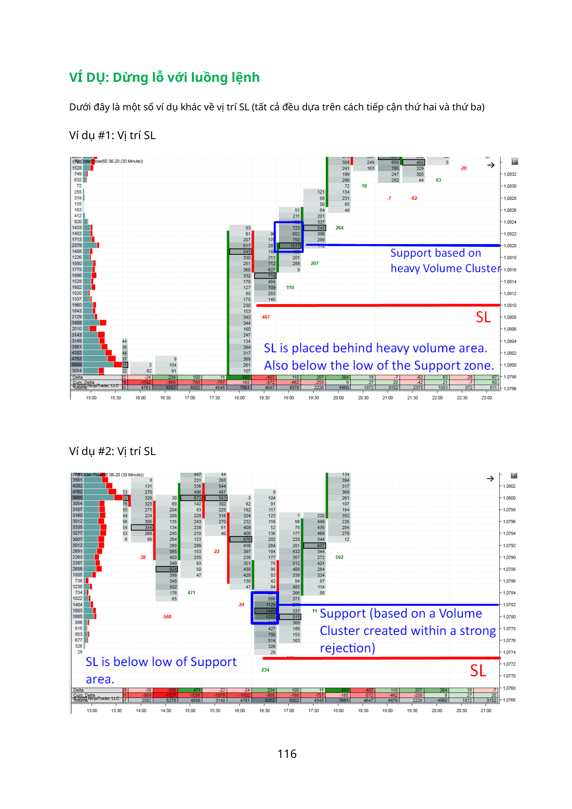

VÍ DỤ: Dừng lỗ với luồng lệnh
Dưới đây là một số ví dụ khác về vị trí SL (tất cả đều dựa trên cách tiếp cận thứ hai và thứ ba)
Ví dụ #1: Vị trí SL
Ví dụ #2: Vị trí SL
116

## Trang 118
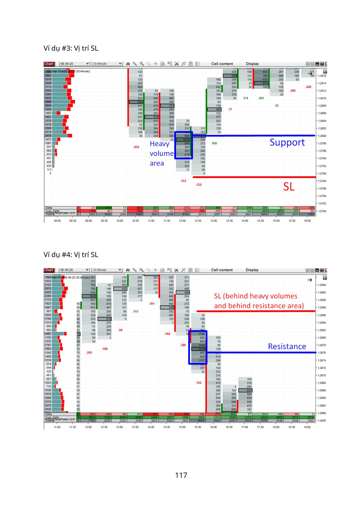

Ví dụ #3: Vị trí SL
Ví dụ #4: Vị trí SL
117

## Trang 119
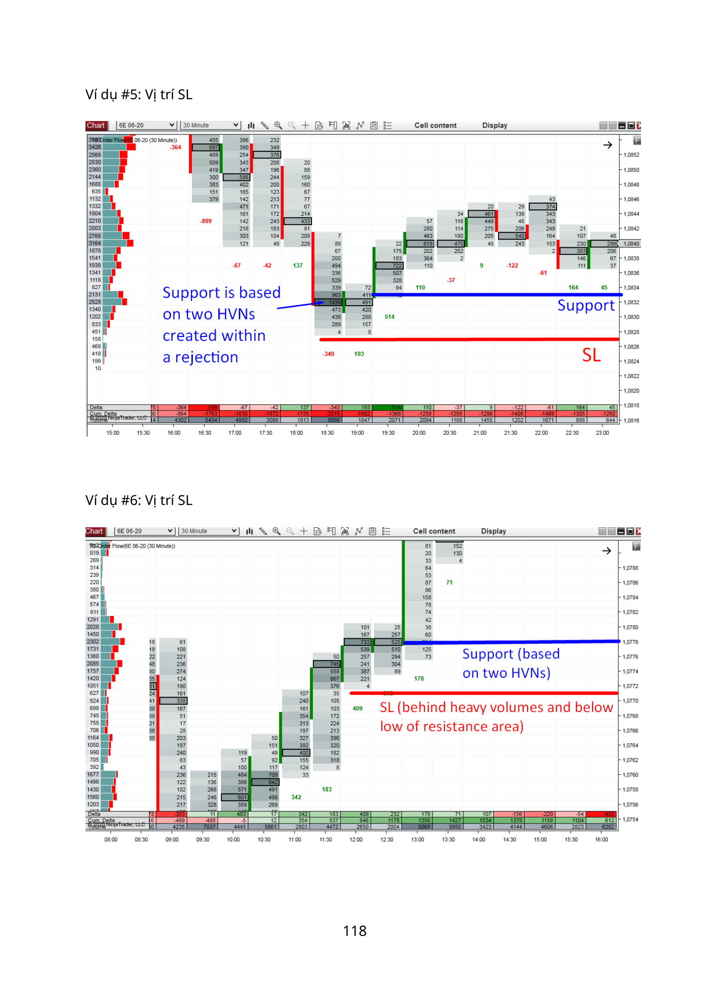

Ví dụ #5: Vị trí SL
Ví dụ #6: Vị trí SL
118

## Trang 120
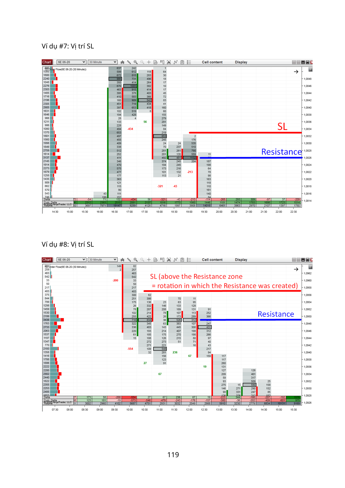

Ví dụ #7: Vị trí SL
Ví dụ #8: Vị trí SL
119

## Trang 121

Cách tìm mức hỗ trợ và kháng cự bằng hồ sơ
khối lượng
Giới thiệu hồ sơ khối lượng
Luồng đặt hàng là một công cụ tuyệt vời hoạt động tốt nếu bạn sử dụng nó xung quanh Hỗ trợ mạnh mẽ và
Các vùng kháng cự Bạn có thể sử dụng chiến lược xác nhận Luồng đơn hàng để biết liệu giá có
đang thực sự phản ứng với vùng S/R hoặc nếu vùng S/R có nhiều khả năng bị hỏng nhất.
Trong phần này tôi muốn chỉ cho bạn cách xác định mức Hỗ trợ và Kháng cự mạnh như vậy
vùng bằng công cụ yêu thích của tôi—Hồ sơ âm lượng.
Hồ sơ Khối lượng là công cụ yêu thích của tôi để xác định các vùng S/R mạnh vì nó có thể hiển thị cho bạn
bức tranh lớn hơn về những gì đang diễn ra trong biểu đồ. Điều này bổ sung cho Luồng đặt hàng,
hiển thị nhiều chi tiết hơn.
Trong các chương tiếp theo, tôi sẽ hướng dẫn bạn những kiến thức cơ bản về Hồ sơ Khối lượng và chỉ cho bạn thấy những kiến thức cơ bản của tôi.
thiết lập Hồ sơ Khối lượng yêu thích. Đó là những thiết lập mà bạn có thể sử dụng để xác định vùng S/R mạnh
từ đó bạn có thể giao dịch sau này bằng cách sử dụng thiết lập xác nhận Luồng đơn hàng.
ĐỊNH NGHĨA HỒ SƠ KHỐI LƯỢNG:Hồ sơ Khối lượng là một chỉ báo giao dịch hiển thị Khối lượng tại
Giá. Nó giúp xác định nơi các tổ chức tài chính lớn đặt tiền của họ và giúp
lộ ý định của họ.
120

## Trang 122
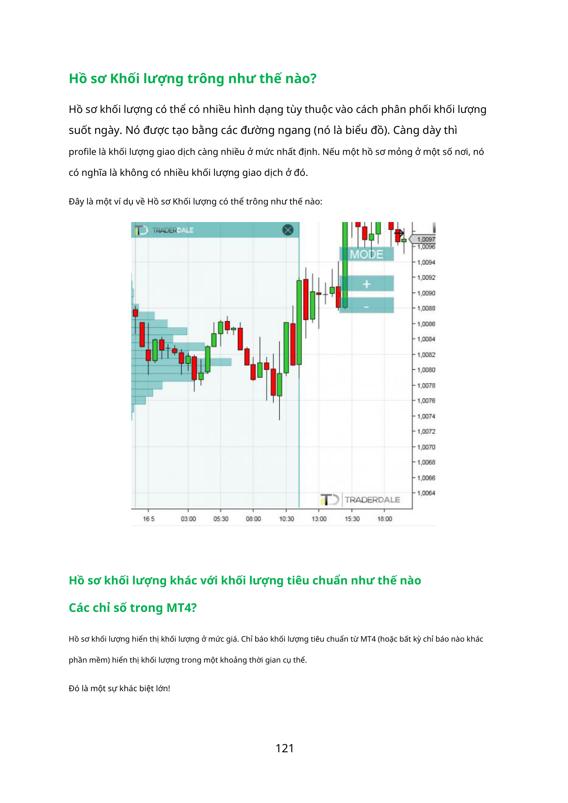

Hồ sơ Khối lượng trông như thế nào?
Hồ sơ khối lượng có thể có nhiều hình dạng tùy thuộc vào cách phân phối khối lượng
suốt ngày. Nó được tạo bằng các đường ngang (nó là biểu đồ). Càng dày thì
profile là khối lượng giao dịch càng nhiều ở mức nhất định. Nếu một hồ sơ mỏng ở một số nơi, nó
có nghĩa là không có nhiều khối lượng giao dịch ở đó.
Đây là một ví dụ về Hồ sơ Khối lượng có thể trông như thế nào:
Hồ sơ khối lượng khác với khối lượng tiêu chuẩn như thế nào
Các chỉ số trong MT4?
Hồ sơ khối lượng hiển thị khối lượng ở mức giá. Chỉ báo khối lượng tiêu chuẩn từ MT4 (hoặc bất kỳ chỉ báo nào khác
phần mềm) hiển thị khối lượng trong một khoảng thời gian cụ thể.
Đó là một sự khác biệt lớn!
121

## Trang 123
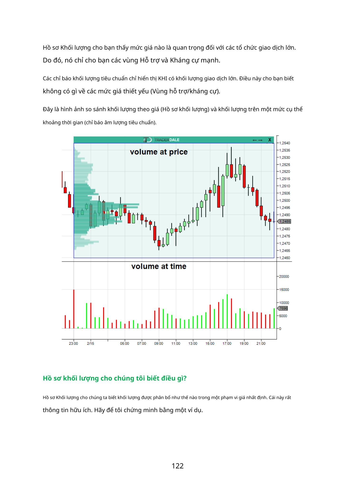

Hồ sơ Khối lượng cho bạn thấy mức giá nào là quan trọng đối với các tổ chức giao dịch lớn.
Do đó, nó chỉ cho bạn các vùng Hỗ trợ và Kháng cự mạnh.
Các chỉ báo khối lượng tiêu chuẩn chỉ hiển thị KHI có khối lượng giao dịch lớn. Điều này cho bạn biết
không có gì về các mức giá thiết yếu (Vùng hỗ trợ/kháng cự).
Đây là hình ảnh so sánh khối lượng theo giá (Hồ sơ khối lượng) và khối lượng trên một mức cụ thể
khoảng thời gian (chỉ báo âm lượng tiêu chuẩn).
Hồ sơ khối lượng cho chúng tôi biết điều gì?
Hồ sơ Khối lượng cho chúng ta biết khối lượng được phân bổ như thế nào trong một phạm vi giá nhất định. Cái này rất
thông tin hữu ích. Hãy để tôi chứng minh bằng một ví dụ.
122

## Trang 124
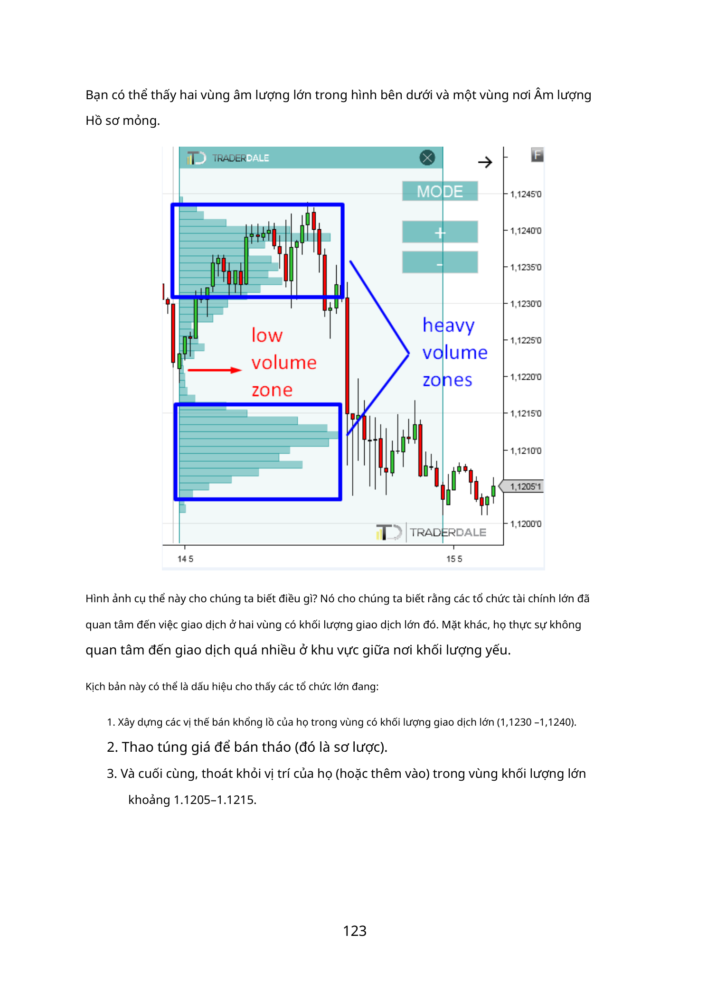

Bạn có thể thấy hai vùng âm lượng lớn trong hình bên dưới và một vùng nơi Âm lượng
Hồ sơ mỏng.
Hình ảnh cụ thể này cho chúng ta biết điều gì? Nó cho chúng ta biết rằng các tổ chức tài chính lớn đã
quan tâm đến việc giao dịch ở hai vùng có khối lượng giao dịch lớn đó. Mặt khác, họ thực sự không
quan tâm đến giao dịch quá nhiều ở khu vực giữa nơi khối lượng yếu.
Kịch bản này có thể là dấu hiệu cho thấy các tổ chức lớn đang:
1. Xây dựng các vị thế bán khổng lồ của họ trong vùng có khối lượng giao dịch lớn (1,1230 –1,1240).
2. Thao túng giá để bán tháo (đó là sơ lược).
3. Và cuối cùng, thoát khỏi vị trí của họ (hoặc thêm vào) trong vùng khối lượng lớn
khoảng 1.1205–1.1215.
123

## Trang 125
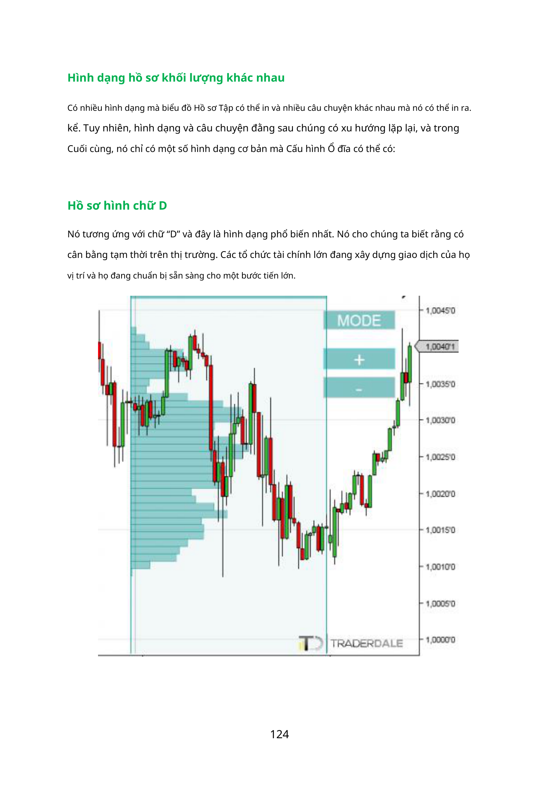

Hình dạng hồ sơ khối lượng khác nhau
Có nhiều hình dạng mà biểu đồ Hồ sơ Tập có thể in và nhiều câu chuyện khác nhau mà nó có thể in ra.
kể. Tuy nhiên, hình dạng và câu chuyện đằng sau chúng có xu hướng lặp lại, và trong
Cuối cùng, nó chỉ có một số hình dạng cơ bản mà Cấu hình Ổ đĩa có thể có:
Hồ sơ hình chữ D
Nó tương ứng với chữ “D” và đây là hình dạng phổ biến nhất. Nó cho chúng ta biết rằng có
cân bằng tạm thời trên thị trường. Các tổ chức tài chính lớn đang xây dựng giao dịch của họ
vị trí và họ đang chuẩn bị sẵn sàng cho một bước tiến lớn.
124

## Trang 126
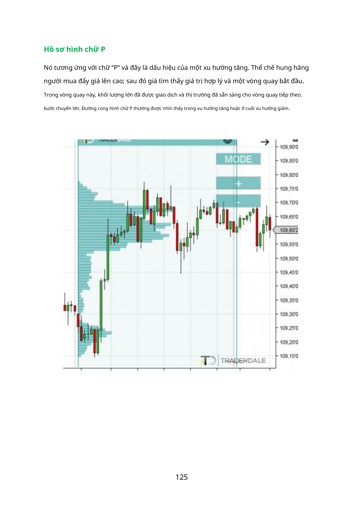

Hồ sơ hình chữ P
Nó tương ứng với chữ “P” và đây là dấu hiệu của một xu hướng tăng. Thể chế hung hăng
người mua đẩy giá lên cao; sau đó giá tìm thấy giá trị hợp lý và một vòng quay bắt đầu.
Trong vòng quay này, khối lượng lớn đã được giao dịch và thị trường đã sẵn sàng cho vòng quay tiếp theo.
bước chuyển lớn. Đường cong hình chữ P thường được nhìn thấy trong xu hướng tăng hoặc ở cuối xu hướng giảm.
125

## Trang 127
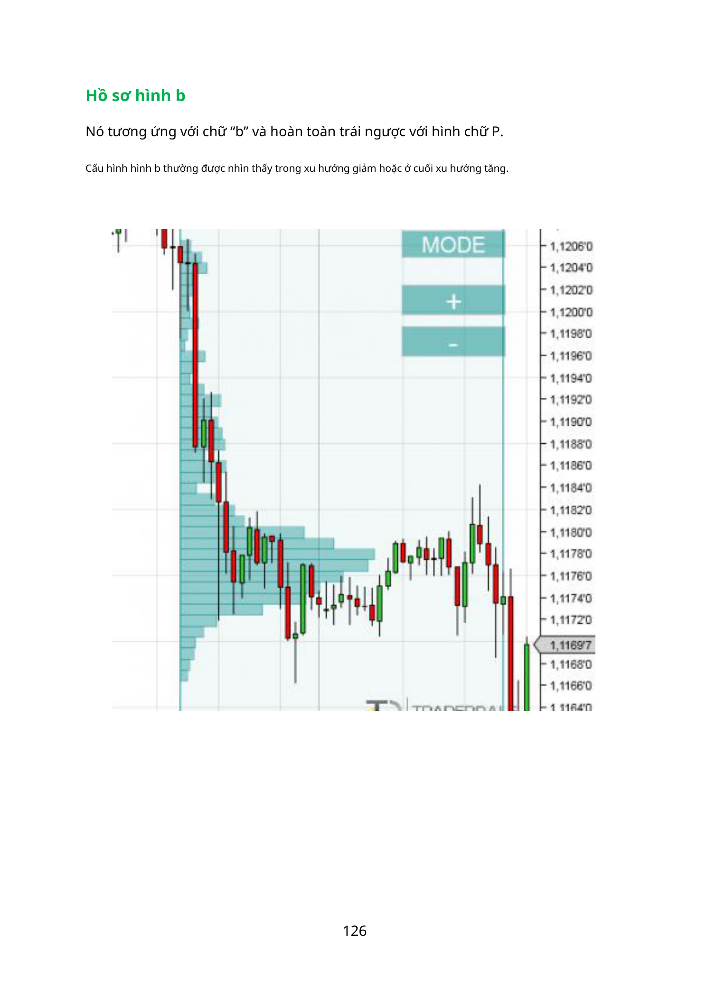

Hồ sơ hình b
Nó tương ứng với chữ “b” và hoàn toàn trái ngược với hình chữ P.
Cấu hình hình b thường được nhìn thấy trong xu hướng giảm hoặc ở cuối xu hướng tăng.
126

## Trang 128
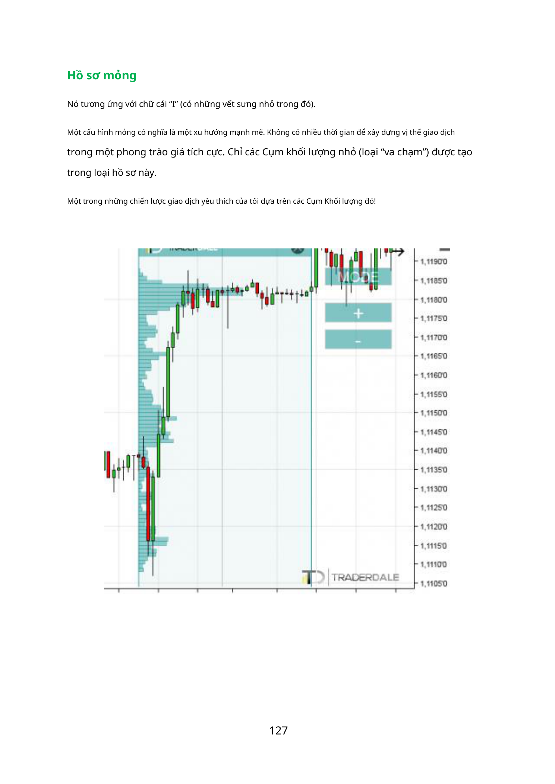

Hồ sơ mỏng
Nó tương ứng với chữ cái “I” (có những vết sưng nhỏ trong đó).
Một cấu hình mỏng có nghĩa là một xu hướng mạnh mẽ. Không có nhiều thời gian để xây dựng vị thế giao dịch
trong một phong trào giá tích cực. Chỉ các Cụm khối lượng nhỏ (loại “va chạm”) được tạo
trong loại hồ sơ này.
Một trong những chiến lược giao dịch yêu thích của tôi dựa trên các Cụm Khối lượng đó!
127

## Trang 129

Điều gì làm cho hồ sơ khối lượng khác với giao dịch khác
Chỉ số?
Không có chỉ báo nào khác (tất nhiên ngoài Dòng lệnh) có thể cho bạn thấy giao dịch lớn ở đâu
các tổ chức có khả năng mua/bán! Tại sao? Bởi vì 99% tất cả các chỉ số tiêu chuẩn đều
chỉ được tính từ hai biến: Giá và Thời gian. Hồ sơ Khối lượng được tính toán bằng cách sử dụng ba
các biến—Giá, Thời gian và Khối lượng.
Nói cách khác, 99% chỉ báo giao dịch tiêu chuẩn chỉ cho bạn thấy giá đang di chuyển như thế nào
trong quá khứ. Sự khác biệt duy nhất giữa hàng ngàn chỉ số đó là cách chúng hình dung
Nó. Không quan trọng đó là EMA, dải Bollinger, RSI, MACD hay bất kỳ chỉ báo nào khác…
Tất cả những điều đó chỉ thể hiện một hình dung khác về biến động giá trong quá khứ (chúng
bị trì hoãn—họ hình dung ra điều gì đó đã xảy ra).
CÓ – chúng khá vô dụng, đó là lý do khiến các nhà giao dịch liên tục nhảy từ cái này sang cái khác
mà không đạt được thành công thực sự nào.
Mặt khác, Hồ sơ Khối lượng chỉ cho bạn các vùng đã và sẽ quan trọng đối với
các tổ chức thương mại lớn. Nói một cách đơn giản – Hồ sơ Khối lượng có thể cho bạn thấy điều gì sẽ xảy ra trong
tương lai!
Tại sao phải quan tâm đến khối lượng và các tổ chức lớn là gì
Đang làm?
Có một lý do đơn giản tại sao chúng ta cần biết các tổ chức tài chính lớn là gì
đang làm. Nguyên nhân là do họ thống trị, vận động và thao túng thị trường. Chính họ là người
quyết định giá sẽ đi về đâu, không phải bạn hay tôi. Chúng ta quá nhỏ.
Hãy nhìn vào hình ảnh sau đây. Nó cho thấy 10 ngân hàng lớn nhất và khối lượng giao dịch của họ
điều khiển. Cùng với nhau, nó chiếm gần 65% thị trường. Chỉ cần 10 ngân hàng!
Chính những kẻ đó là người sở hữu trò chơi này. Đó là những kẻ chúng ta cần theo dõi và theo dõi. Và làm thế nào
chúng ta có theo dõi họ không? Bằng cách sử dụng Hồ sơ Khối lượng để theo dõi khối lượng của chúng.
128

## Trang 130
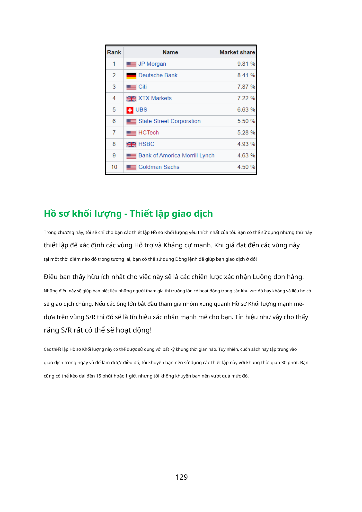

Hồ sơ khối lượng - Thiết lập giao dịch
Trong chương này, tôi sẽ chỉ cho bạn các thiết lập Hồ sơ Khối lượng yêu thích nhất của tôi. Bạn có thể sử dụng những thứ này
thiết lập để xác định các vùng Hỗ trợ và Kháng cự mạnh. Khi giá đạt đến các vùng này
tại một thời điểm nào đó trong tương lai, bạn có thể sử dụng Dòng lệnh để giúp bạn giao dịch ở đó!
Điều bạn thấy hữu ích nhất cho việc này sẽ là các chiến lược xác nhận Luồng đơn hàng.
Những điều này sẽ giúp bạn biết liệu những người tham gia thị trường lớn có hoạt động trong các khu vực đó hay không và liệu họ có
sẽ giao dịch chúng. Nếu các ông lớn bắt đầu tham gia nhóm xung quanh Hồ sơ Khối lượng mạnh mẽ-
dựa trên vùng S/R thì đó sẽ là tín hiệu xác nhận mạnh mẽ cho bạn. Tín hiệu như vậy cho thấy
rằng S/R rất có thể sẽ hoạt động!
Các thiết lập Hồ sơ Khối lượng này có thể được sử dụng với bất kỳ khung thời gian nào. Tuy nhiên, cuốn sách này tập trung vào
giao dịch trong ngày và để làm được điều đó, tôi khuyên bạn nên sử dụng các thiết lập này với khung thời gian 30 phút. Bạn
cũng có thể kéo dài đến 15 phút hoặc 1 giờ, nhưng tôi không khuyên bạn nên vượt quá mức đó.
129

## Trang 131
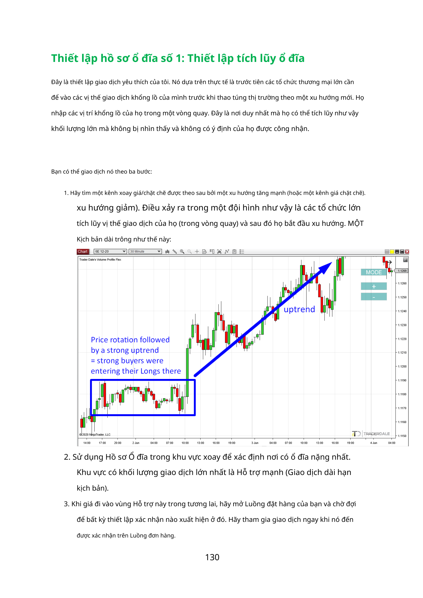

Thiết lập hồ sơ ổ đĩa số 1: Thiết lập tích lũy ổ đĩa
Đây là thiết lập giao dịch yêu thích của tôi. Nó dựa trên thực tế là trước tiên các tổ chức thương mại lớn cần
để vào các vị thế giao dịch khổng lồ của mình trước khi thao túng thị trường theo một xu hướng mới. Họ
nhập các vị trí khổng lồ của họ trong một vòng quay. Đây là nơi duy nhất mà họ có thể tích lũy như vậy
khối lượng lớn mà không bị nhìn thấy và không có ý định của họ được công nhận.
Bạn có thể giao dịch nó theo ba bước:
1. Hãy tìm một kênh xoay giá/chặt chẽ được theo sau bởi một xu hướng tăng mạnh (hoặc một kênh giá chặt chẽ).
xu hướng giảm). Điều xảy ra trong một đội hình như vậy là các tổ chức lớn
tích lũy vị thế giao dịch của họ (trong vòng quay) và sau đó họ bắt đầu xu hướng. MỘT
Kịch bản dài trông như thế này:
2. Sử dụng Hồ sơ Ổ đĩa trong khu vực xoay để xác định nơi có ổ đĩa nặng nhất.
Khu vực có khối lượng giao dịch lớn nhất là Hỗ trợ mạnh (Giao dịch dài hạn
kịch bản).
3. Khi giá đi vào vùng Hỗ trợ này trong tương lai, hãy mở Luồng đặt hàng của bạn và chờ đợi
để bất kỳ thiết lập xác nhận nào xuất hiện ở đó. Hãy tham gia giao dịch ngay khi nó đến
được xác nhận trên Luồng đơn hàng.
130

## Trang 132
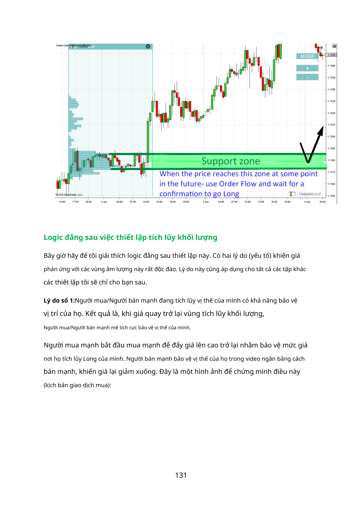

Logic đằng sau việc thiết lập tích lũy khối lượng
Bây giờ hãy để tôi giải thích logic đằng sau thiết lập này. Có hai lý do (yếu tố) khiến giá
phản ứng với các vùng âm lượng này rất độc đáo. Lý do này cũng áp dụng cho tất cả các tập khác
các thiết lập tôi sẽ chỉ cho bạn sau.
Lý do số 1:Người mua/Người bán mạnh đang tích lũy vị thế của mình có khả năng bảo vệ
vị trí của họ. Kết quả là, khi giá quay trở lại vùng tích lũy khối lượng,
Người mua/Người bán mạnh mẽ tích cực bảo vệ vị thế của mình.
Người mua mạnh bắt đầu mua mạnh để đẩy giá lên cao trở lại nhằm bảo vệ mức giá
nơi họ tích lũy Long của mình. Người bán mạnh bảo vệ vị thế của họ trong video ngắn bằng cách
bán mạnh, khiến giá lại giảm xuống. Đây là một hình ảnh để chứng minh điều này
(kịch bản giao dịch mua):
131

## Trang 133
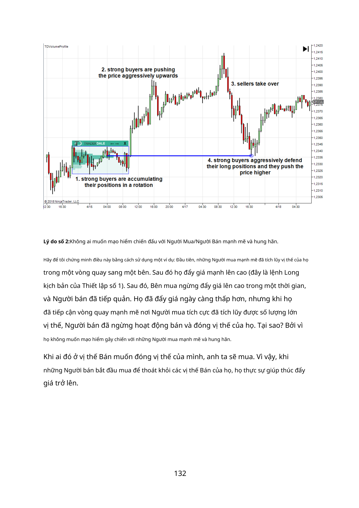

Lý do số 2:Không ai muốn mạo hiểm chiến đấu với Người Mua/Người Bán mạnh mẽ và hung hãn.
Hãy để tôi chứng minh điều này bằng cách sử dụng một ví dụ: Đầu tiên, những Người mua mạnh mẽ đã tích lũy vị thế của họ
trong một vòng quay sang một bên. Sau đó họ đẩy giá mạnh lên cao (đây là lệnh Long
kịch bản của Thiết lập số 1). Sau đó, Bên mua ngừng đẩy giá lên cao trong một thời gian,
và Người bán đã tiếp quản. Họ đã đẩy giá ngày càng thấp hơn, nhưng khi họ
đã tiếp cận vòng quay mạnh mẽ nơi Người mua tích cực đã tích lũy được số lượng lớn
vị thế, Người bán đã ngừng hoạt động bán và đóng vị thế của họ. Tại sao? Bởi vì
họ không muốn mạo hiểm gây chiến với những Người mua mạnh mẽ và hung hãn.
Khi ai đó ở vị thế Bán muốn đóng vị thế của mình, anh ta sẽ mua. Vì vậy, khi
những Người bán bắt đầu mua để thoát khỏi các vị thế Bán của họ, họ thực sự giúp thúc đẩy
giá trở lên.
132

## Trang 134
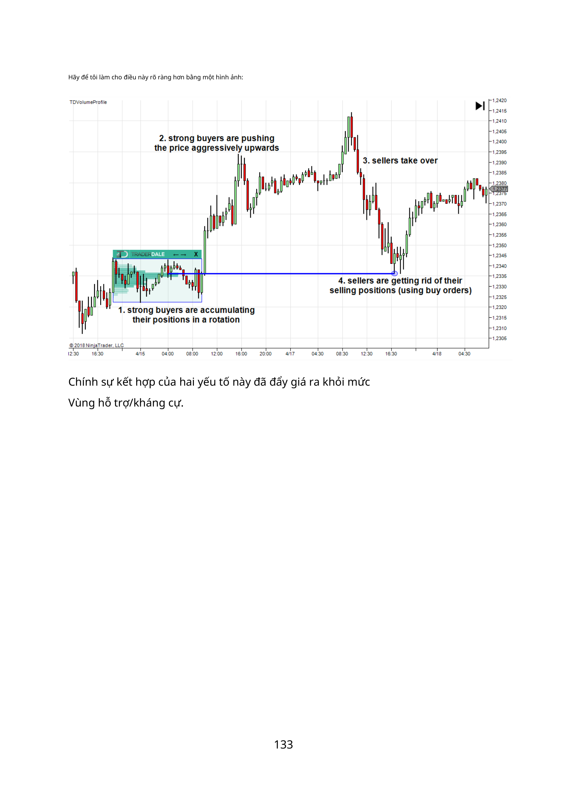

Hãy để tôi làm cho điều này rõ ràng hơn bằng một hình ảnh:
Chính sự kết hợp của hai yếu tố này đã đẩy giá ra khỏi mức
Vùng hỗ trợ/kháng cự.
133

## Trang 135
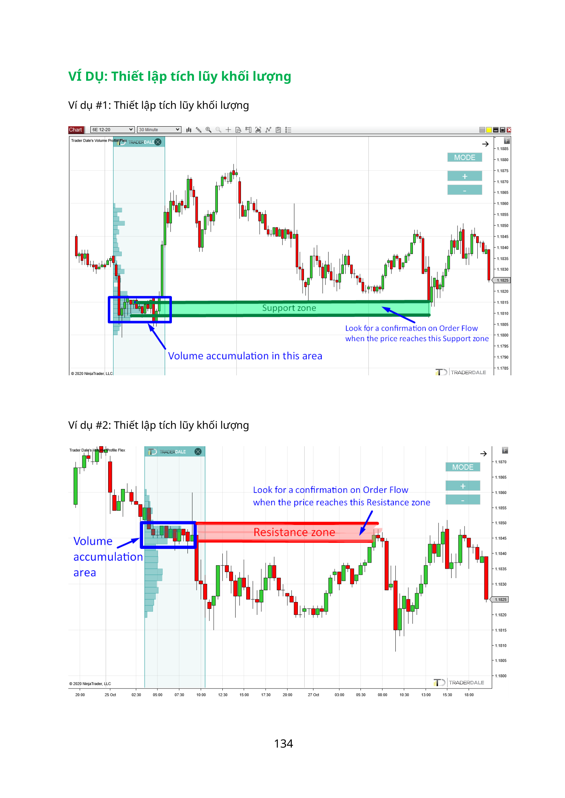

VÍ DỤ: Thiết lập tích lũy khối lượng
Ví dụ #1: Thiết lập tích lũy khối lượng
Ví dụ #2: Thiết lập tích lũy khối lượng
134

## Trang 136
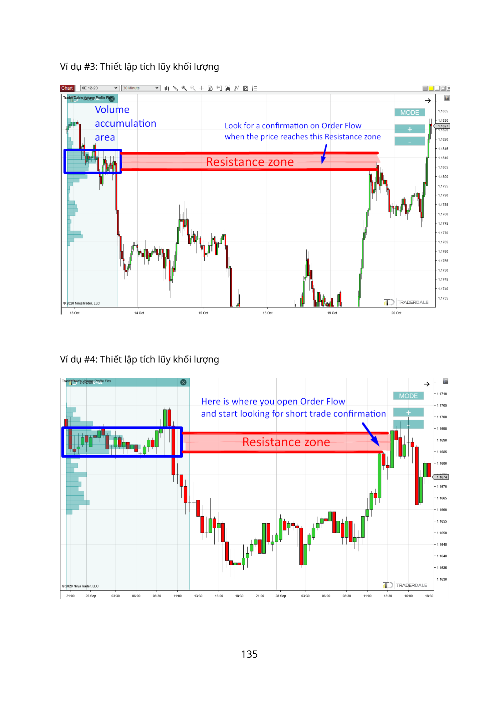

Ví dụ #3: Thiết lập tích lũy khối lượng
Ví dụ #4: Thiết lập tích lũy khối lượng
135

## Trang 137
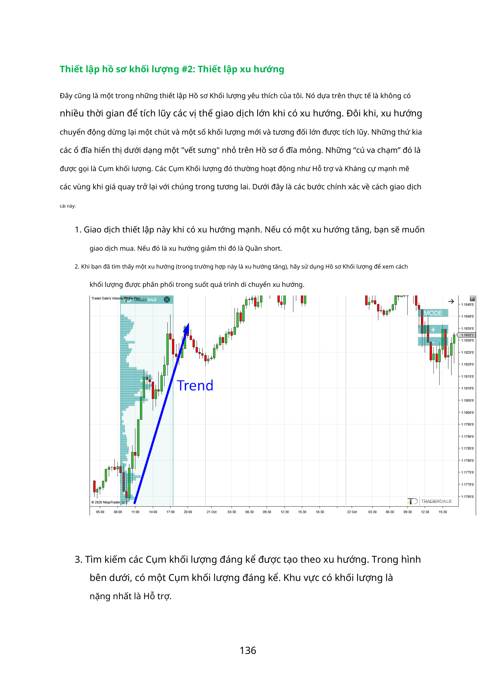

Thiết lập hồ sơ khối lượng #2: Thiết lập xu hướng
Đây cũng là một trong những thiết lập Hồ sơ Khối lượng yêu thích của tôi. Nó dựa trên thực tế là không có
nhiều thời gian để tích lũy các vị thế giao dịch lớn khi có xu hướng. Đôi khi, xu hướng
chuyển động dừng lại một chút và một số khối lượng mới và tương đối lớn được tích lũy. Những thứ kia
các ổ đĩa hiển thị dưới dạng một "vết sưng" nhỏ trên Hồ sơ ổ đĩa mỏng. Những “cú va chạm” đó là
được gọi là Cụm khối lượng. Các Cụm Khối lượng đó thường hoạt động như Hỗ trợ và Kháng cự mạnh mẽ
các vùng khi giá quay trở lại với chúng trong tương lai. Dưới đây là các bước chính xác về cách giao dịch
cái này:
1. Giao dịch thiết lập này khi có xu hướng mạnh. Nếu có một xu hướng tăng, bạn sẽ muốn
giao dịch mua. Nếu đó là xu hướng giảm thì đó là Quần short.
2. Khi bạn đã tìm thấy một xu hướng (trong trường hợp này là xu hướng tăng), hãy sử dụng Hồ sơ Khối lượng để xem cách
khối lượng được phân phối trong suốt quá trình di chuyển xu hướng.
3. Tìm kiếm các Cụm khối lượng đáng kể được tạo theo xu hướng. Trong hình
bên dưới, có một Cụm khối lượng đáng kể. Khu vực có khối lượng là
nặng nhất là Hỗ trợ.
136

## Trang 138
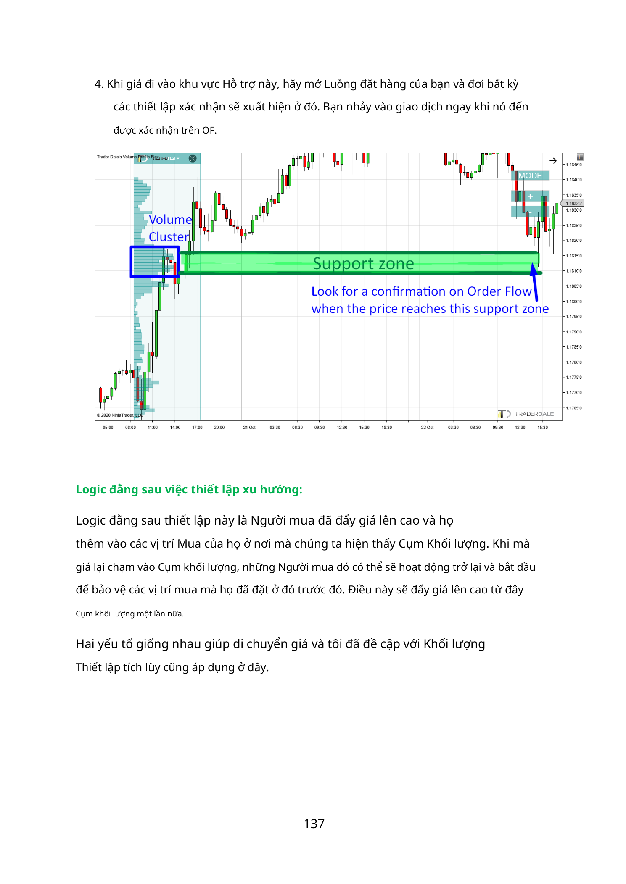

4. Khi giá đi vào khu vực Hỗ trợ này, hãy mở Luồng đặt hàng của bạn và đợi bất kỳ
các thiết lập xác nhận sẽ xuất hiện ở đó. Bạn nhảy vào giao dịch ngay khi nó đến
được xác nhận trên OF.
Logic đằng sau việc thiết lập xu hướng:
Logic đằng sau thiết lập này là Người mua đã đẩy giá lên cao và họ
thêm vào các vị trí Mua của họ ở nơi mà chúng ta hiện thấy Cụm Khối lượng. Khi mà
giá lại chạm vào Cụm khối lượng, những Người mua đó có thể sẽ hoạt động trở lại và bắt đầu
để bảo vệ các vị trí mua mà họ đã đặt ở đó trước đó. Điều này sẽ đẩy giá lên cao từ đây
Cụm khối lượng một lần nữa.
Hai yếu tố giống nhau giúp di chuyển giá và tôi đã đề cập với Khối lượng
Thiết lập tích lũy cũng áp dụng ở đây.
137

## Trang 139
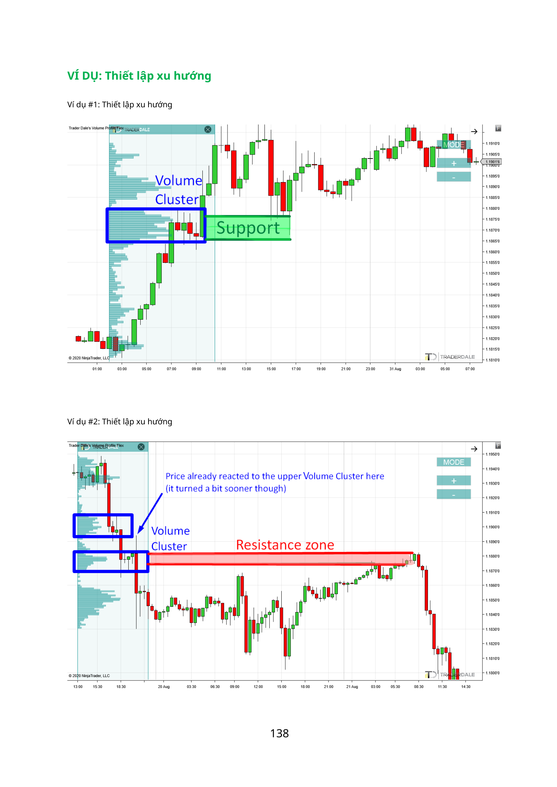

VÍ DỤ: Thiết lập xu hướng
Ví dụ #1: Thiết lập xu hướng
Ví dụ #2: Thiết lập xu hướng
138

## Trang 140
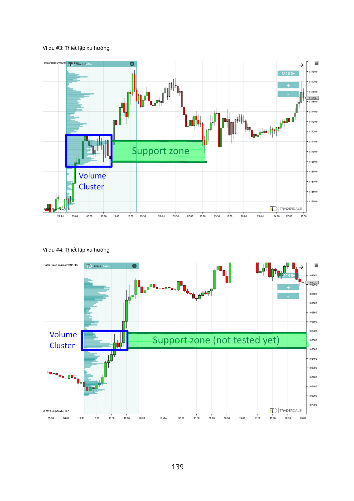

Ví dụ #3: Thiết lập xu hướng
Ví dụ #4: Thiết lập xu hướng
139

## Trang 141
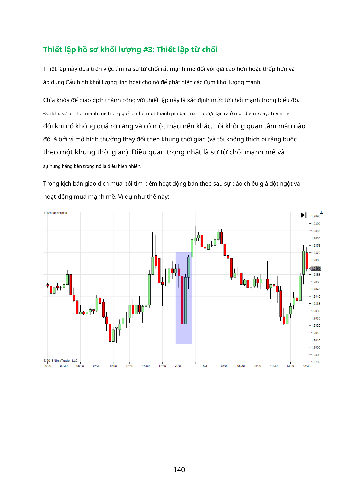

Thiết lập hồ sơ khối lượng #3: Thiết lập từ chối
Thiết lập này dựa trên việc tìm ra sự từ chối rất mạnh mẽ đối với giá cao hơn hoặc thấp hơn và
áp dụng Cấu hình khối lượng linh hoạt cho nó để phát hiện các Cụm khối lượng mạnh.
Chìa khóa để giao dịch thành công với thiết lập này là xác định mức từ chối mạnh trong biểu đồ.
Đôi khi, sự từ chối mạnh mẽ trông giống như một thanh pin bar mạnh được tạo ra ở một điểm xoay. Tuy nhiên,
đôi khi nó không quá rõ ràng và có một mẫu nến khác. Tôi không quan tâm mẫu nào
đó là bởi vì mô hình thường thay đổi theo khung thời gian (và tôi không thích bị ràng buộc
theo một khung thời gian). Điều quan trọng nhất là sự từ chối mạnh mẽ và
sự hung hăng bên trong nó là điều hiển nhiên.
Trong kịch bản giao dịch mua, tôi tìm kiếm hoạt động bán theo sau sự đảo chiều giá đột ngột và
hoạt động mua mạnh mẽ. Ví dụ như thế này:
140

## Trang 142
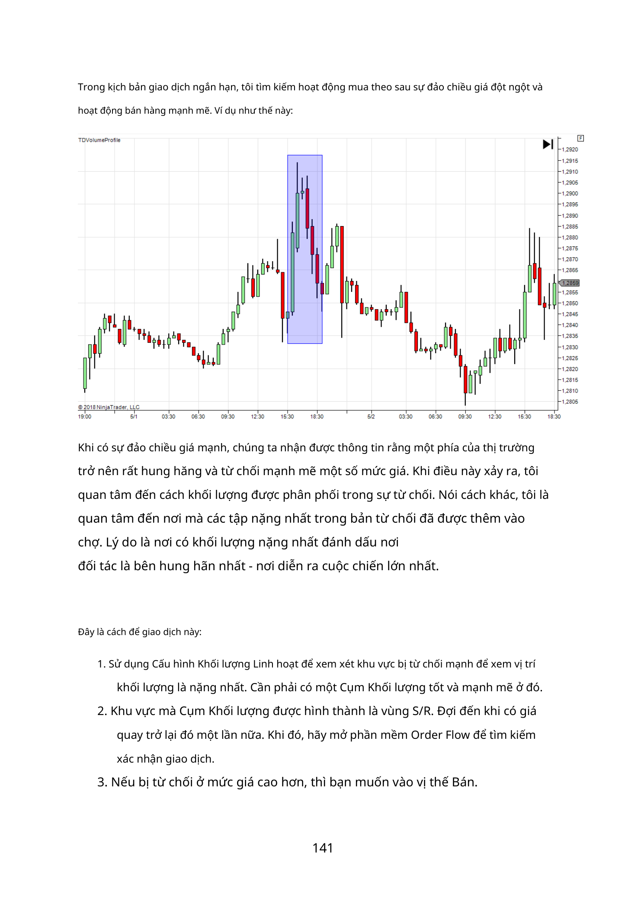

Trong kịch bản giao dịch ngắn hạn, tôi tìm kiếm hoạt động mua theo sau sự đảo chiều giá đột ngột và
hoạt động bán hàng mạnh mẽ. Ví dụ như thế này:
Khi có sự đảo chiều giá mạnh, chúng ta nhận được thông tin rằng một phía của thị trường
trở nên rất hung hăng và từ chối mạnh mẽ một số mức giá. Khi điều này xảy ra, tôi
quan tâm đến cách khối lượng được phân phối trong sự từ chối. Nói cách khác, tôi là
quan tâm đến nơi mà các tập nặng nhất trong bản từ chối đã được thêm vào
chợ. Lý do là nơi có khối lượng nặng nhất đánh dấu nơi
đối tác là bên hung hãn nhất - nơi diễn ra cuộc chiến lớn nhất.
Đây là cách để giao dịch này:
1. Sử dụng Cấu hình Khối lượng Linh hoạt để xem xét khu vực bị từ chối mạnh để xem vị trí
khối lượng là nặng nhất. Cần phải có một Cụm Khối lượng tốt và mạnh mẽ ở đó.
2. Khu vực mà Cụm Khối lượng được hình thành là vùng S/R. Đợi đến khi có giá
quay trở lại đó một lần nữa. Khi đó, hãy mở phần mềm Order Flow để tìm kiếm
xác nhận giao dịch.
3. Nếu bị từ chối ở mức giá cao hơn, thì bạn muốn vào vị thế Bán.
141

## Trang 143
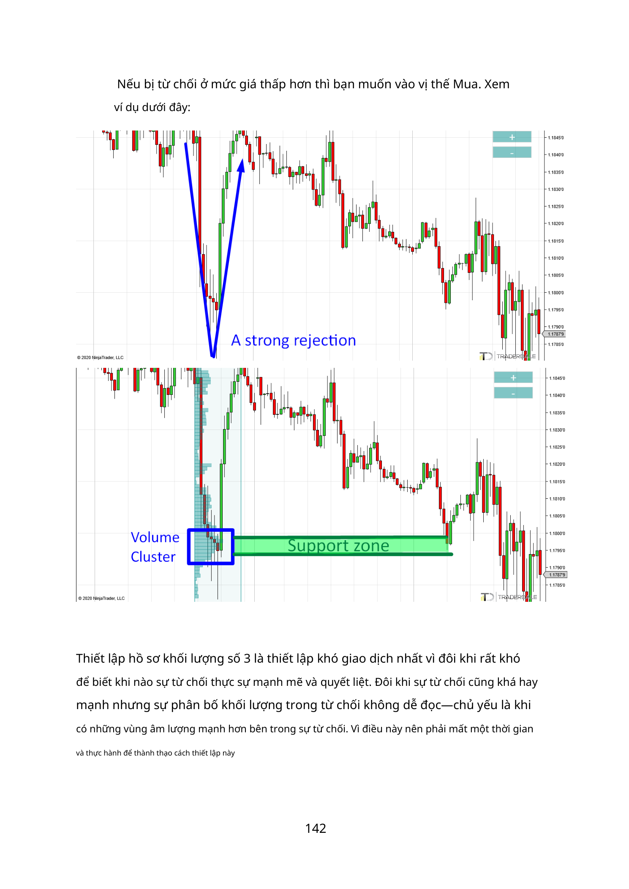

Nếu bị từ chối ở mức giá thấp hơn thì bạn muốn vào vị thế Mua. Xem
ví dụ dưới đây:
Thiết lập hồ sơ khối lượng số 3 là thiết lập khó giao dịch nhất vì đôi khi rất khó
để biết khi nào sự từ chối thực sự mạnh mẽ và quyết liệt. Đôi khi sự từ chối cũng khá hay
mạnh nhưng sự phân bố khối lượng trong từ chối không dễ đọc—chủ yếu là khi
có những vùng âm lượng mạnh hơn bên trong sự từ chối. Vì điều này nên phải mất một thời gian
và thực hành để thành thạo cách thiết lập này
142

## Trang 144
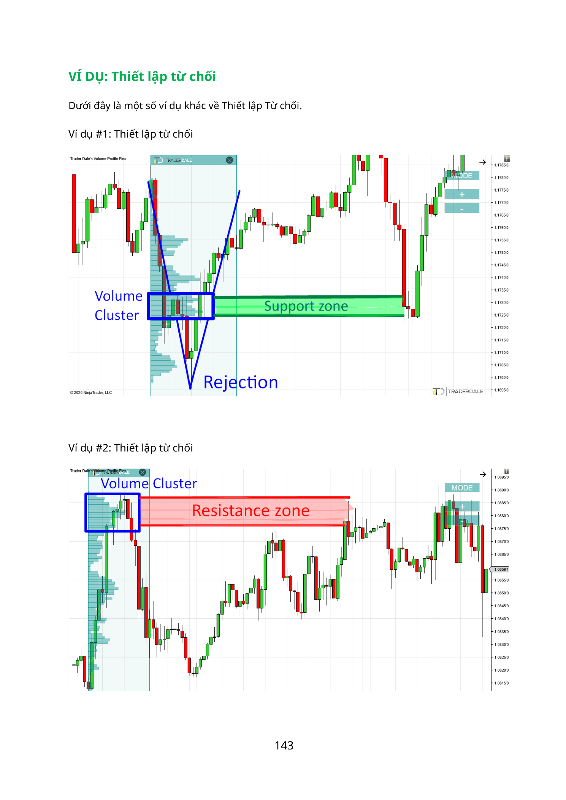

VÍ DỤ: Thiết lập từ chối
Dưới đây là một số ví dụ khác về Thiết lập Từ chối.
Ví dụ #1: Thiết lập từ chối
Ví dụ #2: Thiết lập từ chối
143

## Trang 145
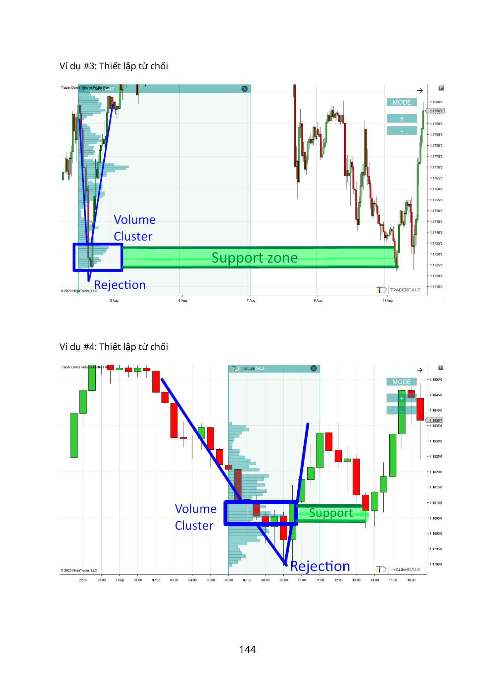

Ví dụ #3: Thiết lập từ chối
Ví dụ #4: Thiết lập từ chối
144

## Trang 146

Nơi nhận thêm thông tin về hồ sơ khối lượng
Volume Profile là một công cụ tuyệt vời chắc chắn đáng được bạn chú ý hơn. Như thế này
Mục tiêu chính của cuốn sách là dạy cho bạn cách giao dịch theo Dòng lệnh, tôi sẽ không đi sâu hơn về Khối lượng
Hồ sơ. Tuy nhiên, bạn có thể tìm hiểu thêm về nó trên trang web của tôiwww.trader-dale.com . Cái gì
bạn sẽ thấy có một bản sao miễn phí cuốn sách của tôiHỒ SƠ KHỐI LƯỢNG: Hướng dẫn giao dịch dành cho người nội bộ
có sẵn để bạn tải về.
Nếu bạn muốn đi sâu hơn nữa, tôi khuyên bạn nên lấyGói luồng đặt hàng(có sẵn ở đây:
https://www.trader-dale.com/order-flow-indicator-and-video-course/ ). Gói này bao gồm:
•
Phần mềm luồng đặt hàng
•
Phần mềm hồ sơ khối lượng
•
Đào tạo video về Quy trình đặt hàng mở rộng và Hồ sơ khối lượng
Nếu bạn muốn tải phần mềm Volume Profile, bạn có thể tải nó trên trang web của tôi tại đây:
(https://www.trader-dale.com/volume-profile-forex-trading-course/ )
Ví dụ về giao dịch trực tiếp - Liên kết
Lần đầu tiên tôi định bình luận về một số giao dịch trực tiếp Dòng lệnh + Hồ sơ khối lượng của mình tại đây, nhưng
hình thức viết làm cho nó khá khó khăn và không hiệu quả lắm. Vì lý do này, tôi đã thiết lập một
trang web đặc biệt dành cho bạn, nơi tôi đã tải lên một vài video giao dịch trực tiếp. Bạn có thể thấy tôi
giao dịch với Luồng đơn hàng và Hồ sơ khối lượng trong các video đó bằng cách sử dụng tất cả các mẹo và phương pháp tiếp cận
Tôi đã chỉ cho bạn trong cuốn sách này. Đây là liên kết:
Liên kết:https://www.trader-dale.com/of-book/
Mật khẩu:giao dịch vui vẻ
145

## Trang 147

Phải làm gì tiếp theo
Trong cuốn sách này, tôi đã cố gắng hết sức để giải thích các chiến lược giao dịch của mình và cung cấp cho bạn một điểm khởi đầu tốt
để sử dụng chúng một cách độc lập. Tôi hy vọng bạn thích nó và bạn tìm ra cách giao dịch
cùng với các tổ chức giao dịch lớn sử dụng Luồng lệnh và Hồ sơ khối lượng cũng hấp dẫn như tôi
LÀM. Cuốn sách này sẽ cung cấp cho bạn những kiến thức cơ bản bạn cần để bắt đầu khám phá nhiều hơn và hầu hết
quan trọng là có được một số kinh nghiệm trực tiếp.
Giao dịch bằng Luồng đặt hàng giống như lái một chiếc ô tô. Tất cả lý thuyết về lái xe là một chuyện, nhưng
thực sự lái ô tô là một trải nghiệm mà bạn sẽ không thể học được từ sách vở. Bạn thực sự
cần phải ngồi trong xe và lái xe. Đây là điều sẽ giúp bạn trở thành người lái xe giỏi chứ không phải đọc sách
về lái xe.
Quá trình lái xe (hoặc giao dịch) thực tế cũng sẽ trở nên tự nhiên hơn nhiều khi bạn bắt đầu.
làm việc đó. Tôi hy vọng rằng sau khi xem qua cuốn sách Order Flow này, đầu bạn có thể cảm thấy hơi khó chịu.
chóng mặt vì lượng thông tin, đặc biệt nếu Luồng đơn hàng hoàn toàn mới đối với bạn. Ở đó
có quá nhiều thứ để xem, rất nhiều sắc thái, rất nhiều điều để nhớ phải không? Tốt,
về mặt lý thuyết là có. NHƯNG khi bạn bắt đầu sử dụng Dòng lệnh trong giao dịch của mình, nhiều thứ trong số này
sẽ trở nên tự nhiên đối với bạn. Trong một khoảng thời gian ngắn, việc đọc Luồng đơn hàng sẽ trở thành
dễ dàng hơn, và khi bạn nhìn vào nó, bạn sẽ thấy một bức tranh rõ ràng, không chỉ là tổng các ô,
số và các sắc thái màu khác nhau.
Điều bạn cần bây giờ là thực hành những điều bạn đã học. Bạn cần luyện tập và thực hành-
theo kinh nghiệm!
Tăng tốc việc học của bạn!
Để đẩy nhanh quá trình học tập của bạn và cung cấp cho bạn nhiều thông tin nhất có thể, tôi đã tạo một
số khóa đào tạo đặc biệt. Có hai điều đặc biệt mà tôi đánh giá cao
nhận. Chúng được gọi là Gói ưu tú và Gói dòng lệnh. Mỗi người trong số họ tập trung vào
những thứ khác. Bây giờ hãy để tôi cho bạn biết hai gói đào tạo đó bao gồm những gì và chúng
có thể giúp bạn!
146

## Trang 148
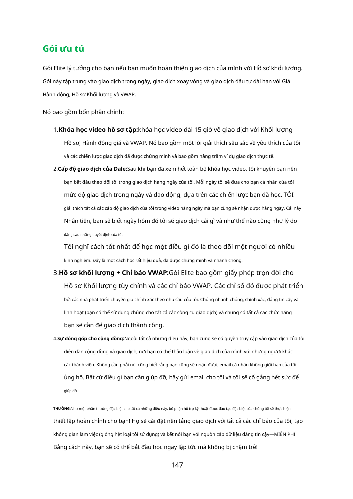

Gói ưu tú
Gói Elite lý tưởng cho bạn nếu bạn muốn hoàn thiện giao dịch của mình với Hồ sơ khối lượng.
Gói này tập trung vào giao dịch trong ngày, giao dịch xoay vòng và giao dịch đầu tư dài hạn với Giá
Hành động, Hồ sơ Khối lượng và VWAP.
Nó bao gồm bốn phần chính:
1.Khóa học video hồ sơ tập:khóa học video dài 15 giờ về giao dịch với Khối lượng
Hồ sơ, Hành động giá và VWAP. Nó bao gồm một lời giải thích sâu sắc về yêu thích của tôi
và các chiến lược giao dịch đã được chứng minh và bao gồm hàng trăm ví dụ giao dịch thực tế.
2.Cấp độ giao dịch của Dale:Sau khi bạn đã xem hết toàn bộ khóa học video, tôi khuyên bạn nên
bạn bắt đầu theo dõi tôi trong giao dịch hàng ngày của tôi. Mỗi ngày tôi sẽ đưa cho bạn cá nhân của tôi
mức độ giao dịch trong ngày và dao động, dựa trên các chiến lược bạn đã học. TÔI
giải thích tất cả các cấp độ giao dịch của tôi trong video hàng ngày mà bạn cũng sẽ nhận được hàng ngày. Cái này
Nhân tiện, bạn sẽ biết ngày hôm đó tôi sẽ giao dịch cái gì và như thế nào cũng như lý do
đằng sau những quyết định của tôi.
Tôi nghĩ cách tốt nhất để học một điều gì đó là theo dõi một người có nhiều
kinh nghiệm. Đây là một cách học rất hiệu quả, đã được chứng minh và nhanh chóng!
3.Hồ sơ khối lượng + Chỉ báo VWAP:Gói Elite bao gồm giấy phép trọn đời cho
Hồ sơ Khối lượng tùy chỉnh và các chỉ báo VWAP. Các chỉ số đó được phát triển
bởi các nhà phát triển chuyên gia chính xác theo nhu cầu của tôi. Chúng nhanh chóng, chính xác, đáng tin cậy và
linh hoạt (bạn có thể sử dụng chúng cho tất cả các công cụ giao dịch) và chúng có tất cả các chức năng
bạn sẽ cần để giao dịch thành công.
4.Sự đóng góp cho cộng đồng:Ngoài tất cả những điều này, bạn cũng sẽ có quyền truy cập vào giao dịch của tôi
diễn đàn cộng đồng và giao dịch, nơi bạn có thể thảo luận về giao dịch của mình với những người khác
các thành viên. Không cần phải nói cũng biết rằng bạn cũng sẽ nhận được email cá nhân không giới hạn của tôi
ủng hộ. Bất cứ điều gì bạn cần giúp đỡ, hãy gửi email cho tôi và tôi sẽ cố gắng hết sức để
giúp đỡ.
THƯỞNG:Như một phần thưởng đặc biệt cho tất cả những điều này, bộ phận hỗ trợ kỹ thuật được đào tạo đặc biệt của chúng tôi sẽ thực hiện
thiết lập hoàn chỉnh cho bạn! Họ sẽ cài đặt nền tảng giao dịch với tất cả các chỉ báo của tôi, tạo
không gian làm việc (giống hệt loại tôi sử dụng) và kết nối bạn với nguồn cấp dữ liệu đáng tin cậy—MIỄN PHÍ.
Bằng cách này, bạn sẽ có thể bắt đầu học ngay lập tức mà không bị chậm trễ!
147

## Trang 149

*(trang chi co hinh)*

## Trang 150
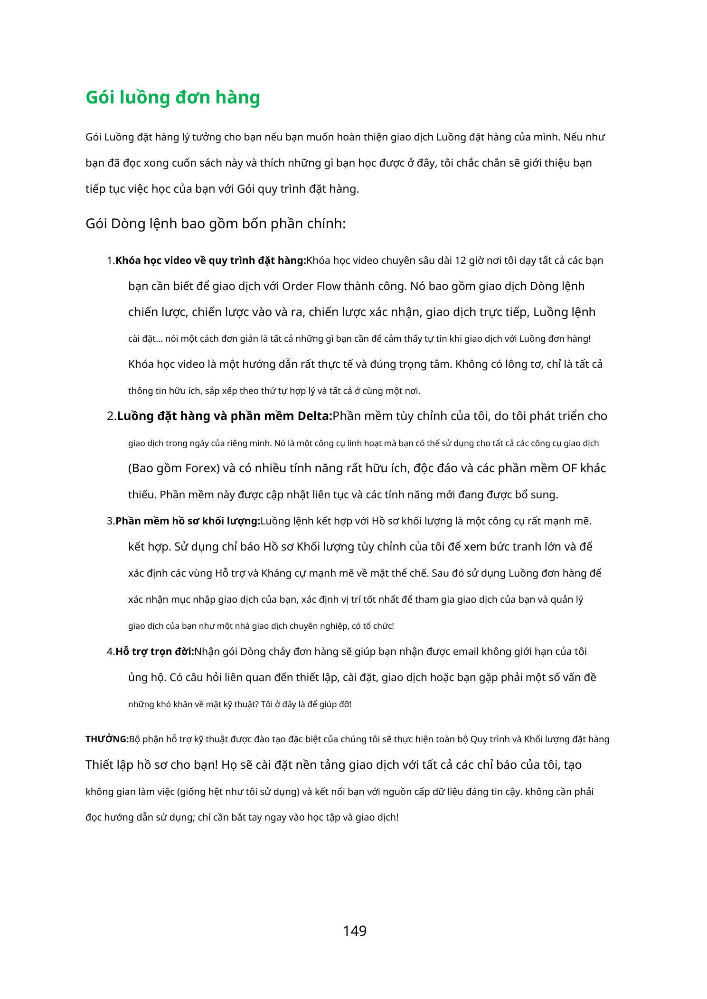

Gói luồng đơn hàng
Gói Luồng đặt hàng lý tưởng cho bạn nếu bạn muốn hoàn thiện giao dịch Luồng đặt hàng của mình. Nếu như
bạn đã đọc xong cuốn sách này và thích những gì bạn học được ở đây, tôi chắc chắn sẽ giới thiệu bạn
tiếp tục việc học của bạn với Gói quy trình đặt hàng.
Gói Dòng lệnh bao gồm bốn phần chính:
1.Khóa học video về quy trình đặt hàng:Khóa học video chuyên sâu dài 12 giờ nơi tôi dạy tất cả các bạn
bạn cần biết để giao dịch với Order Flow thành công. Nó bao gồm giao dịch Dòng lệnh
chiến lược, chiến lược vào và ra, chiến lược xác nhận, giao dịch trực tiếp, Luồng lệnh
cài đặt… nói một cách đơn giản là tất cả những gì bạn cần để cảm thấy tự tin khi giao dịch với Luồng đơn hàng!
Khóa học video là một hướng dẫn rất thực tế và đúng trọng tâm. Không có lông tơ, chỉ là tất cả
thông tin hữu ích, sắp xếp theo thứ tự hợp lý và tất cả ở cùng một nơi.
2.Luồng đặt hàng và phần mềm Delta:Phần mềm tùy chỉnh của tôi, do tôi phát triển cho
giao dịch trong ngày của riêng mình. Nó là một công cụ linh hoạt mà bạn có thể sử dụng cho tất cả các công cụ giao dịch
(Bao gồm Forex) và có nhiều tính năng rất hữu ích, độc đáo và các phần mềm OF khác
thiếu. Phần mềm này được cập nhật liên tục và các tính năng mới đang được bổ sung.
3.Phần mềm hồ sơ khối lượng:Luồng lệnh kết hợp với Hồ sơ khối lượng là một công cụ rất mạnh mẽ.
kết hợp. Sử dụng chỉ báo Hồ sơ Khối lượng tùy chỉnh của tôi để xem bức tranh lớn và để
xác định các vùng Hỗ trợ và Kháng cự mạnh mẽ về mặt thể chế. Sau đó sử dụng Luồng đơn hàng để
xác nhận mục nhập giao dịch của bạn, xác định vị trí tốt nhất để tham gia giao dịch của bạn và quản lý
giao dịch của bạn như một nhà giao dịch chuyên nghiệp, có tổ chức!
4.Hỗ trợ trọn đời:Nhận gói Dòng chảy đơn hàng sẽ giúp bạn nhận được email không giới hạn của tôi
ủng hộ. Có câu hỏi liên quan đến thiết lập, cài đặt, giao dịch hoặc bạn gặp phải một số vấn đề
những khó khăn về mặt kỹ thuật? Tôi ở đây là để giúp đỡ!
THƯỞNG:Bộ phận hỗ trợ kỹ thuật được đào tạo đặc biệt của chúng tôi sẽ thực hiện toàn bộ Quy trình và Khối lượng đặt hàng
Thiết lập hồ sơ cho bạn! Họ sẽ cài đặt nền tảng giao dịch với tất cả các chỉ báo của tôi, tạo
không gian làm việc (giống hệt như tôi sử dụng) và kết nối bạn với nguồn cấp dữ liệu đáng tin cậy. không cần phải
đọc hướng dẫn sử dụng; chỉ cần bắt tay ngay vào học tập và giao dịch!
149

## Trang 151
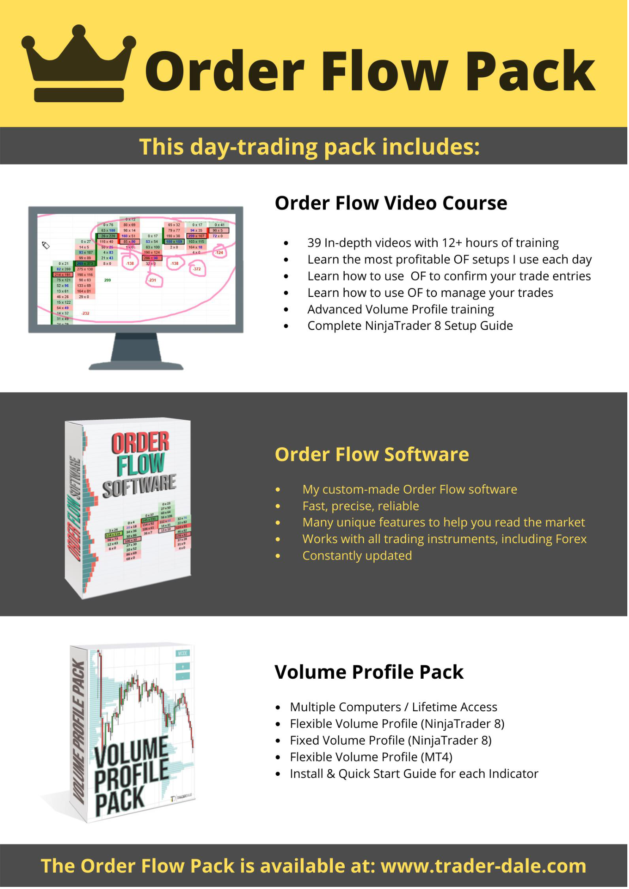

*(trang chi co hinh)*

## Trang 152
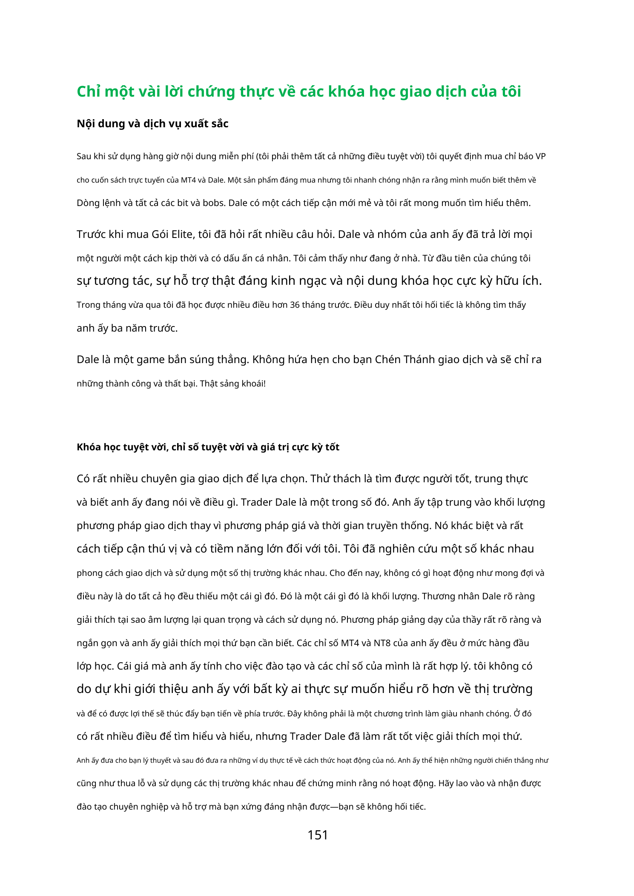

Chỉ một vài lời chứng thực về các khóa học giao dịch của tôi
Nội dung và dịch vụ xuất sắc
Sau khi sử dụng hàng giờ nội dung miễn phí (tôi phải thêm tất cả những điều tuyệt vời) tôi quyết định mua chỉ báo VP
cho cuốn sách trực tuyến của MT4 và Dale. Một sản phẩm đáng mua nhưng tôi nhanh chóng nhận ra rằng mình muốn biết thêm về
Dòng lệnh và tất cả các bit và bobs. Dale có một cách tiếp cận mới mẻ và tôi rất mong muốn tìm hiểu thêm.
Trước khi mua Gói Elite, tôi đã hỏi rất nhiều câu hỏi. Dale và nhóm của anh ấy đã trả lời mọi
một người một cách kịp thời và có dấu ấn cá nhân. Tôi cảm thấy như đang ở nhà. Từ đầu tiên của chúng tôi
sự tương tác, sự hỗ trợ thật đáng kinh ngạc và nội dung khóa học cực kỳ hữu ích.
Trong tháng vừa qua tôi đã học được nhiều điều hơn 36 tháng trước. Điều duy nhất tôi hối tiếc là không tìm thấy
anh ấy ba năm trước.
Dale là một game bắn súng thẳng. Không hứa hẹn cho bạn Chén Thánh giao dịch và sẽ chỉ ra
những thành công và thất bại. Thật sảng khoái!
Khóa học tuyệt vời, chỉ số tuyệt vời và giá trị cực kỳ tốt
Có rất nhiều chuyên gia giao dịch để lựa chọn. Thử thách là tìm được người tốt, trung thực
và biết anh ấy đang nói về điều gì. Trader Dale là một trong số đó. Anh ấy tập trung vào khối lượng
phương pháp giao dịch thay vì phương pháp giá và thời gian truyền thống. Nó khác biệt và rất
cách tiếp cận thú vị và có tiềm năng lớn đối với tôi. Tôi đã nghiên cứu một số khác nhau
phong cách giao dịch và sử dụng một số thị trường khác nhau. Cho đến nay, không có gì hoạt động như mong đợi và
điều này là do tất cả họ đều thiếu một cái gì đó. Đó là một cái gì đó là khối lượng. Thương nhân Dale rõ ràng
giải thích tại sao âm lượng lại quan trọng và cách sử dụng nó. Phương pháp giảng dạy của thầy rất rõ ràng và
ngắn gọn và anh ấy giải thích mọi thứ bạn cần biết. Các chỉ số MT4 và NT8 của anh ấy đều ở mức hàng đầu
lớp học. Cái giá mà anh ấy tính cho việc đào tạo và các chỉ số của mình là rất hợp lý. tôi không có
do dự khi giới thiệu anh ấy với bất kỳ ai thực sự muốn hiểu rõ hơn về thị trường
và để có được lợi thế sẽ thúc đẩy bạn tiến về phía trước. Đây không phải là một chương trình làm giàu nhanh chóng. Ở đó
có rất nhiều điều để tìm hiểu và hiểu, nhưng Trader Dale đã làm rất tốt việc giải thích mọi thứ.
Anh ấy đưa cho bạn lý thuyết và sau đó đưa ra những ví dụ thực tế về cách thức hoạt động của nó. Anh ấy thể hiện những người chiến thắng như
cũng như thua lỗ và sử dụng các thị trường khác nhau để chứng minh rằng nó hoạt động. Hãy lao vào và nhận được
đào tạo chuyên nghiệp và hỗ trợ mà bạn xứng đáng nhận được—bạn sẽ không hối tiếc.
151

## Trang 153
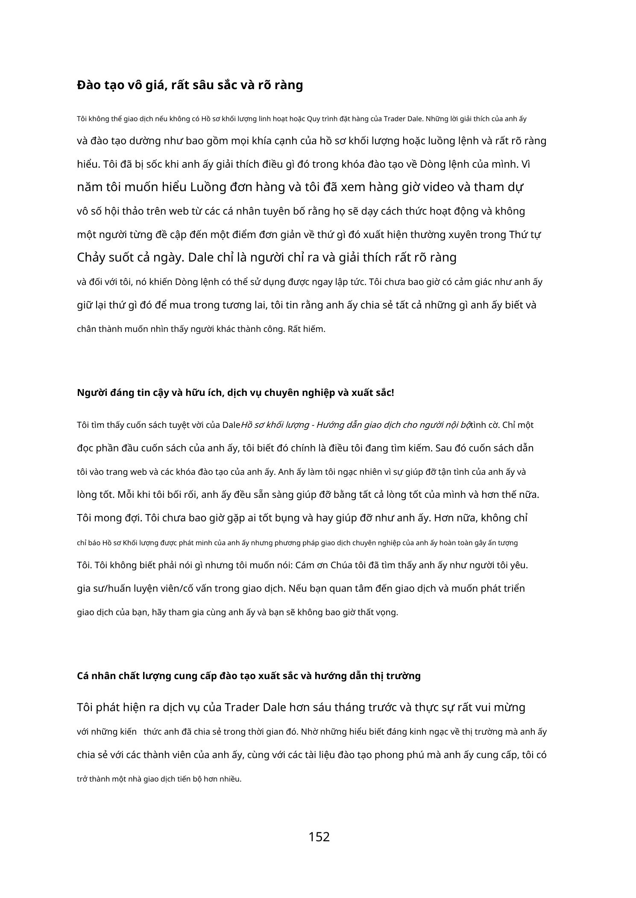

Đào tạo vô giá, rất sâu sắc và rõ ràng
Tôi không thể giao dịch nếu không có Hồ sơ khối lượng linh hoạt hoặc Quy trình đặt hàng của Trader Dale. Những lời giải thích của anh ấy
và đào tạo dường như bao gồm mọi khía cạnh của hồ sơ khối lượng hoặc luồng lệnh và rất rõ ràng
hiểu. Tôi đã bị sốc khi anh ấy giải thích điều gì đó trong khóa đào tạo về Dòng lệnh của mình. Vì
năm tôi muốn hiểu Luồng đơn hàng và tôi đã xem hàng giờ video và tham dự
vô số hội thảo trên web từ các cá nhân tuyên bố rằng họ sẽ dạy cách thức hoạt động và không
một người từng đề cập đến một điểm đơn giản về thứ gì đó xuất hiện thường xuyên trong Thứ tự
Chảy suốt cả ngày. Dale chỉ là người chỉ ra và giải thích rất rõ ràng
và đối với tôi, nó khiến Dòng lệnh có thể sử dụng được ngay lập tức. Tôi chưa bao giờ có cảm giác như anh ấy
giữ lại thứ gì đó để mua trong tương lai, tôi tin rằng anh ấy chia sẻ tất cả những gì anh ấy biết và
chân thành muốn nhìn thấy người khác thành công. Rất hiếm.
Người đáng tin cậy và hữu ích, dịch vụ chuyên nghiệp và xuất sắc!
Tôi tìm thấy cuốn sách tuyệt vời của DaleHồ sơ khối lượng - Hướng dẫn giao dịch cho người nội bộtình cờ. Chỉ một
đọc phần đầu cuốn sách của anh ấy, tôi biết đó chính là điều tôi đang tìm kiếm. Sau đó cuốn sách dẫn
tôi vào trang web và các khóa đào tạo của anh ấy. Anh ấy làm tôi ngạc nhiên vì sự giúp đỡ tận tình của anh ấy và
lòng tốt. Mỗi khi tôi bối rối, anh ấy đều sẵn sàng giúp đỡ bằng tất cả lòng tốt của mình và hơn thế nữa.
Tôi mong đợi. Tôi chưa bao giờ gặp ai tốt bụng và hay giúp đỡ như anh ấy. Hơn nữa, không chỉ
chỉ báo Hồ sơ Khối lượng được phát minh của anh ấy nhưng phương pháp giao dịch chuyên nghiệp của anh ấy hoàn toàn gây ấn tượng
Tôi. Tôi không biết phải nói gì nhưng tôi muốn nói: Cám ơn Chúa tôi đã tìm thấy anh ấy như người tôi yêu.
gia sư/huấn luyện viên/cố vấn trong giao dịch. Nếu bạn quan tâm đến giao dịch và muốn phát triển
giao dịch của bạn, hãy tham gia cùng anh ấy và bạn sẽ không bao giờ thất vọng.
Cá nhân chất lượng cung cấp đào tạo xuất sắc và hướng dẫn thị trường
Tôi phát hiện ra dịch vụ của Trader Dale hơn sáu tháng trước và thực sự rất vui mừng
với những kiến thức anh đã chia sẻ trong thời gian đó. Nhờ những hiểu biết đáng kinh ngạc về thị trường mà anh ấy
chia sẻ với các thành viên của anh ấy, cùng với các tài liệu đào tạo phong phú mà anh ấy cung cấp, tôi có
trở thành một nhà giao dịch tiến bộ hơn nhiều.
152

## Trang 154
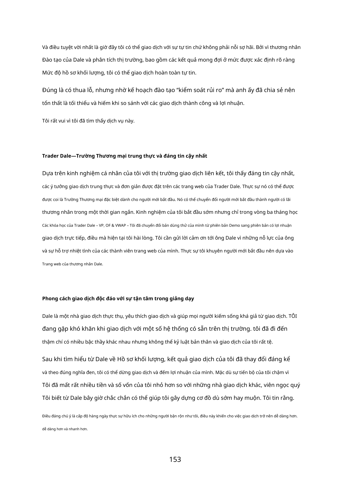

Và điều tuyệt vời nhất là giờ đây tôi có thể giao dịch với sự tự tin chứ không phải nỗi sợ hãi. Bởi vì thương nhân
Đào tạo của Dale và phân tích thị trường, bao gồm các kết quả mong đợi ở mức được xác định rõ ràng
Mức độ hồ sơ khối lượng, tôi có thể giao dịch hoàn toàn tự tin.
Đúng là có thua lỗ, nhưng nhờ kế hoạch đào tạo “kiểm soát rủi ro” mà anh ấy đã chia sẻ nên
tổn thất là tối thiểu và hiếm khi so sánh với các giao dịch thành công và lợi nhuận.
Tôi rất vui vì tôi đã tìm thấy dịch vụ này.
Trader Dale—Trường Thương mại trung thực và đáng tin cậy nhất
Dựa trên kinh nghiệm cá nhân của tôi với thị trường giao dịch liên kết, tôi thấy đáng tin cậy nhất,
các ý tưởng giao dịch trung thực và đơn giản được đặt trên các trang web của Trader Dale. Thực sự nó có thể được
được coi là Trường Thương mại đặc biệt dành cho người mới bắt đầu. Nó có thể chuyển đổi người mới bắt đầu thành người có lãi
thương nhân trong một thời gian ngắn. Kinh nghiệm của tôi bắt đầu sớm nhưng chỉ trong vòng ba tháng học
Các khóa học của Trader Dale – VP, OF & VWAP – Tôi đã chuyển đổi bản dùng thử của mình từ phiên bản Demo sang phiên bản có lợi nhuận
giao dịch trực tiếp, điều mà hiện tại tôi hài lòng. Tôi cần gửi lời cảm ơn tới ông Dale vì những nỗ lực của ông
và sự hỗ trợ nhiệt tình của các thành viên trang web của mình. Thực sự tôi khuyên người mới bắt đầu nên dựa vào
Trang web của thương nhân Dale.
Phong cách giao dịch độc đáo với sự tận tâm trong giảng dạy
Dale là một nhà giao dịch thực thụ, yêu thích giao dịch và giúp mọi người kiếm sống khá giả từ giao dịch. TÔI
đang gặp khó khăn khi giao dịch với một số hệ thống có sẵn trên thị trường. tôi đã đi đến
thậm chí có nhiều bậc thầy khác nhau nhưng không thể kỷ luật bản thân và giao dịch của tôi rất tệ.
Sau khi tìm hiểu từ Dale về Hồ sơ khối lượng, kết quả giao dịch của tôi đã thay đổi đáng kể
và theo đúng nghĩa đen, tôi có thể dừng giao dịch và đếm lợi nhuận của mình. Mặc dù sự tiến bộ của tôi chậm vì
Tôi đã mất rất nhiều tiền và số vốn của tôi nhỏ hơn so với những nhà giao dịch khác, viên ngọc quý
Tôi biết từ Dale bây giờ chắc chắn có thể giúp tôi gây dựng cơ đồ dù sớm hay muộn. Tôi tin rằng.
Điều đáng chú ý là cấp độ hàng ngày thực sự hữu ích cho những người bận rộn như tôi, điều này khiến cho việc giao dịch trở nên dễ dàng hơn.
dễ dàng hơn và nhanh hơn.
153

## Trang 155

Cảm ơn Dale vì sự hỗ trợ tuyệt vời của bạn. Tôi thường không đánh giá người cố vấn trên bất kỳ trang web đánh giá nào,
nhưng nếu đánh giá của tôi có giá trị và hỗ trợ chương trình của bạn theo bất kỳ cách nào thì đó là cử chỉ nhỏ của tôi
thể hiện lòng biết ơn vì sự chăm chỉ của bạn đã dạy tôi cách kiếm lợi nhuận tốt.
Xuất sắc
Không có sự cường điệu nào với anh chàng này, không có. Điều đó rất dễ hiểu, đối với tôi, tôi đã giao dịch
và nghiên cứu được khoảng hai năm và tôi đã sử dụng Hồ sơ Tập, nhưng anh chàng này
vừa giải thích mọi thứ về TA và các tổ chức cũng như cách họ giao dịch và những thứ
tiếp tục những hậu trường mà tôi cho rằng đó là cách anh ấy giải thích, vậy nên anh chàng này đã
về cơ bản đã xác nhận mọi nghi ngờ của tôi về cách thị trường thực sự chuyển động và tại sao. MỘT
rất nhiều người kể từ khi tôi học TA đã đi sâu vào nó và họ thực sự bắt đầu
đối xử và suy nghĩ về thị trường như thể nó sẽ tự vận hành mà không cần có người tham gia và
đó chỉ là một cỗ máy lớn tự chạy, hoặc tại sao 90% tất cả những con TA nhảm nhí*** ngoài kia
không hiệu quả và những câu hỏi tôi đã hỏi khi tìm hiểu nội dung này và tại sao rất nhiều câu hỏi không hiệu quả
Thực sự phù hợp. Dù sao đi nữa, nếu có ai ở vào hoàn cảnh tôi không muốn làm việc cho một công ty, nhưng
rất mong muốn tìm hiểu cách thức và lý do tại sao thị trường thực sự chuyển động thì hãy theo dõi anh chàng này. Và
Điểm cộng là khi bạn hoàn toàn hiểu rằng bạn thực sự phải chạy theo số tiền lớn và dừng lại
nghĩ rằng bạn sẽ thực sự làm được điều gì đó ngoài kia, bạn cũng sẽ ngạc nhiên về việc nó dễ dàng đến thế nào
giao dịch thực sự là vậy. Cảm ơn một lần nữa, Dale, tôi đã chờ đợi để tìm được một người như bạn khoảng
hai năm rồi.
154

## Trang 156
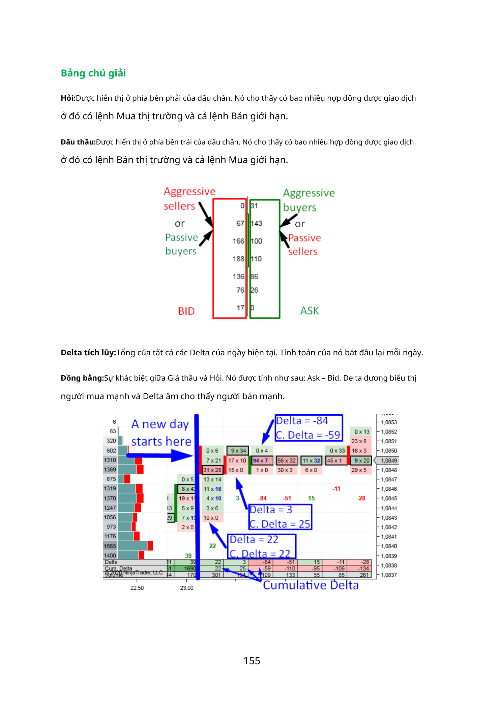

Bảng chú giải
Hỏi:Được hiển thị ở phía bên phải của dấu chân. Nó cho thấy có bao nhiêu hợp đồng được giao dịch
ở đó có lệnh Mua thị trường và cả lệnh Bán giới hạn.
Đấu thầu:Được hiển thị ở phía bên trái của dấu chân. Nó cho thấy có bao nhiêu hợp đồng được giao dịch
ở đó có lệnh Bán thị trường và cả lệnh Mua giới hạn.
Delta tích lũy:Tổng của tất cả các Delta của ngày hiện tại. Tính toán của nó bắt đầu lại mỗi ngày.
Đồng bằng:Sự khác biệt giữa Giá thầu và Hỏi. Nó được tính như sau: Ask – Bid. Delta dương biểu thị
người mua mạnh và Delta âm cho thấy người bán mạnh.
155

## Trang 157
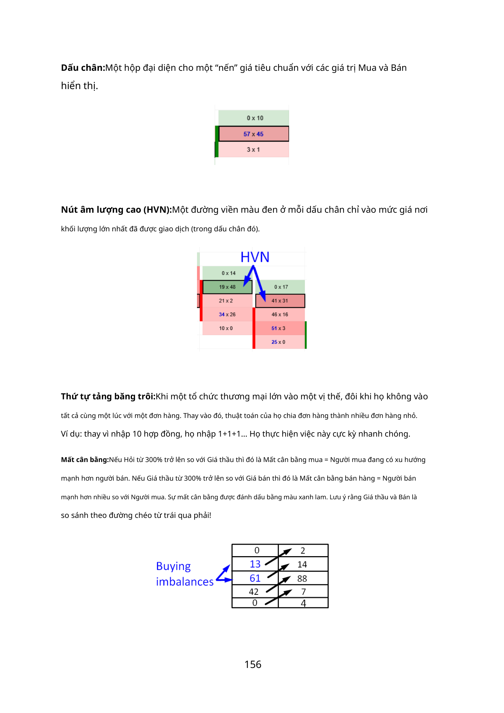

Dấu chân:Một hộp đại diện cho một “nến” giá tiêu chuẩn với các giá trị Mua và Bán
hiển thị.
Nút âm lượng cao (HVN):Một đường viền màu đen ở mỗi dấu chân chỉ vào mức giá nơi
khối lượng lớn nhất đã được giao dịch (trong dấu chân đó).
Thứ tự tảng băng trôi:Khi một tổ chức thương mại lớn vào một vị thế, đôi khi họ không vào
tất cả cùng một lúc với một đơn hàng. Thay vào đó, thuật toán của họ chia đơn hàng thành nhiều đơn hàng nhỏ.
Ví dụ: thay vì nhập 10 hợp đồng, họ nhập 1+1+1… Họ thực hiện việc này cực kỳ nhanh chóng.
Mất cân bằng:Nếu Hỏi từ 300% trở lên so với Giá thầu thì đó là Mất cân bằng mua = Người mua đang có xu hướng
mạnh hơn người bán. Nếu Giá thầu từ 300% trở lên so với Giá bán thì đó là Mất cân bằng bán hàng = Người bán
mạnh hơn nhiều so với Người mua. Sự mất cân bằng được đánh dấu bằng màu xanh lam. Lưu ý rằng Giá thầu và Bán là
so sánh theo đường chéo từ trái qua phải!
156

## Trang 158
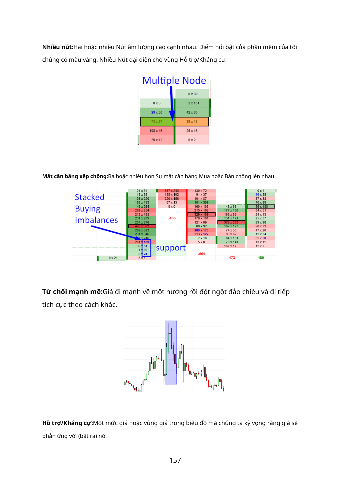

Nhiều nút:Hai hoặc nhiều Nút âm lượng cao cạnh nhau. Điểm nổi bật của phần mềm của tôi
chúng có màu vàng. Nhiều Nút đại diện cho vùng Hỗ trợ/Kháng cự.
Mất cân bằng xếp chồng:Ba hoặc nhiều hơn Sự mất cân bằng Mua hoặc Bán chồng lên nhau.
Từ chối mạnh mẽ:Giá đi mạnh về một hướng rồi đột ngột đảo chiều và đi tiếp
tích cực theo cách khác.
Hỗ trợ/Kháng cự:Một mức giá hoặc vùng giá trong biểu đồ mà chúng ta kỳ vọng rằng giá sẽ
phản ứng với (bật ra) nó.
157

## Trang 159
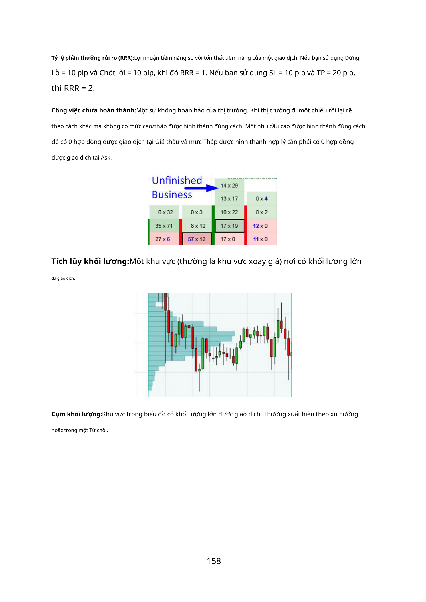

Tỷ lệ phần thưởng rủi ro (RRR):Lợi nhuận tiềm năng so với tổn thất tiềm năng của một giao dịch. Nếu bạn sử dụng Dừng
Lỗ = 10 pip và Chốt lời = 10 pip, khi đó RRR = 1. Nếu bạn sử dụng SL = 10 pip và TP = 20 pip,
thì RRR = 2.
Công việc chưa hoàn thành:Một sự không hoàn hảo của thị trường. Khi thị trường đi một chiều rồi lại rẽ
theo cách khác mà không có mức cao/thấp được hình thành đúng cách. Một nhu cầu cao được hình thành đúng cách
để có 0 hợp đồng được giao dịch tại Giá thầu và mức Thấp được hình thành hợp lý cần phải có 0 hợp đồng
được giao dịch tại Ask.
Tích lũy khối lượng:Một khu vực (thường là khu vực xoay giá) nơi có khối lượng lớn
đã giao dịch.
Cụm khối lượng:Khu vực trong biểu đồ có khối lượng lớn được giao dịch. Thường xuất hiện theo xu hướng
hoặc trong một Từ chối.
158

## Trang 160

Cảm ơn!
Tại nơi này, tôi muốn cảm ơn bạn đã đọc cuốn sách của tôi. Tôi hy vọng bạn thích nó và bạn
thấy nó hữu ích Tôi ước nó sẽ giúp bạn đạt được các mục tiêu và ước mơ tài chính của mình cho dù thế nào đi chăng nữa
họ lớn thật đấy!
Chúc bạn giao dịch vui vẻ!
- Dale
159

## Trang 161
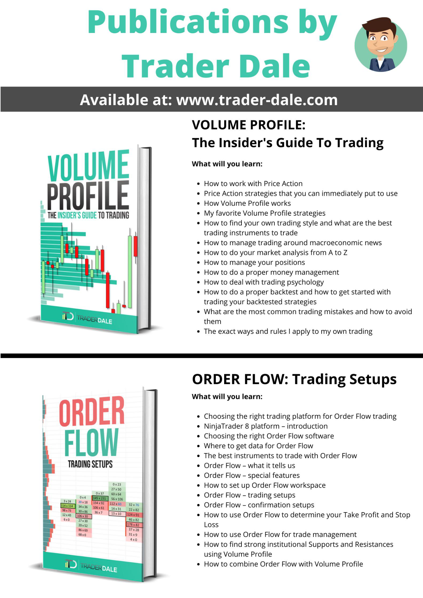

*(trang chi co hinh)*