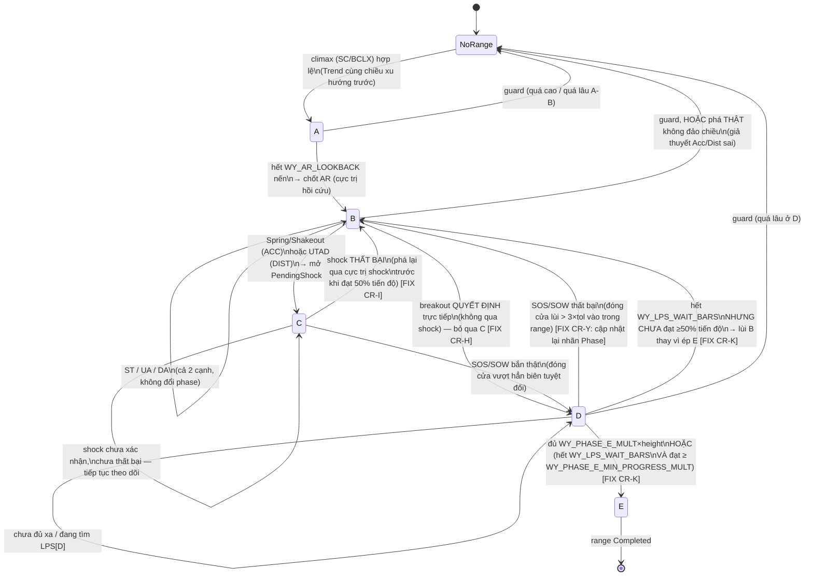

# WYCKOFF DRAW SPEC v2 — Đặc tả bộ vẽ Range + Phase A-E + Sự kiện

> **Phạm vi:** tài liệu này CHỈ đặc tả lớp **VẼ/ĐÁNH DẤU** (hiển thị, giáo dục) cho một indicator Quantower —
> xác định đúng biên Trading Range, đúng trình tự Phase A→E, đúng vị trí các sự kiện (SC/BCLX, AR, ST,
> Spring/Shakeout/UT/UTAD, SOS/SOW, LPS/LPSY). **KHÔNG** đề xuất bất kỳ gate/entry/filter giao dịch nào —
> mọi ngưỡng trong tài liệu chỉ phục vụ việc "có nên vẽ nhãn X tại đây không", không phải "có nên vào lệnh
> không". Nơi nào một khái niệm (WY03, WY09, WY10/WY12...) từng được đề xuất làm gate tín hiệu ở tài liệu
> khác, ở đây nó chỉ được dùng lại dưới dạng **nhãn hiển thị**.
>
> **Nguồn tổng hợp:**
> 1. `data-export/wyckoff/THEORY.md` — chưng cất lý thuyết gốc (1.pdf, 3.pptx, 5.pdf, 6.pdf, 8.pdf, 12.pdf).
> 2. `data-export/wyckoff/CHART_CASES.md` — ~70 ca bài chữa học viên thật (7.pdf, 4.pdf, 2.pdf, Journal.pptx).
> 3. Đọc trực tiếp `quantower-entry-signal/research/wyckoff/v8/wyckoff/wyckoff_schematic.py` (319 dòng, prototype
>    Python) + 2 ảnh mẫu `rule-entry/wyckoff-schematic-examples/example-ACC-04-08.png`,
>    `example-DIST-04-01.png` + đối chiếu `quantower-entry-signal/WyckoffRunner.cs` (hàm `ScanWyckoff`,
>    `WyTryLpsAndPhaseE`, `WyEmitLps`, dòng 1040-1296, đọc lại trực tiếp khi soạn tài liệu này để đảm bảo mọi
>    mô tả code khớp 100% với code đang chạy).
> 4. `data-export/wyckoff/WYCKOFF_RULES.md` (mã `WY01..WY17`, khuôn theo `RULES.md` của pro trader) — dùng làm
>    nguồn ký hiệu cho các luật đối chiếu (WY03, WY09, WY10, WY12...).
>
> **Quy ước ký hiệu trong tài liệu này:** `ACC` = nhánh Tích luỹ (Accumulation), `DIST` = nhánh Phân phối
> (Distribution) — hai nhánh đối xứng nhau qua trục giá. Mọi hằng số giữ tiền tố `WY_` để tương thích code
> hiện tại; hằng số **MỚI** đề xuất trong tài liệu này được đánh dấu rõ **[MỚI]**.

---

## 1. Định nghĩa chuẩn (đã phân xử mâu thuẫn)

### 1.0 Nguyên tắc phân xử chung

Khi 2 nguồn (lý thuyết gốc vs sơ đồ minh hoạ, hoặc lý thuyết vs dữ liệu thực chiến) mâu thuẫn nhau, thứ tự
ưu tiên áp dụng xuyên suốt tài liệu này:

1. **Câu ĐỊNH NGHĨA GỐC** (trích dẫn nguyên văn trong THEORY.md) thắng **câu mô tả HỆ QUẢ ĐIỂN HÌNH** (ca
   thường gặp) — không lấy hệ quả điển hình áp làm điều kiện bắt buộc.
2. Khi định nghĩa gốc mơ hồ (không định lượng), **cơ chế đấu giá** (ai đang thắng cung/cầu, giá đã "đến"
   đâu) thắng **câu chữ/tên gọi tự phát của học viên**.
3. Khi lý thuyết nói một điều là "bước chuẩn trong chuỗi" nhưng dữ liệu thực chiến (CHART_CASES, hoặc
   `WYCKOFF_V6_PLAN.md`) cho thấy dùng nó làm **gate bắt buộc để vào lệnh** là sai — tài liệu này **giữ đúng
   định nghĩa vẽ** (vẽ đúng vị trí khi nó xảy ra) nhưng **không** biến nó thành điều kiện bắt buộc phải tồn
   tại trước khi vẽ Phase kế tiếp. Đây chính là lý do Phase C trong spec này **không bắt buộc phải xuất
   hiện** trong lịch sử Phase của mọi range (xem §1.5, §3.4).

### 1.1 Trading Range (TR)

**ĐỊNH NGHĨA GỐC** (THEORY §3.1): "nơi chuyển động trước đó đã bị dừng lại và có sự cân bằng tương đối giữa
cung và cầu... cần hai điểm được yêu cầu để xây kênh." — mơ hồ về "hai điểm" là gì.

**Phân xử bằng cơ chế:** hai điểm đó chính là **2 mức giá do 2 sự kiện xác nhận khác nhau tạo ra**, không
phải "2 đỉnh" hay "2 đáy" tuỳ chọn:
- Cạnh thứ nhất = cực trị của nến **climax** (SC → `Low`; BCLX → `High`) — bằng chứng xu hướng trước đã
  dừng (Phase A).
- Cạnh thứ hai = cực trị của **AR/AR-reaction** — bằng chứng phe đối lập đã phản ứng đủ mạnh để tạo biên
  tạm thời phía kia.

TR được coi là "mở" (active) ngay khi có đủ 2 điểm này (climax + AR), **trước khi** biết được Phase B sẽ dài
bao lâu hay có Spring/UT hay không. Biên có thể được mở rộng thêm sau đó bởi ST/UA/DA/Spring/Shakeout/UT/
UTAD/SOS/SOW (xem §3).

**Biên ngang vs biên xiên:** mặc định TR có biên **ngang** (2 mức giá cố định `r.Low`/`r.High`). CHART_CASES
ghi nhận ít nhất 3 ca (7.pdf Ca#6, Journal Buổi 3, Journal J22) dùng kênh **xiên** (down-sloping / up-sloping
channel, 2 trendline hồi quy trên đỉnh/đáy cục bộ) cho cả tích luỹ lẫn phân phối. Spec này **giữ biên ngang
cho v2** (đã có sẵn trong code, đơn giản, không có công thức đo trendline định lượng được trong tài liệu gốc)
— biên xiên đưa vào backlog riêng, xem CR-O ở §2.

### 1.2 Bốn giai đoạn thị trường & Composite Man (bối cảnh, không cần code hoá)

THEORY §1 mô tả 4 giai đoạn tổng quát của thị trường (xu hướng → dừng → đi ngang → chuyển tiếp) và khái niệm
**Composite Man** (nhân cách hoá "tay mạnh", không phải thực thể thật). Đây là khung tư duy nền, **không**
map trực tiếp vào một biến/điều kiện code nào — chỉ dùng để giải thích TẠI SAO một climax + AR lại đủ để mở
TR (Phase A-B-C-D-E chính là "giai đoạn đi ngang" ở mục 3 trong 4 giai đoạn tổng quát).

Ba quy luật nền (Cung-Cầu, Nhân-Quả, Nỗ lực-Kết quả) được dùng xuyên suốt tài liệu này mỗi khi cần giải
thích "tại sao ngưỡng X hợp lý" (vd SOS cần thân nến lớn = Nỗ lực-Kết quả), không phải một khối riêng cần
code.

### 1.3 Phase A

**ĐỊNH NGHĨA GỐC** (THEORY §3.2 / §4.2): "đánh dấu sự dừng lại của xu hướng giảm/tăng trước đó." Với ACC:
cung đang chiếm ưu thế nhưng suy giảm, chứng minh bằng SC. Với DIST: cầu chiếm ưu thế nhưng suy giảm, chứng
minh bằng PSY+BCLX.

**Vẽ:** Phase A = khoảng từ nến climax (SC/BCLX) đến nến AR (bao gồm cả 2 mốc).

**Biến thể không có climax (BIẾN THỂ, không phải lỗi):** THEORY §4.2 ghi nhận xu hướng tăng trước phân phối
đôi khi kết thúc **không có** cao trào — nguồn cầu cạn kiệt dần (SOT). Code hiện tại (và spec này) **chỉ**
mở TR khi có climax rõ ràng (`Rng ≥ 1.4×avgRange` và `Vratio ≥ VsaClimax`) — biến thể "cạn kiệt lặng lẽ"
**không** được vẽ thành TR ở v2 này (giới hạn đã biết, không sửa trong spec này — xem CR-U2 ở §2 nếu muốn mở
rộng sau).

### 1.4 Phase B

**ĐỊNH NGHĨA GỐC:** "xây dựng nguyên nhân" — tổ chức lớn kiểm tra cung/cầu nhiều lần trong biên đã thiết
lập. **HỆ QUẢ ĐIỂN HÌNH (không bắt buộc):** thường có nhiều ST; thường là Phase **dài nhất**.

**Vẽ:** Phase B = khoảng từ hết Phase A đến khi có **Spring/Shakeout/UTAD** (mở Phase C) HOẶC đến khi có
**breakout quyết định trực tiếp** (mở thẳng Phase D, xem §1.5 và §3.4 — đây là điểm sửa quan trọng nhất so
với code hiện tại).

### 1.5 Phase C

**ĐỊNH NGHĨA GỐC** (THEORY §3.2/§4.2): "thử nghiệm nguồn cung/cầu còn lại" — Spring/Shakeout (ACC) hoặc
UT/UTAD (DIST). **CẢNH BÁO QUAN TRỌNG NHẤT của toàn bộ THEORY.md (§10 mục 4, lặp lại ở cả `1.pdf` và
`6.pdf`):** *"không phải cấu trúc nào cũng có Spring hoặc Shakeout"* — tức Phase C là **HỆ QUẢ ĐIỂN HÌNH**,
KHÔNG phải bước bắt buộc.

**Phân xử → thay đổi thiết kế so với code hiện tại:** nếu range đi thẳng từ Phase B sang một breakout quyết
định (SOS/SOW) mà **không hề** có Spring/Shakeout/UTAD trước đó, Phase C **không được vẽ** — Phase B chuyển
thẳng sang Phase D tại đúng nến breakout. Điều này **chỉ khả thi được** sau khi sửa lỗi bất đối xứng theo
dõi 2 biên ở Phase B (CR-H, §2 và §3.4) — code hiện tại không có cách nào phát hiện breakout trực tiếp kiểu
này vì nó chỉ theo dõi 1 cạnh (cạnh có khả năng sinh Spring/UTAD) trong Phase B.

**Độ dài Phase C khi CÓ xảy ra:** không còn cố định 1 nến như code hiện tại — Phase C kéo dài từ nến
Spring/Shakeout/UTAD cho đến khi **hoặc** SOS/SOW thật sự bắn (chuyển Phase D) **hoặc** shock bị xác nhận
THẤT BẠI (lùi về Phase B) — xem cơ chế WY10/WY12 ở §1.15 và thuật toán chi tiết ở §3.5.

### 1.6 Phase D

**ĐỊNH NGHĨA GỐC:** sau test Phase C thành công → "sự áp đảo của cầu so với cung" (ACC) hay "nguồn cung
chiếm ưu thế rõ ràng" (DIST), thể hiện bằng SOS/SOW (spread + volume tăng) và LPS/LPSY (nguồn cung/cầu đối
lập giảm dần). **HỆ QUẢ ĐIỂN HÌNH (không bắt buộc — Ca #21, 7.pdf):** LPS/LPSY (hay BU) **không bắt buộc**
phải xuất hiện; một SOS phá biên rồi tăng/giảm thẳng không hồi lại vẫn là Phase D hợp lệ.

**Vẽ:** Phase D = từ nến SOS/SOW (đóng cửa vượt hẳn cạnh tuyệt đối của range, thân nến đủ lớn) đến khi chốt
Phase E.

### 1.7 Phase E

**ĐỊNH NGHĨA GỐC:** giá rời hẳn TR, "nguồn cung/cầu đối lập được kiểm soát hoàn toàn". **Mơ hồ (THEORY §10
mục 5):** không định lượng "đi bao xa mới coi là rời hẳn".

**Vẽ:** hiện tại dùng tiêu chí `di chuyển ≥ WY_PHASE_E_MULT(=1.0) × chiều cao range tính từ mức SOS/SOW`
HOẶC **ép buộc** khi hết `WY_LPS_WAIT_BARS(=25)` nến dù chưa đi đủ xa. Spec này **giữ tiêu chí đủ xa** (hợp
lý, có neo vào chiều cao range thật) nhưng **thay** tiêu chí ép-buộc-theo-timeout thuần tuý bằng một tiêu
chí mềm hơn — xem §2 (CR-K) và §3.6.

### 1.8 SC (Selling Climax) / BCLX (Buying Climax)

**ĐỊNH NGHĨA GỐC:** SC — "chênh lệch biên độ giá mở rộng + khối lượng tăng mạnh, áp lực bán lên đỉnh điểm...
bán tháo hoảng loạn thu hút CO mua vào giá thấp." BCLX — đối xứng, mua tăng cực điểm, CO bán ra.

**Lỗi cần tránh (CHART_CASES lỗi #3, 7.pdf, ≥2 ca):** SC/BCLX **chỉ hợp lệ** nếu **trước đó thật sự là một
downtrend/uptrend** (không phải range đang hình thành ngay sau 1 đợt SOS/uptrend khác — đó là tái tích luỹ,
không có SC thật, chỉ nên gọi AR/ST). → **Cơ chế phân xử:** dùng field xu hướng dài hạn (`Trend`, so `close`
hiện tại với `close` 480 nến trước — proxy TPO bias, đã có sẵn trong C#) làm điều kiện bắt buộc: SC chỉ hợp
lệ khi `Trend == -1` tại nến climax; BCLX chỉ hợp lệ khi `Trend == 1`.

**Biến thể — SC/BCLX là cả một VÙNG (CHART_CASES Ca#12, 2.pdf: "khi SC là một vùng TR nhỏ, điểm ST1 phải
được đánh là SC"):** hiếm gặp, spec v2 **không** xử lý biến thể vùng — vẫn coi SC/BCLX là 1 nến climax đơn
(xem CR-N ở §2, độ ưu tiên thấp).

### 1.9 AR (Automatic Rally) / AR-reaction

**ĐỊNH NGHĨA GỐC:** ACC — "áp lực bán giảm mạnh → sóng mua đẩy giá lên; đỉnh AR xác lập biên trên tạm thời."
DIST — đối xứng, đáy của đợt bán tháo sau BCLX xác lập biên dưới tạm thời.

**Cách chốt AR hiện tại (code + Report 3 mục 1):** chờ đúng `WY_AR_LOOKBACK(=40)` nến cố định rồi lấy cực
trị (cao nhất/thấp nhất) trong TOÀN BỘ cửa sổ 40 nến làm AR — **không phải phát hiện hình dạng bật giá thật**.
**Rủi ro đã quan sát bằng ảnh** (`example-ACC-04-08.png`): cực trị đó có thể chỉ là 1 cây bấc nhiễu ngay sát
climax (cách đúng 1 nến), không giống một cú Automatic Rally thật. Xem đề xuất vá ở CR-U (§2, §3.3).

### 1.10 ST (Secondary Test) — ST[A] vs ST[B], UA/DA

**ĐỊNH NGHĨA GỐC:** kiểm tra lại cung/cầu tại vùng SC/BCLX; do CO đã mua/bán mạnh nên spread/volume thường
**giảm** khi giá quay lại tiệm cận vùng đó. Có thể có nhiều ST.

**Phân biệt ST[A] và AR (CHART_CASES lỗi #4, 7.pdf Ca#12):** điểm đầu tiên ngay sau BCLX/SC luôn là **AR**;
ST chỉ là lần quay lại test **sau đó**. Code hiện tại vốn đã tách đúng theo thứ tự (AR luôn gán tại hết cửa
sổ 40 nến, ST chỉ gán trong Phase B sau đó) — **ĐÃ ĐÚNG**, không cần sửa.

**Tên gọi phụ thuộc VỊ TRÍ trong range, không phải "cứ gọi chung ST" (CHART_CASES lỗi #6, 7.pdf Ca#7):**
- Test **thủng biên dưới** rồi bật lại trong TR → **Spring** (ACC) — không phải ST.
- Test **thủng biên trên** rồi bật lại trong TR → **UT** (DIST) — không phải ST.
- Test **chạm gần biên nhưng KHÔNG thủng** (trong dung sai) → **ST** (đúng tên, cho cả 2 biên).

**Test ở biên "kia" (biên không sinh ra Spring/UT của range đó) — THEORY §5 đặt tên riêng:**
- Trong Phase B của **ACC**: test ở **đỉnh** (biên trên) gọi là **UA** (Upper-Area test — tên lấy trực tiếp
  từ THEORY §5 bảng "Test ở đỉnh (UA)"). Ý nghĩa: nếu UA xuất hiện và biên **dưới** không hề bị chạm lại
  (đáy giữ nguyên cao) → dấu hiệu lực mua đáy rất mạnh, dùng cho WY09 (§3.7).
- Trong Phase B của **DIST**: test ở **đáy** (biên dưới), THEORY §5 chỉ mô tả bằng chữ ("dạng SOW") không
  cho acronym — spec này đặt tên đối xứng là **DA** (Down-Area test) `[Claude đặt tên — không có trong tài
  liệu gốc, chỉ để đối xứng với UA cho code/hiển thị]`.
- UA/DA **không** chuyển Phase (giống cách UT-thường được xử lý hiện tại — chỉ ghi nhận, ở lại Phase B).
  Đây là điểm code hiện tại **CHƯA CÓ** hoàn toàn (xem CR-H, §2) vì nó không theo dõi cạnh "kia" trong Phase
  B.

**Cam kết ở kháng cự quyết định UT vs ST (CHART_CASES Ca#J23, mở rộng lỗi #5 4.pdf):** nguyên văn giảng
viên: *"UT[B] LÀ ST[B] ĐỂ Ý NÓ CAM KẾT Ở KHÁNG CỰ"* — nếu nến **đóng cửa giữ được** ở/trên kháng cự (không
bị đẩy lùi ngay) → ST (giữ được), không phải UT. Code hiện tại **ĐÃ ĐÚNG** triết lý này: điều kiện UT/UTAD
bắt buộc `b.C < r.High` (đóng cửa KHÔNG cam kết, bị đẩy lùi) — nếu `b.C >= r.High` thì rơi vào nhánh ST/mở
rộng biên (tức "cam kết"), không phải UT. Giữ nguyên logic này.

### 1.11 Spring / Shakeout (ACC) & UT / UTAD (DIST)

**ĐỊNH NGHĨA GỐC:** Spring/Shakeout — giá xuống dưới mức thấp nhất TR rồi đảo chiều đóng cửa trong TR
(đánh lừa công chúng nghĩ downtrend tiếp diễn). UT/UTAD — đối xứng ở biên trên.

**3 loại Spring (THEORY §3.5):** #1 kiệt sức bán (volume/range **rất thấp**); #2 thâm nhập vừa phải
(volume/range **tăng vừa phải**, cần test lặp lại); #3/Terminal Shakeout (volume **đột biến**, phá **sâu**).
Code hiện tại gộp #1+#2 thành "Spring" và #3 thành "Shakeout", phân loại bằng `depth ≥ 15 tick HOẶC Vratio ≥
1.5×VsaClimax` — chấp nhận được như một xấp xỉ 2 mức (nhẹ/nặng) thay vì 3 mức chi tiết của lý thuyết; **giữ
nguyên** ở v2 (tách 3 mức tinh hơn không có ngưỡng định lượng rõ trong tài liệu gốc để làm căn cứ, xem
CR-U3).

**Điều kiện BẮT BUỘC, code hoá trực tiếp được (CHART_CASES lỗi #6, 2.pdf, lỗi PHỔ BIẾN NHẤT toàn corpus —
4/22 ca riêng 2.pdf + 2 ca Journal + 1 ca tự-phát-hiện-đúng J12):**
> "Spring bắt buộc phải là điểm giá **THẤP NHẤT trong suốt Trading Range**" — nếu đáy nghi ngờ không phá
> đáy SC/ST cũ, dù hình dáng giống Spring vẫn KHÔNG được gọi Spring, chỉ là ST/LPS thường.

Đối xứng cho UT/UTAD: SOS/MSOS (và ngầm định cả UTAD-là-đỉnh-mới) **chỉ hợp lệ khi phá đỉnh CAO NHẤT từng
có của toàn range** (CHART_CASES lỗi #7, 2.pdf Ca#18), không phải đỉnh cục bộ trong Phase B.

Code hiện tại **ĐÃ ĐÚNG cả hai** vì `r.Low`/`r.High` là cực trị chạy (running min/max) được cập nhật liên
tục kể từ đầu range, và điều kiện Spring/UT so `b.L`/`b.H` với đúng `r.Low`/`r.High` hiện hành (không phải
một đường kẻ tĩnh vẽ tuỳ ý).

**Bất đối xứng thiết kế hiện tại (Report 3 mục 2, ĐÃ ĐÚNG Ý ĐỒ nhưng cần làm rõ trong spec):** Spring **hay**
Shakeout — bất kỳ loại nào — đều lập tức xem là quyết định (chuyển Phase C). Ở DIST, chỉ **UTAD** chuyển
Phase C; **UT thường** (không đủ sâu/đủ volume) chỉ ghi nhận rồi **ở lại Phase B** chờ test tiếp. **Giữ
nguyên bất đối xứng này** — nó phản ánh đúng lý thuyết: Spring luôn được coi là "phát súng dứt khoát" (kể cả
loại nhẹ #1), trong khi ở phía trên, một cú vượt biên chưa đủ mạnh (UT) chỉ là nhiễu, cần đợi cú UTAD dứt
khoát hơn mới coi là quyết định. Đây KHÔNG phải bug, không sửa.

**LỖ HỔNG LỚN NHẤT (yêu cầu trọng tâm của đề bài) — chưa có kiểm tra "cấu trúc thất bại SAU KHI đã gắn
nhãn":** xem §1.15 và §3.5 — đây là phần thiết kế MỚI quan trọng nhất của tài liệu này.

### 1.12 SOS (Sign of Strength) / SOW (Sign of Weakness) — kể cả "minor"

**ĐỊNH NGHĨA GỐC:** SOS — "giá cam kết ở trên mức cao nhất TR một thời gian, spread + volume tăng đều."
SOW — đối xứng ở biên dưới.

**Điều kiện hiện tại (giữ nguyên, ĐÃ ĐÚNG):** đóng cửa vượt HẲN cạnh tuyệt đối của range (+ đệm `tol`=10
tick) VÀ thân nến `Brat ≥ WY_SOS_BODY_MIN(=0.45)` VÀ cách sự kiện gần nhất ≥5 nến (`gapOk`).

**"Minor SOS/SOW" (CHART_CASES mục h, ≥4 ca rải rác — 7.pdf Ca#16, 2.pdf Ca#12, Journal J5/J9):** một nhịp
tăng/giảm mạnh **trong nội bộ range** (chưa phá biên tuyệt đối) vẫn có thể gọi "minor SOS/SOW" để ghi nhận
lực — **khác hẳn** SOS/SOW "chính thức" (phải phá biên tuyệt đối). Đây là 2 tầng khái niệm dễ nhầm nếu
không tách nhãn rõ. Spec này đề xuất thêm nhãn hiển thị PHỤ (không đổi Phase, không tính vào điều kiện
breakout) — xem CR-L (§2), độ ưu tiên THẤP/optional.

### 1.13 LPS (Last Point of Support) / LPSY (Last Point of Supply) — point vs area, LPS[C] vs LPS[D]

**ĐỊNH NGHĨA GỐC:** thoái lui sau SOS/SOW (hoặc trong TR) thể hiện nguồn cung/cầu đối lập đã giảm dần —
"điểm vào lệnh đẹp nhất" theo hệ quả điển hình (không phải bắt buộc phải tồn tại, xem §1.6).

**Vẽ điểm hay vùng (CHART_CASES lỗi #1, 7.pdf Ca#5/#11/#20, củng cố thêm Journal J8):** nếu quanh điểm test
có **≥3 nến** dao động hẹp cùng vùng giá → vẽ **VÙNG** (rectangle); nếu chỉ 1 cú test đơn (bật ngay) → vẽ
**ĐIỂM**. Code hiện tại **ĐÃ ĐÚNG** (`WY_LPS_AREA_MIN_BARS = 3`).

**LPS[C] vs LPS[D] (CHART_CASES mục 2b + 2d + lỗi #4 4.pdf — gap CHƯA CÓ trong code hiện tại):** 9/70 ca
(~13%, riêng 2.pdf gần 1/3 số ca) đều là dạng sửa "học viên gọi tên hành động thô (Test/SP/Spring) → giảng
viên đổi thành **LPS[C]**" cho điểm test **cuối cùng ngay trước SOS/SOW**, phân biệt với các LPS/LPSY xảy ra
**sau khi đã có SOS/SOW** (thuộc Phase D). Code hiện tại chỉ có 1 loại nhãn "LPS"/"LPSY" — luôn phát sinh
**sau khi** SOS/SOW đã bắn (bên trong `WyTryLpsAndPhaseE`, tức luôn thuộc Phase D theo cách gọi hiện tại) —
**không có khái niệm LPS[C]** cho test xảy ra TRONG khoảng Spring/UTAD → SOS (khoảng mà spec này định nghĩa
lại là Phase C, xem §1.5). Đề xuất: đổi tên 2 loại nhãn tách bạch — `LPS[C]`/`LPSY[C]` (test trong lúc chờ
xác nhận shock, trước SOS/SOW) và `LPS[D]`/`LPSY[D]` (pullback sau SOS/SOW, do `WyTryLpsAndPhaseE` phát
hiện, giữ nguyên logic point/area hiện tại) — xem CR-M (§2), §3.5.

### 1.14 BU (Back-Up) — không bắt buộc

**ĐỊNH NGHĨA GỐC:** hấp thụ nguồn cung còn lại trên TR sau SOS; hình thái là 1 LPS hoặc 1 cấu trúc tuỳ
nguồn cung còn nhiều/ít.

**KHÔNG BẮT BUỘC (CHART_CASES Ca#21, 7.pdf, xác nhận tường minh DUY NHẤT trong toàn corpus):** giảng viên
công nhận 1 case Phase D hợp lệ dù SOS phá biên rồi tăng thẳng, **không hề có** nhịp lùi test BU/LPS. Code
hiện tại **ĐÃ ĐÚNG** (không coi thiếu BU/LPS là điều kiện phủ định Phase D) — **giữ nguyên**, không được
"sửa" theo hướng bắt buộc phải có BU.

### 1.15 Cấu trúc THẤT BẠI (Failed Structure) — cơ chế phân xử trung tâm, LỖ HỔNG LỚN NHẤT cần vá

**ĐỊNH NGHĨA GỐC** (THEORY §9, `3.pptx` slide 28, nguyên văn): *"Nếu không có sự thay đổi về giá ở phía đối
diện và thay vào đó tạo ra một ngã rẽ trước khi đến khu vực đó, chúng ta sẽ nói rằng nó đã phát triển một
cấu trúc thất bại... LPS/LPSY là những thất bại về cấu trúc trong đó giá bị chặn khi đang nỗ lực tìm kiếm
một cú sốc."* Và (THEORY §5, `8.pdf`): *"Giá trị thực sự của một cú rung chuyển được thể hiện ở việc nó có
tiếp diễn hay không... Cú sốc phải có khả năng tạo ra một chuyển động với động lượng nhất định mà ít nhất
đạt đến phía đối diện của cấu trúc."*

**Nguyên tắc ưu tiên đọc** (THEORY §9, nguyên văn): *"Cú sốc là hành động quyết định nhất... nếu phần còn
lại các dấu hiệu tương thích với nó, chúng ta sẽ luôn ưu tiên vận hành theo định hướng của lần rung chuyển
cuối cùng."*

**Vì sao đây là lỗ hổng lớn nhất của code hiện tại:** ngay khi Spring/Shakeout (ACC) hoặc UTAD (DIST) được
gắn nhãn, code hiện tại **chuyển thẳng Phase C rồi D trong vòng 1 nến** và **không còn kiểm tra gì thêm** về
số phận của chính cú shock đó — nếu sau đó giá **phá tiếp qua đáy Spring** (hay đỉnh UTAD) mà **không hồi
lại**, tức chính cú shock đã THẤT BẠI theo đúng định nghĩa THEORY §9 — code hiện tại **không phát hiện việc
này**, chỉ ngồi chờ SOS/SOW hoặc hết `WY_MAX_BARS_D(=2000)` nến rồi mới âm thầm bỏ range qua guard (không
phải qua cơ chế thất bại có chủ đích). Đây chính là mã **WY10/WY12** trong `WYCKOFF_RULES.md` — tài liệu đó
đã tự nhận: *"CÓ THỂ — cần tự đặt ngưỡng"* nhưng chưa được đưa vào bất kỳ code nào.

**Thiết kế đề xuất (chi tiết đầy đủ ở §3.5), tóm tắt cơ chế:**

1. Ngay khi Spring/Shakeout/UTAD được gắn nhãn, tạo một **"shock đang chờ xác nhận"** (`PendingShock`) gắn
   với range, ghi lại: mức cực trị của shock (đáy Spring / đỉnh UTAD), và mức biên **đối diện** tại thời
   điểm đó (đóng băng, không đổi trong lúc chờ).
2. Mỗi nến tiếp theo, đo **tiến độ** = quãng đường giá đã đi (từ cực trị shock hướng về biên đối diện) chia
   cho khoảng cách đầy đủ tới biên đối diện.
   - Nếu tiến độ đạt ngưỡng **WY_SHOCK_PROGRESS_MULT [MỚI] = 0.5** (50% quãng đường) **trước khi** giá phá
     lại qua cực trị shock → coi shock đã **XÁC NHẬN MỘT PHẦN** (đánh dấu hiển thị khác — marker đặc/liền
     nét). Nếu đạt đủ 100% (`WY_PHASE_E_MULT` hiện có, tái dùng) → coi như đã tới hẳn phía đối diện, xác
     nhận đầy đủ.
   - Nếu **đóng cửa** phá NGƯỢC qua chính cực trị của shock (đáy Spring bị phá sâu hơn / đỉnh UTAD bị phá
     cao hơn, quá dung sai `tol`) **trước khi** đạt 50% tiến độ → đây chính là **"ngã rẽ trước khi tới khu
     vực đối diện"** = cấu trúc thất bại theo đúng định nghĩa gốc. Gắn nhãn shock đó là **"(thất bại)"**
     (marker rỗng/xám), và **lùi Phase về B** (không huỷ toàn bộ range — tiếp tục dò Spring/UT mới, nhất
     quán với triết lý "hạ cấp thay vì huỷ" đã có sẵn trong code cho trường hợp SOS thất bại ở Phase D).
3. Không cần thêm 1 cửa sổ-số-nến riêng cho việc này — nó tự nhiên bị chặn bởi các guard đã có
   (`WY_MAX_BARS_AB`/`WY_MAX_BARS_D`): nếu shock treo quá lâu không xác nhận cũng không thất bại rõ ràng,
   range vẫn bị bỏ qua guard thời lượng như hiện tại.

**Vì sao chọn 50% (không phải 80% như đề xuất ban đầu trong `WYCKOFF_RULES.md` WY10):** đề xuất gốc 80% được
viết cho mục đích **gate tín hiệu giao dịch** (cần chắc chắn cao mới vào lệnh). Ở đây mục đích là **hiển
thị/giáo dục** — có thể chấp nhận một ngưỡng "đang tiến triển tốt" khoan dung hơn (50%) để không phải chờ
đến 80% mới tô màu khác, đồng thời 100% (đã có sẵn `WY_PHASE_E_MULT`) vẫn giữ vai trò "xác nhận đầy đủ". Ghi
rõ: **50% là ngưỡng TỰ ĐẶT** cho bản v2 này, dễ chỉnh sau bằng cách đổi 1 hằng số.

### 1.16 No Supply / No Demand, SOT — phụ trợ hiển thị (ngoài lõi state machine)

**No Supply/No Demand (THEORY §5.4, WY04):** điều kiện định lượng hiếm hoi và rõ ràng nhất toàn bộ tài liệu
gốc — nến test có **volume thấp hơn 2 nến liền trước** + range hẹp (No Supply = nến giảm trong bối cảnh có
sức mạnh nền; No Demand = nến tăng trong bối cảnh yếu). Có thể thêm làm **nhãn overlay tuỳ chọn** (không bắt
buộc cho việc vẽ Phase/Range đúng), độ ưu tiên THẤP — xem CR-X (§2).

**SOT — Shortening of the Thrust (THEORY §6, WY06/WY16):** mỗi điểm dừng mới di chuyển ngắn hơn điểm dừng
trước, cần ≥3 lần đẩy mới có ý nghĩa. Đây là một khung phân tích **độc lập** với Phase A-E (áp dụng cho
chuỗi đỉnh/đáy trong 1 xu hướng, không riêng gì trong TR) — **ngoài phạm vi** của spec vẽ Range/Phase này,
không đưa vào state machine ở §3. Ghi nhận để không nhầm lẫn khi có yêu cầu mở rộng sau.

**CHoCH/ChoBEV (CHART_CASES mục i, ~10/70 ca):** khung phân tích riêng biệt (2 vùng CHoCH khác Phase A-E cổ
điển) — **ngoài phạm vi** spec này theo đúng yêu cầu đề bài (chỉ tập trung Phase A-E + sự kiện chuẩn của
state machine hiện tại), không đưa vào §3. Backlog nghiên cứu riêng nếu cần mở rộng.

---

## 2. Danh sách lỗi/cạm bẫy thường gặp và ràng buộc thiết kế (CR = Codifiable Rule)

Bảng dưới gộp: (a) mọi ràng buộc rút ra từ CHART_CASES.md Báo cáo 2, (b) mọi lỗ hổng phát hiện MỚI khi đọc
trực tiếp `WyckoffRunner.cs` (không có trong 3 báo cáo gốc, đánh dấu **[MỚI — phát hiện khi soạn spec này]**).
Cột "Trạng thái" nói rõ ĐÃ CÓ hay CHƯA CÓ trong code C# đang chạy (dòng 1040-1296).

| Mã | Ràng buộc code hoá được | Nguồn/ca | Trạng thái trong C# hiện tại |
|---|---|---|---|
| CR-A | SC/BCLX chỉ hợp lệ nếu nến climax có `Trend` (proxy 480 nến) cùng chiều xu hướng trước đó (`Trend==-1` cho SC, `==1` cho BCLX) — tránh gán SC/BCLX trong tái tích luỹ/tái phân phối | Lỗi #3, 7.pdf (Ca#9, #14) | **ĐÃ CÓ** (`b.Trend==-1`/`==1` tại dòng mở range) |
| CR-B | Spring/Shakeout chỉ hợp lệ nếu `low < min(low toàn range trước đó)` (đáy tuyệt đối, không phải đáy cục bộ) | Lỗi #6, 2.pdf — **lỗi phổ biến nhất corpus** (Ca#4,#16,#19,#20 + J1,J5,J12) | **ĐÃ CÓ** (`b.L < r.Low` với `r.Low` là running-min) |
| CR-C | SOS/MSOS chỉ hợp lệ nếu phá đỉnh CAO NHẤT tuyệt đối của toàn range (đối xứng CR-B) | Lỗi #7 (Ca#18), 2.pdf | **ĐÃ CÓ** (`b.C > r.High + tol` với `r.High` running-max) |
| CR-D | LPS/LPSY vẽ VÙNG nếu ≥3 nến hồi hẹp quanh mức test, vẽ ĐIỂM nếu 1-2 nến | Lỗi #1, 7.pdf (Ca#5,#11,#20) + J8 | **ĐÃ CÓ** (`WY_LPS_AREA_MIN_BARS=3`) |
| CR-E | Phase D KHÔNG bắt buộc có BU/LPS — SOS phá biên rồi chạy thẳng vẫn là Phase D hợp lệ | Ca#21, 7.pdf | **ĐÃ CÓ** (`WyTryLpsAndPhaseE` không đòi `pullBars.Count>0` để đóng Phase E) |
| CR-F | Ranh giới breakout/Phase D neo theo GIÁ ĐÓNG CỬA, không phải cực trị (wick) | Lỗi #5, 4.pdf (Ca#5) + Ca#J23 (UT vs ST "cam kết ở kháng cự") | **ĐÃ CÓ** (mọi điều kiện SOS/SOW/Spring/UT đều dùng `b.C`, không dùng `b.H`/`b.L` để xác nhận đảo chiều) |
| CR-G | Dùng đúng thuật ngữ chuẩn (không tự chế "SP" thay ST[B]...) | Lỗi #8, 2.pdf (Ca#6) | **ĐÃ CÓ một phần** — nhãn code là tên chuẩn cố định, nhưng thiếu phân biệt LPS[C] vs LPS[D] (xem CR-M) |
| **CR-H** | **Trong Phase B, PHẢI theo dõi ĐỘC LẬP cả 2 cạnh của range** (không chỉ cạnh có khả năng sinh Spring/UTAD) — hệ quả: (1) cạnh "kia" cần có ST/UA/DA + mở rộng biên khi có nến mới không đảo chiều; (2) một breakout QUYẾT ĐỊNH (đóng cửa vượt hẳn, thân lớn) ở cạnh "kia" ngay từ Phase B — dù CHƯA từng có Spring/UTAD — phải được coi là SOS/SOW hợp lệ bắn TRỰC TIẾP từ Phase B (bỏ qua Phase C), đúng tinh thần WY03 ("không phải cấu trúc nào cũng có Spring/Shakeout") | Hệ quả trực tiếp của WY03 (THEORY §10 mục 4/9) — **[MỚI — phát hiện khi đọc code, KHÔNG được nêu tường minh ở mức này trong 3 báo cáo]** | **CHƯA CÓ — LỖ HỔNG NGHIÊM TRỌNG.** Đọc trực tiếp `ScanWyckoff` dòng 1194-1253: khối `if (r.Acc)` (Phase B của ACC) chỉ có các nhánh xét `b.L`/`r.Low` — không một dòng nào xét `b.H`/`r.High`; khối `else` (Phase B của DIST) chỉ xét `b.H`/`r.High`, không xét `b.L`/`r.Low`. Hệ quả: nếu 1 range ACC đang ở Phase B mà giá đóng cửa phá HẲN trên `r.High` với thân nến lớn (một SOS thật, không cần Spring trước) → code **không làm gì cả** (rơi qua mọi điều kiện, không cập nhật `r.High`, không cảnh báo, không chuyển Phase) — range có thể bị bỏ oan qua guard `WY_MAX_BARS_AB` dù đang là 1 cấu trúc tích luỹ hợp lệ đi thẳng lên. Đối xứng cho DIST ở cạnh dưới. |
| **CR-I** | **Sau khi Spring/Shakeout/UTAD được gắn nhãn, phải tiếp tục theo dõi shock đó tới khi XÁC NHẬN hoặc THẤT BẠI** — thất bại = giá đóng cửa phá tiếp qua cực trị của chính shock mà chưa đạt tiến độ tối thiểu về phía biên đối diện | WY10/WY12 (`WYCKOFF_RULES.md`) + THEORY §9 (Failed Structure) + THEORY §5 (mục tiêu tối thiểu = đến phía đối diện) — đây là **LỖ HỔNG TRỌNG TÂM** mà đề bài yêu cầu vá | **CHƯA CÓ HOÀN TOÀN.** Ngay khi Spring/Shakeout/UTAD được gắn, code chuyển Phase C→D trong đúng 1-2 nến và không còn logic nào theo dõi lại số phận riêng của chính sự kiện đó. |
| **CR-Y** | Khi SOS/SOW ở Phase D "bắn nhưng không đóng được range" (`closed=false`), code phải **cập nhật lại nhãn Phase** về 'B' trên timeline hiển thị, không chỉ đổi biến nội bộ `r.State` | **[MỚI — phát hiện khi đọc code]** | **CHƯA CÓ.** Dòng `if (fired && !closed) r.State = "B";` — chỉ đổi biến bookkeeping nội bộ, **không gọi** `WySetPhase(r, i, 'B')`. Hệ quả: đoạn Phase hiển thị trên chart vẫn ghi là Phase D kéo dài liên tục dù bên trong thuật toán đã âm thầm quay lại logic "đang ở Phase B chờ test" — timeline Phase hiển thị SAI so với trạng thái thật đang được xử lý. |
| CR-J | Phân biệt hiển thị ST theo VỊ TRÍ trong range (đáy=Spring nếu phá, đỉnh=UT nếu phá; test không phá ở cả 2 biên đều gọi ST) | Lỗi #6, 7.pdf (Ca#7) | **ĐÃ CÓ một phần** cho cạnh "chính" của mỗi loại range; **CHƯA CÓ** cho cạnh "kia" (phụ thuộc fix CR-H) |
| CR-K | Phase E không nên bị ép chốt CHỈ vì hết timeout `WY_LPS_WAIT_BARS` — cần tiêu chí tối thiểu về tiến độ giá | Yêu cầu trọng tâm đề bài + hệ quả CR-E (không đòi LPS nhưng vẫn nên đòi ít nhất MỘT phần tiến triển giá thật) | **CHƯA CÓ** — code hiện tại: `if ((end - sosI) >= WY_LPS_WAIT_BARS) { WySetPhase(r, end, 'E'); return true; }` — ép Phase E vô điều kiện khi hết 25 nến, kể cả khi `movedFar` gần như 0. |
| CR-L | "Minor SOS/SOW" (lực mạnh nội bộ range, chưa phá biên) là khái niệm KHÁC "SOS/SOW chính thức" (phải phá biên tuyệt đối) — không lẫn lộn 2 tầng | Mục h, CHART_CASES (7.pdf Ca#16, 2.pdf Ca#12, J5, J9) | **CHƯA CÓ** — optional, ưu tiên THẤP |
| CR-M | Tách nhãn LPS[C]/LPSY[C] (test trong Phase C, trước SOS/SOW) khỏi LPS[D]/LPSY[D] (pullback sau SOS/SOW) | Mục 2b + 2d, CHART_CASES (9/70 ca, lỗi phổ biến thứ 2 toàn corpus) + lỗi #4, 4.pdf | **CHƯA CÓ** — hiện tại chỉ có 1 loại "LPS"/"LPSY", luôn phát sinh sau SOS/SOW (tương đương LPS[D]); không có LPS[C] |
| CR-N | SC/BCLX có thể là 1 VÙNG dao động nhỏ, không chỉ 1 nến climax đơn | Ca#12, 2.pdf (1 ca duy nhất) | **CHƯA CÓ** — ưu tiên THẤP, edge case hiếm |
| CR-O | Biên range có thể là kênh XIÊN (down/up-sloping), không chỉ đường ngang | 7.pdf Ca#6, Journal Buổi 3, J22 | **CHƯA CÓ** — ưu tiên THẤP/backlog, không có công thức đo trong tài liệu gốc |
| CR-P | WY09 — bất đối xứng test 2 biên (1 biên không hề bị chạm lại trong khi biên kia bị test nhiều) dự báo hướng phá, dùng làm nhãn HIỂN THỊ | WY09 (`WYCKOFF_RULES.md`) + THEORY §5 | **CHƯA CÓ** — phụ thuộc fix CR-H trước (cần dữ liệu test cả 2 biên mới tính được) |
| CR-Q | CHoCH/ChoBEV — khung phân tích riêng, KHÔNG gộp vào Phase A-E chuẩn | Mục i, CHART_CASES (~10/70 ca) | **NGOÀI PHẠM VI** spec này theo yêu cầu đề bài — không code |
| CR-R | Volume tăng dần trong range → 2 cách diễn giải khác nhau (sức mạnh sắp bung / Phase B kéo dài) — không định lượng được, chỉ ghi nhận | Mục e, CHART_CASES | Không code hoá — chỉ lưu ý diễn giải, không đưa vào state machine |
| CR-S | "Failed SOS/UT" (breakout quay ngay lại trong range vài nến) — đã có cơ chế tương đương cho Phase D (`closed=false→state=B`), NHƯNG chưa có cho Phase C (shock Spring/UT) | Mục c, CHART_CASES (Ca#10 2.pdf; J11, J16, M5) | **CÓ MỘT PHẦN** (Phase D) — phần Phase C hợp nhất vào CR-I |
| CR-T | Guard kỹ thuật (chiều cao <3.5% giá, Phase A/B <2500 nến, Phase D <2000 nến) — không có trong lý thuyết gốc, chỉ để tránh range phi lý | Ghi chú tự đặt trong code | **ĐÃ CÓ**, giữ nguyên |
| CR-U | AR = cực trị hồi cứu trong cửa sổ 40 nến cố định — có thể chỉ cách climax 1 nến (nhiễu), không phải hình dạng bật giá thật | Report 3 mục 1 + ảnh `example-ACC-04-08.png` | **ĐÃ CÓ theo đúng thiết kế** (không phải bug) nhưng **rủi ro chưa được giảm nhẹ** — đề xuất vá nhẹ ở §3.3 |
| CR-V | No Supply/No Demand (volume test < 2 nến liền trước) — overlay hiển thị phụ, không bắt buộc cho lõi Phase/Range | WY04, THEORY §5.4 | **CHƯA CÓ** — optional, ưu tiên THẤP |
| CR-W | Renderer phải né chữ khi ≥2 marker sự kiện hoặc ranh giới Phase rơi trong vài nến của nhau (đã quan sát thấy chữ đè nhau trong CẢ HAI ảnh mẫu) | Report 3 Phần 2.A (2 điểm ĐÁNG NGỜ #2 và #4) | **CHƯA CÓ** — thuộc lớp renderer, không phải state machine, nhưng nằm trong phạm vi "vẽ đúng vị trí" của spec này |

**Không đưa vào state machine (ghi nhận nhưng KHÔNG code hoá ở v2):** CR-Q (CHoCH), CR-R (volume diễn giải
định tính). Lý do: CR-Q là một khung phân tích khác hẳn Phase A-E (nằm ngoài yêu cầu đề bài); CR-R không có
ngưỡng định lượng nào rút ra được từ dữ liệu, chỉ là quan sát định tính.

---

## 3. Thuật toán đầy đủ (pseudocode gần C#)

### 3.0 Bảng hằng số đầy đủ

| Hằng số | Giá trị | Vai trò | Trạng thái |
|---|---|---|---|
| `WY_CLIMAX_RANGE_MULT` | 1.4 | Nến climax phải rộng ≥1.4× range trung bình N nến trước | Giữ nguyên |
| `WY_CLIMAX_LOOKBACK` | 20 | Số nến lấy trung bình range để so climax | Giữ nguyên |
| `WY_AR_LOOKBACK` | 40 | Số nến chờ sau climax để chốt AR | Giữ nguyên (xem vá nhẹ §3.3) |
| `WY_ST_TOL_TICKS` | 10 tick | Dung sai coi 1 cú chạm biên là ST (không phải phá thật) | Giữ nguyên |
| `WY_ST_MIN_GAP_BARS` | 5 | Khoảng cách tối thiểu giữa 2 sự kiện liên tiếp (áp dụng CHUNG cho cả 2 cạnh) | Giữ nguyên, mở rộng phạm vi áp dụng sang cạnh "kia" |
| `WY_SOS_BODY_MIN` | 0.45 | Thân nến SOS/SOW (và breakout trực tiếp từ B) phải ≥45% range nến đó | Giữ nguyên |
| `WY_LPS_WAIT_BARS` | 25 | Số nến chờ hồi sau SOS/SOW trước khi xét đóng Phase E | Giữ nguyên (đổi *cách dùng*, xem §3.6) |
| `WY_LPS_AREA_MIN_BARS` | 3 | ≥3 nến hồi hẹp quanh vùng → LPS/LPSY dạng AREA | Giữ nguyên |
| `WY_PHASE_E_MULT` | 1.0 | Giá phải đi xa hơn 1× chiều cao range (từ mức SOS/SOW) để chốt Phase E "đủ điều kiện" | Giữ nguyên |
| `WY_MAX_HEIGHT_PCT` | 0.035 (3.5%) | Range cao hơn ngưỡng này so với giá hiện tại → bỏ (guard) | Giữ nguyên |
| `WY_MAX_BARS_AB` | 2500 | Ở Phase A/B quá lâu không tới Phase C/D → bỏ | Giữ nguyên |
| `WY_MAX_BARS_D` | 2000 | Ở Phase D quá lâu không chốt được E → bỏ | Giữ nguyên |
| `WY_SHOCK_PROGRESS_MULT` **[MỚI]** | 0.5 | % quãng đường (từ cực trị shock hướng về biên đối diện) để coi shock "xác nhận một phần" — xem §1.15 | **MỚI, tự đặt** |
| `WY_PHASE_E_MIN_PROGRESS_MULT` **[MỚI]** | 0.5 | % của `WY_PHASE_E_MULT` cần đạt tối thiểu để được phép ép chốt Phase E khi hết `WY_LPS_WAIT_BARS` — dưới ngưỡng này thì lùi về Phase B thay vì ép E | **MỚI, tự đặt** |
| `WY_LABEL_COLLISION_BARS` **[MỚI]** | 3 | Khoảng cách (nến) để coi 2 marker sự kiện là "cụm" cần né chữ khi vẽ | **MỚI, tự đặt** (mượn trực giác "3 nến = 1 cụm hẹp" đã có ở `WY_LPS_AREA_MIN_BARS`) |
| `WY_PHASE_LABEL_COLLISION_BARS` **[MỚI]** | 2 | Khoảng cách (nến) để gộp 2 nhãn ranh giới Phase liền kề thành 1 nhãn ghép | **MỚI, tự đặt** |

Không đẻ thêm hằng số cho phần "cửa sổ chờ shock xác nhận/thất bại" (CR-I) — tận dụng guard sẵn có
(`WY_MAX_BARS_AB`/`WY_MAX_BARS_D`) làm giới hạn trên tối đa, như giải thích ở §1.15 mục 3.

### 3.1 Cấu trúc dữ liệu (mở rộng so với hiện tại)

```csharp
private sealed class WyEvent
{
    public int Idx;
    public string Label;      // "SC","BCLX","AR","ST","UA","DA","Spring","Shakeout","UT","UTAD",
                               // "SOS","SOW","LPS[C]","LPSY[C]","LPS[D]","LPSY[D]"
    public double Price;
    public WyShockStatus Status = WyShockStatus.None;  // None|Pending|Confirmed|Failed — chỉ có ý
                                                        // nghĩa với Spring/Shakeout/UT/UTAD; các nhãn
                                                        // khác luôn None (không tham gia cơ chế WY10/WY12)
}
private enum WyShockStatus { None, Pending, Confirmed, Failed }

private sealed class WyPhaseSeg { public char Phase; public int StartIdx; public int EndIdx = -1; }

private sealed class WyRange
{
    public int StartIdx; public int EndIdx = -1;
    public bool Acc;
    public double Low, High;
    public string State = "A";     // A | B | D  (C không lưu state riêng — xem PendingShock bên dưới)
    public bool Completed;
    public List<WyEvent> Events = new();
    public List<WyPhaseSeg> Phases = new();

    // ---- MỚI: theo dõi shock đang chờ xác nhận/thất bại (§1.15, §3.5) ----
    public WyEvent PendingShock = null;      // null nếu không có shock nào đang mở
    public double ShockTargetEdge;           // biên đối diện, ĐÓNG BĂNG tại thời điểm shock xảy ra
    public double ShockPeakSoFar;            // cực trị tốt nhất đã đạt được về hướng biên đối diện
}
```

### 3.2 State machine tổng quát



Ghi chú đọc diagram: nhánh `B --> D` (bỏ qua C) và nhánh `C --> B` (shock thất bại) là **2 điểm sửa chính**
so với code hiện tại (hiện tại không có cả hai). Nhánh `D --> B` khi SOS thất bại **đã có** trong code (chỉ
thiếu việc cập nhật nhãn Phase — CR-Y). Nhánh `D --> B` khi hết timeout mà tiến độ quá thấp là **MỚI** (CR-K).

### 3.3 Phase A — phát hiện Climax + chốt AR

```
FUNCTION TryOpenRange(B, i):
    avgr = AvgRange(B, i, WY_CLIMAX_LOOKBACK)
    IF avgr <= 0: RETURN null
    wide      = B[i].Rng >= WY_CLIMAX_RANGE_MULT * avgr
    climaxVol = B[i].Vratio >= VsaClimax
    IF NOT (wide AND climaxVol): RETURN null

    // CR-A: bắt buộc xu hướng THẬT trước đó (chống gán nhầm SC/BCLX trong tái tích luỹ/tái phân phối)
    IF B[i].C < B[i].O AND B[i].Trend == -1:
        r = NewRange(Acc=true, Low=B[i].L, StartIdx=i)
        AddEvent(r, i, "SC", B[i].L)
    ELSE IF B[i].C > B[i].O AND B[i].Trend == 1:
        r = NewRange(Acc=false, High=B[i].H, StartIdx=i)
        AddEvent(r, i, "BCLX", B[i].H)
    ELSE:
        RETURN null

    SetPhase(r, i, 'A')
    r.State = "A"
    RETURN r


FUNCTION ProcessPhaseA(r, B, i):
    // giữ nguyên cơ chế "cửa sổ cố định 40 nến" của code hiện tại — ĐÃ ĐÚNG THIẾT KẾ, nhưng thêm 1 bước
    // giảm rủi ro AR = nhiễu 1 nến (CR-U), KHÔNG đổi độ dài cửa sổ (giữ compat WY_AR_LOOKBACK=40):
    IF (i - r.StartIdx) > WY_AR_LOOKBACK:
        (arIdx, arPrice) = FindExtreme(B, r.StartIdx+1, i, r.Acc)   // như hiện tại: max(High) cho ACC,
                                                                     // min(Low) cho DIST, trong cả cửa sổ

        // ---- VÁ NHẸ ĐỀ XUẤT (không bắt buộc, ưu tiên THẤP — xem CR-U ở §2) ----
        // Nếu cực trị tìm được nằm quá sát climax (ví dụ arIdx - r.StartIdx <= 2 nến) VÀ mức hồi phục
        // (arPrice so với climax price) chưa đạt tối thiểu vài tick có ý nghĩa, đây nhiều khả năng là
        // nhiễu 1 nến (như đã thấy ở example-ACC-04-08.png) chứ không phải AR thật. Đề xuất: nếu rơi vào
        // trường hợp này, KHÔNG bỏ AR (vẫn cần 1 mốc để mở biên) nhưng đánh dấu event AR với 1 cờ hiển thị
        // phụ "(yếu)" để người xem biết đây là fallback thống kê chứ không phải 1 cú bật giá rõ ràng.
        // Đây là thay đổi CHỈ Ở HIỂN THỊ, không đổi ngưỡng số hay luồng state.

        IF r.Acc: r.High = arPrice ELSE r.Low = arPrice
        AddEvent(r, arIdx, "AR", arPrice)
        SetPhase(r, i, 'B')
        r.State = "B"
```

### 3.4 Phase B — test 2 biên ĐỐI XỨNG + phát hiện breakout trực tiếp (FIX CR-H)

Đây là thay đổi cấu trúc quan trọng nhất: thay vì `if (r.Acc) {...chỉ xét Low...} else {...chỉ xét High...}`,
mỗi nến trong Phase B phải xét **CẢ HAI cạnh độc lập** (không loại trừ nhau — một nến rất hiếm khi chạm cả 2
cạnh cùng lúc do guard chiều cao ≤3.5%, nhưng pseudocode xử lý tuần tự để không bỏ sót).

```
FUNCTION ProcessPhaseB(r, B, i):
    gapOk    = (i - LastEventIdx(r)) >= WY_ST_MIN_GAP_BARS
    tol      = WY_ST_TOL_TICKS * tick
    failTolB = 3.0 * WY_ST_TOL_TICKS * tick
    b = B[i]

    // ================= CẠNH DƯỚI (r.Low) =================
    lowHandled = false
    IF b.L < r.Low - eps AND b.C > r.Low AND gapOk:
        // Đảo chiều: phá xuống rồi bật lại trong range → shock đáy
        depthT = (r.Low - b.L) / tick
        isShakeout = depthT >= 15 OR b.Vratio >= 1.5 * VsaClimax
        r.Low = b.L
        ev = AddEvent(r, i, isShakeout ? "Shakeout" : "Spring", b.L)
        IF r.Acc:
            // ACC: Spring/Shakeout LUÔN quyết định (giữ đúng bất đối xứng đã có, KHÔNG đổi)
            OpenPendingShock(r, ev, targetEdge=r.High)      // §3.5
            SetPhase(r, i, 'C')
            r.State = "C_pending"        // trạng thái nội bộ tạm — xem ghi chú bên dưới
        ELSE:
            // DIST: đây là test ở ĐÁY của 1 range phân phối — không phải sự kiện quyết định
            // (đối xứng với việc UT-thường không quyết định ở ACC's cạnh trên).
            // Không có tên riêng trong lý thuyết gốc cho trường hợp đảo chiều NÀY cụ thể ở đáy DIST khi nó
            // chưa đủ điều kiện breakout thật (xem nhánh failTolB bên dưới) — gắn nhãn hiển thị "DA"
            // (Down-Area test, §1.10) thay vì "Spring/Shakeout" để không lẫn thuật ngữ.
            ev.Label = isShakeout ? "DA (sâu)" : "DA"
        lowHandled = true

    ELSE IF |b.L - r.Low| <= tol AND gapOk:
        AddEvent(r, i, "ST", b.L)
        r.Low = min(r.Low, b.L)
        lowHandled = true

    ELSE IF b.C < r.Low - failTolB AND b.Brat >= WY_SOS_BODY_MIN AND gapOk:
        // Đóng cửa lùi HẲN qua dưới, KHÔNG đảo chiều, thân nến đủ lớn = breakout quyết định
        IF r.Acc:
            // FIX CR-H: giả thuyết Tích luỹ SAI (breakdown thật) → bỏ range (GIỮ NGUYÊN, đã đúng)
            AbandonRange(r); RETURN
        ELSE:
            // FIX CR-H: đây CHÍNH LÀ 1 SOW hợp lệ bắn TRỰC TIẾP từ Phase B, KHÔNG cần UTAD trước
            // (đúng tinh thần WY03 — "không phải cấu trúc nào cũng có Spring/Shakeout/UT")
            r.Low = b.L
            AddEvent(r, i, "SOW", b.C)
            SetPhase(r, i, 'D')             // BỎ QUA Phase C — không có shock nào đã xảy ra để chờ
            r.State = "D"
            closed = TryLpsAndPhaseE(B, r, i, acc=false)
            IF NOT closed: r.State = "B"; SetPhase(r, i, 'B')   // FIX CR-Y luôn đi kèm
        lowHandled = true

    ELSE IF b.L < r.Low:
        r.Low = b.L   // mở rộng biên lặng lẽ, chưa đủ điều kiện gắn nhãn gì
        lowHandled = true

    IF r.State != "B": RETURN   // đã chuyển Phase (C_pending hoặc D) — không xét tiếp cạnh trên cùng nến này

    // ================= CẠNH TRÊN (r.High) — ĐỐI XỨNG, TRƯỚC ĐÂY HOÀN TOÀN THIẾU Ở ACC =================
    IF b.H > r.High + eps AND b.C < r.High AND gapOk:
        depthT = (b.H - r.High) / tick
        isUtad = depthT >= 15 OR b.Vratio >= 1.5 * VsaClimax
        r.High = b.H
        ev = AddEvent(r, i, isUtad ? "UTAD" : "UT", b.H)
        IF NOT r.Acc:
            // DIST: chỉ UTAD quyết định (giữ đúng bất đối xứng đã có, KHÔNG đổi)
            IF isUtad:
                OpenPendingShock(r, ev, targetEdge=r.Low)
                SetPhase(r, i, 'C')
                r.State = "C_pending"
            // UT thường: chỉ ghi nhận, ở lại Phase B (giữ nguyên hành vi hiện tại)
        ELSE:
            // ACC: test ở đỉnh của 1 range đang tích luỹ — gắn nhãn "UA" (§1.10), không quyết định
            ev.Label = isUtad ? "UA (mạnh)" : "UA"

    ELSE IF |b.H - r.High| <= tol AND gapOk:
        AddEvent(r, i, "ST", b.H)
        r.High = max(r.High, b.H)

    ELSE IF b.C > r.High + failTolB AND b.Brat >= WY_SOS_BODY_MIN AND gapOk:
        IF NOT r.Acc:
            AbandonRange(r); RETURN    // giả thuyết Phân phối SAI (đã đúng, giữ nguyên)
        ELSE:
            // FIX CR-H: SOS hợp lệ bắn TRỰC TIẾP từ Phase B của ACC, không cần Spring trước
            r.High = b.H
            AddEvent(r, i, "SOS", b.C)
            SetPhase(r, i, 'D')
            r.State = "D"
            closed = TryLpsAndPhaseE(B, r, i, acc=true)
            IF NOT closed: r.State = "B"; SetPhase(r, i, 'B')

    ELSE IF b.H > r.High:
        r.High = b.H
```

**Ghi chú triển khai:** `r.State = "C_pending"` là một giá trị state MỚI (trước đây chỉ có `"A"|"B"|"D"`) —
dùng để route bar tiếp theo vào `ProcessPhaseC` (§3.5) thay vì tiếp tục `ProcessPhaseB`. Vì Phase C giờ có
thể kéo dài >1 nến (khác thiết kế cũ), cần state riêng để phân biệt với `"D"` (đã có SOS/SOW thật).

### 3.5 Phase C — theo dõi xác nhận/thất bại của shock (FIX CR-I, cơ chế WY10/WY12)

```
FUNCTION OpenPendingShock(r, shockEvent, targetEdge):
    shockEvent.Status = Pending
    r.PendingShock    = shockEvent
    r.ShockTargetEdge = targetEdge        // ĐÓNG BĂNG — không đổi trong lúc Phase C đang mở
    r.ShockPeakSoFar  = shockEvent.Price   // khởi tạo bằng chính cực trị của shock


FUNCTION ProcessPhaseC(r, B, i):
    b = B[i]
    shock = r.PendingShock
    span  = ABS(r.ShockTargetEdge - shock.Price)     // chiều cao "quãng đường cần đi" tại thời điểm shock
    IF span < eps: span = eps

    IF r.Acc:   // Spring đang chờ xác nhận — mục tiêu đi LÊN tới r.ShockTargetEdge (= r.High cũ)
        IF b.H > r.ShockPeakSoFar: r.ShockPeakSoFar = b.H
        progress = (r.ShockPeakSoFar - shock.Price) / span
        failedNow = b.C < shock.Price - tol     // đóng cửa phá NGƯỢC qua đáy Spring (dùng CLOSE, theo CR-F)
    ELSE:       // UTAD đang chờ xác nhận — mục tiêu đi XUỐNG tới r.ShockTargetEdge (= r.Low cũ)
        IF b.L < r.ShockPeakSoFar: r.ShockPeakSoFar = b.L
        progress = (shock.Price - r.ShockPeakSoFar) / span
        failedNow = b.C > shock.Price + tol

    IF failedNow AND progress < WY_SHOCK_PROGRESS_MULT:
        // ĐÚNG ĐỊNH NGHĨA THEORY §9: "ngã rẽ trước khi đến khu vực đối diện" = cấu trúc thất bại
        shock.Status = Failed
        shock.Label  = shock.Label + " (thất bại)"
        r.PendingShock = null
        // Cập nhật lại biên theo cực trị MỚI (chính là cực trị vừa phá thêm) rồi LÙI VỀ PHASE B để tiếp
        // tục dò — KHÔNG huỷ toàn bộ range (nhất quán triết lý "hạ cấp thay vì huỷ" đã có cho Phase D).
        IF r.Acc: r.Low  = MIN(r.Low, b.L)  ELSE: r.High = MAX(r.High, b.H)
        SetPhase(r, i, 'B')     // FIX CR-Y áp dụng luôn ở đây
        r.State = "B"
        RETURN

    IF progress >= WY_SHOCK_PROGRESS_MULT AND shock.Status == Pending:
        shock.Status = Confirmed     // chỉ đổi kiểu hiển thị marker (đặc/liền nét) — KHÔNG đổi Phase,
                                      // vẫn tiếp tục chờ SOS/SOW thật ở dưới

    // Trong lúc Phase C mở, vẫn phải xét khả năng SOS/SOW bắn thật (đóng cửa vượt hẳn biên TUYỆT ĐỐI —
    // dùng đúng điều kiện Phase D hiện tại, không đổi):
    IF r.Acc AND b.C > r.High + tol AND b.Brat >= WY_SOS_BODY_MIN AND gapOk:
        r.High = MAX(r.High, b.H)
        AddEvent(r, i, "SOS", b.C)
        r.PendingShock = null            // shock đã hoàn thành vai trò của nó, không cần theo dõi tiếp
        SetPhase(r, i, 'D'); r.State = "D"
        closed = TryLpsAndPhaseE(B, r, i, acc=true)
        IF NOT closed: r.State = "B"; SetPhase(r, i, 'B')
    ELSE IF NOT r.Acc AND b.C < r.Low - tol AND b.Brat >= WY_SOS_BODY_MIN AND gapOk:
        r.Low = MIN(r.Low, b.L)
        AddEvent(r, i, "SOW", b.C)
        r.PendingShock = null
        SetPhase(r, i, 'D'); r.State = "D"
        closed = TryLpsAndPhaseE(B, r, i, acc=false)
        IF NOT closed: r.State = "B"; SetPhase(r, i, 'B')

    // Test/pullback TRONG Phase C, gần đúng vùng đảo chiều của shock, TRƯỚC KHI có SOS/SOW thật:
    // đây là nhãn LPS[C]/LPSY[C] (CR-M) — phân biệt với LPS[D]/LPSY[D] phát sinh SAU SOS/SOW.
    ELSE IF |b.C - shock.Price| <= 2.0*tol AND gapOk:
        AddEvent(r, i, r.Acc ? "LPS[C]" : "LPSY[C]", b.C)
```

**Vì sao không cần thêm 1 cửa sổ-số-nến riêng cho Phase C:** nếu `ProcessPhaseC` chạy mãi không failed cũng
không có SOS/SOW (giá cứ lình xình giữa 2 mốc), range vẫn bị guard `WY_MAX_BARS_AB`/`WY_MAX_BARS_D` (tuỳ
cách tính — đề xuất tính Phase C vào cùng nhóm với B cho mục đích guard, vì về bản chất nó vẫn là "chưa có
SOS/SOW thật") chặn và bỏ như thiết kế guard hiện tại — không phát sinh thêm rủi ro treo vô hạn.

### 3.6 Phase D — SOS/SOW đã bắn, tìm LPS/LPSY, chốt Phase E (FIX CR-K)

Giữ nguyên toàn bộ cách tính hiện tại của `WyTryLpsAndPhaseE`/`WyEmitLps`, chỉ đổi nhánh timeout và đổi tên
nhãn LPS→LPS[D]:

```
FUNCTION TryLpsAndPhaseE(B, r, sosI, acc):
    end        = MIN(len(B)-1, sosI + WY_LPS_WAIT_BARS)
    level      = acc ? r.High : r.Low
    failTol    = 3.0 * WY_ST_TOL_TICKS * tick
    pullBars   = []
    peak       = acc ? B[sosI].H : B[sosI].L
    rangeHeight = MAX(eps, r.High - r.Low)

    FOR j FROM sosI+1 TO end:
        bj = B[j]
        IF acc: IF bj.H > peak: peak = bj.H
                failed = bj.C < level - failTol
        ELSE:   IF bj.L < peak: peak = bj.L
                failed = bj.C > level + failTol

        IF failed: RETURN false     // giữ nguyên — sẽ khiến caller đặt r.State="B" (FIX CR-Y áp dụng)

        IF |bj.C - level| <= 2.0*tol: pullBars.append(j)

        movedFar = acc ? (peak - level) : (level - peak)
        IF movedFar >= WY_PHASE_E_MULT * rangeHeight:
            IF pullBars: EmitLps(B, r, pullBars, acc)   // nhãn LPS[D]/LPSY[D], xem WyEmitLps bên dưới
            SetPhase(r, j, 'E')
            RETURN true

    // ---- FIX CR-K: thay ép-buộc-vô-điều-kiện bằng tiêu chí tiến độ tối thiểu ----
    IF pullBars: EmitLps(B, r, pullBars, acc)
    finalMovedFar = acc ? (peak - level) : (level - peak)
    IF (end - sosI) >= WY_LPS_WAIT_BARS:
        IF finalMovedFar >= WY_PHASE_E_MIN_PROGRESS_MULT * WY_PHASE_E_MULT * rangeHeight:
            // đã có tiến triển giá thật (dù chưa đủ ngưỡng đầy đủ) → CHẤP NHẬN chốt Phase E, giữ đúng
            // tinh thần CR-E (không đòi hỏi LPS/BU) nhưng KHÔNG còn ép buộc mù quáng theo số nến thuần tuý
            SetPhase(r, end, 'E')
            RETURN true
        ELSE:
            // hầu như không nhúc nhích khỏi mức breakout sau cả WY_LPS_WAIT_BARS nến — đây là 1 SOS/SOW
            // "yếu", không đáng để gọi là Phase E; trả false để caller lùi về Phase B (giữ range, dò tiếp)
            RETURN false
    RETURN false


FUNCTION EmitLps(B, r, pullBars, acc):
    label = acc ? "LPS[D]" : "LPSY[D]"     // đổi tên so với hiện tại "LPS"/"LPSY" — xem CR-M
    IF len(pullBars) >= WY_LPS_AREA_MIN_BARS:
        mid = pullBars[len(pullBars)/2]
        (loP, hiP) = MinMaxOfBars(B, pullBars)
        AddEvent(r, mid, label + "(vùng)", (loP+hiP)/2)
    ELSE:
        k = pullBars[-1]
        AddEvent(r, k, label, acc ? B[k].L : B[k].H)
```

### 3.7 WY09 — bất đối xứng test 2 biên (hiển thị PHỤ, không gate)

Chỉ khả thi **sau khi** đã fix CR-H (vì cần dữ liệu test của CẢ HAI biên trong Phase B, kể cả biên "phụ").
Áp dụng đúng nguyên tắc "chia biên độ thành 3 phần" của THEORY §5:

```
FUNCTION ComputePhaseBBias(r):
    // Chỉ tính khi range đã hoàn tất hoặc đang ở Phase C/D trở lên (đủ dữ liệu Phase B để so sánh)
    lowTouches  = TẤT CẢ event ST/Spring/Shakeout của r ở cạnh dưới, trong Phase B
    highTouches = TẤT CẢ event ST/UA/UT/UTAD của r ở cạnh trên, trong Phase B  (đối xứng cho DIST)

    closestLowApproach  = MIN khoảng cách (r.Low_at_AR - low của mỗi lowTouches)   // càng nhỏ = càng chạm sâu
    closestHighApproach = MIN khoảng cách (high của mỗi highTouches - r.High_at_AR)

    thirdHeight = (r.High - r.Low) / 3.0

    IF closestLowApproach > thirdHeight AND len(highTouches) >= 1:
        // đáy KHÔNG hề bị test lại gần (nằm ngoài 1/3 dưới) trong khi đỉnh liên tục bị test (UA)
        RETURN "WY09: thiên hướng TĂNG — đáy không bị test lại, lực mua giữ giá cao (theo THEORY §5, dấu
                hiệu 'UA + không chạm đáy → không cần Spring ở đáy')"
    IF closestHighApproach > thirdHeight AND len(lowTouches) >= 1:
        RETURN "WY09: thiên hướng GIẢM — đỉnh không bị test lại, lực bán giữ giá thấp (đối xứng)"
    RETURN null   // không đủ bất đối xứng rõ để hiển thị
```

Kết quả chỉ được vẽ như 1 dòng chú thích PHỤ (tooltip/annotation), không ảnh hưởng bất kỳ điều kiện chuyển
Phase nào ở §3.4-3.6.

### 3.8 Yêu cầu Renderer (chống đè chữ — CR-W)

1. **Cụm sự kiện (marker tròn) gần nhau:** nếu ≥2 event có `|Idx_a - Idx_b| <= WY_LABEL_COLLISION_BARS(=3)`,
   xếp chồng nhãn chữ theo trục dọc (offset tăng dần theo pixel cố định mỗi nhãn thêm trong cụm) thay vì vẽ
   đè lên nhau tại cùng 1 điểm; vẽ thêm 1 đường dẫn (leader line) mảnh từ marker tới vị trí chữ đã dịch.
   Áp dụng trực tiếp cho đúng 2 tình huống đã quan sát thấy lỗi trong ảnh mẫu: cụm Phase
   B-kết-thúc/C-bắt-đầu/D-bắt-đầu dồn 2 nến (`example-ACC-04-08.png`), và cụm SOW+LPSY cách nhau 1-2 nến
   (`example-DIST-04-01.png`).
2. **Ranh giới Phase (đường đứt đoạn dọc):** nếu ≥2 mốc chuyển Phase có
   `|StartIdx_a - StartIdx_b| <= WY_PHASE_LABEL_COLLISION_BARS(=2)`, gộp thành 1 nhãn ghép kiểu
   `"B→C→D"` tại 1 vị trí duy nhất thay vì vẽ 3 chuỗi text chồng nhau.
3. **Va chạm với trục giá (Y-axis):** nhãn Phase E (hoặc bất kỳ nhãn Phase nào) không được vẽ trong vùng
   margin dành cho nhãn giá trục Y — dịch nhãn Phase vào trong tối thiểu 1 khoảng đệm cố định (px) tính từ
   viền phải/trục Y.
4. **Marker Confirmed vs Failed (mới, từ §3.5):** Spring/Shakeout/UT/UTAD với `Status=Confirmed` vẽ marker
   đặc/liền nét; `Status=Pending` vẽ marker viền đứt (đang chờ); `Status=Failed` vẽ marker rỗng/xám kèm hậu
   tố " (thất bại)" trong nhãn chữ.

---

## 4. Bảng diff so với code C# hiện tại

| # | Vấn đề | Code hiện tại làm gì | Spec mới yêu cầu gì | Ưu tiên |
|---|---|---|---|---|
| 1 | **Phase B chỉ theo dõi 1 cạnh của range** (ACC chỉ xét Low, DIST chỉ xét High) — CR-H | Cạnh "kia" hoàn toàn đông cứng: không ST, không mở rộng biên, không phát hiện breakout trực tiếp; 1 SOS/SOW hợp lệ xảy ra ở cạnh đó trong Phase B bị bỏ sót hoàn toàn cho tới khi range hết hạn qua guard | Theo dõi ĐỘC LẬP cả 2 cạnh mỗi nến trong Phase B: thêm nhãn UA (ACC-đỉnh)/DA (DIST-đáy) cho test không quyết định; cho phép SOS/SOW bắn TRỰC TIẾP từ Phase B (bỏ qua Phase C) khi có breakout quyết định ở cạnh chưa từng có Spring/UTAD, đúng tinh thần WY03 | **CAO** |
| 2 | **Không có cơ chế "cấu trúc thất bại" sau khi gắn Spring/Shakeout/UT/UTAD** — CR-I (WY10/WY12) | Ngay khi shock được gắn nhãn, chuyển Phase C→D trong 1-2 nến và KHÔNG theo dõi gì thêm; nếu giá phá tiếp qua đáy Spring/đỉnh UTAD mà không hồi, không có phát hiện nào — chỉ lặng lẽ chờ hết `WY_MAX_BARS_D` | Mở `PendingShock` khi shock xảy ra; theo dõi tiến độ về phía biên đối diện mỗi nến; đóng cửa phá lại qua cực trị shock trước khi đạt `WY_SHOCK_PROGRESS_MULT`(=0.5) → đánh dấu "(thất bại)", lùi Phase về B (không huỷ range) | **CAO** |
| 3 | **Phase E ép buộc vô điều kiện khi hết `WY_LPS_WAIT_BARS`**, dù giá gần như chưa nhúc nhích | `if ((end - sosI) >= WY_LPS_WAIT_BARS) { SetPhase(E); return true; }` — không kiểm tra `movedFar` | Chỉ ép Phase E ở mốc timeout nếu đã đạt tối thiểu `WY_PHASE_E_MIN_PROGRESS_MULT`(=0.5)×`WY_PHASE_E_MULT`×height; nếu không, lùi về Phase B, không đóng range | **CAO** |
| 4 | **Nhãn Phase không cập nhật khi SOS/SOW thất bại ở Phase D** — CR-Y | `if (fired && !closed) r.State = "B";` chỉ đổi biến nội bộ, không gọi `WySetPhase` → chart vẫn hiển thị đoạn Phase D kéo dài dù thuật toán đã âm thầm quay lại Phase B | Gọi `SetPhase(r, i, 'B')` mỗi khi `state` bị lùi về B (áp dụng cả cho nhánh Phase D thất bại lẫn nhánh Phase C thất bại mới thêm) | **CAO** |
| 5 | **Renderer đè chữ khi nhiều event/ranh giới Phase dồn sát nhau** | Không có cơ chế né chữ — đã quan sát thấy lỗi thật trong cả 2 ảnh mẫu (`Phase B/C/D` dồn cụm; `SOW`+`LPSY` chồng nhau) | Thêm logic gom-cụm + offset dọc + leader line cho marker; gộp nhãn ranh giới Phase liền kề thành 1 chuỗi ghép; tránh margin trục Y | **CAO** (thuộc đúng phạm vi "vẽ đúng vị trí" của spec) |
| 6 | **1 loại nhãn "LPS"/"LPSY" duy nhất**, không phân biệt trước/sau SOS-SOW — CR-M | Chỉ phát sinh trong `WyTryLpsAndPhaseE`, luôn SAU khi SOS/SOW đã bắn | Tách `LPS[C]`/`LPSY[C]` (test trong Phase C, trước SOS/SOW thật) và `LPS[D]`/`LPSY[D]` (pullback sau SOS/SOW, logic cũ giữ nguyên) | **TRUNG BÌNH** |
| 7 | **AR = cực trị hồi cứu trong cửa sổ 40 nến cố định**, có thể chỉ là nhiễu 1 nến sát climax | Không phân biệt AR "thật" (bật giá rõ) với AR "nhiễu" (bấc 1 nến) — đã thấy trong `example-ACC-04-08.png` | Giữ đúng cơ chế cửa sổ 40 nến (không đổi ngưỡng số), chỉ thêm cờ hiển thị "(yếu)" khi AR quá sát climax + hồi phục quá nhỏ, để phân biệt trực quan, KHÔNG đổi logic chuyển Phase | **TRUNG BÌNH** |
| 8 | **Chưa có WY09 (bất đối xứng test 2 biên) làm nhãn hiển thị** | Không có, và trước khi fix mục 1 cũng KHÔNG THỂ có (thiếu dữ liệu test cạnh phụ) | Sau khi fix mục 1, thêm `ComputePhaseBBias` — chỉ hiển thị annotation phụ, không gate | **TRUNG BÌNH** (phụ thuộc mục 1) |
| 9 | **Không có "minor SOS/SOW"** (lực mạnh nội bộ range, chưa phá biên) — CR-L | Không có khái niệm này | Thêm nhãn hiển thị phụ optional cho nến thân lớn+volume cao KHÔNG phá biên tuyệt đối trong Phase B/C | **THẤP** (optional) |
| 10 | **Không có No Supply/No Demand overlay** — CR-V (WY04) | Không có | Thêm overlay optional: nến test volume < 2 nến liền trước + range hẹp | **THẤP** (optional) |
| 11 | **SC/BCLX luôn là 1 nến, không xử lý biến thể "vùng"** — CR-N | 1 nến climax đơn | Giữ nguyên ở v2 (edge case hiếm, 1/70 ca) | **THẤP** |
| 12 | **Biên range luôn NGANG, không hỗ trợ kênh xiên** — CR-O | `r.Low`/`r.High` là 2 số vô hướng | Giữ nguyên ở v2 (không có công thức đo trendline định lượng trong tài liệu gốc); backlog riêng | **THẤP** |
| 13 | **CHoCH/ChoBEV** — khung phân tích khác | Không có, không nên có | Xác nhận NGOÀI PHẠM VI spec này | **KHÔNG LÀM** |

---

## Phụ lục — checklist triển khai theo thứ tự khuyến nghị

1. Sửa CR-H (Phase B theo dõi 2 cạnh + breakout trực tiếp) — đây là nền tảng, các mục WY09/UA/DA phụ thuộc
   vào nó.
2. Thêm `PendingShock`/`WyShockStatus` + logic §3.5 (CR-I) — vá lỗ hổng trọng tâm của đề bài.
3. Sửa nhánh timeout Phase E (CR-K) trong `WyTryLpsAndPhaseE`.
4. Thêm `SetPhase(..., 'B')` ở mọi nhánh lùi state về B (CR-Y) — cả nhánh Phase D cũ lẫn nhánh Phase C mới.
5. Đổi tên nhãn `LPS`→`LPS[D]`, `LPSY`→`LPSY[D]`, thêm `LPS[C]`/`LPSY[C]` (CR-M).
6. Cập nhật renderer theo §3.8 (CR-W) — có thể làm song song với các bước trên vì không phụ thuộc state
   machine.
7. (Optional, không bắt buộc cho v2) WY09 hiển thị, minor SOS/SOW, No Supply/No Demand overlay, AR "(yếu)".

**Không làm trong v2:** biên xiên/kênh (CR-O), SC/BCLX dạng vùng (CR-N), CHoCH/ChoBEV (CR-Q) — ghi rõ lý do
từng mục ở bảng §4 để người đọc sau không thắc mắc tại sao thiếu.
