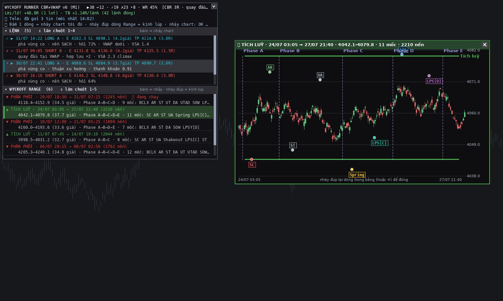

# Tính năng MỚI — Sơ đồ Wyckoff tự động (Range + Phase A-E + sự kiện) trên WyckoffRunner.cs

> Toggle mới: **`ShowWyckoffSchematic`** (mặc định **BẬT**). Đây là lớp hiển thị/giáo dục THUẦN
> TUÝ — không gate, không đổi bất kỳ tín hiệu CBR/QUAY ĐẦU nào. Build: `dist/WyckoffRunner.dll`
> (biên dịch sạch, 0 warning/error, dotnet 10 trên Linux qua `build-wyckoff.sh`).
>
> **v2 (2026-08-03):** đã vá 5 lỗ hổng thuật toán theo `WYCKOFF_DRAW_SPEC.md` (CR-H/CR-I/CR-K/CR-Y/
> CR-M) + 4 lỗi tự phát hiện qua vòng chấm bằng agent — xem mục "v2" bên dưới. Nội dung "Vẽ gì" và
> "Cơ chế nhận diện" dưới đây đã cập nhật theo v2.

## Vẽ gì

1. **Range** (Trading Range) — 2 đường ngang biên trên/dưới, màu xanh lá (Tích luỹ) / đỏ (Phân
   phối), **CHỈ vẽ trong đúng phạm vi thời gian của range đó** (từ nến bắt đầu tới nến kết thúc/
   hiện tại nếu còn đang chạy) — **KHÔNG kéo dài hết chart**.
2. **Vạch chia Phase A/B/C/D/E** — nét đứt, màu tím nhạt, **CHỈ vẽ trong đúng phạm vi GIÁ của
   range đó** (từ Range Low tới Range High) — **KHÔNG kéo hết chiều cao chart**. Ranh giới quá gần
   nhau gộp thành 1 nhãn kiểu "Phase B→D" (vẫn vẽ đủ từng đường nét đứt riêng).
3. **Sự kiện** (chấm tròn + nhãn chữ, có hộp nền + màu theo họ) tại đúng nến/giá: Tích luỹ dùng
   `SC, AR, ST, UA, Spring, Shakeout, SOS, LPS[C], LPS[D]`; Phân phối dùng `BCLX, AR, ST, DA, UT,
   UTAD, SOW, LPSY[C], LPSY[D]`. Marker của Spring/Shakeout/UT/UTAD vẽ theo trạng thái xác nhận:
   viền đặc = Confirmed, viền đứt = Pending, xám = Failed (kèm hậu tố "(thất bại)").
4. Hiển thị tối đa `WyckoffMaxRanges` (mặc định 6) range gần nhất để tránh rối chart.

## Cơ chế nhận diện (tóm tắt — chi tiết xem comment trong `ScanWyckoff()`)

Chưng cất từ 3 nguồn đã có sẵn trong repo (không bịa thêm lý thuyết):
- `data-export/wyckoff/THEORY.md` — định nghĩa gốc Phase A-E + PS/SC/AR/ST/Spring/SOS/LPS
  (đối xứng PSY/BCLX/AR/ST/UT/UTAD/SOW/LPSY).
- `data-export/wyckoff/CHART_CASES.md` — **9 lỗi gán nhãn hay gặp**, chưng cất từ ~50 ca bài chữa
  học viên THẬT (7.pdf/4.pdf/2.pdf/Journal.pptx) — dùng làm **ràng buộc thiết kế trực tiếp**:
  - Spring **bắt buộc** là đáy THẤP NHẤT toàn bộ range tính tới lúc đó (lỗi phổ biến nhất trong
    2.pdf: gọi Spring cho đáy không phá đáy cũ) → code chỉ gắn nhãn Spring/Shakeout khi
    `low < mọi low trước đó trong range`.
  - SOS/SOW **bắt buộc** phá cạnh TUYỆT ĐỐI của range, không phải đỉnh/đáy cục bộ trong Phase B.
  - SC/BCLX chỉ hợp lệ nếu TRƯỚC đó là downtrend/uptrend thật (dùng field `Trend` có sẵn) — tránh
    gán SC trong tái tích luỹ.
  - LPS/LPSY vẽ thành VÙNG (không phải 1 điểm) khi ≥3 nến dao động hẹp quanh vùng test.
  - Phase D không bắt buộc phải có BU/LPS (SOS xong tăng thẳng vẫn hợp lệ).
- `data-export/wyckoff/WYCKOFF_RULES.md` — WY01-WY17, chọn các luật code hoá được trực tiếp.

## ⚠ Giới hạn (đọc trước khi dùng để học/đối chiếu)

- **Heuristic, không phải chuẩn tuyệt đối.** Các ngưỡng (`CLIMAX_RANGE_MULT=1.4`,
  `ST_TOL_TICKS=10`, `SOS_BODY_MIN=0.45`, `MAX_RANGE_HEIGHT_PCT=3.5%`, `SHOCK_PROGRESS_MULT=0.5`...)
  là **tự đặt** vì tài liệu gốc không cho số cụ thể (xem `WYCKOFF_DRAW_SPEC.md` §1/§3) — giống hệt
  tình huống của luật W3 (Phase C) đã từng bị bác bỏ khi dùng làm gate cứng. Ở đây KHÔNG dùng làm
  gate, chỉ vẽ.
- **"Cấu trúc thất bại" (failed structure, THEORY.md §9) — v2 đã code hoá một phần lớn** qua cơ chế
  `PendingShock` (xem mục "v2" bên dưới): sau Spring/Shakeout/UTAD, theo dõi tiến độ tới biên đối
  diện, gắn "(thất bại)" nếu đóng cửa phá lại qua cực trị shock trước khi đạt 50% tiến độ. Case CÒN
  LẠI (giá phá NGƯỢC hướng giả thuyết ngay từ Phase B, chưa từng có Spring/UT) vẫn xử lý như v1: bỏ
  range, KHÔNG tự dựng lại thành cấu trúc ngược chiều.
- Chỉ theo dõi **1 range tại một thời điểm** (không xử lý range chồng lấp) — do kiến trúc "nhìn
  trước rồi khép range ngay trong 1 lần quét", 2 range liên tiếp trong danh sách kết quả **có thể**
  có khung thời gian chồng nhau một phần (đã quan sát trên dữ liệu thật) — không phải lỗi vẽ, mà là
  hệ quả của cách `WyTryLpsAndPhaseE` nhìn trước tới 25 nến trước khi vòng lặp chính đi tới đó.
- Đã tự kiểm bằng ảnh + **vòng chấm bằng agent đóng vai giảng viên** (xem mục "v2" bên dưới),
  KHÔNG kiểm bằng cách chạy lại đúng chart của học viên trong CHART_CASES.md (khác thị trường/khung
  thời gian, không có dữ liệu giá).

## v2 (2026-08-03) — vá theo `WYCKOFF_DRAW_SPEC.md` + vòng chấm bằng agent

Theo yêu cầu tổng hợp toàn bộ lý thuyết (`THEORY.md`) + ~70 ca bài chữa học viên thật
(`CHART_CASES.md`) thành 1 spec duy nhất rồi implement lại, có vòng lặp **chấm → sửa → vẽ lại →
chấm lại** (agent đóng vai giảng viên Wyckoff, dùng đúng văn phong/tiêu chuẩn của `CHART_CASES.md`).

**Spec tổng hợp:** [`../quantower-entry-signal/WYCKOFF_DRAW_SPEC.md`](../quantower-entry-signal/WYCKOFF_DRAW_SPEC.md)
(819 dòng — định nghĩa chuẩn đã phân xử mâu thuẫn, bảng ràng buộc CR-A..CR-W, pseudocode đầy đủ,
bảng diff ưu tiên sửa).

**5 fix chính theo spec (ưu tiên CAO):**
- **CR-H** — Phase B trước đây chỉ theo dõi 1 cạnh của range; một breakout QUYẾT ĐỊNH ở cạnh chưa
  từng có Spring/UTAD nay được phép bắn SOS/SOW **trực tiếp từ Phase B** (bỏ qua Phase C nếu không
  có Spring/UT/UTAD thật — đúng cảnh báo "không phải cấu trúc nào cũng có Spring/Shakeout").
- **CR-I** (chính là WY10/WY12 chưa từng code hoá) — sau Spring/Shakeout/UTAD, theo dõi
  `PendingShock` mỗi nến tới khi XÁC NHẬN (≥50% quãng đường tới biên đối diện) hoặc THẤT BẠI (đóng
  cửa phá lại qua cực trị shock trước 50%) → gắn "(thất bại)", lùi Phase B. Marker vẽ theo trạng
  thái: Confirmed=viền đặc, Pending=viền đứt nét, Failed=xám.
- **CR-K** — Phase E không còn ép buộc vô điều kiện khi hết `LPS_WAIT_BARS`; cần ≥50%×`PHASE_E_MULT`
  tiến độ, không đủ thì lùi Phase B.
- **CR-Y** — mọi nhánh lùi state về "B" đều cập nhật đúng nhãn Phase hiển thị (trước đây có nhánh
  chỉ đổi biến nội bộ, khiến timeline Phase sai).
- **CR-M** — tách `LPS[C]`/`LPSY[C]` (test lúc chờ xác nhận shock, Phase C) khỏi `LPS[D]`/`LPSY[D]`
  (pullback sau SOS/SOW, Phase D). Thêm nhãn đối xứng `UA`/`DA` (test cạnh "kia" không quyết định).

**4 lỗi tự phát hiện thêm** (qua vòng chấm bằng agent + tự kiểm bằng số liệu thật, KHÔNG có trong
spec gốc — chi tiết trong comment tại từng điểm sửa của `ScanWyckoff`/`wyckoff_schematic.py`):
1. `end_i`/`EndIdx` của cả range dùng nến đang xử lý thay vì bar Phase E thật (`WyTryLpsAndPhaseE`
   nhìn trước tới 25 nến) → Range High/Low vẽ ngắn hơn hẳn Phase D/E thật.
2. Trong Phase A (chờ AR), biên KHÔNG cùng phía với climax không hề được cập nhật suốt cả cửa sổ
   40 nến — một cú vượt biên trước khi đảo chiều thật bị bỏ sót hoàn toàn.
3. Mốc bắt đầu Phase B neo vào nến CỐ ĐỊNH (climax+40+1) thay vì đúng nến AR — khiến Phase A hiển
   thị vẽ dài lố tới cuối cửa sổ cố định thay vì đúng kết thúc tại AR (xảy ra ở CẢ 6/6 ảnh mẫu chấm).
4. Nhãn vùng LPS[D] ghi CHỈ SỐ NẾN vào text (vd "(vùng 47637-47648)") thay vì giá — gây hiểu lầm
   nghiêm trọng; nay chỉ ghi "(vùng)".

**UI/UX** (yêu cầu "show chữ rõ ràng"): mọi nhãn vẽ trong hộp bo góc nền tối (không chữ trần đè lên
nến), né chồng lấp theo cả 2 trục + đường dẫn (leader line) khi nhãn bị đẩy xa điểm sự kiện, mỗi họ
sự kiện 1 màu riêng (Climax=đỏ, AR=xanh lá, ST/UA/DA=xám, Spring/Shakeout/UT/UTAD=vàng, SOS/SOW=xanh
dương, LPS[C]=xanh ngọc, LPS[D]=tím — 2 màu LPS đổi hẳn tông thay vì đậm/nhạt cùng tông để không bị
nhầm bằng mắt), ranh giới Phase quá gần nhau gộp thành 1 nhãn kiểu "Phase B→D", chú giải màu có nền
đục ở góc trên-phải.

**Vòng chấm:** 1 agent đọc `CHART_CASES.md` + `WYCKOFF_DRAW_SPEC.md` rồi chấm 6 ảnh mẫu (ACC/DIST,
đơn giản/phức tạp/đang chạy) đúng văn phong giảng viên — tìm ra cả 5 fix theo spec đều chạy đúng
**và** phát hiện thêm lỗi #2/#3/#4 ở trên (lỗi #1 tự tìm ra trước đó qua kiểm tra số liệu trực
tiếp). Sau khi sửa, render lại xác nhận cả 2 lỗi Phase A/B đã hết ở mọi mẫu.

## Đã test thế nào

1. Viết prototype Python trước (`research/wyckoff/v8/wyckoff/wyckoff_schematic.py`), chạy trên dữ
   liệu dxFeed GCQ26 M1 THẬT (~9 tháng, 11/2025→7/2026, `research/27-7/`).
2. Vẽ lại bằng Pillow (`render_schematic_preview.py`) để kiểm bằng mắt — v1 đã soát và sửa 2 vòng
   lỗi thuật toán lớn trước khi port sang C# lần đầu; v2 (2026-08-03) thêm vòng chấm bằng agent như
   mô tả ở trên. 2 ảnh mẫu v1 vẫn còn: [example-ACC-04-08.png](wyckoff-schematic-examples/example-ACC-04-08.png),
   [example-DIST-04-01.png](wyckoff-schematic-examples/example-DIST-04-01.png) — ảnh mẫu v2 chưa
   được lưu cố định vào repo (render trong scratchpad phiên làm việc), tự chạy lại
   `render_schematic_preview.py` để tái tạo khi cần.
3. Port logic 1-1 sang C# (`ScanWyckoff`/`WyTryLpsAndPhaseE`/`WyEmitLps` trong `WyckoffRunner.cs`),
   build DLL qua `build-wyckoff.sh` (dotnet 10, Linux) — **biên dịch sạch, 0 lỗi/cảnh báo** (cả v1
   lẫn v2).
4. **Chưa test được** trên chart Quantower thật (cần môi trường Windows + Volume Analysis sống) —
   người dùng cần tự kiểm khi attach vào chart M1 thật, đối chiếu range/phase/nhãn với hành vi giá.
   Chưa có parity harness so C# vs Python cho riêng phần schematic này (khác với CBR/QUAY_ĐẦU đã có
   `research/wyckoff/parity/`) — nếu cần độ tin cậy cao hơn trước khi dùng dạy học diện rộng, nên
   viết thêm bước đối chiếu số (range count/timestamps) giữa 2 bên trên cùng 1 bộ dữ liệu.

---

## v3 (2026-08-03) — xem lại RANGE QUÁ KHỨ + bảng tương tác

Người học báo 2 vấn đề: (1) **chỉ thấy range mới nhất**, không soi lại được range quá khứ để tự chấm
bản vẽ; (2) bảng cũ đổ hết mọi thứ ra một danh sách dài, không cuộn, không bấm được.

### 1. Thấy được range quá khứ

* Mặc định `Wyckoff: số Range gần nhất hiển thị` **6 → 40** (trần 300). Thuật toán vẫn quét toàn bộ
  lịch sử như cũ — trước đây chỉ giữ lại 6 range cuối rồi vứt phần còn lại, nên "mất" range cũ.
* Thêm **danh sách WYCKOFF RANGE** trong bảng: mỗi dòng ghi loại (Tích luỹ/Phân phối), khoảng thời
  gian, biên giá, chuỗi Phase và các mốc đã đánh dấu. Bấm 1 dòng là nhảy tới đó.
* **Kính lúp** (nháy đúp 1 dòng Range): tự vẽ lại range đó trong một cửa sổ riêng trên chart — nến
  + biên Range + vạch Phase + toàn bộ nhãn sự kiện, dùng **cùng một hàm vẽ** `DrawWyckoff` với chart
  chính (2 hàm ánh xạ toạ độ khác nhau) nên không thể lệch nhau.

### 2. Bảng tương tác mới (`UiPanel`, thay `PanelDrag` cho riêng indicator này)

Header thống kê (như cũ) + **2 danh sách con**: `LỆNH` và `WYCKOFF RANGE`. Mỗi danh sách có chiều
cao cố định theo input (mặc định 4 và 5 dòng), cuộn bằng lăn chuột hoặc kéo thanh cuộn, bấm tiêu đề
để thu gọn riêng từng mục. Hover đổi nền + vạch màu bên trái; dòng đang chọn tô đậm hơn và **đối
tượng tương ứng trên chart cũng được làm nổi** (range: tô nền mờ + viền dày; lệnh: vòng tròn vàng +
vạch dọc). Bảng tự bóp số dòng lại nếu cao quá khung chart. Kéo thả và nút thu gọn giữ như cũ.

### 3. Nhảy chart khi bấm — và lý do phải làm vòng lặp kín

Quantower **không công bố API cuộn chart**: `IChart` chỉ cho ĐỌC `RightOffset`/`BarsWidth` (đã dump
toàn bộ `TradingPlatform.BusinessLayer.dll` để kiểm — không có `Scroll*`/`GoTo*`/`Navigate*` nào,
`Core.Instance` cũng không). Nên `ChartNav` dò bằng reflection trên **đối tượng chart thật** (lớp
cài đặt nằm trong assembly giao diện) xem có thành viên `int` ghi được tên `RightOffset`/`BarsWidth`
không — **không gọi bừa phương thức lạ**, chỉ ghi đúng 2 tên đã biết.

Vì không chắc `RightOffset` tính bằng nến hay px, việc canh vị trí chạy theo **vòng lặp kín qua
nhiều khung hình**: mỗi lần vẽ đo lại `GetChartX(mốc đích)`, tự ước lượng "bao nhiêu px cho 1 đơn vị
offset" từ chính bước trước rồi hiệu chỉnh, dừng khi sai số ≤ 8px hoặc quá 10 bước.

⚠ **Chưa xác nhận được là nhảy chart chạy thật** (không có Quantower trên máy này). Nếu reflection
không dò được thành viên nào, bảng sẽ ghi rõ `nhảy chart: KHÔNG hỗ trợ → dùng kính lúp` và mỗi lần
bấm sẽ **tự mở kính lúp** thay thế — nên tính năng "soi lại range quá khứ" vẫn dùng được trong mọi
trường hợp. Lần đầu attach, indicator ghi
`%LOCALAPPDATA%\WyckoffRunner\chart_api.txt` liệt kê các thành viên khả nghi của lớp chart để còn
chỉnh lại nếu tên không khớp.

### Đã test thế nào (v3)

* Build DLL sạch (0 lỗi/cảnh báo) sau mỗi lượt sửa.
* Dựng ảnh mô phỏng bảng bằng Pillow theo **đúng công thức layout trong C#**
  (`research/wyckoff/v8/wyckoff/render_panel_preview.py`) để soi UI/UX trước khi deploy — máy Linux
  không chạy được `System.Drawing`.
* **Chưa chạy thật trên Quantower**: phần chuột (hover/cuộn/bấm/kéo thanh cuộn) và phần nhảy chart
  đều cần kiểm trên máy Windows.

