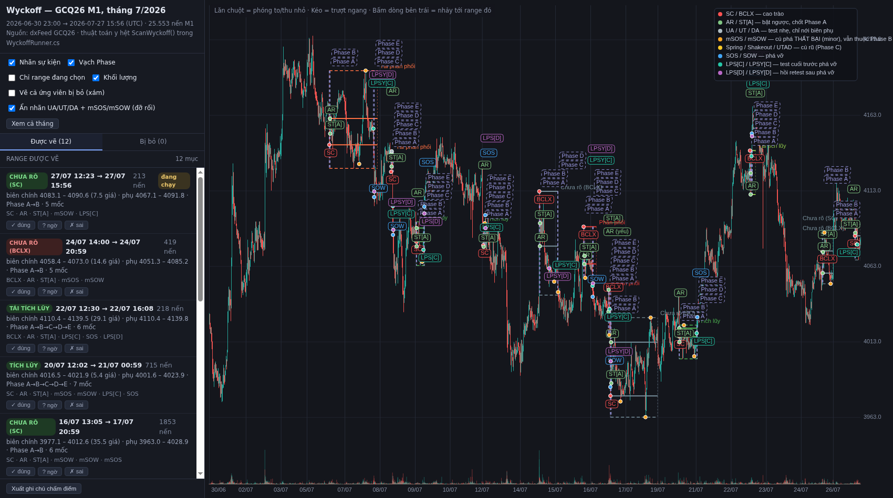
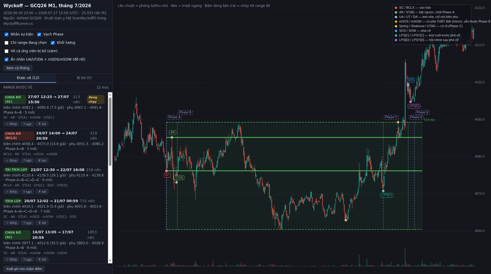

# Thuật toán vẽ Wyckoff trong WyckoffRunner — giải thích bằng lời để review

> Mục đích: mô tả **đúng những gì code đang làm** bằng ngôn ngữ dễ đọc, để tự chấm điểm xem
> indicator vẽ Wyckoff đúng hay sai. Không phải lý thuyết Wyckoff chung chung.
>
> Code tương ứng: [`quantower-entry-signal/WyckoffRunner.cs`](../quantower-entry-signal/WyckoffRunner.cs)
> — hàm `ScanWyckoff()`, `WyTryLpsAndPhaseE()`, `WyFireBreak()`, `DrawWyckoff()`; bản Python song sinh
> [`wyckoff_schematic.py`](../quantower-entry-signal/research/wyckoff/v8/wyckoff/wyckoff_schematic.py)
> (sửa một bên là phải sửa bên kia).
>
> Cập nhật: 2026-08-03 (bản **v5** — vá 11 lỗi hệ thống do **vòng chấm chart bằng agent giảng viên**
> tìm ra, cộng 6 quyết định người học chốt trong lượt đó).

---

## 0b. Vòng chấm chart — nguồn của bản v5

Bản v4 vẽ 49 range trên toàn bộ lịch sử. 10 agent
[giảng viên Wyckoff](../.claude/agents/wyckoff-giao-vien.md) — nhập vai chính người đã chữa ~70 bài của
học viên trong [CHART_CASES.md](../data-export/wyckoff/CHART_CASES.md) — chấm **đủ 49 bài**, mỗi bài một
ảnh chart + một phiếu số liệu (giá, VSA từng nến, độ dài từng phase) để không phải đọc số từ pixel.

**Điểm trung vị 3/10.** Phân bố: 1 điểm ×4 · 2 ×13 · 3 ×12 · 4 ×11 · 5 ×2 · 6 ×3 · 7 ×3 · 8 ×1.
Bài chấm lưu ở [`research/wyckoff/grading_v4/`](../quantower-entry-signal/research/wyckoff/grading_v4/);
bộ ảnh + phiếu số liệu do
[`render_range_for_grading.py`](../quantower-entry-signal/research/wyckoff/v8/wyckoff/render_range_for_grading.py)
sinh ra.

Điều đáng giá không phải điểm số, mà là **11 lỗi lặp trên phần lớn bài** — tức lỗi thuật toán, không
phải lỗi lẻ từng nhãn:

| Mã | Lỗi hệ thống | Cách vá ở v5 |
|---|---|---|
| A | Climax không phải cực trị thật (cực trị thật cách 2–8 nến, cá biệt 93 nến) → **biên chính nằm giữa vùng giá** | Cao trào là một **cụm**: 8 nến đầu còn cực trị mới thì dời mốc climax; sau đó giá còn vượt mức climax quá 3× biên độ TB → climax không chặn được move, **bỏ range** |
| B | Nhãn SOS/SOW neo ở nến xác nhận thứ 3 → rơi vào nến VSA 0.30–0.69× trong khi cây phá thật VSA 4.2–9.6× | Vẫn đợi đủ 3 nến mới **chốt**, nhưng nhãn đặt **hồi tố** vào cây phá thật (VSA cao nhất, đúng hướng, đóng cửa vượt biên) |
| C | Phase C dài đúng 121 nến = trần timeout; hết hạn thì shock ghi "(thất bại)" nhưng **đoạn C vẫn nằm lại** trong timeline | Shock hết hạn → đổi nhãn thành UT/UA/**mSOS/mSOW** và **xoá hẳn đoạn C**; đồng thời Phase C không còn làm máy mù: vẫn theo dõi cú phá biên và vẫn nới biên phụ |
| D | Phase A bị sàn cứng 41 nến (AR chỉ chốt tại đúng nến climax+40); ST[A] rơi giữa range (đo được 41%–179% chiều cao) | AR và ST[A] đều là **swing pivot** đầu tiên được xác nhận (5 nến không tạo cực trị mới) + sàn chống nhiễu 1.5× biên độ TB. Bỏ hết ngưỡng % |
| E | Nhãn AR không dời khi mức AR bị dời → nhãn lệch tới **110.8 giá** so với chính biên nó tạo ra | Giữ tham chiếu tới sự kiện AR, đổi cả mức lẫn nhãn |
| F | Giá trị trả về của hàm xét Phase D/E **bị bỏ**: cú phá hỏng vẫn đóng range và vẫn **đặt tên** pattern | Cú phá vô hiệu → hạ cấp thành mSOS/mSOW, trả dải phase về B, **không đặt tên range**; cú sau phải vượt qua cực trị đã thất bại; 3 lần vô hiệu thì đóng range ở trạng thái "chưa rõ" |
| G | Cú rũ đo bằng **biên chính** thay vì cực trị thật của TR (lỗi giảng viên sửa nhiều nhất: 4/22 ca nguồn 2.pdf) | Chỉ **vượt qua biên phụ** mới là Spring/Shakeout/UTAD, và **mỗi range chỉ MỘT** cú rũ — cú sâu hơn hạ cấp cú trước |
| H | UA/DA gán bất kể độ sâu/volume: một cú thọc 5.5 giá VSA 2.44× bị hạ thành "test nhẹ" rồi chính nó làm hỏng điều kiện xác nhận SOW | Thăm dò **mạnh** mà không phá được = **mSOS/mSOW**; chỉ cú thật nhẹ mới là UA/UT/DA |
| I | Move trước climax tính cả **chính cây climax** (một cây tin 60 giá tự nó đã thoả) | Đo move trên đoạn *chân → nến trước climax* |
| J | Phase E luôn dài 1 nến (mốc chốt E là nến cuối cửa sổ chờ) | Phase D bao trọn nhịp retest; Phase E kéo tới khi giá lùi vào trong biên / đi xa 2× chiều cao / hết 120 nến |
| K | Cửa sổ chờ đếm bằng **số nến** trên dữ liệu chỉ có nến khi có giao dịch → 54 nến trải **4,8 ngày lịch** (bắc qua khe cuối tuần 73 giờ) | Khe > 4 giờ thì **cắt range** (nghỉ phiên 1 giờ vẫn nối) |

Sáu quyết định người học chốt trong lượt này (ưu tiên cao hơn câu chữ trong sách):

1. **Không** đặt sàn độ dài tối thiểu cho range — range ngắn vẫn hợp lệ nếu đủ cấu trúc.
2. Chỉ vẽ range ở M1, **chưa cần range lồng nhau**.
3. Shock đã tới biên đối diện nhưng hết hạn chờ mà không phá được → "**tạo thành UT, UA hoặc là mSOS,
   mSOW (minor, tức là bị fail), và phase này vẫn là phase B**".
4. ST[A] "**không đo bằng %, đo bằng cấu trúc**".
5. Cắt range tại khe cuối tuần, nối qua nghỉ phiên 1 giờ.
6. **Không** dùng sàn khối lượng tuyệt đối (giữ VSA tương đối) — dù giảng viên bắt được nhiều climax chỉ
   6–19 hợp đồng ở phiên Á giờ chết. Lọc bằng cấu trúc, không bằng số lot.
7. Mỗi range **chỉ một** Spring/UTAD duy nhất — cú rũ sâu nhất là cú thật, các cú khác hạ xuống test nhẹ.

---

## 0. Tóm tắt một câu

Máy quét từ nến cũ nhất tới nến mới nhất, tìm **một cú climax** để mở range, chờ **cú bật ngược (AR)**
để có đủ hai biên, rồi theo dõi hai biên đó cho tới khi có **cú rũ được xác nhận** và **cú phá vỡ đi đủ xa** —
lúc đó range mới coi là hoàn tất.

---

## 1. Nguyên liệu: mỗi nến M1 được đo 4 thứ

| Đại lượng | Cách tính | Dùng để làm gì |
|---|---|---|
| **Biên độ nến** | `High − Low` | nhận diện nến climax bất thường |
| **VSA** | khối lượng nến ÷ TB khối lượng **20 nến** gần nhất | 2.2x = climax, 3.3x = climax cực mạnh |
| **Tỉ lệ thân** | `\|Close − Open\| ÷ biên độ` | phân biệt phá vỡ dứt khoát (thân to) vs râu lừa (thân nhỏ) |
| **MOVE trước nến** | độ dài chân→đỉnh (hoặc đỉnh→chân), số nến, và **hiệu suất hướng** | điều kiện **CẦN** để mở range (mục 3) |

**Hiệu suất hướng** = độ dài move ÷ tổng quãng đường giá đi (cộng dồn `|close − close trước|`).
Giá đi thẳng một mạch → gần **1.0**. Giá loanh quanh đi ngang → khoảng **0.05**. Đây là thước đo
phân biệt "một move xu hướng thật" với "giá lắc trong vùng".

> ⚠️ Trước bản v3 (03/08/2026) chỗ này dùng **xu hướng nền** = close hiện tại so close 480 nến trước
> với dung sai 1.0 giá. Quá yếu — giá đi ngang cả 8 tiếng chỉ cần lệch 1 giá là đã tính "có xu hướng".
> Đã **bỏ hẳn**, thay bằng phép đo MOVE ở trên.

Dung sai tính bằng **tick**. Với vàng: **1 giá = 10 tick**.

---

## 2. Máy trạng thái tổng thể

```
        [rỗi]
          │  MOVE xu hướng + cây climax chặn move đó
          ▼
     ┌─ Phase A ─┐  climax → AR → ST[A]   (đủ 3 lần đổi hướng)
          │        ↳ chốt 2 BIÊN CHÍNH, từ đây không đổi nữa
          ▼
     ┌─ Phase B ─┐◄────────────┐  chờ một cú phá biên (bất kỳ cạnh nào)
          │                    │
   giá thò ra ngoài biên       │
          ▼                    │
     [theo dõi cú phá]         │  cú rũ THẤT BẠI
          │                    │  (hoặc chờ quá 120 nến)
     ┌────┴────┐               │
 quay lại   ở hẳn              │
 trong range  ngoài            │
     │          │              │
     ▼          │              │
 ┌─ Phase C ─┐──┼──────────────┘
     │          │
     └──► SOS / SOW ◄──┘
              ▼
     ┌─ Phase D ─┐  CBR: phá → hồi retest giữ ngoài biên
              ▼
     ┌─ Phase E ─┐  giá đi tìm vùng giá mới → range ĐÓNG
```

Hai điều quan trọng:

1. **Phase B ⇄ C có thể quay lui.** Một range có thể ghi nhiều Spring thất bại rồi mới có Spring thật.
2. **Nhưng SOS/SOW đã xác nhận thì range ĐÓNG luôn**, không lùi lại nữa. Giá đã rời vùng đấu giá thì
   vùng đó hết vai trò — dù sau đó nó chạy xa hay không.

---

## 2b. Bốn pattern — thứ quyết định "câu hỏi triệu đô"

Hướng của MOVE trước climax **chỉ quyết định loại climax**, **không** quyết định range sẽ phá về
hướng nào. Vì vậy có **đủ bốn** cách, không phải hai:

| MOVE trước | Climax | Phá về | Tên | Ý nghĩa |
|---|---|---|---|---|
| giảm | **SC** | **lên** | **Tích luỹ** | cá mập gom hàng ở đáy |
| giảm | **SC** | **xuống** | **Tái phân phối** | chỉ là chỗ nghỉ giữa đợt giảm, xả tiếp |
| tăng | **BCLX** | **xuống** | **Phân phối** | cá mập xả hàng ở đỉnh |
| tăng | **BCLX** | **lên** | **Tái tích luỹ** | chỉ là chỗ nghỉ giữa đợt tăng, gom tiếp |

Trong lúc chưa phá biên, thuật toán **không đoán** — range hiển thị "Chưa rõ (SC)" hoặc
"Chưa rõ (BCLX)", tô **xám**. Tên thật chỉ được gán khi SOS/SOW xảy ra.

Đây chính là chỗ **sai nặng nhất của bản trước**: nó mặc định SC ⇒ tích luỹ, và khi giá phá xuống
thì coi là "giả thuyết sai" rồi **xoá cả range**. Trên toàn bộ lịch sử có **61 range bị xoá oan**
kiểu này — tất cả đều là tái tích luỹ / tái phân phối hợp lệ.

---

## 3. Chế độ rỗi — điều kiện mở một range mới

Nguyên tắc: **climax chỉ là điều kiện ĐỦ, một MOVE xu hướng rõ ràng mới là điều kiện CẦN.**
Phải có một đợt tăng/giảm mạnh trước, rồi cây climax xuất hiện để **chặn đợt đó lại**.
Giá đang đi ngang mà nổ một cây VSA lớn thì **không** được mở range.

Một nến mở được range khi thoả **cả ba nhóm**:

**(1) Cây nến đủ tính chất climax**
- Biên độ nến ≥ **1.4 lần** biên độ trung bình 20 nến trước.
- VSA ≥ **2.2x**.

**(2) Trước nó có MOVE thật** (nhìn lại tối đa **240 nến**)
- Nến climax phải là **cực trị của cả cửa sổ** — đáy thấp nhất (tích luỹ) hoặc đỉnh cao nhất (phân phối).
  Nó đang chặn move, không nằm giữa move.
- Chân move (đỉnh xa nhất phía đối diện) cách climax ≥ **20 nến**.
- Độ dài move ≥ **8 lần** biên độ trung bình 20 nến.
- **Hiệu suất hướng ≥ 0.35** — đây là điều kiện loại đi ngang. Giá lắc trong vùng có hiệu suất
  khoảng 0.05, không bao giờ chạm 0.35.

**(3) Màu nến khớp hướng move**
- nến **đỏ** chặn một **move giảm** → climax là **SC**, đánh dấu tại **đáy** nến.
- nến **xanh** chặn một **move tăng** → climax là **BCLX**, đánh dấu tại **đỉnh** nến.

Range mới bắt đầu ở **Phase A** và **chưa có tên** — chỉ biết nó xuất phát từ SC hay từ BCLX
(xem mục 2b: cùng một loại climax vẫn có thể dẫn tới hai pattern trái ngược).

---

## 4. Phase A — CHoCH, phải đủ ĐÚNG 3 LẦN ĐỔI HƯỚNG

Phase A không phải chỉ có climax + AR. Nó là một **CHoCH** — chỉ khi giá đổi hướng **ba lần**
thì mới hình thành được vùng đi ngang:

| Lần | Sự kiện | Tạo ra |
|---|---|---|
| 1 | Move theo xu hướng bị **climax** chặn lại | biên thứ nhất |
| 2 | Giá đi ngược lại tới **AR** rồi quay đầu | biên còn lại |
| 3 | Giá quay về phía climax rồi **bị chặn nhẹ lần nữa** = **ST[A]** | chốt Phase A |

**Phase A kết thúc ĐÚNG tại ST[A]**, không phải tại AR. Phase B bắt đầu ngay sau ST[A].

### 4.0 Cụm climax (v5, lỗi A)

Mốc climax **không** cố định ngay tại nến đầu tiên đủ ngưỡng. Trong **8 nến** đầu, nếu có cực trị mới
cùng phía thì mốc climax **dời** sang đó — kéo theo cả nhãn SC/BCLX và mốc bắt đầu range. Cao trào là
một *cụm* vài nến, không phải một cây.

Sau cửa sổ cụm, nếu giá còn vượt mức climax quá **3× biên độ trung bình 20 nến** thì cây climax đó
**không chặn được move** → bỏ ứng viên. Vượt nhẹ hơn thì chỉ nới biên phụ, biên chính giữ nguyên.

### 4.1 Bước tìm AR (v5, lỗi D — đo bằng cấu trúc)

Không còn chờ cứng 40 nến. AR là **swing pivot ngược đầu tiên được xác nhận**: cực trị phía đối diện
đã giữ được **5 nến** mà không có cực trị mới, và nhịp bật ngược đó lớn hơn nhiễu (**≥ 1,5× biên độ
trung bình 20 nến**). Không còn ngưỡng "≥ 30% độ dài move" — ngưỡng đó chính là thứ đẩy Phase A xuống
sàn 41 nến và làm Phase A dài hơn Phase B ở 5/5 bài trong một lô chấm.

Quá **300 nến** vẫn không thành hình AR → bỏ ứng viên.

**Nhãn "AR (yếu)":** AR rơi vào 1–2 nến ngay sát climax → nhiều khả năng chỉ là râu nhiễu. Chỉ là cảnh
báo hiển thị, không đổi logic.

### 4.2 Bước tìm ST[A] (v5, lỗi D)

Cùng một cơ chế: ST[A] là **swing pivot đầu tiên** về phía climax được xác nhận (5 nến không tạo cực
trị mới, nhịp hồi ≥ 1,5× biên độ TB). **Không đo bằng % chiều cao** nữa — người học chốt "đo bằng cấu
trúc".

Đổi lại có một **trần**: nếu nhịp hồi vượt hẳn qua mức climax hơn **một lần chiều cao range** thì đó
không còn là một cú *test* — giá đang đi tiếp, không phải cân bằng → **bỏ ứng viên**. (Giảng viên bắt
được ST[A] ở 179% và 275% chiều cao range vẫn được nhận.)

Quá **400 nến** kể từ AR mà không có ST[A] → bỏ ứng viên.

Nếu trong lúc chờ mà giá phá xa hơn AR về phía đối diện, AR được dời tới cực trị mới — **và nhãn AR dời
theo** (lỗi E: trước đây chỉ mức dời, nhãn đứng lại, lệch tới 110,8 giá).

### 4.3 Hai loại biên khi vẽ

- **Biên chính — nét liền:** mức **climax** và mức **AR**. Đây là hai biên quan trọng nhất.
- **Biên nới rộng — nét đứt:** khi ST[A] (hoặc Spring/UT về sau) vượt ra **ngoài** mức climax,
  biên làm việc rộng ra; phần rộng thêm đó vẽ nét đứt để phân biệt với biên chính.

---

## 5. Phase B — quan hệ nỗ lực ↔ kết quả, giai đoạn dài nhất

Phase B là lúc đọc **cung cầu qua khối lượng**: hai bên có hỗ trợ nhau không, lực đẩy có bị rút
ngắn không, move của phe nào trong range đang lớn hơn. Về mặt thuật toán, sau khi Phase A đã chốt,
mỗi nến chỉ hỏi **một câu duy nhất**:

> Giá có thò ra **ngoài biên chính** quá 10 tick không?

Không thò → không làm gì (chỉ âm thầm nới biên phụ). Có thò → chuyển sang **theo dõi cú phá đó**
cho tới khi biết kết cục. Đây là thay đổi lớn so với bản trước: trước đây mỗi nến tự phán ngay tại
chỗ, nên không phân biệt được Spring (rút nhanh) với Shakeout (lùng bùng) hay với một cú phá thật.

### 5.0 Hai loại biên

| | Biên chính (2 cái) | Biên phụ (0, 1 hoặc 2 cái) |
|---|---|---|
| Vẽ | **nét liền** | **nét đứt** |
| Từ đâu | mức **climax** + mức **AR**, chốt tại ST[A] | cực trị xa nhất mà giá từng thò ra ngoài |
| Đổi không | **KHÔNG BAO GIỜ đổi nữa** | nới rộng dần; **biên phụ cũ biến mất**, chỉ giữ cái xa nhất |
| Nguồn | Phase A | ST[A] vượt quá climax, hoặc UA / UT / DA trong Phase B |

Biên phụ nói lên rằng **có thế lực đã cố phá range gốc** và tạo được mức giá ngoài range. Vì thế
**SOS/SOW muốn tính là mạnh phải đóng cửa bứt qua biên phụ**, không chỉ qua biên chính.

Nhãn **UA / UT / DA** mỗi bên cũng chỉ giữ **một cái duy nhất**, đúng theo quy tắc biên phụ:
cú thăm dò mới nông hơn cú cũ thì không ghi gì cả.

### 5.1 Theo dõi một cú phá biên

Từ nến thò ra, máy theo dõi liên tục cho tới khi rơi vào **một trong hai kết cục**:

**Kết cục A — giá rút về trong range** (đóng cửa quay lại phía bên kia biên chính):

Ba câu hỏi quyết định nhãn (v5 — lỗi G và H):

1. Cú thăm dò có **vượt qua biên phụ** (cực trị xa nhất đã có) không? Không vượt → chỉ là test, dù có
   qua biên chính. *Đây là mâu thuẫn giữa tài liệu thuật toán và giảng viên (Ca #19 nguồn 2.pdf), người
   học phân xử: đo bằng cực trị thật.*
2. Cú đó có **mạnh** không: sâu ≥ max(15 tick, **15% chiều cao range**) hoặc VSA ≥ 2,2×?
3. Range đã có Spring/UTAD nào **sâu hơn** chưa? Người học chốt **mỗi range chỉ MỘT** cú rũ.

| Cạnh bị phá | Vượt biên phụ + mạnh + sâu nhất | Mạnh nhưng không đủ tư cách rũ | Thật NHẸ |
|---|---|---|---|
| Cạnh **climax** (SC ở dưới) | **≤ 4 nến** quay lại → **Spring**<br>**> 4 nến** lùng bùng → **Shakeout** | **mSOW** | không ghi gì — đây chính là ST[B], bỏ theo yêu cầu |
| Cạnh **climax** (BCLX ở trên) | **UTAD** | **mSOS** | **UT** |
| Cạnh **AR** (cạnh còn lại) | — (không quyết định) | **mSOS** (trên) / **mSOW** (dưới) | **UA** (trên) / **DA** (dưới) |

Chỉ Spring / Shakeout / UTAD → vào **Phase C**. Mọi nhãn còn lại **ở lại Phase B**, chỉ nới biên phụ.

> **mSOS / mSOW là gì:** một cú phá **thất bại** (minor sign of strength / weakness). Trước v5 những cú
> này bị hạ thành "UA/DA test nhẹ", rồi chính chúng nới biên phụ và làm hỏng điều kiện xác nhận SOW —
> giảng viên bắt được một cú thọc 5,5 giá VSA 2,44× có nến đóng dưới biên bị gọi là "test nhẹ".

> **Spring khác Shakeout ở THỜI GIAN, không phải độ sâu.** Spring phá xuống rồi rút vào rất nhanh.
> Shakeout phá xuống, lùng bùng ngoài đó một lúc rồi mới quay lại — bản chất là **một SOW thất bại**.

**Kết cục B — giá ở hẳn ngoài biên** = phá THẬT → **SOS** (lên) / **SOW** (xuống) → Phase D.
Điều kiện: **3 nến liên tiếp** đóng cửa vượt **biên phụ** thêm ≥ 30 tick với thân ≥ 45%. Hoặc: ở ngoài
quá **40 nến** **và** ≥ 60% số nến trong đoạn đóng cửa ngoài biên (v5: trước đây chỉ cần "quá 40 nến"
bất kể giá đang ở đâu, nên nhãn rơi vào đúng nến thứ 40 dù nến đó là gì).

**Nhãn đặt ở đâu (v5 — lỗi B, lỗi lặp nhiều nhất cả vòng chấm):** vẫn cần 3 nến để **chốt**, nhưng nhãn
SOS/SOW được đặt **hồi tố** vào **cây phá thật** — nến có VSA cao nhất trong đoạn, đúng hướng, đóng cửa
vượt biên. Trước đây nhãn nằm ở nến xác nhận thứ 3 nên đo được VSA 0,30× / 0,37× / 0,47× / 0,69× trong
khi cây phá thật có VSA 4,2×–9,6×. Sửa chỗ này còn kéo theo ranh giới C/D về đúng chỗ.

### 5.2 Phá "sai hướng" KHÔNG huỷ range nữa

Đây là điểm sửa quan trọng nhất. Một range xuất phát từ SC mà đóng cửa hẳn **xuống dưới** thì
**không phải** giả thuyết tích luỹ sai — nó là **tái phân phối**. Ngược lại, range từ BCLX mà phá
hẳn **lên trên** là **tái tích luỹ**. Range **không bị xoá**, chỉ **đổi tên** (xem mục 2b).

---

## 6. Phase C — phase ngắn nhất

Phase C là tín hiệu đầu tiên cho thấy giá đang ở biên bên này sắp phá biên bên kia. Có hai loại:

**Case DỄ — nhìn ra ngay:** UTAD, Spring, Shakeout. Chúng phá được một biên rồi thất bại, tức là
**một phe vừa thua và phe kia đang thắng thế**. Đánh dấu Phase C ngay tại điểm rũ.

Sau đó máy đo giá đã đi được **bao nhiêu phần đường từ điểm rũ sang biên đối diện**:
- Đi được **≥ 50%** → cú rũ **XÁC NHẬN** (chấm viền trắng đậm).
- Quay lại **đóng cửa vượt qua điểm rũ** khi **chưa đi nổi 50%** → thất bại.
- Chờ quá **120 nến** vẫn chưa ra SOS/SOW → cũng coi là thất bại ("Phase C là phase ngắn nhất").

**Shock thất bại thì xảy ra gì (v5 — lỗi C, người học chốt):** nhãn Spring/Shakeout/UTAD **đổi thành**
UT / UA / mSOS / mSOW, và **đoạn Phase C bị xoá hẳn khỏi timeline** — "phase này vẫn là phase B". Trước
v5 chỉ ghi thêm "(thất bại)" rồi lùi state, nên một đoạn "Phase C" dài đúng **121 nến** (= trần timeout)
còn nằm lại trên chart: phase ngắn nhất hoá thành phase dài nhất, tự phủ định cả hai luật tỉ lệ phase.
Đo lại sau khi vá: Phase C từ 121 nến xuống **5–34 nến**.

Trong lúc chờ, Phase C **không còn làm máy mù**: vẫn theo dõi cú phá biên bằng đúng bộ điều kiện của
Phase B và vẫn nới biên phụ cả hai phía. Trước đây một cú sụp thật 46 giá bị xếp thành "Phase C" và
range **mất hẳn** SOW.

Trong lúc chờ, giá quay về test đúng vùng điểm rũ → đánh dấu **LPS[C]** / **LPSY[C]**, **một điểm duy nhất**.

**Case KHÓ — không có cú rũ nào:** chỉ có LPS[C]/LPSY[C], rất khó xác nhận tại thời điểm đó.
Cách xử lý: **đợi có Phase D rồi quay lại vẽ Phase C**. Khi SOS/SOW thật sự bắn ra mà range chưa
từng có Phase C, máy nhìn ngược lại **60 nến** trước cú phá, lấy **nhịp test cuối cùng** (đáy sâu
nhất nếu phá lên / đỉnh cao nhất nếu phá xuống) làm **LPS[C] / LPSY[C]**, và Phase C bắt đầu từ đó.

---

## 7. Phase D → E — chính là CBR

Phase D + E chính là mô hình **CBR** đã dùng cho runner: **phá biên → hồi về retest nhưng giữ được
bên ngoài biên → giá thuận lực đi tiếp tìm vùng giá mới.**

Ngay khi có SOS/SOW, máy nhìn tới **25 nến kế tiếp**:

**Câu 1 — có giữ được bên ngoài biên vừa phá không?**
Một nến **đóng cửa lùi hẳn** vào trong range (quá 3× dung sai chuẩn ~30 tick) **trước khi đi được
≥ 50% tiến độ tối thiểu** → cú phá **BỊ VÔ HIỆU** (v5 — lỗi F, xem dưới).

**Câu 2 — LPS[D]/LPSY[D] đo bằng CẤU TRÚC (v5, cùng cơ chế với AR/ST[A] ở mục 4.1):** không còn
chờ "đóng cửa trong 20 tick quanh biên" — đó quá chặt, khiến 17/47 range không có nhịp retest nào và
Phase D dài đúng 1 nến. Giờ LPS[D] là **swing pivot ngược hướng phá đầu tiên được xác nhận** (5 nến
không tạo cực trị mới, nhịp hồi ≥ 1,5× biên độ TB) — tính từ đỉnh/đáy sau cú phá tới điểm hồi đó.

**Câu 3 — giá có đi ĐỦ XA không?** Mốc: đi thêm bằng đúng chiều cao biên chính → chốt **Phase E**.
Hết 25 nến mà mới đi được ≥ 50% → vẫn cho chốt Phase E; **Phase D bao trọn nhịp retest** (không để
Phase E bắt đầu trước khi nhịp hồi LPS[D] kết thúc — trước đây Phase D có thể chỉ dài 1 nến vì Phase E
mở ngay khi giá chạy nhanh).

**Phase E có độ dài THẬT (v5 — lỗi J):** trước đây mốc chốt E luôn là nến cuối cửa sổ chờ, nên Phase E
đo được **luôn dài 1 nến** ở mọi range. Giờ sau khi vào Phase E, máy kéo tiếp tới khi một trong ba điều
xảy ra: giá đóng cửa lùi hẳn vào trong biên đã phá, hoặc đã đi xa **gấp đôi** chiều cao range (= tìm
được vùng giá mới), hoặc hết **120 nến**.

**Cú phá BỊ VÔ HIỆU thì sao (v5 — lỗi F, người học chốt gián tiếp qua mục 5.1/5.2):** trước đây giá
trị này bị **bỏ hoàn toàn** — cú phá hỏng vẫn đóng range và vẫn **đặt tên pattern**, nên có range mang
nhãn "Phân phối" mà không hề có một cú phá nào thành công. Giờ: nhãn SOS/SOW hạ cấp thành **mSOS/mSOW**,
dải phase trả về B, range **không được đặt tên**, và cú phá lần sau phải vượt qua chính cực trị đã thất
bại đó mới được tính. Sau **3 lần** vô hiệu liên tiếp thì đóng range ở trạng thái **"chưa rõ hướng"**
(chặn vòng lặp D→B→D vô tận của bản v3: một range ngày 16/07 từng bắn **20 cái SOW liên tiếp** cách
nhau đúng 42 nến).

> Phân biệt hai loại LPS (đặt tên khác nhau có chủ đích):
> - **LPS[C] / LPSY[C]** = test **trước** SOS/SOW, thuộc Phase C.
> - **LPS[D] / LPSY[D]** = hồi retest **sau** SOS/SOW, thuộc Phase D.

---

## 8. Hai điều kiện huỷ range giữa chừng

| Điều kiện | Ngưỡng | Lý do |
|---|---|---|
| Range quá cao | **biên chính** cao > **3.5% giá** | range Wyckoff là vùng **cân bằng hẹp**, không phải cả một xu hướng dài |
| Kéo quá dài | > **2500 nến** kể từ climax | như trên |

⚠️ Hai mốc này là **guard tự đặt, KHÔNG có trong tài liệu Wyckoff gốc**.

Guard "quá cao" đo bằng **biên chính** (cố định) chứ không phải biên phụ, nên nó gần như không còn
bắn sau Phase A — trước đây biên làm việc phình theo mỗi cú thăm dò, khiến range bị giết oan vì "quá
cao" trong khi vùng cân bằng thật vẫn hẹp.

Ngoài ra còn các chỗ **bỏ ứng viên khi Phase A/B không hoàn thành** (v5 mở rộng đáng kể so với v4):
climax không chặn được move (lỗi A), không thành hình AR hoặc ST[A] trong cửa sổ chờ, ST[A] vượt hẳn
qua mức climax (lỗi D), climax trùng AR, hoặc khe thời gian > 4 giờ cắt ngang range đang chạy (lỗi K).

## 9. Range chưa xong

Nếu quét tới nến cuối cùng mà range chưa đạt Phase E, nó **vẫn được vẽ** nhưng:
- gắn nhãn **"(đang chạy)"** trong danh sách range của bảng,
- Phase cuối cùng kéo dài tới nến hiện tại.

Nến **đang hình thành** (nến cuối chưa đóng) luôn bị bỏ qua, giống phần quét tín hiệu vào lệnh.

---

## 10. Phần vẽ trên chart

- **Khung range**: chữ nhật kéo từ nến climax tới nến kết thúc. Màu theo **4 pattern**:
  Tích luỹ = **xanh đậm** · Tái tích luỹ = **xanh nhạt** · Phân phối = **đỏ** ·
  Tái phân phối = **cam** · chưa biết hướng phá = **xám**.
- **Biên chính** (mức climax + mức AR) vẽ **nét liền** — đây là biên quan trọng nhất, cố định.
- **Biên phụ** vẽ **nét đứt**, chỉ xuất hiện khi thật sự có giá nằm ngoài biên chính.
  Có thể có cả 2, chỉ 1, hoặc **không có biên phụ nào**.
- **Dải Phase**: các đoạn **A / B / C / D / E** theo trục thời gian.
- **Sự kiện**: một chấm + nhãn tại **đúng giá** của nó, màu theo nhóm (climax / bật ngược / test
  nhẹ / cú rũ / phá vỡ / hồi test). Chú giải 7 màu vẽ sẵn trên chart.
- **Viền chấm = trạng thái**: trắng đậm = **đã xác nhận**, nét đứt = **đang chờ**, xám = **thất bại**.

> **Cách đo một cú Spring cho đúng:** đo với **nét liền** (biên chính), không phải nét đứt.
> Chính cú Spring đó đã đẩy nét đứt ra ngoài, nên nhìn trên chart nó luôn **nằm ngay trên nét đứt** —
> cố ý, không phải lỗi vẽ.

## 11. Bảng tham số — tra nhanh khi muốn chỉnh

| Tham số | Giá trị | Nơi dùng |
|---|---|---|
| Biên độ climax | ≥ **1.4×** TB 20 nến | mở range |
| VSA climax | ≥ **2.2x** | mở range |
| Cụm climax: cửa sổ dời mốc | **8 nến** | mở range (v5, lỗi A) |
| Climax không chặn được move | vượt hẳn quá **3×** biên độ TB | mở range (v5, lỗi A) |
| MOVE: cửa sổ nhìn lại | **240 nến**, loại bỏ hẳn nến climax | mở range (v5, lỗi I) |
| MOVE: dài tối thiểu | **20 nến** và ≥ **8×** TB biên độ | mở range |
| MOVE: hiệu suất hướng | ≥ **0.35** | mở range (loại đi ngang) |
| AR / ST[A]: xác nhận swing pivot | **5 nến** không cực trị mới | Phase A (v5, lỗi D — đo bằng cấu trúc) |
| AR / ST[A]: sàn chống nhiễu | nhịp hồi ≥ **1.5×** biên độ TB | Phase A (v5, lỗi D) |
| ST[A]: trần vượt climax | ≤ **1.0×** chiều cao range | Phase A (v5, lỗi D) |
| AR: chờ tối đa | **300 nến** | Phase A |
| ST[A]: chờ tối đa | **400 nến** từ AR | Phase A |
| Cú rũ: phải vượt biên phụ | bắt buộc | Phase B (v5, lỗi G) |
| Cú rũ: sâu/mạnh tối thiểu | ≥ max(**15 tick**, **15%** chiều cao) **hoặc** VSA ≥ 2.2x | Phase B (v5, lỗi H) |
| Mỗi range chỉ một cú rũ | cú sâu hơn hạ cấp cú trước | Phase B (v5, lỗi G) |
| Spring ↔ Shakeout | quay về trong **≤ 4 nến** = Spring | Phase B (mục 5.1) |
| Phá THẬT: số nến giữ ngoài biên | **3 nến** liên tiếp, nhãn hồi tố về cây phá | Phase B → D (v5, lỗi B) |
| Phá THẬT: ở ngoài quá lâu | **40 nến** **và** ≥ 60% nến đóng ngoài biên | Phase B → D (v5) |
| Phase C: chờ tối đa | **120 nến**, hết hạn thì xoá đoạn C (v5, lỗi C) | Phase C (phase ngắn nhất) |
| Phase C gán ngược: cửa sổ nhìn lại | min(**60 nến**, 1/2 độ dài Phase B), lấy swing pivot | Phase C case khó |
| Sai số chạm biên (ST) | **10 tick** | Phase B |
| Đóng cửa "lùi hẳn" qua biên | **30 tick** | Phase B, D |
| Thân nến tối thiểu để công nhận SOS/SOW | **45%** | Phase B, C, D |
| Tiến độ để xác nhận cú rũ | **50%** quãng đường sang biên đối diện | Phase C |
| Cửa sổ chờ retest sau SOS/SOW | **25 nến** | Phase D |
| LPS[D]/LPSY[D]: đo bằng cấu trúc | swing pivot 5 nến, sàn 1.5× biên độ TB | Phase D (v5, lỗi J) |
| Cú phá vô hiệu: số lần tối đa | **3 lần** liên tiếp mới đóng range "chưa rõ" | Phase D (v5, lỗi F) |
| Đích Phase E | đi thêm **1.0 ×** chiều cao range | Phase D |
| Đích Phase E tối thiểu (khi hết giờ) | **0.5 ×** chiều cao range | Phase D |
| Phase E: độ dài thật, tối đa | **120 nến** hoặc đi xa **2.0×** chiều cao | Phase E (v5, lỗi J) |
| Chiều cao **biên chính** tối đa | **3.5% giá** | huỷ range |
| Số nến tối đa kể từ climax | **2500** | huỷ range |
| Khe thời gian cắt range | > **240 phút** (4 giờ) | huỷ range (v5, lỗi K) |
| Số range gần nhất hiển thị | **40** (chỉnh được tới 300) | phần vẽ |

---

## 12. Danh sách những chỗ nên nghi ngờ khi review

1. **Ngưỡng 1.4× biên độ + 2.2x VSA** — có thể quá lỏng ở phiên Á (thanh khoản thấp, VSA dễ vọt).
   Người học đã chốt **không** dùng sàn khối lượng tuyệt đối để chặn việc này — chấp nhận đánh đổi.
2. **Sàn chống nhiễu 1.5× biên độ TB cho AR/ST[A]/LPS[D]** — con số tự đặt để thay cho ngưỡng % cũ,
   chưa quét tham số.
3. **Bốn ngưỡng của phép đo MOVE** (240 / 20 nến / 8× ATR / hiệu suất 0.35) — thêm ở v3,
   chưa quét tham số, chỉ mới kiểm bằng mắt.
4. **Trần ST[A] = 1.0× chiều cao range** — tự đặt ở v5 để chặn ST[A] "chạy đi tiếp" bị nhận nhầm
   thành test; chưa hiệu chỉnh bằng số liệu.
5. **Hai guard huỷ range** (3.5%, 2500 nến) — hoàn toàn tự đặt, chưa hiệu chỉnh bằng số liệu.
6. **Mốc 4 nến phân biệt Spring ↔ Shakeout** — người học nói "3-4 cây nến hoặc ít hơn"; chọn 4.
7. **Ngưỡng "cú rũ mạnh" = 15% chiều cao range hoặc VSA≥2.2x** (v5, lỗi H) — tự đặt để thay ngưỡng
   tuyệt đối 15 tick cũ (quá nhỏ với vàng); chưa quét tham số.
8. **Ngưỡng "phá thật khi ở ngoài lâu" = 40 nến và ≥60% nến đóng ngoài biên** (v5) — tỉ lệ 60% tự đặt.
9. **UT vs UA vs DA** — đặt theo **origin** (SC hay BCLX) vì lúc đó chưa biết range là tích luỹ hay
   phân phối. Cách gán này là suy luận từ mục 5, cần xác nhận.
10. **Phase C gán ngược lấy swing pivot trong cửa sổ ≤60 nến** làm LPS[C] — đỡ hơn "lấy đúng cực trị
    cả cửa sổ" của v4, nhưng vẫn là cách chọn đơn giản, chưa chắc trùng nhịp test mắt người sẽ chọn.
11. **Khe cắt range = 240 phút (4 giờ)** — tự chọn để vừa cắt cuối tuần (73 giờ) vừa nối nghỉ phiên
    (~1 giờ); chưa kiểm với lịch nghỉ lễ dài hơn 4 giờ nhưng ngắn hơn cuối tuần.
12. **Không dùng dữ liệu order flow** — phần Wyckoff này chỉ đọc OHLC + khối lượng, **chưa** dùng
    delta / bid-ask từng mức giá dù indicator có sẵn.
13. **Vẫn chỉ theo dõi ĐÚNG MỘT range một lúc** — chưa sửa, xem mục 13.3.

## 13. ĐO THẬT trên dữ liệu tháng 7/2026

Đã dựng chart M1 thật của tháng 7 rồi chạy đúng thuật toán này lên đó:
**[wyckoff-chart-thang7.html](wyckoff-chart-thang7.html)** (mở bằng trình duyệt, cuộn/zoom được).

Dữ liệu: dxFeed **GCQ26**, 2026-06-30 → **2026-07-27 15:56 UTC**, 25.553 nến M1.
dxFeed chỉ xuất tới 27/7; file footprint export có tới 31/7 nhưng là **hợp đồng khác**
(giá lệch ~59 điểm: 4080 vs 4138) nên **không nối vào** — nối sẽ tạo khe giá giả.



### 13.1 Con số qua bốn bản

Toàn lịch sử 11/2025 → 27/7/2026 (103.857 nến M1):

| | v2 | v3 (+MOVE, +ST[A]) | v4 (+4 pattern, biên phụ, CBR) | **v5 (vòng chấm chart)** |
|---|---|---|---|---|
| Range **được mở** | 120 | 41 | 66 | **52** |
| Range **được vẽ** | 3 | 1 | 49 | **47** |
| Range **bị bỏ** | 117 | 40 | 17 | **5** |
| Trong đó **tới Phase E** | — | 1 | 20 | **37** |

v5 vẽ ít hơn v4 một chút (47 so với 49) nhưng vẽ **đúng hơn**: điểm chấm trung vị của v4 là 3/10 trên
49 bài (10 agent giảng viên chấm hết, xem mục 0b); tỉ lệ tới Phase E tăng từ 20/49 (41%) lên **37/47
(79%)** — không phải vì "dễ đạt E hơn" mà vì Phase D/E giờ đo bằng cấu trúc thật (lỗi J) nên phần lớn
cú phá thật sự chạy đủ xa mới được ghi nhận, thay vì bị cắt ở nến cuối cửa sổ chờ.

Số ứng viên bị bỏ giảm mạnh (17 → 5) vì hai ngưỡng gây bỏ oan nhiều nhất ở v4 đã bị thay: "AR phải hồi
≥30% move" (bỏ 12/17 ca ở v4) nay là swing pivot đo bằng cấu trúc; "biên chính quá cao" (bỏ 4/17) gần
như không còn bắn vì biên chính giờ chốt đúng tại climax+AR thật. Lý do bỏ 5 ứng viên còn lại của v5:
**3** ST[A] vượt hẳn qua climax (không phải test) · **2** climax không chặn được move.

Phân bố 4 pattern (v5): **Tích luỹ 12 · Tái tích luỹ 5 · Phân phối 9 · Tái phân phối 11** ·
10 range đang chạy/đóng ở trạng thái chưa rõ hướng (cú phá bị vô hiệu — lỗi F). Tỉ trọng đổi khá nhiều
so với v4 (10/6/14/18) vì phần lớn range "Phân phối"/"Tái phân phối" cũ của v4 thực ra là cú phá bị
vô hiệu chứ không phải cú phá thật — đây chính là hệ quả của việc vá lỗi F.

Chiều cao biên chính: nhỏ nhất **4.1 giá**, trung vị **18.4 giá**, lớn nhất 136.0 giá — hẹp hơn cả v4
(trung vị 21.6 giá) vì climax giờ chốt đúng tại cực trị cụm, không lệch vào giữa vùng giá.

39/47 range có Phase C; trong đó **36 (92%)** dùng cách gán ngược (không có Spring/Shakeout/UTAD) —
case khó vẫn phổ biến hơn case dễ, xem mục 13.3.

### 13.2 Tháng 7: 12 range, bản v5

Trang HTML minh hoạ (`wyckoff-chart-thang7.html`) đã dựng lại từ bản v5: **12 range**, **0 ứng viên bị
bỏ**. So với v4 (18 range vẽ, 3 bị bỏ) số lượng giảm — hợp lý vì v5 hẹp climax về đúng cụm cực trị nên
một số range v4 tách nhỏ nay có thể gộp lại hoặc không đủ điều kiện tách riêng.

```
06/07 12:43 → 07/07 22:23  Tái phân phối       biên chính 4127.7-4192.4   1886 nến, 8 mốc, xong
08/07 07:19 → 08/07 08:54  Tái phân phối       biên chính 4125.4-4139.0     95 nến, 7 mốc, xong
09/07 00:54 → 09/07 06:22  Tích luỹ             biên chính 4063.4-4092.3    328 nến, 8 mốc, xong
12/07 22:48 → 13/07 00:34  Tích luỹ             biên chính 4075.8-4091.4    105 nến, 7 mốc, xong
14/07 12:33 → 15/07 01:48  Chưa rõ (BCLX)       biên chính 4043.8-4112.5    735 nến, 7 mốc, xong (A→B→C→D)
15/07 18:31 → 16/07 03:54  Phân phối            biên chính 4055.2-4089.1    503 nến, 7 mốc, xong
16/07 11:48 → 16/07 13:22  Phân phối            biên chính 4017.4-4048.7     94 nến, 7 mốc, xong
16/07 13:05 → 17/07 20:59  Chưa rõ (SC)         biên chính 3963.0-4028.9   1853 nến, 6 mốc, xong (A→B, không phá)
20/07 12:02 → 21/07 00:59  Tích luỹ             biên chính 4001.6-4023.9    715 nến, 7 mốc, xong
22/07 12:30 → 22/07 16:08  Tái tích luỹ         biên chính 4110.4-4139.8    218 nến, 6 mốc, xong
24/07 14:00 → 24/07 20:59  Chưa rõ (BCLX)       biên chính 4051.3-4085.2    419 nến, 5 mốc, xong (A→B)
27/07 12:23 → 27/07 15:56  Chưa rõ (SC)         biên chính 4067.1-4091.8    213 nến, 5 mốc, ĐANG CHẠY
```

Bốn trong 12 range tháng 7 kết thúc ở trạng thái **"chưa rõ hướng"** — đúng như mục 13.3 điểm 3 đã nói:
đây là hành vi mới của v5 (không còn ép đặt tên khi cú phá chưa xác nhận thật), nhưng cũng là 1/3 số
range của tháng không đưa ra kết luận cấu trúc rõ ràng.



*(Ảnh chụp trên vẫn là ảnh minh hoạ từ bản v4 — cách đọc biên/phase trên chart không đổi, chỉ số liệu
cụ thể đã khác; ảnh chưa chụp lại.)*

### 13.3 Chỗ CHƯA sửa (sau v5)

1. **Vẫn chỉ theo dõi ĐÚNG MỘT range một lúc.** Khi một ứng viên đang mở, mọi climax mới đều bị bỏ
   qua. Range chết nhanh hơn v4 (khe cuối tuần giờ cắt range — lỗi K) nên tác hại giảm thêm, nhưng
   **vấn đề còn nguyên**: thực tế các range chồng lấn nhau — một range tuần chứa nhiều range ngày —
   thuật toán chưa mô tả được. Người học đã chốt: chưa cần sửa trong lượt này ("chỉ vẽ range ở M1,
   chưa cần range lồng nhau").
2. **Phase C gán ngược vẫn chiếm đa số:** 36/47 range (92%, tăng tỉ trọng so với 36/49=73% ở v4)
   không có cú rũ nào (Spring/Shakeout/UTAD), Phase C phải suy ngược sau khi có SOS/SOW. Case khó
   càng rõ là phổ biến hơn case dễ trên M1 — chất lượng cách chọn LPS[C]/LPSY[C] gán ngược (mục 12.10)
   vì thế ảnh hưởng lớn tới toàn bộ, cần soi kỹ hơn nữa.
3. **10/47 range đóng ở trạng thái "chưa rõ hướng"** (dir=0, sau 3 lần cú phá bị vô hiệu — lỗi F).
   Đây là hành vi MỚI ở v5: trước đây những range này bị đặt tên sai (đóng range và gán pattern dù
   không có cú phá thật). Giờ trung thực hơn nhưng cũng nghĩa là **~1/5 range không đưa ra kết luận
   gì** — chưa có cách xử lý tiếp cho nhóm này (bỏ hẳn hay giữ lại chờ dữ liệu mới).
4. **Giá trị dự báo của cú phá vẫn chưa có backtest.** Tỉ lệ tới Phase E tăng lên 79% (mục 13.1) là
   tín hiệu đo đúng hơn, không phải bằng chứng cú phá "ăn tiền" — chưa đo lợi nhuận/rủi ro thật.

### 13.4 Trang HTML có gì để review

Hai tab bên trái: **Được vẽ (12)** và **Bị bỏ (0 trong tháng 7)** — tab thứ hai kèm **lý do bỏ** ghi
thẳng trên từng dòng khi có. Bấm một dòng thì chart nhảy tới và fit đúng range đó; bật "Vẽ cả ứng viên
bị bỏ" để thấy chúng nằm xám mờ trên nền chart. Mỗi dòng có 3 nút ✓ / ? / ✗ để tự chấm, lưu trong trình
duyệt, bấm "Xuất ghi chú chấm điểm" để lấy ra JSON. Legend đã thêm màu **cam** cho mSOS/mSOW (v5).

Mỗi dòng hiển thị **biên chính** và (nếu có) **biên phụ** riêng, để đối chiếu nét liền / nét đứt.

⚠️ Trang HTML dựng từ **bản Python** của thuật toán (`wyckoff_schematic.py`), chạy song song
với `ScanWyckoff()` bên C#. Hai bên được sửa cùng lúc theo cùng một spec nhưng **chưa có test
đối chiếu tự động** — thấy chỗ nào lệch với chart Quantower thì báo, đó là lỗi parity.

Script dựng lại trang: `quantower-entry-signal/research/wyckoff/v8/wyckoff/render_wyckoff_html.py`.

---

## 14. Liên quan

- [wyckoff-schematic-tinh-nang-moi.md](wyckoff-schematic-tinh-nang-moi.md) — lịch sử tính năng, bản v2/v3, bảng tương tác.
- [wyckoffrunner-setup-va-kich-ban.md](wyckoffrunner-setup-va-kich-ban.md) — phần **vào lệnh** (CBR, quay đầu), **tách hẳn** khỏi phần vẽ Wyckoff này.
- [wyckoff-schematic-examples/](wyckoff-schematic-examples/) — ảnh minh hoạ.
