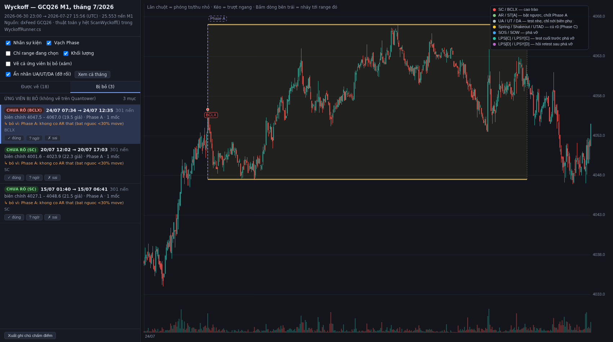

# Thuật toán vẽ Wyckoff trong WyckoffRunner — giải thích bằng lời để review

> Mục đích: mô tả **đúng những gì code đang làm** bằng ngôn ngữ dễ đọc, để tự chấm điểm xem
> indicator vẽ Wyckoff đúng hay sai. Không phải lý thuyết Wyckoff chung chung.
>
> Code tương ứng: [`quantower-entry-signal/WyckoffRunner.cs`](../quantower-entry-signal/WyckoffRunner.cs)
> — hàm `ScanWyckoff()` (dòng 1208–1522), `WyTryLpsAndPhaseE()` (1153), `WyEmitLps()` (1191),
> `DrawWyckoff()` (2590).
>
> Cập nhật: 2026-08-03 (bản **v4** — vá review mục 5, 5.1, 5.2, 6, 7 của người học).

---

## 0. Tóm tắt một câu

Máy quét từ nến cũ nhất tới nến mới nhất, tìm **một cú climax** để mở range, chờ **cú bật ngược (AR)**
để có đủ hai biên, rồi theo dõi hai biên đó cho tới khi có **cú rũ được xác nhận** và **cú phá vỡ đi đủ xa** —
lúc đó range mới coi là hoàn tất.

---

## 1. Nguyên liệu: mỗi nến M1 được đo 4 thứ

| Đại lượng | Cách tính | Dùng để làm gì |
|---|---|---|
| **Biên độ nến** | `High − Low` | nhận diện nến climax bất thường |
| **VSA** | khối lượng nến ÷ TB khối lượng **20 nến** gần nhất | 2.2x = climax, 3.3x = climax cực mạnh |
| **Tỉ lệ thân** | `\|Close − Open\| ÷ biên độ` | phân biệt phá vỡ dứt khoát (thân to) vs râu lừa (thân nhỏ) |
| **MOVE trước nến** | độ dài chân→đỉnh (hoặc đỉnh→chân), số nến, và **hiệu suất hướng** | điều kiện **CẦN** để mở range (mục 3) |

**Hiệu suất hướng** = độ dài move ÷ tổng quãng đường giá đi (cộng dồn `|close − close trước|`).
Giá đi thẳng một mạch → gần **1.0**. Giá loanh quanh đi ngang → khoảng **0.05**. Đây là thước đo
phân biệt "một move xu hướng thật" với "giá lắc trong vùng".

> ⚠️ Trước bản v3 (03/08/2026) chỗ này dùng **xu hướng nền** = close hiện tại so close 480 nến trước
> với dung sai 1.0 giá. Quá yếu — giá đi ngang cả 8 tiếng chỉ cần lệch 1 giá là đã tính "có xu hướng".
> Đã **bỏ hẳn**, thay bằng phép đo MOVE ở trên.

Dung sai tính bằng **tick**. Với vàng: **1 giá = 10 tick**.

---

## 2. Máy trạng thái tổng thể

```
        [rỗi]
          │  MOVE xu hướng + cây climax chặn move đó
          ▼
     ┌─ Phase A ─┐  climax → AR → ST[A]   (đủ 3 lần đổi hướng)
          │        ↳ chốt 2 BIÊN CHÍNH, từ đây không đổi nữa
          ▼
     ┌─ Phase B ─┐◄────────────┐  chờ một cú phá biên (bất kỳ cạnh nào)
          │                    │
   giá thò ra ngoài biên       │
          ▼                    │
     [theo dõi cú phá]         │  cú rũ THẤT BẠI
          │                    │  (hoặc chờ quá 120 nến)
     ┌────┴────┐               │
 quay lại   ở hẳn              │
 trong range  ngoài            │
     │          │              │
     ▼          │              │
 ┌─ Phase C ─┐──┼──────────────┘
     │          │
     └──► SOS / SOW ◄──┘
              ▼
     ┌─ Phase D ─┐  CBR: phá → hồi retest giữ ngoài biên
              ▼
     ┌─ Phase E ─┐  giá đi tìm vùng giá mới → range ĐÓNG
```

Hai điều quan trọng:

1. **Phase B ⇄ C có thể quay lui.** Một range có thể ghi nhiều Spring thất bại rồi mới có Spring thật.
2. **Nhưng SOS/SOW đã xác nhận thì range ĐÓNG luôn**, không lùi lại nữa. Giá đã rời vùng đấu giá thì
   vùng đó hết vai trò — dù sau đó nó chạy xa hay không.

---

## 2b. Bốn pattern — thứ quyết định "câu hỏi triệu đô"

Hướng của MOVE trước climax **chỉ quyết định loại climax**, **không** quyết định range sẽ phá về
hướng nào. Vì vậy có **đủ bốn** cách, không phải hai:

| MOVE trước | Climax | Phá về | Tên | Ý nghĩa |
|---|---|---|---|---|
| giảm | **SC** | **lên** | **Tích luỹ** | cá mập gom hàng ở đáy |
| giảm | **SC** | **xuống** | **Tái phân phối** | chỉ là chỗ nghỉ giữa đợt giảm, xả tiếp |
| tăng | **BCLX** | **xuống** | **Phân phối** | cá mập xả hàng ở đỉnh |
| tăng | **BCLX** | **lên** | **Tái tích luỹ** | chỉ là chỗ nghỉ giữa đợt tăng, gom tiếp |

Trong lúc chưa phá biên, thuật toán **không đoán** — range hiển thị "Chưa rõ (SC)" hoặc
"Chưa rõ (BCLX)", tô **xám**. Tên thật chỉ được gán khi SOS/SOW xảy ra.

Đây chính là chỗ **sai nặng nhất của bản trước**: nó mặc định SC ⇒ tích luỹ, và khi giá phá xuống
thì coi là "giả thuyết sai" rồi **xoá cả range**. Trên toàn bộ lịch sử có **61 range bị xoá oan**
kiểu này — tất cả đều là tái tích luỹ / tái phân phối hợp lệ.

---

## 3. Chế độ rỗi — điều kiện mở một range mới

Nguyên tắc: **climax chỉ là điều kiện ĐỦ, một MOVE xu hướng rõ ràng mới là điều kiện CẦN.**
Phải có một đợt tăng/giảm mạnh trước, rồi cây climax xuất hiện để **chặn đợt đó lại**.
Giá đang đi ngang mà nổ một cây VSA lớn thì **không** được mở range.

Một nến mở được range khi thoả **cả ba nhóm**:

**(1) Cây nến đủ tính chất climax**
- Biên độ nến ≥ **1.4 lần** biên độ trung bình 20 nến trước.
- VSA ≥ **2.2x**.

**(2) Trước nó có MOVE thật** (nhìn lại tối đa **240 nến**)
- Nến climax phải là **cực trị của cả cửa sổ** — đáy thấp nhất (tích luỹ) hoặc đỉnh cao nhất (phân phối).
  Nó đang chặn move, không nằm giữa move.
- Chân move (đỉnh xa nhất phía đối diện) cách climax ≥ **20 nến**.
- Độ dài move ≥ **8 lần** biên độ trung bình 20 nến.
- **Hiệu suất hướng ≥ 0.35** — đây là điều kiện loại đi ngang. Giá lắc trong vùng có hiệu suất
  khoảng 0.05, không bao giờ chạm 0.35.

**(3) Màu nến khớp hướng move**
- nến **đỏ** chặn một **move giảm** → climax là **SC**, đánh dấu tại **đáy** nến.
- nến **xanh** chặn một **move tăng** → climax là **BCLX**, đánh dấu tại **đỉnh** nến.

Range mới bắt đầu ở **Phase A** và **chưa có tên** — chỉ biết nó xuất phát từ SC hay từ BCLX
(xem mục 2b: cùng một loại climax vẫn có thể dẫn tới hai pattern trái ngược).

---

## 4. Phase A — CHoCH, phải đủ ĐÚNG 3 LẦN ĐỔI HƯỚNG

Phase A không phải chỉ có climax + AR. Nó là một **CHoCH** — chỉ khi giá đổi hướng **ba lần**
thì mới hình thành được vùng đi ngang:

| Lần | Sự kiện | Tạo ra |
|---|---|---|
| 1 | Move theo xu hướng bị **climax** chặn lại | biên thứ nhất |
| 2 | Giá đi ngược lại tới **AR** rồi quay đầu | biên còn lại |
| 3 | Giá quay về phía climax rồi **bị chặn nhẹ lần nữa** = **ST[A]** | chốt Phase A |

**Phase A kết thúc ĐÚNG tại ST[A]**, không phải tại AR. Phase B bắt đầu ngay sau ST[A].

### 4.1 Bước tìm AR

Chờ **40 nến** sau climax, lấy cực trị phía đối diện (đỉnh cao nhất cho tích luỹ / đáy thấp nhất
cho phân phối) làm **AR**. Song song, biên cùng phía climax vẫn nới thụ động mỗi nến.

AR phải là cú bật ngược **thật**: khoảng cách climax↔AR phải ≥ **30% độ dài move**. Chưa đủ thì
tiếp tục chờ; quá **300 nến** vẫn không đủ → **bỏ ứng viên**.

**Nhãn "AR (yếu)":** AR rơi vào 1–2 nến ngay sát climax → nhiều khả năng chỉ là râu nhiễu.
Chỉ là cảnh báo hiển thị, không đổi logic.

### 4.2 Bước tìm ST[A]

Sau AR, theo dõi giá quay lại phía climax:
- Phải hồi lại ít nhất **40% chiều cao** (khoảng cách climax↔AR).
- Rồi phải **thật sự đổi hướng**: **5 nến liên tiếp** không tạo cực trị mới.

Đủ hai điều đó → đánh dấu **ST[A]** tại điểm cực trị, đóng Phase A, mở Phase B.
Quá **400 nến** kể từ AR mà không có ST[A] → **bỏ ứng viên** (chưa thành vùng đi ngang).

Nếu trong lúc chờ mà giá phá xa hơn AR về phía đối diện, AR được dời tới cực trị mới và
đồng hồ chờ ST[A] tính lại từ đó.

### 4.3 Hai loại biên khi vẽ

- **Biên chính — nét liền:** mức **climax** và mức **AR**. Đây là hai biên quan trọng nhất.
- **Biên nới rộng — nét đứt:** khi ST[A] (hoặc Spring/UT về sau) vượt ra **ngoài** mức climax,
  biên làm việc rộng ra; phần rộng thêm đó vẽ nét đứt để phân biệt với biên chính.

---

## 5. Phase B — quan hệ nỗ lực ↔ kết quả, giai đoạn dài nhất

Phase B là lúc đọc **cung cầu qua khối lượng**: hai bên có hỗ trợ nhau không, lực đẩy có bị rút
ngắn không, move của phe nào trong range đang lớn hơn. Về mặt thuật toán, sau khi Phase A đã chốt,
mỗi nến chỉ hỏi **một câu duy nhất**:

> Giá có thò ra **ngoài biên chính** quá 10 tick không?

Không thò → không làm gì (chỉ âm thầm nới biên phụ). Có thò → chuyển sang **theo dõi cú phá đó**
cho tới khi biết kết cục. Đây là thay đổi lớn so với bản trước: trước đây mỗi nến tự phán ngay tại
chỗ, nên không phân biệt được Spring (rút nhanh) với Shakeout (lùng bùng) hay với một cú phá thật.

### 5.0 Hai loại biên

| | Biên chính (2 cái) | Biên phụ (0, 1 hoặc 2 cái) |
|---|---|---|
| Vẽ | **nét liền** | **nét đứt** |
| Từ đâu | mức **climax** + mức **AR**, chốt tại ST[A] | cực trị xa nhất mà giá từng thò ra ngoài |
| Đổi không | **KHÔNG BAO GIỜ đổi nữa** | nới rộng dần; **biên phụ cũ biến mất**, chỉ giữ cái xa nhất |
| Nguồn | Phase A | ST[A] vượt quá climax, hoặc UA / UT / DA trong Phase B |

Biên phụ nói lên rằng **có thế lực đã cố phá range gốc** và tạo được mức giá ngoài range. Vì thế
**SOS/SOW muốn tính là mạnh phải đóng cửa bứt qua biên phụ**, không chỉ qua biên chính.

Nhãn **UA / UT / DA** mỗi bên cũng chỉ giữ **một cái duy nhất**, đúng theo quy tắc biên phụ:
cú thăm dò mới nông hơn cú cũ thì không ghi gì cả.

### 5.1 Theo dõi một cú phá biên

Từ nến thò ra, máy theo dõi liên tục cho tới khi rơi vào **một trong hai kết cục**:

**Kết cục A — giá rút về trong range** (đóng cửa quay lại phía bên kia biên chính):

| Cạnh bị phá | Thăm dò NHẸ<br>(< 15 tick **và** VSA < 3.3x) | Thăm dò THẬT |
|---|---|---|
| Cạnh **climax** (SC ở dưới) | không ghi gì — đây chính là ST[B], bỏ theo yêu cầu | **≤ 4 nến** quay lại → **Spring**<br>**> 4 nến** lùng bùng rồi mới về → **Shakeout** |
| Cạnh **climax** (BCLX ở trên) | **UT** | **UTAD** |
| Cạnh **AR** (cạnh còn lại) | **UA** (trên) / **DA** (dưới) | UA / DA — vẫn không quyết định |

Spring / Shakeout / UTAD → vào **Phase C**. UA / UT / DA → **ở lại Phase B**, chỉ nới biên phụ.

> **Spring khác Shakeout ở THỜI GIAN, không phải độ sâu.** Spring phá xuống rồi rút vào rất nhanh.
> Shakeout phá xuống, lùng bùng ngoài đó một lúc rồi mới quay lại — bản chất là **một SOW thất bại**.

**Kết cục B — giá ở hẳn ngoài biên** = phá THẬT → **SOS** (lên) / **SOW** (xuống) → Phase D.
Điều kiện: **3 nến liên tiếp** đóng cửa vượt **biên phụ** thêm ≥ 30 tick với thân ≥ 45%.
Hoặc: ở ngoài quá **40 nến** mà không quay lại — giá đã bỏ đi hẳn.

### 5.2 Phá "sai hướng" KHÔNG huỷ range nữa

Đây là điểm sửa quan trọng nhất. Một range xuất phát từ SC mà đóng cửa hẳn **xuống dưới** thì
**không phải** giả thuyết tích luỹ sai — nó là **tái phân phối**. Ngược lại, range từ BCLX mà phá
hẳn **lên trên** là **tái tích luỹ**. Range **không bị xoá**, chỉ **đổi tên** (xem mục 2b).

---

## 6. Phase C — phase ngắn nhất

Phase C là tín hiệu đầu tiên cho thấy giá đang ở biên bên này sắp phá biên bên kia. Có hai loại:

**Case DỄ — nhìn ra ngay:** UTAD, Spring, Shakeout. Chúng phá được một biên rồi thất bại, tức là
**một phe vừa thua và phe kia đang thắng thế**. Đánh dấu Phase C ngay tại điểm rũ.

Sau đó máy đo giá đã đi được **bao nhiêu phần đường từ điểm rũ sang biên đối diện**:
- Đi được **≥ 50%** → cú rũ **XÁC NHẬN** (chấm viền trắng đậm).
- Quay lại **đóng cửa vượt qua điểm rũ** khi **chưa đi nổi 50%** → **THẤT BẠI**: nhãn thêm
  "(thất bại)", vẽ xám, range **lùi về Phase B** — không huỷ range.
- Chờ quá **120 nến** vẫn chưa ra SOS/SOW → cũng coi là thất bại, lùi Phase B.
  (Phase C là phase **ngắn nhất**; kéo dài hàng trăm nến thì nó không còn là Phase C.)
- Trong lúc chờ, giá quay về test đúng vùng điểm rũ → đánh dấu **LPS[C]** / **LPSY[C]**, **một điểm duy nhất**.

**Case KHÓ — không có cú rũ nào:** chỉ có LPS[C]/LPSY[C], rất khó xác nhận tại thời điểm đó.
Cách xử lý: **đợi có Phase D rồi quay lại vẽ Phase C**. Khi SOS/SOW thật sự bắn ra mà range chưa
từng có Phase C, máy nhìn ngược lại **60 nến** trước cú phá, lấy **nhịp test cuối cùng** (đáy sâu
nhất nếu phá lên / đỉnh cao nhất nếu phá xuống) làm **LPS[C] / LPSY[C]**, và Phase C bắt đầu từ đó.

---

## 7. Phase D → E — chính là CBR

Phase D + E chính là mô hình **CBR** đã dùng cho runner: **phá biên → hồi về retest nhưng giữ được
bên ngoài biên → giá thuận lực đi tiếp tìm vùng giá mới.**

Ngay khi có SOS/SOW, máy nhìn tới **25 nến kế tiếp**:

**Câu 1 — có giữ được bên ngoài biên vừa phá không?**
Một nến **đóng cửa lùi hẳn** vào trong range quá **30 tick** → cú phá hỏng. (Râu chạm nhẹ không tính.)

**Câu 2 — giá có đi ĐỦ XA không?**
Mốc: đi thêm **bằng đúng chiều cao biên chính**. Đạt → chốt **Phase E**.
Hết 25 nến mà mới đi được **≥ 50%** → vẫn cho chốt Phase E.

**LPS[D] / LPSY[D]:** nhịp hồi về loanh quanh biên vừa phá (trong 20 tick), đánh dấu **một điểm
duy nhất** — đáy sâu nhất (phá lên) / đỉnh cao nhất (phá xuống) của nhịp hồi đó.

**Dù Phase E có đạt hay không, range vẫn ĐÓNG tại đây.** Cú phá đã được xác nhận bằng 3 nến giữ
ngoài biên, tức vùng đấu giá này hết vai trò. Bản trước lùi về Phase B khi Phase E không đạt, mà
lúc đó giá vẫn đang ở ngoài biên nên nến kế tiếp lại bắn SOS/SOW mới → **vòng lặp vô tận**
(đo được: một range ngày 16/07 bắn **20 cái SOW liên tiếp** cách nhau đúng 42 nến).

> Phân biệt hai loại LPS (đặt tên khác nhau có chủ đích):
> - **LPS[C] / LPSY[C]** = test **trước** SOS/SOW.
> - **LPS[D] / LPSY[D]** = hồi retest **sau** SOS/SOW.

---

## 8. Hai điều kiện huỷ range giữa chừng

| Điều kiện | Ngưỡng | Lý do |
|---|---|---|
| Range quá cao | **biên chính** cao > **3.5% giá** | range Wyckoff là vùng **cân bằng hẹp**, không phải cả một xu hướng dài |
| Kéo quá dài | > **2500 nến** kể từ climax | như trên |

⚠️ Hai mốc này là **guard tự đặt, KHÔNG có trong tài liệu Wyckoff gốc**.

Từ v4, guard "quá cao" đo bằng **biên chính** (cố định) chứ không phải biên phụ, nên nó gần như
không còn bắn sau Phase A — cũng là mục đích: trước đây biên làm việc phình theo mỗi cú thăm dò,
khiến range bị giết oan vì "quá cao" trong khi vùng cân bằng thật vẫn hẹp.

Ngoài ra còn 3 chỗ **bỏ ứng viên khi Phase A không hoàn thành**: không có AR thật (quá 300 nến),
không có ST[A] (quá 400 nến từ AR), climax trùng AR.

## 9. Range chưa xong

Nếu quét tới nến cuối cùng mà range chưa đạt Phase E, nó **vẫn được vẽ** nhưng:
- gắn nhãn **"(đang chạy)"** trong danh sách range của bảng,
- Phase cuối cùng kéo dài tới nến hiện tại.

Nến **đang hình thành** (nến cuối chưa đóng) luôn bị bỏ qua, giống phần quét tín hiệu vào lệnh.

---

## 10. Phần vẽ trên chart

- **Khung range**: chữ nhật kéo từ nến climax tới nến kết thúc. Màu theo **4 pattern**:
  Tích luỹ = **xanh đậm** · Tái tích luỹ = **xanh nhạt** · Phân phối = **đỏ** ·
  Tái phân phối = **cam** · chưa biết hướng phá = **xám**.
- **Biên chính** (mức climax + mức AR) vẽ **nét liền** — đây là biên quan trọng nhất, cố định.
- **Biên phụ** vẽ **nét đứt**, chỉ xuất hiện khi thật sự có giá nằm ngoài biên chính.
  Có thể có cả 2, chỉ 1, hoặc **không có biên phụ nào**.
- **Dải Phase**: các đoạn **A / B / C / D / E** theo trục thời gian.
- **Sự kiện**: một chấm + nhãn tại **đúng giá** của nó, màu theo nhóm (climax / bật ngược / test
  nhẹ / cú rũ / phá vỡ / hồi test). Chú giải 7 màu vẽ sẵn trên chart.
- **Viền chấm = trạng thái**: trắng đậm = **đã xác nhận**, nét đứt = **đang chờ**, xám = **thất bại**.

> **Cách đo một cú Spring cho đúng:** đo với **nét liền** (biên chính), không phải nét đứt.
> Chính cú Spring đó đã đẩy nét đứt ra ngoài, nên nhìn trên chart nó luôn **nằm ngay trên nét đứt** —
> cố ý, không phải lỗi vẽ.

## 11. Bảng tham số — tra nhanh khi muốn chỉnh

| Tham số | Giá trị | Nơi dùng |
|---|---|---|
| Biên độ climax | ≥ **1.4×** TB 20 nến | mở range |
| VSA climax | ≥ **2.2x** | mở range |
| MOVE: cửa sổ nhìn lại | **240 nến** | mở range |
| MOVE: dài tối thiểu | **20 nến** và ≥ **8×** TB biên độ | mở range |
| MOVE: hiệu suất hướng | ≥ **0.35** | mở range (loại đi ngang) |
| AR phải hồi ≥ | **30%** độ dài move | Phase A |
| AR: chờ tối đa | **300 nến** | Phase A |
| ST[A] phải hồi ≥ | **40%** chiều cao climax↔AR | Phase A |
| ST[A]: xác nhận đổi hướng | **5 nến** không cực trị mới | Phase A |
| ST[A]: chờ tối đa | **400 nến** từ AR | Phase A |
| VSA climax cực mạnh | ≥ **3.3x** (1.5 × 2.2) | phân biệt thăm dò NHẸ ↔ cú rũ THẬT |
| Spring ↔ Shakeout | quay về trong **≤ 4 nến** = Spring | Phase B (mục 5.1) |
| Phá THẬT: số nến giữ ngoài biên | **3 nến** liên tiếp | Phase B → D |
| Phá THẬT: ở ngoài quá lâu | **40 nến** không quay lại | Phase B → D |
| Thăm dò NHẸ (UA/UT/DA) | < **15 tick** **và** VSA < 3.3x | Phase B |
| Phase C: chờ tối đa | **120 nến** | Phase C (phase ngắn nhất) |
| Phase C gán ngược: cửa sổ nhìn lại | **60 nến** | Phase C case khó |
| Cửa sổ tìm AR | **40 nến** | Phase A |
| Sai số chạm biên (ST) | **10 tick** | Phase B |
| Giãn cách tối thiểu giữa 2 sự kiện | **5 nến** | mọi Phase |
| Đóng cửa "lùi hẳn" qua biên | **30 tick** | Phase B, D |
| Thân nến tối thiểu để công nhận SOS/SOW | **45%** | Phase B, C, D |
| Tiến độ để xác nhận cú rũ | **50%** quãng đường sang biên đối diện | Phase C |
| Cửa sổ chờ sau SOS/SOW | **25 nến** | Phase D |
| Đích Phase E | đi thêm **1.0 × chiều cao range** | Phase D |
| Đích Phase E tối thiểu (khi hết giờ) | **0.5 × chiều cao range** | Phase D |
| Sai số gom LPS[D] | **20 tick** | Phase D |
| Chiều cao **biên chính** tối đa | **3.5% giá** | huỷ range |
| Số nến tối đa kể từ climax | **2500** | huỷ range |
| Số range gần nhất hiển thị | **40** (chỉnh được tới 300) | phần vẽ |

---

## 12. Danh sách những chỗ nên nghi ngờ khi review

1. **Ngưỡng 1.4× biên độ + 2.2x VSA** — có thể quá lỏng ở phiên Á (thanh khoản thấp, VSA dễ vọt).
2. **Cửa sổ AR cố định 40 nến** — nếu AR thật xảy ra ở nến thứ 45 thì máy bắt nhầm.
3. **Bốn ngưỡng của phép đo MOVE** (240 / 20 nến / 8× ATR / hiệu suất 0.35) — thêm ở v3,
   chưa quét tham số, chỉ mới kiểm bằng mắt.
4. **AR phải hồi ≥ 30% độ dài move** — đây là **Claude tự thêm**, KHÔNG có trong review. Lý do:
   soi chart thấy nhiều ca AR chỉ ngọ nguậy 7 giá sau một move 35 giá, khiến ngưỡng 40% của ST[A]
   thành vô nghĩa. Không đồng ý thì gỡ được.
5. **Hai guard huỷ range** (3.5%, 2500 nến) — hoàn toàn tự đặt, chưa hiệu chỉnh bằng số liệu.
6. **Mốc 4 nến phân biệt Spring ↔ Shakeout** — người học nói "3-4 cây nến hoặc ít hơn"; chọn 4.
7. **UT vs UA vs DA** — đặt theo **origin** (SC hay BCLX) vì lúc đó chưa biết range là tích luỹ hay
   phân phối. Origin BCLX → thăm dò nhẹ trên đỉnh = **UT**; origin SC → thăm dò nhẹ dưới đáy chính
   là ST[B] nên **không ghi gì**. Cách gán này là suy luận từ mục 5, cần xác nhận.
8. **Phase C gán ngược lấy đúng cực trị trong 60 nến** làm LPS[C] — cách chọn đơn giản nhất,
   chưa chắc trùng với nhịp test mà mắt người sẽ chọn.
9. **Không dùng dữ liệu order flow** — phần Wyckoff này chỉ đọc OHLC + khối lượng, **chưa** dùng
   delta / bid-ask từng mức giá dù indicator có sẵn.
10. **Vẫn chỉ theo dõi ĐÚNG MỘT range một lúc** — chưa sửa, xem mục 13.3.

## 13. ĐO THẬT trên dữ liệu tháng 7/2026

Đã dựng chart M1 thật của tháng 7 rồi chạy đúng thuật toán này lên đó:
**[wyckoff-chart-thang7.html](wyckoff-chart-thang7.html)** (mở bằng trình duyệt, cuộn/zoom được).

Dữ liệu: dxFeed **GCQ26**, 2026-06-30 → **2026-07-27 15:56 UTC**, 25.553 nến M1.
dxFeed chỉ xuất tới 27/7; file footprint export có tới 31/7 nhưng là **hợp đồng khác**
(giá lệch ~59 điểm: 4080 vs 4138) nên **không nối vào** — nối sẽ tạo khe giá giả.


### 13.1 Con số qua ba bản

Toàn lịch sử 11/2025 → 27/7/2026 (103.857 nến M1):

| | v2 (xu hướng nền) | v3 (+MOVE, +ST[A]) | **v4 (+4 pattern, biên phụ, CBR)** |
|---|---|---|---|
| Range **được mở** | 120 | 41 | **66** |
| Range **được vẽ** | 3 | 1 | **49** |
| Range **bị bỏ** | 117 | 40 | **17** |
| Trong đó **tới Phase E** | — | 1 | **20** |

Hai bước sửa có tác dụng trái chiều và cả hai đều đúng:

- **v3** (phép đo MOVE) siết cửa vào, loại 2/3 ứng viên rác mở ra giữa lúc giá đi ngang.
- **v4** mở cửa ra: bỏ chuyện "phá sai hướng ⇒ xoá range" (mục 2b) và bỏ vòng lặp D→B→D vô tận
  (mục 7). **1 → 49 range** hầu hết đến từ hai lỗi đó, không phải từ việc nới ngưỡng.

Phân bố 4 pattern: **Tích luỹ 10 · Tái tích luỹ 6 · Phân phối 14 · Tái phân phối 18** ·
1 range đang chạy chưa rõ hướng. Tái phân phối nhiều nhất — hợp với việc giai đoạn này giá vàng
giảm từ ~4800 về ~4000.

Lý do bỏ 17 ứng viên: **12** không có AR thật (bật ngược < 30% move) · **4** biên chính quá cao ·
**1** quá dài.

Chiều cao biên chính: nhỏ nhất **6.6 giá**, trung vị **21.6 giá**, lớn nhất 143.9 giá.
Trung vị ~21 giá trên nền giá ~4300 là **0.5%** — đúng là "vùng cân bằng hẹp", khác hẳn bản trước
(range phình 95–129 giá).

### 13.2 Tháng 7: từ 1 lên 18 range

18 range được vẽ trong tháng 7 (trước v4 chỉ có 1). Ví dụ ba range liền nhau đọc rất rõ:

```
16/07 11:46 → 13:04        Phân phối       biên chính 3981.0-4048.7   A→B→C→D→E
16/07 13:04 → 17/07 13:48  Tái phân phối   biên chính 3963.0-4021.8   A→B→C→B→C→B→C→B→D
17/07 13:39 → 15:53        Tái tích luỹ    biên chính 3984.8-4007.9   A→B→C→D→E
```


### 13.3 Chỗ CHƯA sửa

1. **Vẫn chỉ theo dõi ĐÚNG MỘT range một lúc.** Khi một ứng viên đang mở, mọi climax mới đều bị bỏ
   qua. Với v4 range chết nhanh hơn nhiều (đa số đóng trong vài trăm nến thay vì treo 2500 nến)
   nên tác hại giảm mạnh, nhưng **vấn đề còn nguyên**: thực tế các range chồng lấn nhau —
   một range tuần chứa nhiều range ngày — thuật toán chưa mô tả được.
2. **Phase C gán ngược chiếm đa số:** 36/49 range không có cú rũ nào (Spring/Shakeout/UTAD),
   Phase C phải suy ra sau khi có SOS/SOW. Nghĩa là **case khó phổ biến hơn case dễ** trên M1 —
   chất lượng của cách chọn LPS[C] gán ngược vì thế ảnh hưởng khá lớn, cần soi kỹ.
3. **Chỉ 20/49 range đạt Phase E.** 28 range còn lại phá biên xác nhận nhưng chưa chạy đủ 1 lần
   chiều cao range trong 25 nến. Range vẫn được đóng ở Phase D — đúng ý mục 7, nhưng nghĩa là
   **giá trị dự báo của cú phá cần đo lại bằng backtest**, hiện chưa có số.

### 13.4 Trang HTML có gì để review

Hai tab bên trái: **Được vẽ (18)** và **Bị bỏ (3)** — tab thứ hai kèm **lý do bỏ** ghi thẳng
trên từng dòng. Bấm một dòng thì chart nhảy tới và fit đúng range đó; bật "Vẽ cả ứng viên bị bỏ"
để thấy chúng nằm xám mờ trên nền chart. Mỗi dòng có 3 nút ✓ / ? / ✗ để tự chấm, lưu trong trình
duyệt, bấm "Xuất ghi chú chấm điểm" để lấy ra JSON.

Mỗi dòng hiển thị **biên chính** và (nếu có) **biên phụ** riêng, để đối chiếu nét liền / nét đứt.



⚠️ Trang HTML dựng từ **bản Python** của thuật toán (`wyckoff_schematic.py`), chạy song song
với `ScanWyckoff()` bên C#. Hai bên được sửa cùng lúc theo cùng một spec nhưng **chưa có test
đối chiếu tự động** — thấy chỗ nào lệch với chart Quantower thì báo, đó là lỗi parity.

Script dựng lại trang: `quantower-entry-signal/research/wyckoff/v8/wyckoff/render_wyckoff_html.py`.

---

## 14. Liên quan

- [wyckoff-schematic-tinh-nang-moi.md](wyckoff-schematic-tinh-nang-moi.md) — lịch sử tính năng, bản v2/v3, bảng tương tác.
- [wyckoffrunner-setup-va-kich-ban.md](wyckoffrunner-setup-va-kich-ban.md) — phần **vào lệnh** (CBR, quay đầu), **tách hẳn** khỏi phần vẽ Wyckoff này.
- [wyckoff-schematic-examples/](wyckoff-schematic-examples/) — ảnh minh hoạ.
