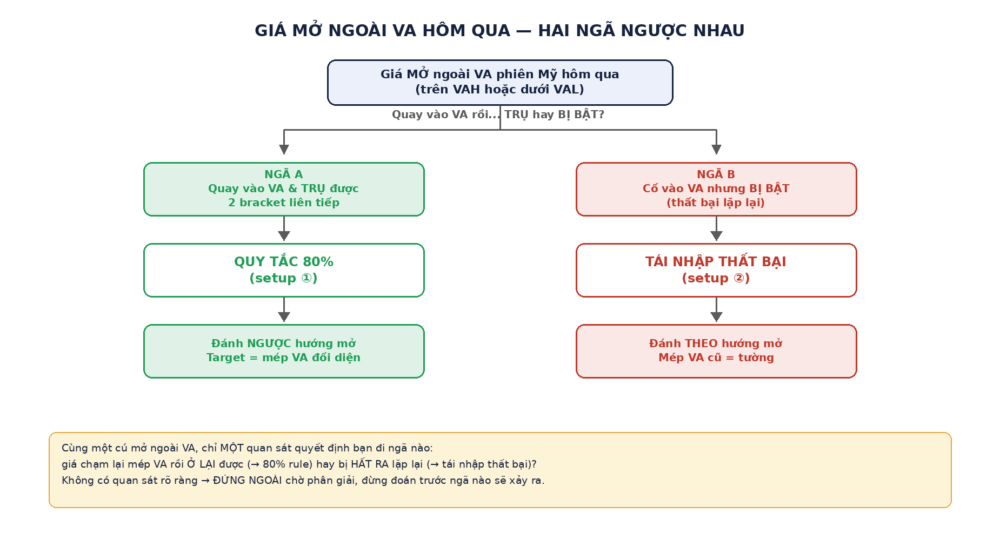
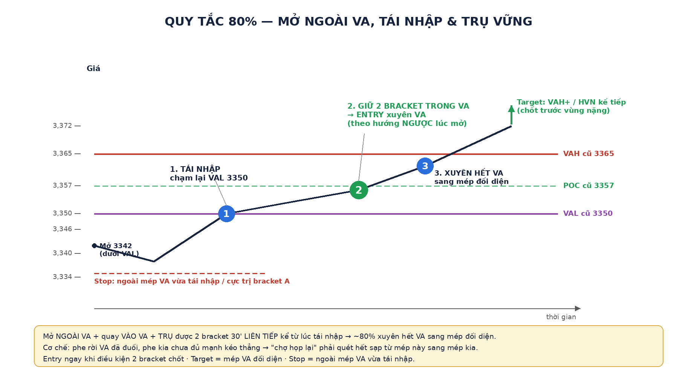
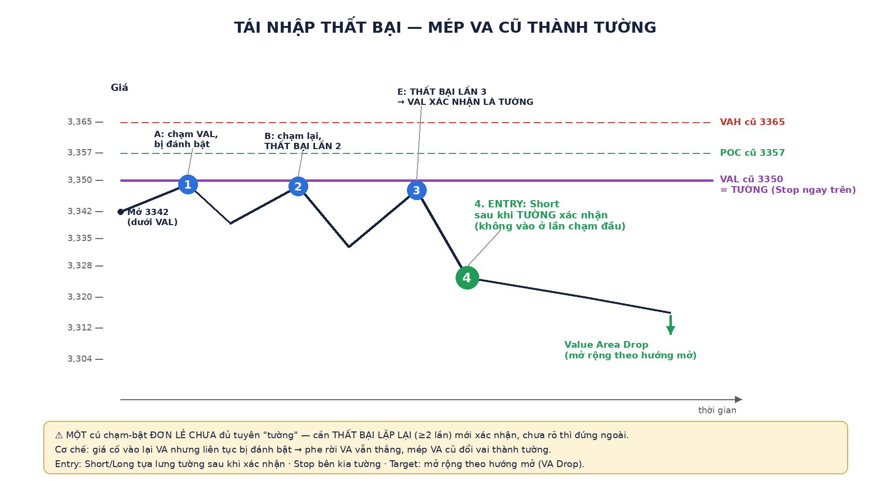

# TPO §2 — Batch A: Quy tắc 80% + Tái nhập thất bại (2 setup "anh em ngược nhau")

> Vị trí: [`00-tpo-loi-thuc-chien.md`](00-tpo-loi-thuc-chien.md) §2 mục 1 & 2. Diagram tự vẽ (Pillow) minh họa cho phần đọc chart chữ — không thay thế chart thật `keppler/p106-0.png`, `tv/p083-0.png`, `tv/p084-0.png` đã dùng khi giảng, chỉ tóm cơ chế lại bằng hình cho dễ nhớ.

## 0️⃣ Cùng một tình huống, hai ngã ngược nhau

Cả hai setup khởi đầu từ **cùng một tình huống**: giá **mở NGOÀI VA phiên Mỹ hôm qua**. Từ đó chỉ có đúng 2 ngã, phân xử bằng **một quan sát duy nhất**: giá quay vào VA rồi **Ở LẠI** được hay **bị BẬT ra**?

| Ngã | Điều gì xảy ra | Setup | Đánh hướng nào |
|---|---|---|---|
| **A** | Quay vào VA **và trụ được** (2 bracket) | ① Quy tắc 80% | **NGƯỢC** hướng mở — xuyên hết VA sang mép kia |
| **B** | Cố vào VA nhưng **bị đẩy bật ra** (lặp lại) | ② Tái nhập thất bại | **THEO** hướng mở — mép VA thành tường |

---

## ① Quy tắc 80% — tái nhập THÀNH CÔNG

**Phát biểu:** Giá mở **ngoài** VA → quay **vào** VA → giữ được trong VA suốt **2 bracket 30′ liên tiếp kể từ lúc tái nhập** → **~80% khả năng giá xuyên HẾT VA sang mép đối diện.**

**Cơ chế (đừng học vẹt con số):** mở dưới VA = phe bán đang thắng. Nhưng giá bò ngược **vào lại** vùng giá trị và **ở lại được** = phe bán đã đuối, phe mua chưa đủ mạnh kéo thẳng → hai phe quay về "họp chợ" trong VA. Chợ đã họp thì phải họp cho hết sạp — giá quét từ mép này sang mép kia để khớp nhu cầu cả hai phía.

**Đọc diagram:** mở 3342 dưới VAL 3350 → **(1) tái nhập** chạm lại VAL → giá trụ trong VA qua **(2) 2 bracket** (đây là điểm ENTRY, xuyên VA theo hướng **ngược** với lúc mở) → **(3) xuyên hết VA**, target đẩy lên trên VAH.

**Vào lệnh:**
- **Entry:** ngay khi điều kiện "2 bracket trong VA" vừa chốt, vào theo hướng xuyên VA.
- **Target = mép VA đối diện** (mở dưới → target VAH; mở trên → target VAL); mép đối diện thường trùng HVN → **chốt trước mép một chút**.
- **Stop = ngoài mép VA vừa tái nhập** / ngoài cực trị bracket A.

**Chart thật đã dùng khi giảng:**
- Chiều mua: [`tv/p083-0.png`](../images/tv/p083-0.png) — "Giai đoạn B chạm vào đáy vùng giá trị" → "Giá đi lên lấp vùng giá trị".
- Chiều bán (gương ngược): [`tv/p084-0.png`](../images/tv/p084-0.png) — "Chạm đỉnh vùng giá trị tại E, F" → "Giá đi xuống lấp vùng giá trị".

---

## ② Mở ngoài value + tái nhập THẤT BẠI → mép VA cũ thành tường

**Cơ chế:** mở **dưới VAL** hôm qua, giá cố ngoi lên vào lại VA nhưng **thất bại nhiều lần** → chính **VAL cũ trở thành kháng cự (trần)** → phe bán cầm trịch, Short **tựa lưng vào VAL cũ**. (Gương ngược cho mở trên VAH: VAH cũ thành sàn đỡ → Long.)

**Đọc diagram:** mở 3342 dưới VAL 3350 → **(1) A** ngoi lên chạm VAL, bị đánh bật → **(2) B** thử lại, thất bại lần 2 → **(3) E** thử lại, thất bại lần 3 — đến đây VAL mới **xác nhận** là tường thật → **(4) ENTRY** Short, giá rơi mạnh = **Value Area Drop**.

**⚠️ Bẫy quan trọng nhất của setup này:** **MỘT cú chạm-bật đơn lẻ CHƯA đủ để tuyên "tường".** Một lần bị đẩy có thể chỉ là nhiễu. Phải thấy **thất bại lặp lại** (như A, B, *rồi* E ở diagram trên) mới đủ bằng chứng mép cũ là tường. Chưa rõ → **đứng ngoài chờ phân giải**, đừng Short ngay cú chạm đầu tiên.

**Chart thật đã dùng khi giảng:** [`keppler/p106-0.png`](../images/keppler/p106-0.png) — Fig 8.5 *"Open Price Below Prior Volume Value Area Low"*: mở 1354.75 dưới VAL cũ ~1357.25; các bracket **A, B rồi E, F** lần lượt ngoi lên và đều bị đánh xuống → VAL cũ thành trần thật; giá rơi tới đáy ~1345.75 (**Value Area Drop**).

---

## 🔁 Bảng đối chiếu nhanh

| | ① Quy tắc 80% | ② Tái nhập thất bại |
|---|---|---|
| Mở ở đâu | ngoài VA | ngoài VA |
| Giá làm gì với VA | **vào lại + TRỤ 2 bracket** | **cố vào nhưng bị BẬT ra (lặp lại)** |
| Ai thắng | phe rời VA đã đuối | phe rời VA vẫn thắng |
| Đánh hướng | **NGƯỢC** hướng mở (xuyên VA) | **THEO** hướng mở (tiếp diễn) |
| Stop | mép VA vừa tái nhập | mép VA vừa bị từ chối (tường) |
| Target | mép VA đối diện | mở rộng theo hướng rời VA (VA Drop) |

Mấu chốt phân biệt chỉ nằm ở **một quan sát**: sau khi chạm lại mép VA, giá **ở lại trong VA** (→ ①) hay **bị hất ra lặp lại** (→ ②).
