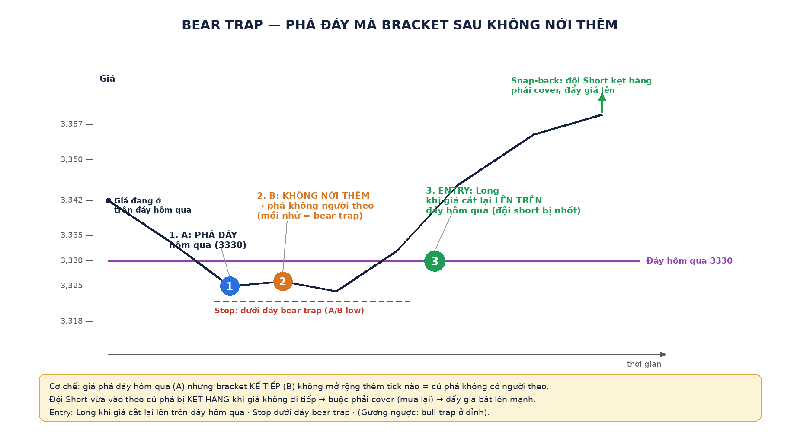
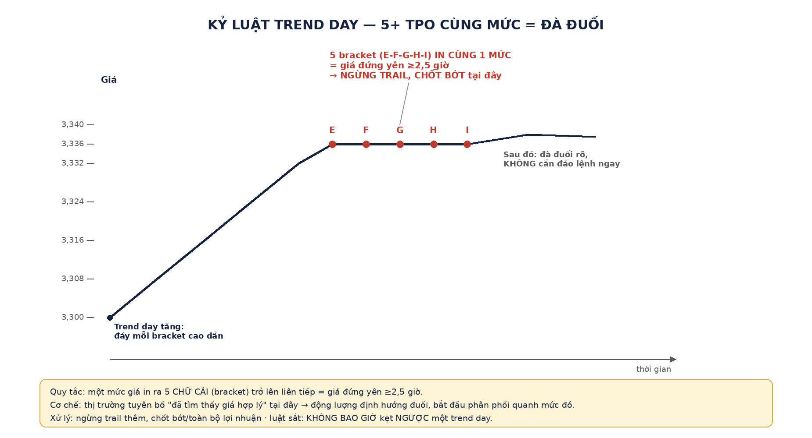
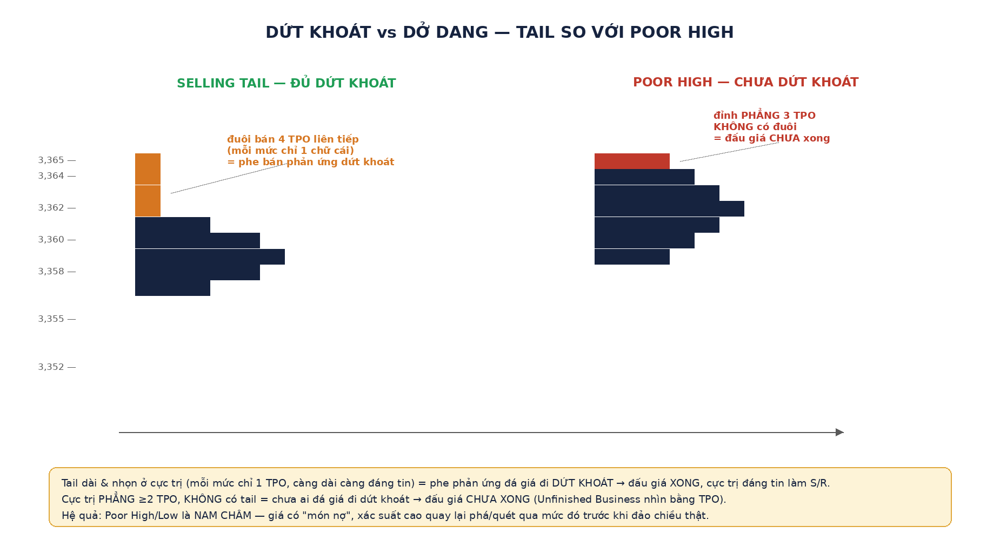

# TPO §2 — Batch B: Single print · Bear/bull trap · Kỷ luật Trend Day · Tails/Poor high-low

> Vị trí: [`00-tpo-loi-thuc-chien.md`](00-tpo-loi-thuc-chien.md) §2 mục 3–6. 4 setup còn lại sau Batch A ([`80% rule + tái nhập thất bại`](batch-A-80-rule-va-tai-nhap.md)). Diagram tự vẽ (Pillow) minh họa cơ chế; chart thật đã dùng khi giảng lấy từ `buoi-1` (single print, tails, poor high/low) và `buoi-2` (bear trap, trend day).

---

## ③ Single print / minus development — đừng đuổi, chờ retest

**Cơ chế:** giá chạy XUYÊN qua một vùng quá nhanh, không kịp xây giá trị → vùng đó chỉ có **đúng 1 cột chữ (TPO)** chạm qua. Đây là vết chân OTF rõ nhất trên chart TPO — chỉ OTF mới đủ lực kéo giá xuyên nhanh như vậy. Vùng này có xác suất cao bị **quay lại test**: giá vượt lên để lại single print bên dưới → vùng đó thành **hỗ trợ**; giá lao xuống để lại single print bên trên → thành **kháng cự**.

**Playbook:** (1) **Không đuổi** cú chạy đang tạo single print. (2) **Chờ giá quay lại test** vùng single print. (3) Vùng giữ được vai trò S/R (chạm và bị đẩy đi) → **vào lệnh theo hướng cú chạy ban đầu** ở giá đẹp hơn. (4) **SL bên kia vùng single print** — nếu giá lấp hẳn vùng đó (từng mức bắt đầu in chữ thứ hai) thì tiền đề "giá bất công" sụp, thoát.

**Chart thật đã dùng khi giảng:**
- [`keppler/p025-0.png`](../images/keppler/p025-0.png) — *Single Print Within Profile Structure*: giá lao từ 1195.00 xuống 1187.00 trong bracket E, các nhịp hồi sau không lần nào vượt lại **1193.25** → dải in đơn kẹp GIỮA profile quanh **1193.25–1194.50**.
- [`keppler/p159-0.png`](../images/keppler/p159-0.png) — *Minus Development* EURUSD: hai khối phân phối dày nối nhau bằng một cột chữ đơn kéo dài **~1.4160–1.4172** — giá rơi xuyên 12 pip không xây nổi giá trị, vùng đó thành kháng cự chờ retest.
- [`note/p003-0.png`](../images/note/p003-0.png) — indicator thực chiến tự khoanh 2 hộp **SP: 44812.5–45462.5** và **SP: 44387.5–44462.5** kèm **IBH/IBL** — đúng bộ khung: IB + single print được máy đánh dấu sẵn, việc của trader là chờ giá quay về hộp SP.

---

## ④ Bear/bull trap — phá cực trị mà bracket sau KHÔNG nới thêm

**Cơ chế:** giá phá **cực trị hôm qua** (đáy cho bear trap, đỉnh cho bull trap), nhưng **bracket KẾ TIẾP KHÔNG mở rộng thêm range** = cú phá không có người theo (mồi nhử). Đội vừa vào lệnh theo cú phá bị **kẹt hàng** khi giá không đi tiếp → buộc phải **đóng lệnh ngược lại** (short phải cover = mua) → tạo lực đẩy giá bật mạnh về hướng ngược cú phá. Đây chính là **Absorption** nhìn bằng cấu trúc TPO thay vì ô Bid×Ask.

**Đọc diagram:** giá ở trên đáy hôm qua (3330) → **(1) A** phá xuống dưới đáy → **(2) B** ngoi lại nhưng **không nới thêm** (mồi nhử xác nhận) → **(3) ENTRY** Long khi giá cắt lại lên trên đáy hôm qua → snap-back đẩy giá lên mạnh vì đội Short bị nhốt.

**Chart thật đã dùng khi giảng:** [`keppler/p075-0.png`](../images/keppler/p075-0.png) — Fig 6.2, ngày 16/12: mở ~1232, bracket A phá xuống dưới đáy hôm trước ~7 điểm, nhưng **bracket B KHÔNG mở rộng thêm được tick nào**. Sau đó bracket D mở rộng NGƯỢC lên, đội short kẹt hàng phải cover, đẩy giá về vòm 1237.

**⚠️ Lưu ý (đã red-team):** "bracket sau không nới range" là **dấu hiệu**, không phải điều kiện CẦN duy nhất — cốt lõi thật sự là **snap-back nhốt hàng** (giá quay đầu đủ mạnh để khiến phe theo cú phá phải thoát lệnh). Nếu bracket sau chỉ đi ngang mà chưa có snap-back rõ, vẫn cần chờ xác nhận trước khi vào.

---

## ⑤ Kỷ luật Trend Day — 5+ TPO cùng mức = đà đuối

**Cơ chế:** trong một trend day (đáy mỗi bracket cao dần ở ngày tăng), khi **một mức giá in ra 5 chữ cái (bracket) liên tiếp trở lên** = giá đã đứng yên **≥2,5 giờ**. Thị trường đang tuyên bố **"đã tìm thấy giá hợp lý"** tại đây → động lượng định hướng đuối, bắt đầu phân phối quanh mức đó.

**Đọc diagram:** giá tăng đều (đáy bracket cao dần) → tới mức 3336, **5 bracket E-F-G-H-I** cùng in một mức → tín hiệu **ngừng trail, chốt bớt/toàn bộ lợi nhuận tại đây** — **chưa chắc đảo chiều**, chỉ là lúc chốt lời, không phải lúc đảo lệnh.

**Luật sắt kèm theo:** **không bao giờ để kẹt NGƯỢC một trend day** — mọi vị thế ngược hướng hôm đó là kẻ thua nặng nhất.

**Chart thật đã dùng khi giảng:**
- [`keppler/p071-0.png`](../images/keppler/p071-0.png) — Fig 6.1 *Standard Trend Day Structure*: thang giá ~1289.50→1306.00, cột A xếp dưới đáy, M trên đỉnh, chú thích *Narrow Structure* — cả ngày một cột hẹp ~16 điểm.
- [`keppler/p073-0.png`](../images/keppler/p073-0.png) — minh họa tiêu chí "đáy của A>B>C>D" = thứ tự thời gian đáy cao dần.
- [`note/p007-0.png`](../images/note/p007-0.png) — slide Trend Day: RE >2× IB, đóng gần cực trị, profile mỏng "không nhiều hơn 4-5 TPO", OTF kiểm soát.

---

## ⑥ Tails + Poor high/low — Unfinished Business nhìn bằng TPO

**Cơ chế:** cực trị của phiên (đỉnh/đáy) có thể kết thúc theo 2 kiểu:
- **Tail (đuôi) dài & nhọn** — mỗi mức chỉ 1 TPO, phe phản ứng (responsive) đá giá đi **dứt khoát** ngay trong <30′ → **đấu giá XONG**, cực trị đáng tin làm S/R. Đuôi càng dài càng ý nghĩa; đuôi 1 TPO gần như vô nghĩa (kỹ thuật ô cuối luôn là in đơn).
- **Poor high/low (đỉnh/đáy dở dang)** — cực trị **PHẲNG ≥2 TPO**, KHÔNG có tail → không phe nào đá giá đi dứt khoát → **đấu giá CHƯA XONG**. Đây chính là **Unfinished Business** nhìn bằng TPO (ở footprint là ô Bid×Ask còn khớp tại cực trị).

**Đọc diagram:** panel trái — 4 TPO liên tiếp mỗi mức 1 chữ cái ở đỉnh (3362–3365) rồi mới phình rộng dần xuống dưới = **tail dứt khoát**. Panel phải — mức đỉnh 3365 đã có **3 TPO cùng mức** ngay từ đầu, không có đoạn thu hẹp dần = **poor high dở dang**.

**Hệ quả quan trọng:** Poor High/Low là **NAM CHÂM** — giá có "món nợ" phải quay lại xử. Xác suất cao phiên tới sẽ quay lại phá/quét qua poor high/low trước khi đảo chiều thật → đưa vào watchlist.

**Chart thật đã dùng khi giảng:**
- [`keppler/p021-0.png`](../images/keppler/p021-0.png) — **Selling Tail**: chuỗi chữ B đơn độc từ 1310.00 xuống ~1309.00, đuôi ~5 ô giá.
- [`keppler/p020-0.png`](../images/keppler/p020-0.png) — **Buying Tail** đối xứng: chuỗi chữ I đứng một mình ~7 ô giá.
- [`keppler/p157-0.png`](../images/keppler/p157-0.png) — **Bottom Ledge** (khái niệm liền kề: ≥3 TPO cùng dừng phẳng, khác poor low ở chỗ ledge có thể nằm giữa/cuối value chứ không nhất thiết ở cực trị): đáy phẳng tại 1.4067, 4 bracket sau quay về test vẫn giữ.

---

## 🔑 Tổng hợp Batch B — bảng đối chiếu nhanh

| Setup | Dấu hiệu nhận diện | Hành động |
|---|---|---|
| ③ Single print | 1 cột chữ duy nhất chạm qua 1 vùng | KHÔNG đuổi → chờ retest → vào theo hướng cú chạy ban đầu |
| ④ Bear/bull trap | Phá cực trị hôm qua, bracket sau KHÔNG nới thêm | Chờ snap-back xác nhận → vào NGƯỢC hướng phá |
| ⑤ Trend Day 5+ TPO | 1 mức in ≥5 bracket liên tiếp trong trend day | Ngừng trail, chốt bớt — KHÔNG đảo lệnh vội |
| ⑥ Tails vs Poor high/low | Đuôi dài & nhọn (xong) vs đỉnh/đáy phẳng ≥2 TPO (chưa xong) | Tail = tin cực trị làm S/R; Poor high/low = đưa vào watchlist chờ quay lại phá |
