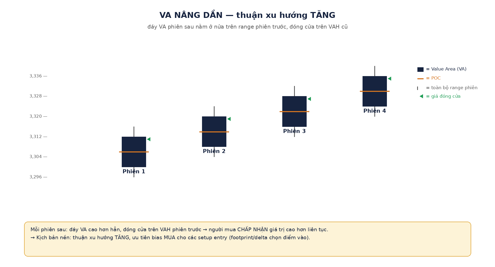
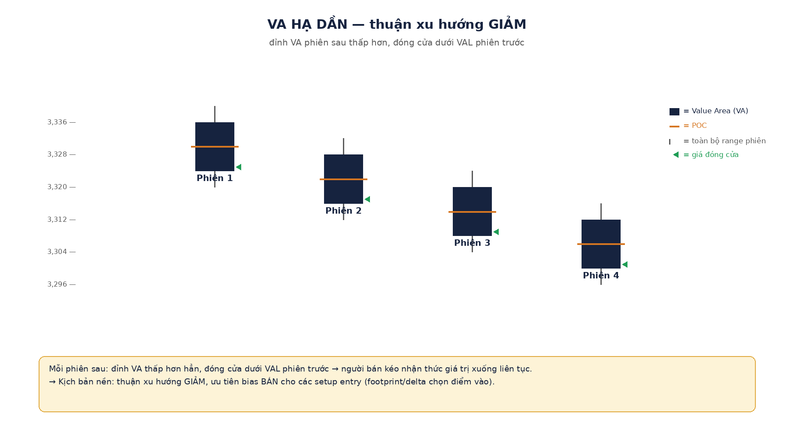
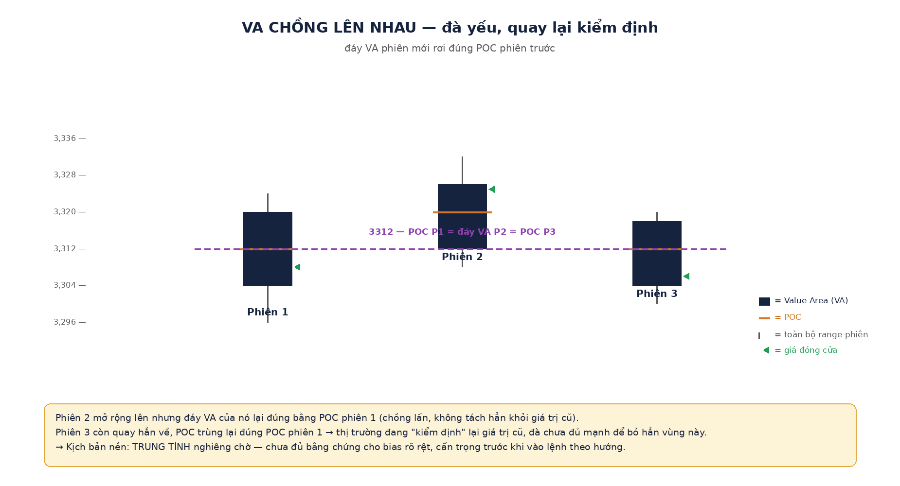
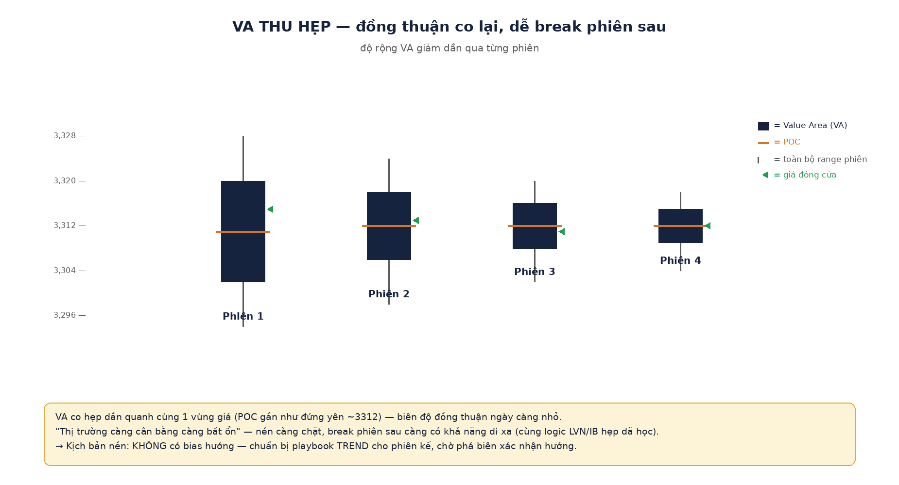
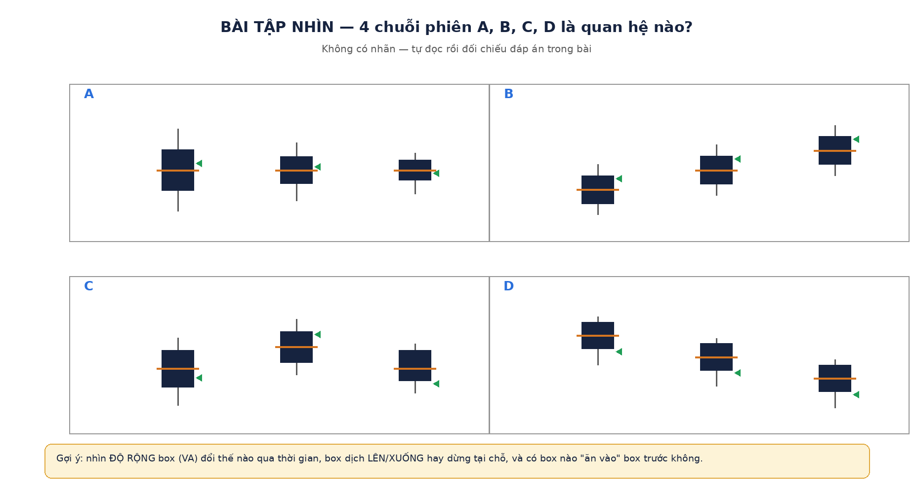
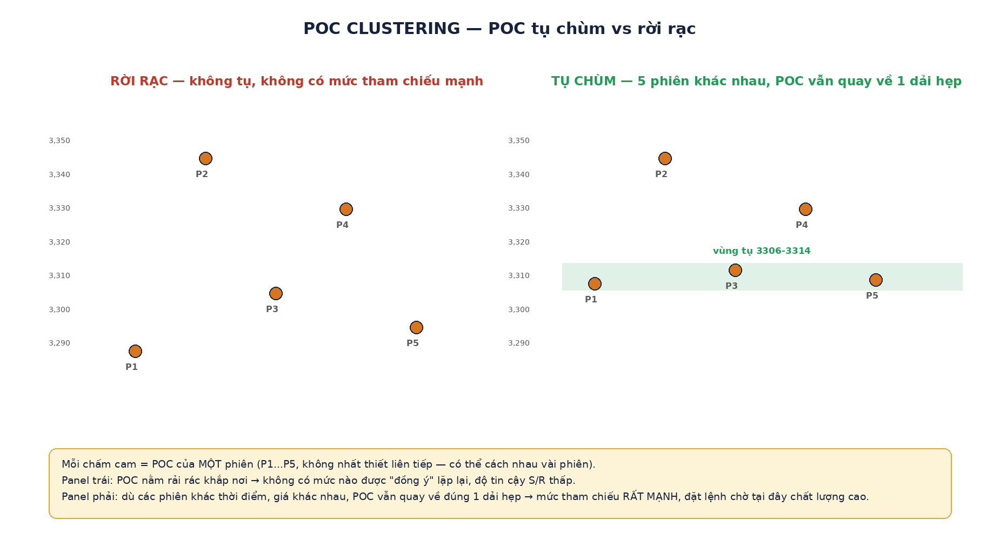
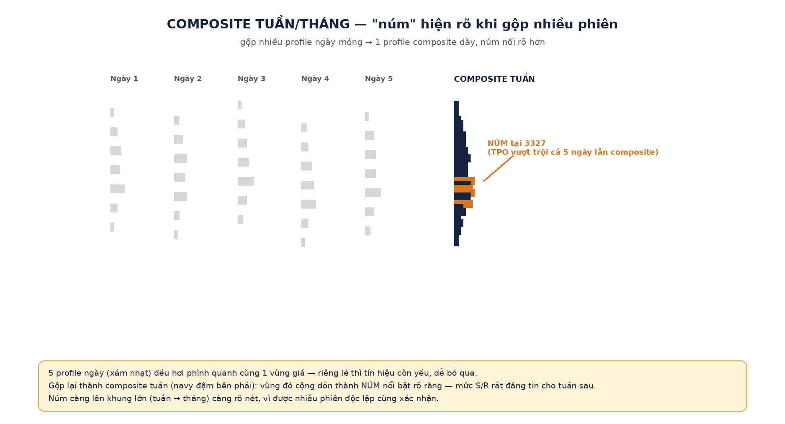
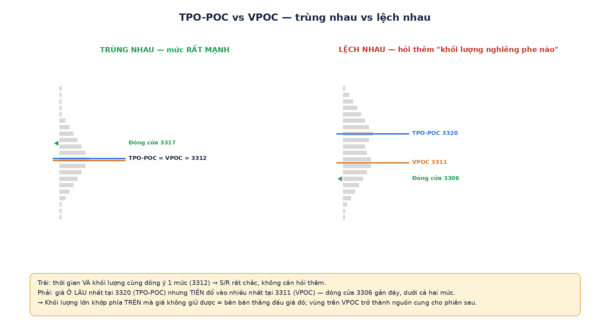

# TPO — Bản đồ đa phiên: Value Migration & POC Clustering

> ⭐ **Đây là phần quan trọng nhất của TPO.** Việc của TPO không phải là bấm entry — entry (thời điểm chính xác vào lệnh, M1) là việc của **footprint/delta**. Việc của TPO là đọc quan hệ giữa NHIỀU phiên để tạo ra **BIAS mua/bán** trước khi vào bất kỳ lệnh nào — tức là biết trước "hôm nay nên thiên về mua hay bán, hay đứng ngoài" trước khi nhìn tới từng cây nến. Bias sai thì entry đẹp cỡ nào cũng chỉ là may rủi.
>
> Vị trí: rút từ [`buoi-3-da-phien-thuc-chien-vang.md`](buoi-3-da-phien-thuc-chien-vang.md) §2. Diagram bên dưới vẽ đơn giản hoá (box = Value Area, tick cam = POC, đường mảnh = full range) — không phải TPO chữ cái thật, chỉ để **tập nhìn quan hệ**, không thay thế chart thật.

---

## 1️⃣ Value Migration — 4 quan hệ giữa VA phiên sau và phiên trước

Một phiên đơn lẻ chỉ nói "hôm nay đấu giá thế nào". Đặt nhiều phiên cạnh nhau mới lộ ra **giá trị đang di cư về đâu** — đây chính là cách tạo BIAS.

| Quan hệ | Đấu giá đang nói gì | Bias |
|---|---|---|
| **VA nâng dần** | Người mua chấp nhận giá trị cao hơn liên tục | MUA |
| **VA hạ dần** | Người bán kéo nhận thức giá trị xuống liên tục | BÁN |
| **VA chồng lên nhau** (đáy VA mới = POC cũ) | Đà yếu, quay lại kiểm định giá trị cũ | Trung tính, chờ |
| **VA thu hẹp** | Đồng thuận co lại, dễ break phiên sau | Chưa có bias, chờ break |

### VA nâng dần

### VA hạ dần

### VA chồng lên nhau

### VA thu hẹp

**Chart thật đối chiếu:** [`keppler/p093-0.png`](../images/keppler/p093-0.png) — 5 profile ngày ES liên tiếp: 4 ngày đầu VA hạ dần theo bậc thang rõ rệt, ngày 5 bật ngược chồng lấn lại vùng ngày 3–4.

---

## 🎯 Bài tập tập nhìn — không nhãn

Nhìn 4 chuỗi A, B, C, D dưới đây, tự xác định mỗi chuỗi là quan hệ nào (số liệu khác bài trên, để không đoán mò theo trí nhớ):

Đáp án

- **A = VA thu hẹp**: 3 box ở gần như cùng 1 vùng giá, độ rộng co dần lại rõ rệt.
- **B = VA nâng dần**: mỗi box sau cao hẳn lên, gần như không chồng lấn box trước, đóng cửa nằm trên đỉnh box trước.
- **C = VA chồng lên nhau**: box giữa nới lên rồi box thứ 3 tụt hẳn về gần vùng box đầu, đáy/POC quay lại kiểm định vùng cũ.
- **D = VA hạ dần**: mỗi box sau thấp hẳn xuống, đóng cửa nằm dưới đáy box trước.

---

## 2️⃣ POC Clustering — mức đặt lệnh chờ chất lượng cao

**Cơ chế:** POC là giá được thị trường "đồng ý" nhiều nhất trong 1 phiên. Khi POC của **nhiều phiên khác nhau** (không nhất thiết liên tiếp) **tụ gần nhau**, đó là sự chấp nhận được xác nhận lặp lại → mức tham chiếu rất mạnh.

**Chart thật đối chiếu:** [`keppler/p153-0.png`](../images/keppler/p153-0.png) — 10 phiên EURUSD (A→J): vòng tròn "Area of Price Acceptance" khoanh vùng nơi POC của 4 phiên A, G, H, I đều hội tụ về cùng 1 dải hẹp dù cách nhau nhiều phiên.

---

## 3️⃣ Composite tuần/tháng — "núm" hiện rõ khi gộp nhiều phiên

Gộp 5 profile ngày = **profile tuần**; gộp 20 ngày = **profile tháng**. Một vùng giá riêng lẻ từng ngày chỉ hơi phình nhẹ (tín hiệu yếu), nhưng khi gộp nhiều ngày lại, vùng đó cộng dồn thành **"núm" (knob)** rất rõ — càng lên khung lớn càng nét.

**Chart thật đối chiếu:** [`keppler/p095-0.png`](../images/keppler/p095-0.png) (composite tuần, POC 1342.25) và [`keppler/p097-0.png`](../images/keppler/p097-0.png) (composite tháng, POC 1343.00) — hai POC gần như dính nhau dù khác khung thời gian, đúng hiện tượng POC clustering xuyên khung.

---

## 4️⃣ TPO-POC vs VPOC — lệch nhau là thông tin

**TPO-POC** = giá được **Ở LÂU** nhất (thời gian). **VPOC** = giá **TRAO TAY** nhiều hợp đồng nhất (khối lượng). Trùng nhau = mức rất chắc. Lệch nhau → nhìn thêm **vị trí đóng cửa** để suy ra khối lượng đó thuộc phe nào.

**Chart thật đối chiếu:** [`keppler/p104-0.png`](../images/keppler/p104-0.png) — TPO-POC 1359.50 nhưng VPOC 1358.00, khối lượng trên VPOC 1.098.142 hợp đồng vs chỉ 311.091 dưới VPOC (~gấp 3.5 lần) → khối lượng khổng lồ khớp ở vùng cao mà giá không giữ được = bên bán thắng đấu giá đó.

---

## 🔑 Tổng hợp — quy trình đọc bias mỗi tối

1. Kẻ VA của **3 phiên gần nhất** → xác định quan hệ: nâng / hạ / chồng / thu hẹp.
2. Tìm **POC tụ chùm** (POC nhiều phiên cách nhau ≤5–10 tick) → đó là mức đặt lệnh chờ chất lượng cao.
3. Nếu có composite tuần/tháng: xem núm nào trùng với POC clustering ở khung nhỏ → càng trùng càng đáng tin.
4. So **TPO-POC vs VPOC** trong phiên gần nhất: lệch xa → xem giá đóng cửa để suy ra phe nào đang thắng khối lượng.
5. Từ 4 bước trên → chốt **BIAS của ngày** (mua/bán/trung tính) TRƯỚC khi mở footprint tìm entry.

**Việc của TPO dừng lại ở bước 5.** Từ đó, footprint/delta mới vào cuộc để tìm điểm bấm cò chính xác (M1) theo đúng bias đã chốt.

## ✅ Câu hỏi kiểm tra

**Câu 1.** Ba phiên liên tiếp: VA phiên 2 nâng lên nhưng **thu hẹp còn một nửa** so với phiên 1; VA phiên 3 đỉnh cao hơn phiên 2 nhưng thân **chồng xuống**, đáy VA phiên 3 chạm đúng POC phiên 2. Chuỗi này đang kể chuyện gì, và bạn nghiêng bias nào cho phiên 4?

**Câu 2.** Một ngày MGC: TPO-POC tại 2345.0, nhưng VPOC tại 2342.5; khối lượng trên VPOC gấp ~3 lần dưới VPOC; giá đóng cửa 2341.8 (gần đáy ngày). Khối lượng dày phía trên VPOC nghiêng về mua hay bán? Mức nào đáng gờm hơn cho phiên sau?

**Câu 3.** Bạn thấy POC của 4 phiên gần nhau (chênh nhau vài tick) trong khi giá hiện tại đang ở xa vùng đó. Theo cơ chế POC clustering, bạn kỳ vọng gì nếu giá quay về vùng đó — và vì sao mức này đáng tin hơn một POC đơn lẻ?
